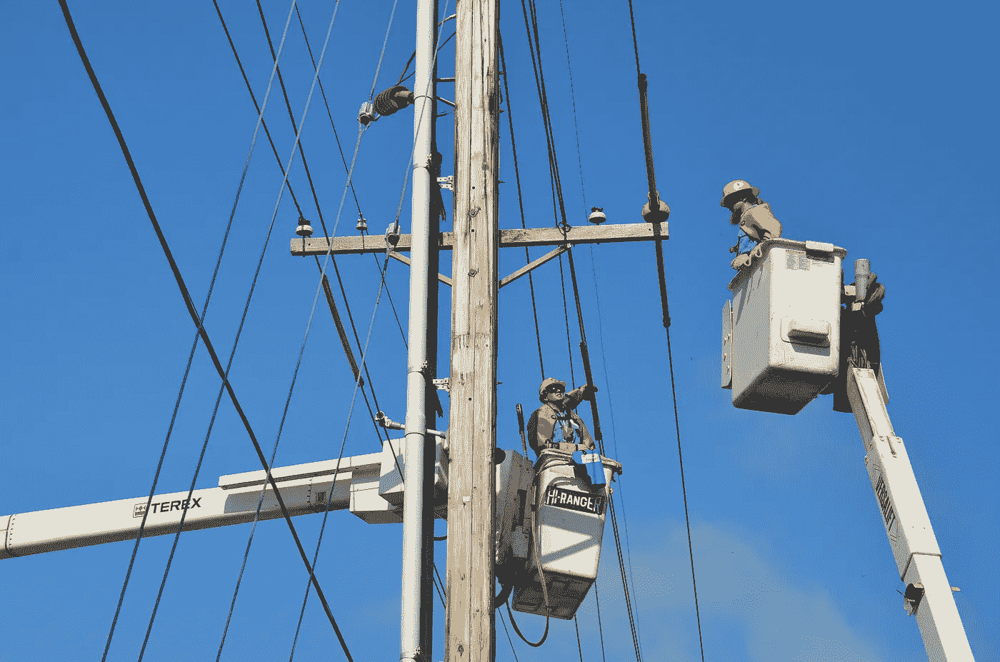
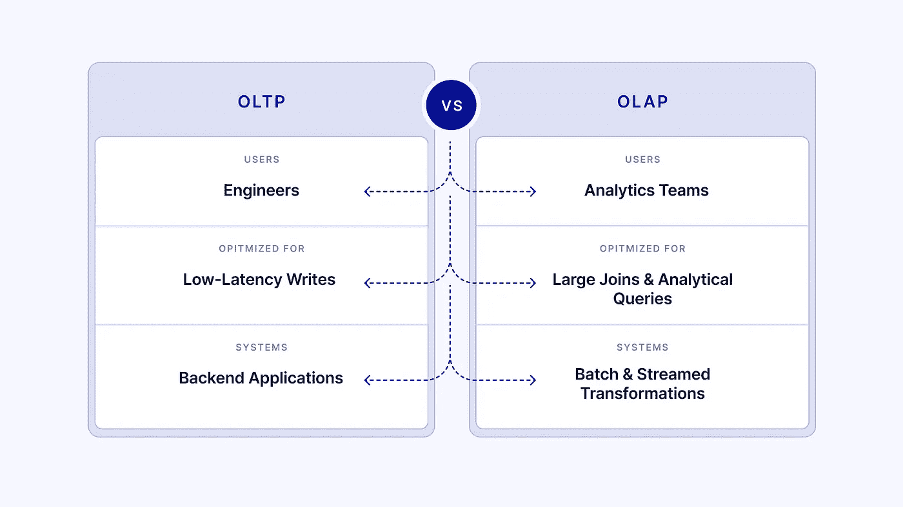
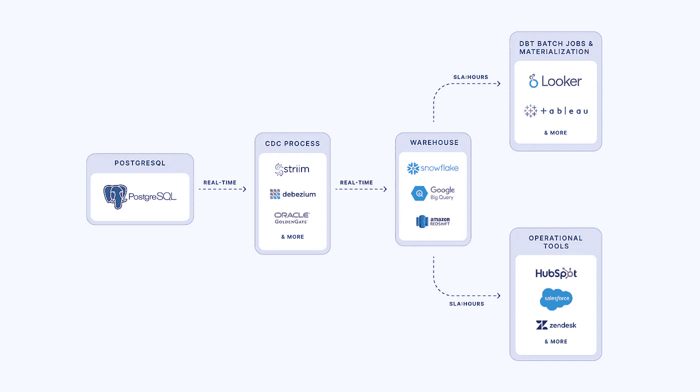

# 当变更数据捕获成功时

> 原文：<https://towardsdatascience.com/when-change-data-capture-wins-271875e3df1a>

## 意见

## 关于实时数据管道何时是保持生产数据库和仓库同步的最可靠方式的指南

美国公共电力协会在 [Unsplash](https://unsplash.com/s/photos/outage?utm_source=unsplash&utm_medium=referral&utm_content=creditCopyText) 上拍摄的照片

*与 Striim 的约翰·库泰合著*

在分析团队多次降低生产数据库的速度后，数据仓库应运而生。分析性工作负载不适合事务性数据库，事务性数据库针对高延迟读取、写入和数据完整性进行了优化。同样，生产应用程序在事务数据库上运行也是有原因的。

**定义:**事务性(OLTP)数据存储是在事务中保持 ACID(原子性、一致性、隔离性和持久性)属性的数据库。例子包括 PostgreSQL 和 MySQL，它们可以扩展到每秒 2 万个[事务](https://info.enterprisedb.com/rs/069-ALB-339/images/PostgreSQL_MongoDB_Benchmark-WhitepaperFinal.pdf)。

分析团队并不太关心在一秒钟内插入 2 万行—相反，他们希望连接、过滤和转换表，以便从数据中获得洞察力。数据仓库正是为此使用 OLAP 进行了优化。

**定义:** [OLAP](https://www.ibm.com/cloud/learn/olap) (在线分析处理)数据库针对大量数据的多维分析进行了优化。例子包括流行的数据仓库，如 Snowflake、Redshift 和 BigQuery。

不同的团队，不同的需求，不同的数据库。问题仍然是:如果分析团队使用 OLAP 数据仓库，它们是如何被填充的？

作者图片

# 使用 CDC 提高数据服务级别协议

让我们后退一步。分析团队拥有的几个领域示例:

*   客户细分数据，发送到第三方工具以优化营销和客户支持等业务功能
*   欺诈检测，对产品上的可疑行为发出警报

如果这些分析是在数据仓库之上运行的，那么数据仓库中所需的基线数据量就来自生产数据库。来自第三方工具的补充数据非常有用，但通常不是分析团队开始的地方。将数据从数据库移动到数据仓库时，通常考虑的第一种方法是基于批处理的。

**定义:**批处理数据管道涉及定期检查源数据库，并运行管道来更新目标(通常是仓库)中的数据。

这种方法存在技术上的困难，最明显的是需要知道源中发生了什么变化以及目标中需要更新什么的逻辑。批量 ELT 工具确实减轻了数据专业人员的负担。然而，没有一个批处理 ELT 工具能够解决其中最大的问题:数据 SLA。考虑每三小时运行一次的数据管道。任何独立运行在该数据之上的管道，即使也是每三个小时运行一次，在最坏的情况下也会过时六个小时。对于许多分析来说，六个小时的延迟不会改变指针。这就引出了一个问题:团队什么时候应该关心数据新鲜度和 SLA？

**定义**:[SLA](https://www.cio.com/article/274740/outsourcing-sla-definitions-and-solutions.html)(服务水平协议)是供应商和客户之间的一份合同，涉及到应用程序可用性和停机时间时，客户可以从供应商那里得到什么。数据 SLA 是分析团队及其利益相关方之间就数据的预期新鲜程度达成的协议。

当新数据对业务产生有意义的影响时，这就是团队应该关心的时候。回到分析团队项目的例子，如果发生欺诈事件(如数百个欺诈订单)，时间是至关重要的。3 小时的数据 SLA 可能导致企业损失数千美元，而不是不到 100 美元。

当新鲜感迫不及待时—提示 CDC，或[改变数据捕捉](https://www.striim.com/blog/change-data-capture-cdc-what-it-is-and-how-it-works/)。CDC 工具读取数据库上的更改日志，并在目标数据中模拟这些更改。如果数据管道遇到错误，这可以很容易地重新运行。

借助实时变更日志，CDC 工具可以近乎实时地保持两个数据存储(生产数据库和分析仓库)完全相同。然后，分析团队对新鲜的数据进行分析。

# CDC 入门

作者图片

最常见的生产事务数据库是 PostgreSQL 和 MySQL，它们都已经存在了几十年。作为目标而不是来源，仓库通常不会以同样的方式支持 CDC(尽管这也在发生变化)。

要为 CDC 设置源数据库，您需要:

*   确保 WAL(预写)日志已启用，并且 WAL 超时足够长。这直接发生在数据库设置中。
*   确保基于 CDC 工具的当前规范将归档日志存储在源上。
*   创建一个复制槽，CDC 工具可以在其中订阅更改日志。
*   监控源和目标数据库基础架构，确保两者都不会过载。

在源数据库上，如果一行数据更改为 A，然后更改为值 B，再更改为 A，那么这种行为会在目标仓库上重演。重放确保了数据的完整性和一致性。

虽然存在像 Debezium 这样的开源 CDC 解决方案，但托管 CDC 解决方案允许用户更少地担心基础设施，而更多地担心管道的业务规范，这是他们的业务所特有的。

作为开发工具的分析和上市顾问，我以前在 Perpay 领导数据工程职能，并建立了一个变更数据捕获堆栈。在我看来，变更数据捕获不仅仅是实时分析。这是将数据从运营数据库复制到分析系统的最可靠、最可扩展的方式，尤其是在下游延迟要求很高的情况下。