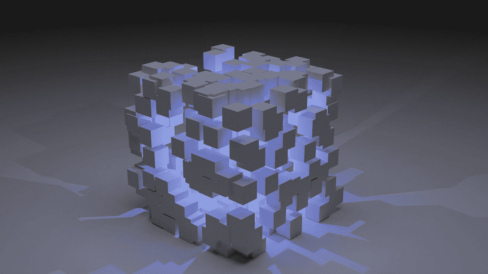

# 数据科学什么时候成了机器学习的代名词？

> 原文：<https://towardsdatascience.com/when-did-data-science-become-synonymous-with-machine-learning-2d7d9f93f4ca>

## 机器学习只是数据科学众多不同方面的一小部分。

由 [Unsplash](https://unsplash.com?utm_source=medium&utm_medium=referral) 上的 [Shubham Dhage](https://unsplash.com/@theshubhamdhage?utm_source=medium&utm_medium=referral) 拍摄的照片

许多刚刚开始接触数据科学的人对这个领域有一种虚幻的想法，认为它是一个温床，日复一日，一小时又一小时，一秒又一秒地产生最先进的机器学习算法。虽然推出很酷的机器学习模型是工作的一部分，但这远不是你作为数据科学家唯一要做的事情。

事实上，数据科学涉及相当多的不那么光彩的繁重工作，甚至使可用的数据语料库适合于分析。根据数据科学家 Vicki Boykis 在 2019 年进行的 Twitter 民意调查，不到 5%的受访者声称将大部分时间花在 ML 模型上[1]。最大比例的数据科学家表示，他们的大部分时间都花在清理数据以使其可用上。

一旦清理干净，就会有大量与机器学习无关的数据处理和分析任务要做。在本文中，我将从两个角度讨论这个话题:1)数据科学中经常被忽视的方面，以及 2)盲目关注机器学习可能带来的潜在问题。

## 数据科学是什么？

数据科学的核心是从数据中收集有意义的见解。关于这个定义，有两件重要的事情需要理解:1)数据几乎永远不会以有助于分析的便利状态可用，2)推理建模(即机器学习)远不是从数据中提取洞察力的唯一方式。

我大四的时候，学校的计算机科学系开始开设一门新的专题课程——CS 194:数据工程。该课程旨在教授学生如何通过专注于现实应用的项目来管理大规模数据——两位教授都是成功的专注于数据的创业公司的创始人。该课程将自己定位为教授学生整个数据科学生命周期，并帮助他们成为成功的数据工程师和科学家。

如果你看一下[的课程大纲](https://cal-data-eng.github.io/syllabus/)【2】，你会注意到机器学习只是课程描述的一小部分。事实上，快速浏览一下主页[3]就会发现一个详细的主题列表，其中很少有与机器学习相关的。

那么，这门课教什么呢？前几周主要关注数据结构化、查询和清理。这一点很重要——大多数数据科学课程都给学生提供了很好的数据集，让他们可以处理并专注于分析部分。从教育学的角度来看，这有一定的道理，但也有误导性。现实世界中的数据几乎永远不会是您想要的形式，您的大部分工作将涉及结构化和处理数据，以使其完全可用。

课程的后半部分讨论了处理数据的各种方法，包括汇总、可视化(我自己的研究领域)、近似、并行化等等。每一个都是一个详细的主题，应该有自己的文章来公正地对待它，但我在这里的观点很简单:有许多方法可以洞察数据，机器学习只是其中之一。

## 盲目应用机器学习会出什么问题？

好的数据科学不仅仅是数字。

我是华盛顿大学以人为中心的数据科学实验室的一名学生，虽然我热爱编程和定量分析，但并非所有实验室成员都是如此。事实上，我有一个经常合作的人，他从来没有写过一行代码，但他写了大量关于机器分类、推荐系统和一堆似乎与机器学习直接相关的其他主题的研究论文。

怎么会？好吧，和他谈谈，他会告诉你他的目标是推进数据科学人类的一面，这样他就可以影响这个领域变得更加多样化、公平和包容。我们在今天的先进技术中看到的许多问题，如带有种族偏见的面部识别算法，都是从数据科学的限制性实践中产生的，这些实践未能解释数据本身的偏见，这是一种被纯定量方法忽略的衡量标准。通过使用定性研究方法和伦理设计原则，像我的实验室伙伴这样的研究人员希望在未来几年改变这种情况。

要点很简单:今天部分[数据科学仍然存在伦理问题的原因](/how-can-we-make-artificial-intelligence-ethical-6d26657c6c32)是因为对纯机器学习的无情和毫无根据的痴迷。如果我们要改善这一领域的发展，就必须转变我们的视角。

## 最后的想法

数据科学是一个新兴的领域，将其简化为一个概念是一种曲解，往好里说是错误的，往坏里说是危险的。要想在这个领域取得整体上的成功，有必要消除似乎只注意机器学习的流行文化狭隘观点。

用其他学科的类比可能更容易理解。将数据科学简化为机器学习类似于将计算机科学简化为构建 iOS 应用。或者，举一个不太专业的例子，这就像认为烹饪艺术只涉及漂亮、闪亮的甜点。但是就像为了让甜点有意义，你必须首先适当地烹饪整顿饭一样，如果你推出这种模式，你需要做相当多的重要工作。

但是如果你愿意做所有其他的事情，它会让你最终的模型变得更好。如果没有别的，记住这一点。

下次见，伙计们！

## 参考

[1][https://twitter.com/vboykis/status/1089920316644704256?s=20](https://twitter.com/vboykis/status/1089920316644704256?s=20)
【2】[https://cal-data-eng.github.io/syllabus/](https://cal-data-eng.github.io/syllabus/)
【3】[https://cal-data-eng.github.io/](https://cal-data-eng.github.io/)

**想擅长 Python？** [**获取独家、免费获取我简单易懂的指南点击**](https://witty-speaker-6901.ck.page/0977670a91) **。想在介质上无限阅读故事？用我下面的推荐链接注册！**

 [## 穆尔塔扎阿里培养基

### 阅读媒介上穆尔塔扎·阿里的作品。华盛顿大学的博士生。对人机感兴趣…

murtaza5152-ali.medium.com](https://murtaza5152-ali.medium.com/?source=entity_driven_subscription-607fa603b7ce---------------------------------------)