# 贝叶斯机器学习实际上什么时候有用？

> 原文：<https://towardsdatascience.com/when-is-bayesian-machine-learning-actually-useful-1fd8af456e4c>

## 关于一个有点争议的范式的个人想法

Javier Allegue Barros 在 [Unsplash](https://unsplash.com/s/photos/thinking?utm_source=unsplash&utm_medium=referral&utm_content=creditCopyText) 上拍摄的照片

# 介绍

当谈到贝叶斯机器学习时，你可能要么喜欢它，要么更喜欢与任何贝叶斯保持安全距离。鉴于当前最先进的模型几乎从未提及贝叶斯，后者背后可能至少有一些基本原理。

另一方面，许多高知名度的研究小组几十年来一直在研究贝叶斯机器学习工具。现在仍然如此。

因此，这个领域也不太可能完全是骗人的。正如生活中经常发生的那样，真相可能介于两个极端之间。在这篇文章中，我想分享我对这个问题的看法，并指出贝叶斯机器学习何时会有所帮助。

为了避免混淆，让我们简要定义一下*贝叶斯机器学习*在本文中的含义:

> *“机器学习的贝叶斯框架指出，你首先列举数据的所有合理模型，并为这些模型中的每一个分配你的先验信念 P(M)。然后，在观察数据 D 的基础上，你评估这些数据在每个模型下计算 P(D|M)的可能性有多大。”*
> 
> [T5【邹斌】格拉马尼 ](http://mlg.eng.cam.ac.uk/zoubin/bayesian.html#:~:text=The%20Bayesian%20framework%20for%20machine,P(D%7CM).)

不太正式的是，我们将来自[贝叶斯统计](https://en.wikipedia.org/wiki/Bayesian_statistics)的工具和框架应用于机器学习模型。我会在最后提供一些参考，以防你还不熟悉贝叶斯统计。

此外，我们的讨论基本上将机器学习等同于神经网络和一般的可微分模型(特别是线性回归)。由于深度学习目前是现代机器学习的基石，这似乎是一种公平的方法。

作为最后的免责声明，我们将区分 frequentist 和贝叶斯机器学习。前者包括你可能已经熟悉的标准 ML 方法和损失函数。

最后，事实上‘贝叶斯’是用大写字母写的，而‘frequentist’不是，没有判断的意思。

现在，让我们从一个令人惊讶的结果开始:

# 你的频率主义模型可能已经是贝叶斯的了

这种说法听起来可能令人惊讶和奇怪。然而，贝叶斯和频率主义学习范式之间有一个清晰的联系。

让我们从贝叶斯公式开始

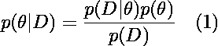

作者图片

并将其应用于贝叶斯神经网络:

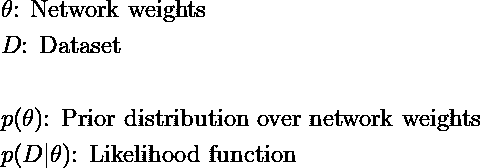

作者图片

作为一个示例，我们可以

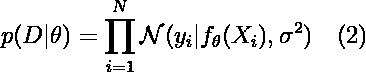

作者图片

即网络输出定义了目标变量的平均值，该平均值可能遵循正态分布。对于网络上的先验权重——假设我们总共有 *K* 个权重——我们可以选择

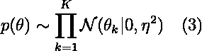

作者图片

具有 **(2)** 和 **(3)** 的设置对于贝叶斯神经网络来说是相当标准的。为 **(1)** 寻找后验权重分布在贝叶斯网络的任何合理设置中都是徒劳的。这对于贝叶斯模型来说也不是什么新鲜事。

我们现在有几个选项来处理这个问题，例如 [**变分贝叶斯**](https://en.wikipedia.org/wiki/Variational_Bayesian_methods) 或 [**最大后验估计**](https://en.wikipedia.org/wiki/Maximum_a_posteriori_estimation) **(MAP)** 。从技术上讲，后者只给出了后验最大值的点估计，而不是完整的后验分布:

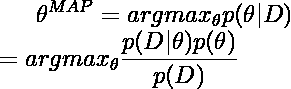

作者图片

假设概率密度在其定义域上严格为正，我们可以引入对数:

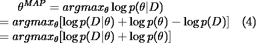

作者图片

由于最后一个被加数不依赖于模型参数，它不影响 *argmax* 。因此，我们可以不考虑它。

## 从贝叶斯映射到正则化均方误差

方程式 **(2)** 和 **(3)** 的目的仅仅是说明性的。让我们用下面的内容代替可能性和先验:

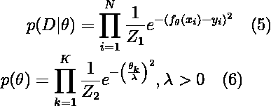

作者图片

Z 项是归一化常数，其唯一目的是产生有效的概率密度。

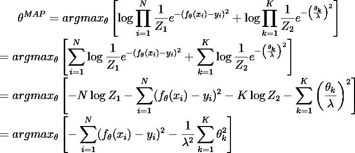

作者图片

当一个函数的最大值等于反函数的最小值时，我们可以写成

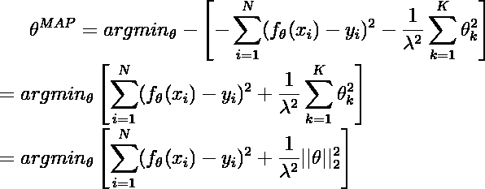

作者图片

最后， *argmax* 也不受与常数相乘的影响:

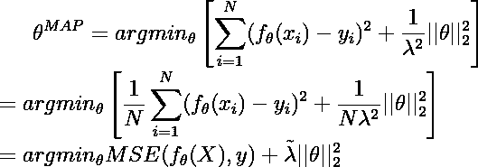

作者图片

最后一项只不过是带有正则化的标准 MSE 目标。因此，给定特定的先验和似然性，正则化的 MSE 目标等价于贝叶斯映射目标。

如果你反过来，你可以找到几乎任何频率损失函数的先验概率对。然而，常客目标通常只给你一个点的解决方案。

贝叶斯方法，另一方面，给你一个完整的后验分布，上面有不确定性区间。使用 [**无信息先验分布**](https://en.wikipedia.org/wiki/Prior_probability#Uninformative_priors) 你也可以在必要时移除正则项。然而，我们不会在这里讨论推导。

# 贝叶斯机器学习在现实世界中的代价

因此，理论上，贝叶斯机器学习比频率主义方法产生了更完整的图像。然而需要注意的是后验分布的困难性，因此需要对其进行近似或估计。

然而，近似和估计都不可避免地导致精度损失。以流行的贝叶斯神经网络的[变分推理方法为例。为了优化模型，我们需要通过从变分分布中取样来近似一个所谓的 **ELBO** 目标。](http://krasserm.github.io/2019/03/14/bayesian-neural-networks/)

通常的 ELBO 物镜看起来是这样的——如果您不理解所有内容，也不要担心:

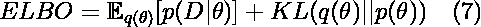

作者图片

我们的目标是最大化 **(7)** 或者最小化它的负值。然而，期望项通常不是难以处理的。这个问题最简单的解决方法是应用 [**重新参数化技巧**](https://gregorygundersen.com/blog/2018/04/29/reparameterization/) 。这使我们能够估计厄尔巴维亚

作者图片

梯度运算的线性允许我们通过 **(8)** 估算 **(7)** 的梯度:

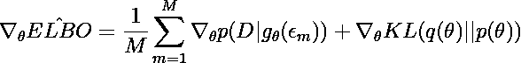

作者图片

使用这个公式，我们基本上是从一个重新参数化的分布中采样 *M* 个梯度。此后，我们使用这些样本来计算“平均”梯度。

## ELBO 的无偏梯度估计

如 [Kingma 和 Welling (2013)](https://arxiv.org/abs/1312.6114) 的里程碑式论文所示，我们已经

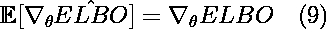

作者图片

本质上，等式 **(9)** 告诉我们，平均而言，我们基于采样的梯度等于真实梯度。 **(9)** 的问题在于我们对采样梯度的高阶统计矩一无所知。

例如，我们的估计可能有一个非常大的方差。因此，虽然我们平均在正确的方向上梯度下降，但我们的效率低得不合理。

由于重采样导致的额外随机性也使得难以找到梯度下降的正确停止时间。再加上非凸损失函数的问题，你在非贝叶斯网络中表现不佳的几率相当高。

总之，贝叶斯世界中的真实后验可以给我们一个关于最优参数的更完整的描述。然而，由于我们需要求助于近似值，我们很可能以比标准方法更差的性能结束。

# 贝叶斯机器学习实际上什么时候有意义？

以上考虑引出了一个问题:你到底想不想使用贝叶斯机器学习。就我个人而言，我看到了两种特殊的情况。请记住，以下是经验法则。支持或反对贝叶斯机器学习的实际决定应该基于手头的具体问题。

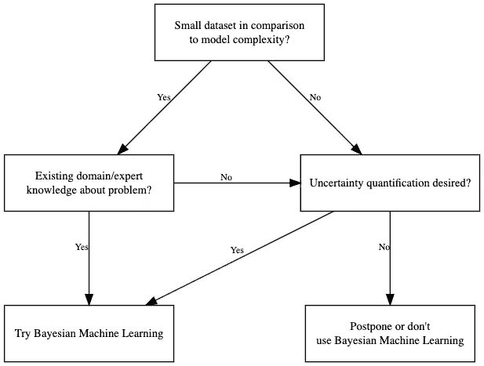

贝叶斯机器学习实际上什么时候有用？一个简单的指导决策树—始终适应您的具体问题。(图片由作者提供)

## 小数据集和丰富的先验知识

让我们回到之前的正则化 MSE 推导。我们的目标是

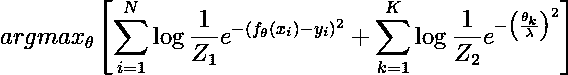

作者图片

在数据集的大小 *N* 和模型参数的数量 *K* 之间存在明显的权衡。对于足够大的数据集，右侧的先验与地图解决方案无关，反之亦然。这通常也是后验推理的一个关键特性。

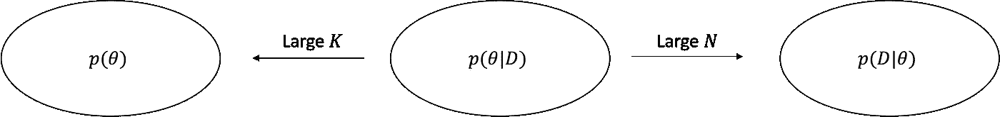

后验分布的形象化表现。更多的数据使后验更接近数据。更少的数据使得它越来越类似于先验分布。(图片由作者提供)

当数据集相对于模型参数的数量很小时，后验分布将非常类似于先验分布。因此，如果先验分布包含关于问题的合理信息，我们可以在一定程度上缓解数据的缺乏。

以简单的线性回归模型为例。根据信噪比，在参数收敛到“最佳”值之前，可能需要大量数据。如果你有一个关于“最佳”解决方案的合理的先验分布，你的模型实际上可能收敛得更快。

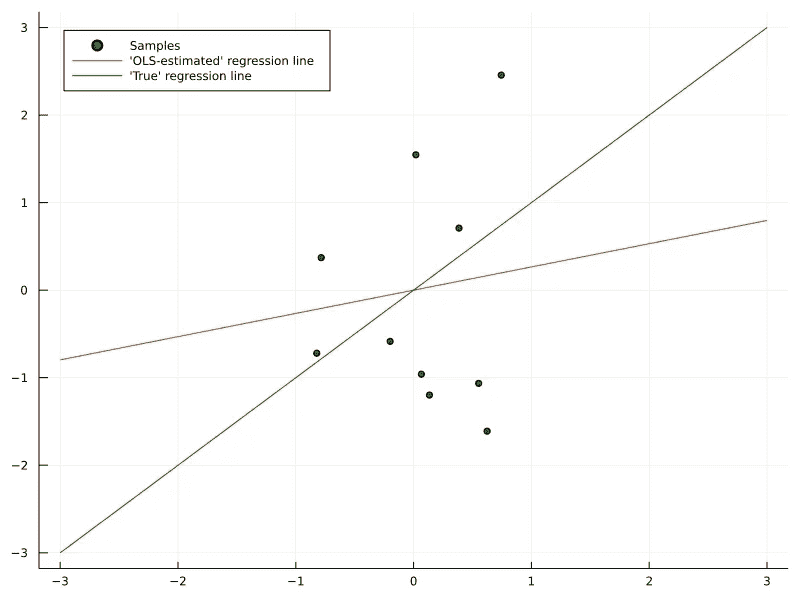

1)由于小数据集和随机噪声，普通 OLS 回归线是关闭的(图片由作者提供)

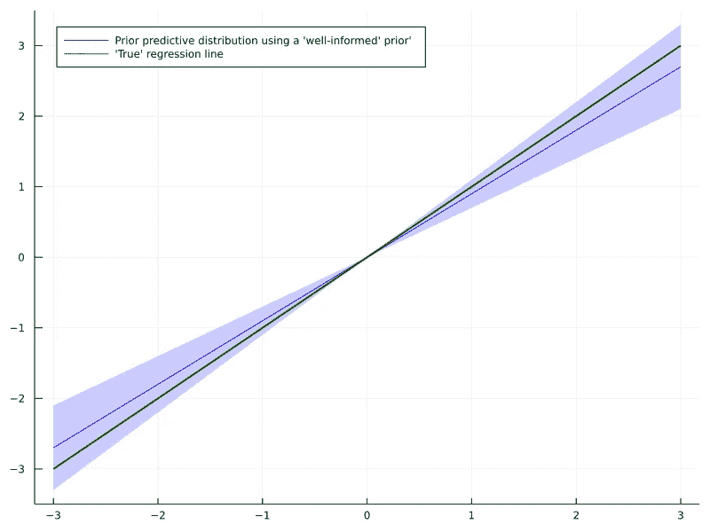

2)在任何模型拟合发生之前，一个消息灵通的先验已经产生了一个合理的范围(图片由作者提供)

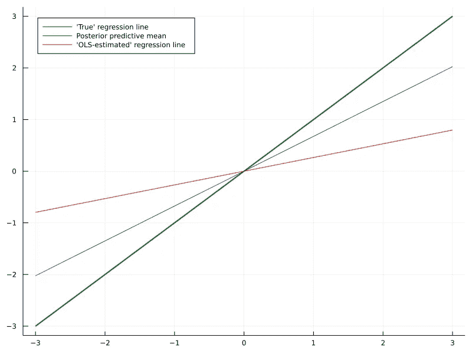

3)在“训练”之后，贝叶斯模型产生一条预测平均回归线，该预测平均回归线更加接近数据生成回归线(图片由作者提供)

然而，恰恰相反，你同样可以通过使用错误的先验知识来搞乱你的模型。结果，收敛到“最佳”解可能比没有任何先验知识更慢。贝叶斯统计中有更多的工具来减轻这种合理的异议，我渴望在未来的文章中讨论这个主题。

此外，即使你不想完全贝叶斯，地图估计仍然是有用的给定高质量的先验知识。

## 现代贝叶斯机器学习的功能先验

一个不同的问题可能是在神经网络权重上表达有意义的先验知识的困难。如果模型是一个黑盒，你如何告诉它该做什么？除了一些模糊的零均值正态分布？

解决这个问题的一个有希望的方向可能是 [**功能贝叶斯**](https://arxiv.org/pdf/1903.05779.pdf) 。在这种方法中，我们只告诉网络，基于我们的先验知识，对于给定的输入，我们期望什么样的输出。因此，我们只关心我们的模型能够表达的后验函数。确切的参数后验分布只是次要的。

简而言之，如果你只有有限的数据，但有充分的先验知识，贝叶斯机器学习实际上可以有所帮助。

## 不确定性量化的重要性

对于大型数据集，您的先验知识的影响变得越来越不相关。在这种情况下，获得一个 frequentist 解决方案可能是完全足够的和优越的方法。然而，在某些情况下，全貌——也称为后验不确定性——可能很重要。

考虑基于某种机器学习模型做出医疗决策的情况。此外，该模型并不产生最终决定，而是支持医生的判断。如果贝叶斯点精度至少接近一个 frequentist 等效，不确定性输出可以作为有用的额外信息。

假设专家的时间有限，他们可能想更仔细地研究高度不确定的模型输出。对于低不确定性的输出，快速的健全性检查可能就足够了。这当然首先要求不确定性估计是有效的。

因此，贝叶斯方法也带来了监控不确定性性能的额外成本。当决定是否使用贝叶斯模型时，这当然应该被考虑在内。

贝叶斯不确定性可以发挥作用的另一个例子是时间序列预测问题。如果您以自回归方式对时间序列建模，即您估计

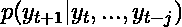

作者图片

你的模型误差越大，你就越想预测未来。

即使对于高度简单的自回归时间序列，如

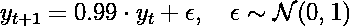

作者图片

你估计模型中的微小偏差

作者图片

从长远来看，会导致灾难性的误差积累:

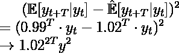

作者图片

一个完整的事后分析可以更清晰地描绘出其他类似的可能情况会如何发展。即使模型平均来说可能是错误的，我们仍然可以了解不同的参数估计如何影响预测。

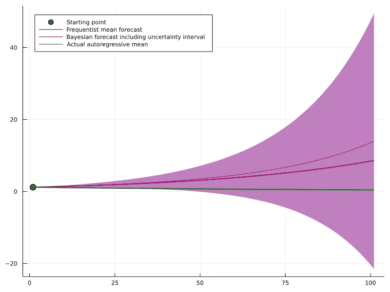

具有不确定性的贝叶斯预测(紫色)与频率点预测(红色)。虽然从长期来看，frequentist 预测稍微更准确，但贝叶斯不确定性区间正确地包含了已实现的平均轨迹。(图片由作者提供)

最后，如果最后一段让你对尝试贝叶斯机器学习感兴趣，这里有一个很好的方法可以开始:

# MC 辍学的贝叶斯深度学习之光

幸运的是，如今训练贝叶斯模型的成本并不太高。除非您正在处理非常大的模型，否则贝叶斯推理增加的计算需求应该不会有太大问题。

贝叶斯推理的一个特别直接的方法是 **MC dropout** 。后者是由 [Gal 和 Ghahramani](http://proceedings.mlr.press/v48/gal16.pdf) 引入的，并且已经成为一个相当流行的工具。总之，作者表明在模型的训练和推断过程中使用辍学是明智的。事实上，这被证明等同于具有特定的、基于伯努利的变分分布的变分推断。

因此，MC 辍学可以是一个很好的起点，使你的神经网络贝叶斯化，而不需要太多的前期工作。

## 利弊

一方面，MC dropout 使得建立现有的贝叶斯模型变得非常简单。您可以简单地用 dropout 重新训练它，并在推断过程中保持 dropout 打开。您以这种方式创建的样本可以被看作是从贝叶斯后验预测分布中抽取的。

另一方面，MC 丢失中的变分分布是基于伯努利随机变量的。理论上，这应该使它比普通的高斯变分分布更不精确。然而，构建和使用这个模型非常简单，只需要普通的 Tensorflow 或 Pytorch。

此外，对这种方法的有效性也有一些更深层次的批评。这里有一个有趣的争论，涉及到作者之一[这里](https://twitter.com/ianosband/status/1014466510885216256)。

无论你从这种批评中得到什么，MC Dropout 都可以成为更复杂方法的有用基线。一旦你掌握了贝叶斯机器学习，你就可以尝试用更复杂的模型来提高性能。

# 摘要

我希望这篇文章能让你对贝叶斯机器学习的有用性有所了解。当然，它不是灵丹妙药，在很多情况下，它可能不是正确的选择。如果你仔细权衡利弊，贝叶斯方法可能是一个非常有用的工具。

另外，我很高兴就这个话题进行更深入的讨论，无论是在评论中还是通过私人渠道。

# 贝叶斯统计参考文献

[1] Gelman，Andrew 等，“贝叶斯数据分析”。CRC 出版社，2013 年。

[2]约翰·克鲁施克。"做贝叶斯数据分析:与 R，JAGS 和斯坦的教程."学术出版社，2014。

[3]西维亚、德文德吉特和约翰·斯基林。"数据分析:贝叶斯教程."OUP 牛津大学，2006 年。

*原载于 2022 年 1 月 27 日*[*【https://sarem-seitz.com】*](https://sarem-seitz.com/blog/when-is-bayesian-machine-learning-actually-useful/)*。*