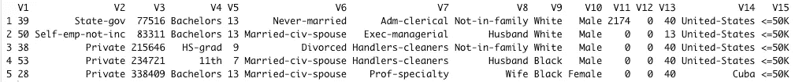
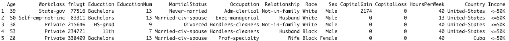
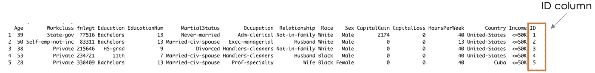
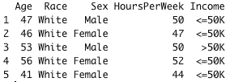
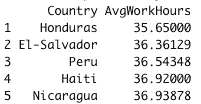
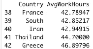
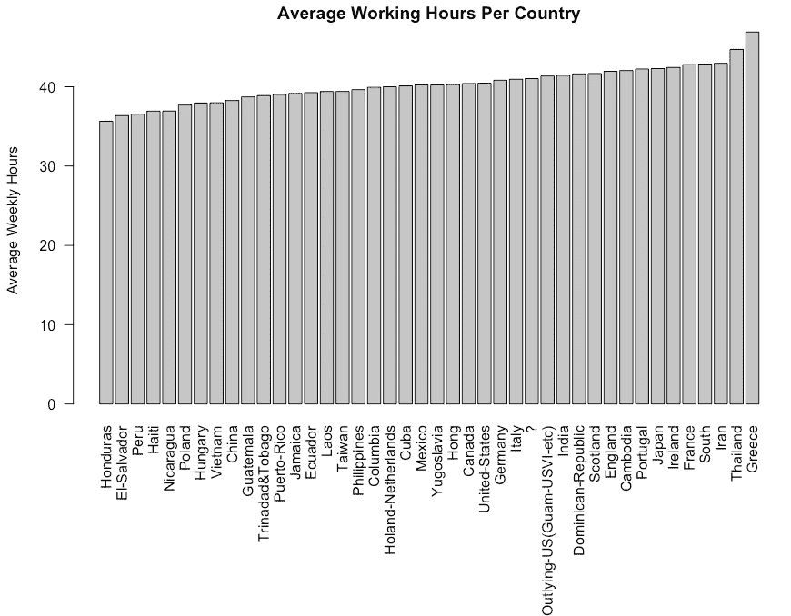
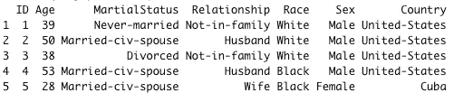
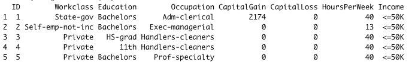
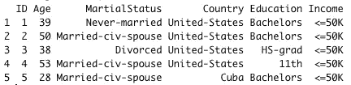

# 当 R 遇到 SQL 查询数据帧时

> 原文：<https://towardsdatascience.com/when-r-meets-sql-to-query-data-frames-a94d9d92b0f2>

## 在 R 数据帧上运行 SQL 命令的全面概述。


图片由 [Peggy_Marco](https://pixabay.com/users/peggy_marco-1553824/) 在 [Pixabay](https://pixabay.com/illustrations/meet-relationship-business-1019875/) 上

# 介绍

作为一名数据科学家，您可能已经听说过 SQL 和 r。SQL 非常适合与关系数据库进行交互。另一方面，r 是执行高级统计分析的一个很好的工具。然而，有些任务在 SQL 中比在 R 中简单，反之亦然。如果我们能有一种工具，可以结合每种工具的优点，会怎么样？这就是`**sqldf**`派上用场的地方。本文旨在强调`sqldf`的一些特性，类似于 SQL 中的特性。

# 什么是 SQLDf

`sqldf`是一个开源库，用于在 R 数据帧上运行 SQL 语句。它可以与 SQLite、H2、PostgreSQL 和 MySQL 数据库等多种数据库协同工作。

# 入门指南

## 安装软件包

是时候动手了！但是，我们首先需要使用***install . packages***函数安装`sqldf` 库。

```
# Install the library 
install.packages("sqldf") # Load the library 
library("sqldf")
```

## 数据和预处理

在本文中，我们将使用一个标准的机器学习数据集，称为“*成人收入*”，在 [UCI 机器学习](https://archive.ics.uci.edu/ml/datasets/Adult)许可证下免费提供。通过直接从[我的 Github](https://raw.githubusercontent.com/keitazoumana/Medium-Articles-Notebooks/main/data/adult-all.csv) 中读取或者使用`read.csv()`功能下载并保存在你当前的工作目录中，开始获取数据集。

```
data_url = "[https://raw.githubusercontent.com/keitazoumana/Medium-Articles-Notebooks/main/data/adult-all.csv](https://raw.githubusercontent.com/keitazoumana/Medium-Articles-Notebooks/main/data/adult-all.csv)"# Read the data
income_data <- read.csv(data_url)# Check the first 5 rows of the data
head(income_data, 5)
```



数据集的前 5 行(图片由作者提供)

数据的列(V1，V1，…，V15)是不可理解的，我们可以用下面的语法重命名它们。这些名字来自 [UCI 机器学习](https://archive.ics.uci.edu/ml/datasets/Adult)网站，所以没有什么是发明的。

```
new_columns = c("Age", "Workclass", "fnlwgt", "Education", "EducationNum", "MartialStatus", "Occupation", 
           "Relationship", "Race", "Sex", "CapitalGain", 
           "CapitalLoss", "HoursPerWeek", "Country", "Income")# Change column names
colnames(income_data) <- new_columns# Check the first 5 rows of the data again
head(income_data, 5)
```



重命名列后数据集的前 5 行(作者图片)

正如您在前面的屏幕截图中看到的，更改已经成功执行。

最后，让我们使用 tidy 向数据集添加一个 **ID** 列，这将是每个人的标识符。在本文的后面，您会发现本专栏的好处。

```
# Add the ID column to the dataset
income_data$ID <- 1:nrow(income_data)# Show the first 5 rows
```



添加 ID 列后数据集的前 5 行(图片由作者提供)

# 使用 sqldf 的 SQL 查询

为了能够执行任何 SQL 查询，您需要使用`sqldf`函数，该函数将字符串格式 的查询作为参数 ***，如下所示。***

```
**sqldf**("YOUR_SQL_QUERY")
```

在这一节中，我们将讨论从简单到更高级的不同查询，从选择列开始。

## 列选择

我们可以检索满足一个或多个条件的数据列。例如，我们可以提取古巴成年人的年龄、种族、性别、每周工作时间和收入。

**注意**:在语法中，确保不要忘记**古巴**周围的**“**符号，以使其工作。

```
cuba_query = "SELECT Age, Race, Sex, HoursPerWeek, Income \
              FROM income_data \ 
              WHERE Country = 'Cuba'"
cuba_data = sqldf(cuba_query)
head(cuba_data, 5)
```


关于古巴成年人的前 5 行数据(图片由作者提供)

我们可能想增加一个额外的限制，以便只获得每周工作 40 小时以上且不到 40 岁的古巴成年人。

```
cuba_query_2 = "SELECT Age, Race, Sex, HoursPerWeek, Income \
              FROM income_data \ 
              WHERE Country = 'Cuba'\ 
              AND HoursPerWeek > 40 \ 
              AND Age > 40"cuba_data_2 = sqldf(cuba_query_2)
head(cuba_data_2, 5)
```



40 岁以上、每周工作超过 40 小时的古巴成年人(图片由作者提供)

## GROUP BY 语句

除了选择列之外，我们可能还希望将数据划分到不同的组中，以便在诸如`AVG()`、`COUNT()`、`MAX()`、`MIN()`和`SUM()`等函数的帮助下获得更全面的概述。使用`GROUP BY`，不同行中具有相同值的特定列将被分组在一起。

例如，让我们考虑每个国家每周的平均工作时间，然后按照平均工作时间的升序排序。

```
# Prepare the query
wwh_per_country_query = "SELECT Country, AVG(HoursPerWeek) 
                         AS AvgWorkHours \
                         FROM income_data 
                         GROUP BY Country 
                         ORDER BY AvgWorkHours ASC"# Run the query
wwh_per_country_data = sqldf(wwh_per_country_query) # Get the first 5 observations 
head(wwh_per_country_data, 5)# Get the last 5 observations
tail(wwh_per_country_data, 5)
```



平均每周工作时间:**前 5 次观察**(图片由作者提供)



平均每周工作时间:**最近 5 次观察**(图片由作者提供)

为了更清楚，我们来分解一下查询。

*   我们选择所有的国家和他们各自的每周工作时间。然后使用`AVG`函数计算平均工时的结果，并存储在一个名为 **AvgWorkHours** 的新列中。
*   `GROUP BY Country`:上一条语句结束时，所有同名国家的结果都是 **AvgWorkHours** 。然后，GROUP BY 用于创建每个国家的唯一实例及其相应的 AvgWorkHours。
*   `ORDER BY AvgWorkHours ASC`:最后一条语句用于使用`ASC`(升序)函数对 AvgWorkHours 进行升序排序。

如果你是一个更图形化的人，你可以使用纯 R 脚本显示前面的结果。从 R 切换到 SQL！是不是很神奇:)

```
# Create a plot# Create room for the plot
graphics.off()# Sets or adjusts plotting parameters
par("mar")
par(mar = c(12, 4, 2, 2) + 0.2)# Show the final plot
barplot(height = wwh_per_country_data$AvgWorkHours, 
        names.arg = wwh_per_country_data$Country,
        main ="Average Working Hours Per Country",
        ylab = "Average Weekly Hours",
        las = 2)
```

*   `par()` 函数用于调整绘图参数，`mar`为长度为 4 的向量，分别设置下、左、上、右的边距大小。
*   `las=2`用于以垂直方式显示国家名称，以便更直观。值为 1 将水平显示它们。



平均每周工作时间(图片由作者提供)

> 这只是 sqldf 所能做的？只是列选择和分组依据？

当然不是！可以执行更多的 SQL 查询。让我们用连接的使用来结束这篇文章。

## JOINS 语句

它们用于根据链接这些表的列，组合来自至少两个数据集(即表)的行。为了成功演示这个场景，我们需要创建一个额外的数据集。

**数据集创建**

让我们从创建两个不同的数据集开始。

*   第一个被称为`**personal_info_data**`，它将包含一个人的所有个人信息。
*   第二个名为`**backg_info_data**`,包含所有的学术、薪水等信息。

```
# Prepare the query 
query_pers_info = "SELECT ID, Age, MartialStatus, Relationship, Race, Sex, Country FROM income_data"# Store the result in the personal_info_data variable
**personal_info_data** = sqldf(query_pers_info)# Show the first 5 rows of the result
head(**personal_info_data**, 5)
```



个人信息数据的结果:前 5 行(作者图片)

创建第二个使用与前一个相似的方法。

```
# Prepare the query
query_backg_info = "SELECT ID,Workclass, Education, Occupation, CapitalGain, CapitalLoss, HoursPerWeek, Income FROM income_data"# Store the result in the backg_info_data variable 
**backg_info_data** = sqldf(query_backg_info)# Show the first 5 rows of the result
head(**backg_info_data**, 5)
```



背景信息数据的结果:前 5 行(作者图片)

注意`**personal_info_data**`中的 **ID** 是指`**backg_info_data**` **中的 **ID** 。**因此，我们两个数据集之间的关系是 **ID** 列。`sqldf`可以执行所有[不同类型的连接](https://en.wikipedia.org/wiki/Join_(SQL))，但是我们的重点将放在**内部连接**上，它返回两个表中具有匹配值的所有记录。

以下语句提取成年人的年龄、婚姻状况、国家、教育和收入。

```
# Prepare the query
join_query = "SELECT p_info.ID, \
                  p_info.Age, \
                  p_info.MartialStatus, \
                  p_info.Country, \
                  bg_info.Education,\
                  bg_info.Income \
              FROM personal_info_data p_info \ 
              INNER JOIN backg_info_data bg_info \
              ON p_info.ID = bg_info.ID"# Run the qery
join_data = sqldf(join_query)# Show the first 5 observations
head(join_data, 5)
```



连接查询的前 5 个观察结果(图片由作者提供)

为了清楚和可读性，该查询被分解，并创建了额外的变量。

*   `sp_info`:写 personal_info_data 就太长了。教育，个人信息数据。MaritalStatus 等。我们创建一个别名/实例来代替原来的名字。别名大部分时间都比原来的短。
*   `bg_info:`与上一个类似的是 backg_info_data 的别名。

# 结论

没有一个 R 用户掉队！🎉 🍾您刚刚学习了如何使用`sqldf`与 R 数据框进行交互。如果您仍然在执行复杂的任务，而使用 SQL 可能会更容易，那么现在是时候尝试一下`sqldf`了，它可能会帮助您和您的同事节省时间并提高效率！

此外，如果你喜欢阅读我的故事，并希望支持我的写作，考虑[成为一个媒体成员](https://zoumanakeita.medium.com/membership)解锁无限制访问媒体上的故事。这样做，我会得到一点佣金。

欢迎在[媒体](https://zoumanakeita.medium.com/)、[推特](https://twitter.com/zoumana_keita_)、 [YouTube](https://www.youtube.com/channel/UC9xKdy8cz6ZuJU5FTNtM_pQ) 上关注我，或者在 [LinkedIn](https://www.linkedin.com/in/zoumana-keita/) 上问好。讨论人工智能、人工智能、数据科学、自然语言处理和人工智能是一种乐趣！

# 额外资源

[R 网站上的 SQL 文档](https://cran.r-project.org/web/packages/sqldf/README.html#:~:text=Links-,Overview,and%20a%20few%20additional%20functions)

[UCI 机器学习](https://archive.ics.uci.edu/ml/datasets/Adult)

[R 文章的源代码](https://github.com/keitazoumana/Medium-Articles-Notebooks/blob/main/sqldf_tutorial.R)