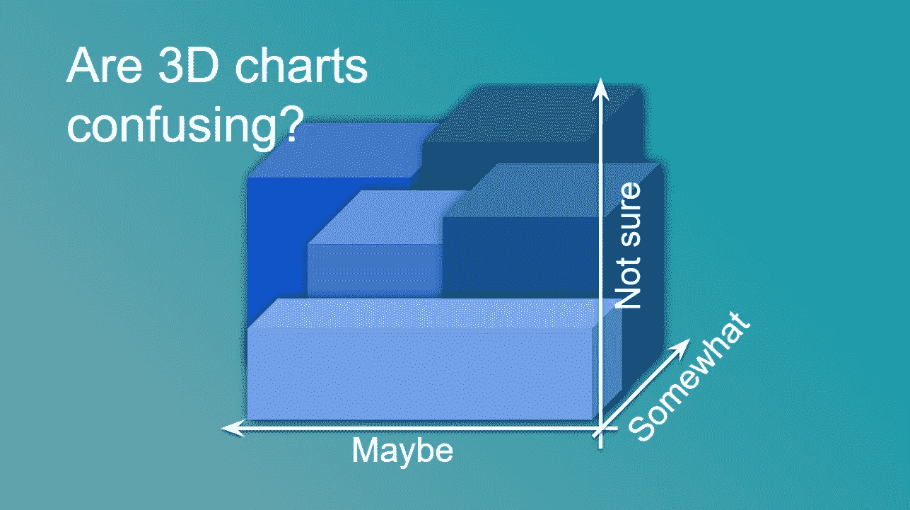
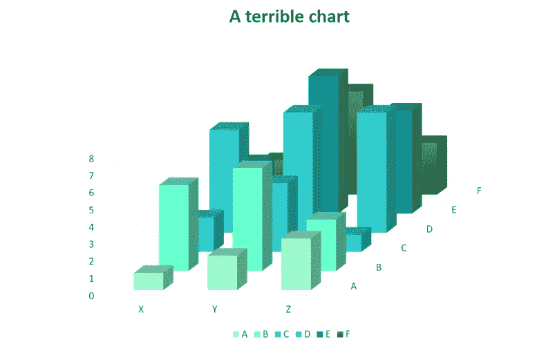
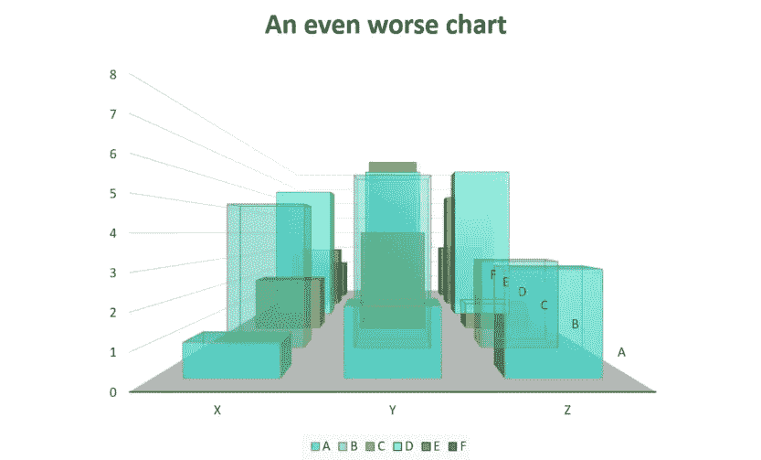
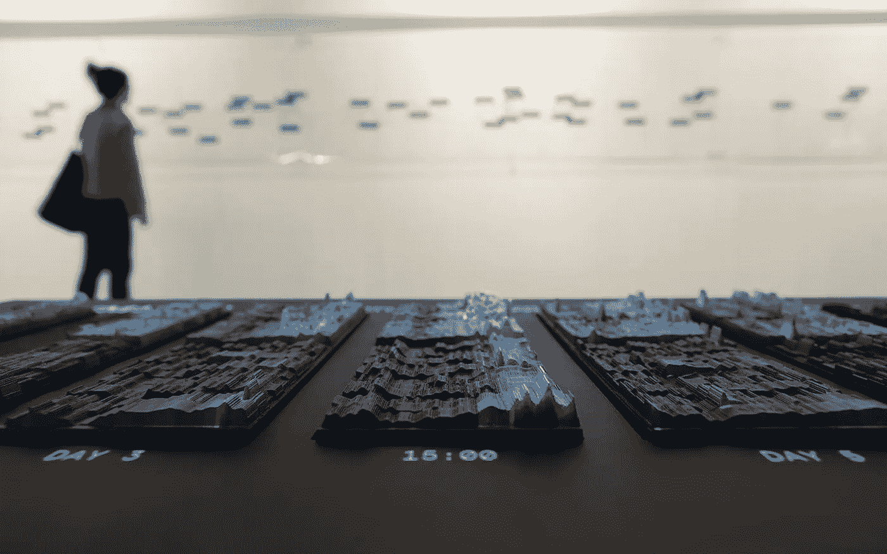

# 何时在数据可视化中使用 3D

> 原文：<https://towardsdatascience.com/when-to-use-3d-in-data-visualisation-f3739e320da7>

## 使用三维表示数据时的注意事项

并非所有的 3D 图形都像这张一样令人困惑。来源:作者

继[我的上一篇文章](/why-we-should-use-animation-in-data-vizualisation-6004fb400014)关于为什么使用运动可以成为数据可视化的有效工具之后，在这篇文章中，我们将注意力转向三维图表。我们将通过一些例子来强调在展示额外信息时的注意事项。

就像动画一样，在数据可视化中使用 3D 已经过时了。因此，在考虑向观众展示数据的最佳方式时，它经常被视为一种选择。

虽然许多最糟糕的视觉化作品往往是 3D 的(不相信我？看看[这个宝石](https://www.reddit.com/r/dataisugly/comments/6o7jj0/a_different_take_on_a_3d_pie_chart/)或者[这个例子](https://www.reddit.com/r/dataisugly/comments/2g1rbw/cost_of_cooking_at_home_vs_eating_out_displayed/)以及本文后面的一些图表)，相关性是*而不是*因果关系。一些最吸引人和最强大的视觉化也以三维形式呈现。事实上，有证据表明，在某些情况下，三维可视化可以比传统的 2D 方法更有效。[1]

现实情况是，3D 图表风险很高。如果弄错了，你很可能最终会创造出相当于巧克力茶壶的数据可视化。然而，如果做对了，你就能产生引人入胜的、有洞察力的、原创的出色数据可视化。

所以，如果你是一个寻求观想刺激的人，请继续读下去。然而，如果在你的图表中增加第三维度的肾上腺素听起来像是高血压的处方，那么你已经被警告了…

# 3D 制图的注意事项

## 不要:当 3D 不提供任何新信息时，使用 3D

这似乎是显而易见的，但令人惊讶的是，你经常看到 3D 图表，其中更传统的可视化数据的方法会有效得多。

让我们考虑下面的例子:

很糟糕，但不幸的是，这不是你在本文中看到的最糟糕的图表。来源:作者

当你看到上面的图表时，你毫无疑问地执行了一个[吐槽](https://en.wikipedia.org/wiki/Spit-take)，并且可以清楚地看到这是一个令人震惊的可视化数据的方式，它仍然值得考虑为什么是这样的细节:

*   前景中的条形遮住了背景中的条形。
*   第三个维度在每个条形的顶部创建了两条水平线，使得判断高度更加困难。这也使得读者在浏览多个条形时可能无法进行同类比较。
*   图表的右下区域离轴很远，因此几乎不可能确定该区域中条形的值。

很明显，一个简单的二维堆积或分组条形图会以更简单、更有效的方式呈现所有上述数据点。

## 不要:忽略视角和观点

添加额外的维度还会添加两个额外的参数，这两个参数需要在创建图表时进行设置:

1.  **视角**。当我们观察物质世界时，离我们较远的物体看起来比离我们较近的物体要小。[图形透视](https://en.wikipedia.org/wiki/Perspective_(graphical))模拟这种效果。虽然这使对象看起来更逼真，但在数据可视化中使用时会引起问题。如果一个对象的大小可以根据它离我们的距离而改变，那么当大小也被用来表示数据值时，这可能会引起混乱。因为这个原因，当谈到观想时，透视是最好避免的[。](https://en.wikipedia.org/wiki/Orthographic_projection)
2.  **观点**。创建 3D 图表时，我们需要考虑如何查看它；我们的“眼睛”相对于图表的位置在哪里？这需要仔细审查，以确保信息表达清楚。

下面的图表允许我们更详细地研究这两个参数:

来源:作者，虽然我并不以此为荣

这可不好。

比尔·盖茨允许这成为 Excel 中的默认图表类型，这一事实比阴谋论者目前对他的任何想象都更令人震惊。然而，它强调了忽视视角和观点的影响。具体来说:

*   此图表中视点的位置有效地遮挡了读者的大部分信息。使用透明度来弥补这一点只会造成复杂的视觉混乱。
*   透视法的使用使得比较图表前面的条形和后面的条形变得非常困难，因为它们本质上是用不同的尺度来衡量的。

## Do:将 3D 映射到 3D

利用 3D 可视化最明显的时候是你的数据也有三维的时候。

下面的例子很好地证明了这一点:

这张图表的作用有几个原因:

*   在可视化中对地球的熟悉减少了对我们工作记忆的需求[2],有助于补偿三维和动画创造的增加的复杂性。
*   任何熟悉地图地理数据的人都会理解，使用三维可以立即解决试图将球形数据投影到 2D 表面时存在的固有问题。事实上，有大约 50 种技术来实现这一点，所有这些技术都必须在如何最好地“扁平化”地理信息方面做出重大妥协[3]。
*   通过在全球范围内缓慢移动视点，它允许观看者消化呈现给他们的信息，同时也提供信息的完整画面。

## 做:跳出框框思考

数据可视化中第三维最强大的一个方面是，它为如何表示数据开辟了许多可能性。

这使得在设计向观众展示数据的方式时，创造力成为过程中的一个关键部分。

下面的例子展示了艺术和数据是如何融合在一个实体装置中，呈现出人们对 2012 年伦敦奥运会的情感反应:

物理装置展示了对 2012 年奥运会的情感反应。来源:NAND 工作室

然后，该装置将数字信息叠加到物理模型上，为观众提供他们正在观看的具体细节。

这是一个很好的例子，展示了 3D 数据可视化是如何被用来创造一些原创的、身临其境的和信息丰富的东西。试着用饼状图来做吧！

## 结论

虽然在 3D 中可视化数据并非没有风险，但希望这篇文章已经表明，它不应该作为向观众展示信息的一种选择而被放弃。

下次你创建图表时，请不要忘记考虑使用额外的维度。

## 更多示例:

我附上两个进一步的例子，说明三维可视化是如何被用来产生巨大的影响。如果你有更多的例子要补充，请评论。

*   这个[谷歌实验](https://artsexperiments.withgoogle.com/tsnemap/)由一个互动艺术画廊组成，使用机器学习将相似的作品聚集成一个 3D 艺术“景观”
*   [这个来自《纽约时报》的著名例子](https://www.nytimes.com/interactive/2015/03/19/upshot/3d-yield-curve-economic-growth.html)通过两个时间轴创建了一个三维图表。这是一个非常好的例子，因为它确实不应该工作，但在传递收益率曲线的复杂信息方面非常有效。

**参考文献:**

[1]对虚拟现实、三维可视化和 2D 视觉交互模拟效果的比较评估:探索性荟萃分析。Ikpe 大法官阿库潘和穆拉利·尚克尔，2019 年

【2】有什么问题？熟悉度、工作记忆和问题解决任务中的迁移。詹姆斯·科尔、汉娜·斯奈德、钱德拉·l·布罗杰德和安吉拉·弗兰德。2015

[3]50 个映射投影的视觉指南:[https://gisgeography.com/map-projection-types/](https://gisgeography.com/map-projection-types/)