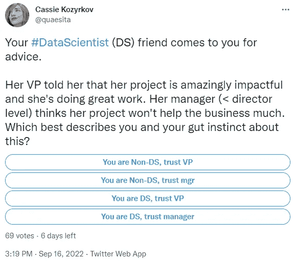

# 当你的经理不是你最好的向导时

> 原文：<https://towardsdatascience.com/when-your-manager-isnt-your-best-guide-841f385760b9>

## 你应该相信副总裁的反馈还是经理的反馈？

作者使用几个工具创建的图像，包括 [DALL E 2](https://openai.com/dall-e-2/) 。

在我的[上一篇文章](http://bit.ly/quaesita_cynicism)中，我们研究了下面的[民意调查，我认为如果你没有关于情况和所涉及的个性的额外背景，有一个可靠的经验法则](https://twitter.com/quaesita/status/1570855013190348802)[支持一个反馈来源而不是另一个。现在是时候提几个可以改变答案的修饰词了。](http://bit.ly/quaesita_cynicism)

[推特投票链接](https://twitter.com/quaesita/status/1570855013190348802)。就问题的目的而言，您可以假设:副总裁不是数据科学背景，而经理有技术背景，但不做数据工作。副总裁和经理都擅长他们的工作。

# 经验法则

如果我们对项目、副总裁或经理一无所知，那么[用差异](http://bit.ly/quaesita_cynicism) **进行逻辑检查，经理**更倾向于作为更清晰的信息来源。(更多关于这个话题的[在这里](http://bit.ly/quaesita_falseboss)。)

# 例外

但是如果你有更多的上下文呢？下面列出了一些可能会让我们倾向于副总裁的因素:

## **缺乏可测量性**

如果影响是不可测量的，那么你的有用性或缺乏有用性取决于你所服务的人们的现实扭曲领域。如果副总裁说你的工作非常有影响力，而且没有办法证明不是，那么你就是有用的……除了:

## 支持

当你在旁观者眼中是有用的，仅仅在最资深的旁观者眼中是有用的是不够的。你需要确定他们会投入工作(这就是工作！)以确保其他人都以自己的方式看待事物。如果你不相信副总裁会记得你的名字，当他表扬你出色的工作时，那么他们告诉你有一次你和他们共乘一部电梯也没关系。

如果一个副总裁在森林里为你辩护，但没人听到，那就没有发生过。但是如果副总裁有为他们所鼓励的人说话的历史，你就要更加重视他们的反馈。

## **经历**

如果你的经理是新来的，副总裁的反馈可能是一个更清晰的信号。无知是所有层次差异的典型来源。

另一方面，如果副总裁是新来的，祝你好运，在这个雷区里跳舞吧。顺便说一下，你可以通过观察所有精明的运营商在获得新副总裁时的做法来了解很多信息。这是一场值得门票的演出。

## **你们团队的问题**

一个好的经理比你的上级更有动力支持你。当一个团队运作良好时，你的经理的胜利就是团队的胜利，反之亦然，但如果你的团队有重大问题，而你的经理正在努力处理这些问题，你正在处理一个离家太近的局部混乱产生过程。无论什么错误的严重性可能会扭曲信息太多，以至于你不能相信你的阅读。

## **管理无能**

如果你有充分的理由怀疑你的经理不称职或不值得信任，那么将你的信息获取偏向你不认识的魔鬼是相当合理的。但是注意不要跳出油锅，跳进火里。

## **对自己工作的理解**

你的直接经理通常更能理解你的工作及其含义，但也有极少数例外，比如副总裁与你有相同的专业背景，而你的经理却没有。即便如此，任何承担大范围任务的人都不太可能有时间去处理他们投资组合中的任何单个项目，所以一定要确保给你反馈的人拥有必要的知识和背景来给你建议。没有理解，反馈和预测就缺乏营养价值。

## 缺乏新奇感

如果你正走在一条被践踏得很好的道路上，并且参与的每个人都很好地掌握了大量像你这样的项目是如何进行的，那么离开争吵不休的经理和副总裁，看看像你这样的项目的丰富历史，然后回来问问他们每个人都知道什么而另一个人不知道。如果这里没有信号，就用历史吧。毕竟你是一个数据科学家。不妨走一走。

## **杂！**

这些异常就像潘多拉盒子里的东西:一旦我开始列表，就没有停止的可能…除了(！)凭意志的力量。但是如果你想出更多的例外，请在这里留下评论[继续这个列表。](https://twitter.com/quaesita/status/1572999334806814723)

# 感谢阅读！人工智能课程怎么样？

如果你在这里玩得开心，并且你正在寻找一个为初学者和专家设计的有趣的应用人工智能课程，这里有一个我为你制作的娱乐课程:

在这里欣赏课程播放列表，它被分成 120 个单独的一口大小的课程视频:[bit.ly/machinefriend](http://bit.ly/machinefriend)

 [## 加入介质

### 阅读 Cassie Kozyrkov(以及媒体上成千上万的其他作家)的每一个故事。您的会员费直接支持…

kozyrkov.medium.com](https://kozyrkov.medium.com/membership) 

*又及:你有没有试过在 Medium 上不止一次点击拍手按钮，看看会发生什么？* ❤️

# 喜欢作者？与凯西·科兹尔科夫联系

让我们做朋友吧！你可以在 [Twitter](https://twitter.com/quaesita) 、 [YouTube](https://www.youtube.com/channel/UCbOX--VOebPe-MMRkatFRxw) 、 [Substack](http://decision.substack.com) 和 [LinkedIn](https://www.linkedin.com/in/kozyrkov/) 上找到我。有兴趣让我在你的活动上发言吗？使用[表格](http://bit.ly/makecassietalk)取得联系。