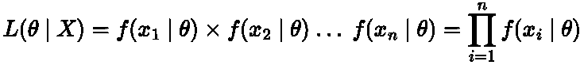
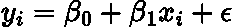
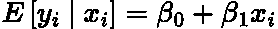
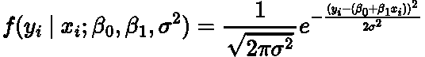
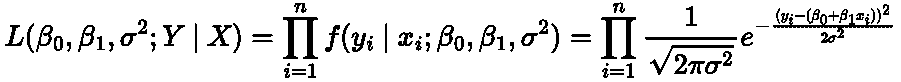
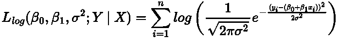
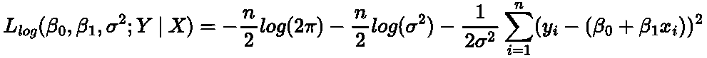
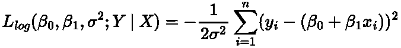
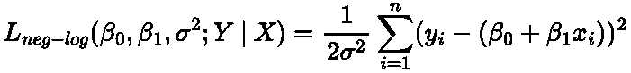
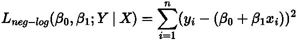

# 损失函数从何而来？

> 原文：<https://towardsdatascience.com/where-do-loss-functions-come-from-c93bc34c0bc5>

## 用极大似然估计量推导线性回归损失函数

杰斯温·托马斯在 [Unsplash](https://unsplash.com?utm_source=medium&utm_medium=referral) 上的照片

# 介绍

我们都知道，在线性回归中，我们的目标是最小化误差平方和(SSE)。然而，为什么是上交所，这种说法是从哪里来的？

在这篇文章中，我希望用最大似然估计来回答这个问题。

# 最大似然估计器

在数据科学社区呆上足够长的时间，我相信你会遇到术语**最大似然估计器(MLE)。**

我不打算给出 MLE 的详细分析，主要是因为它已经以不同的方式做了很多次，可能比我能解释的还要好。此处链接的是我所见过的 Josh Starmer 的 StatQuest 的最佳解释，它真是太棒了。

然而，为了完整起见，我将给出一个简短的描述。MLE 是一种计算最佳参数的方法，这些参数最好地描述了给定的数据或统计模型。

你可以这样想，给定我们观察到的数据，什么参数最适合这个数据。或者，什么参数最有可能给出这种数据分布。

例如，假设我们有一些数据 ***X*** ，我们想要找到可能生成这些数据的参数 ***θ*** 的最佳值。我们可以根据 ***θ:*** 的值，通过计算数据点个体概率的乘积来计算“可能性”

作者在 LaTeX 中创建的方程。

其中 ***L(θ | X)*** 是这个值的可能性 ***θ*** 产我们的观测数据***X*******f(X _ n |θ)***是概率[(概率密度函数)](https://en.wikipedia.org/wiki/Probability_density_function)*

*所以，我们想找到最大化***【L(θ| X)***的 ***θ*** 的值，因此它是最大似然估计量！*

# *简单线性回归*

*让我们以最基本的线性模型，简单的线性回归为例:*

**

*作者在 LaTeX 中创建的方程。*

*其中 ***y_i*** 为给定观测值的响应 ***x_i*** ， ***β_0*** 和 ***β_1*** 为我们想要拟合的参数， **ϵ** 为正态分布误差:*

**

*作者在 LaTeX 中创建的方程。*

*其中 **σ** 为方差。*

*这个等式可以用下面的方式重写:*

**

*作者在 LaTeX 中创建的方程。*

*其中 ***y*** 对 ***x*** 的条件分布假设为正态分布。*

> *请记住，假设条件分布是正态分布，而不是响应的边际分布。[这里链接的一个很棒的线程解释了这个概念。](https://stats.stackexchange.com/questions/327427/how-is-y-normally-distributed-in-linear-regression)*

# *应用 MLE*

*单个响应和可观测值的概率密度函数(PDF)是以我们的预测为平均值的[正态分布](https://www.investopedia.com/terms/n/normaldistribution.asp):*

**

*作者在 LaTeX 中创建的方程。*

*我们使用分号来区分参数和随机变量。*

*因此，我们的可能性函数是:*

**

*作者在 LaTeX 中创建的方程。*

*一般来说，人们更喜欢使用对数似然法，因为在数学上/计算上使用总和比乘积更方便:*

**

*作者在 LaTeX 中创建的方程。*

*正态分布 PDF 中的副标题:*

**

*作者在 LaTeX 中创建的方程。*

*这等于:*

**

*作者在 LaTeX 中创建的方程。*

*你注意到上学期有什么熟悉的东西吗？*

> *对于感兴趣的读者来说，这里有一个更完整的推导，链接到这些表达的出处。*

# *机器学习中的 MLE*

*现在在机器学习中我们只对 ***β_0*** 和 ***β_1 的参数感兴趣。*** 因此，对于机器学习中的简单线性回归模型，我们希望最大化的对数似然是:*

**

*作者在 LaTeX 中创建的方程。*

*由于我们通常认为它是最小化损失函数，因此我们取对数似然的负值，并找到最小化该函数的参数:*

**

*作者在 LaTeX 中创建的方程。*

> *最小化负对数似然性与最大化对数似然性是一样的。[这里链接的线程很好地解释了这一点。](https://stats.stackexchange.com/questions/141087/why-do-we-minimize-the-negative-likelihood-if-it-is-equivalent-to-maximization-o)*

*现在，**[在假设的线性回归中被说成是常数。](https://www.statology.org/constant-variance-assumption/) 考虑到这一点**，**对于简单的线性回归，我们需要最小化以下表达式:***

******

***作者在 LaTeX 中创建的方程。***

***也就是我们都知道的经典**平方和**！***

# ***结论***

***在这篇文章中，我们已经展示了如何使用线性回归的最大似然估计来导出平方和。这就是为什么它被用作我们机器学习问题的损失函数。***

***可以对二项式分布进行类似的推导，并得出用于逻辑回归的对数损失！***

# ***和我联系！***

*   ***要在媒体上阅读无限的故事，请务必在此注册！ 💜***
*   ***[*在我发布注册邮件通知时获得更新！*](/subscribe/@egorhowell) 😀***
*   ***[*LinkedIn*](https://www.linkedin.com/in/egor-howell-092a721b3/)*👔****
*   ****[*推特*](https://twitter.com/EgorHowell) 🖊****
*   ****[*github*](https://github.com/egorhowell)*🖥*****
*   *****<https://www.kaggle.com/egorphysics>**🏅*******

> *****(所有表情符号都是由 [OpenMoji](https://openmoji.org/) 设计的——开源的表情符号和图标项目。许可证: [CC BY-SA 4.0](https://creativecommons.org/licenses/by-sa/4.0/#)*****