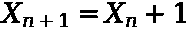
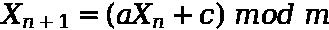
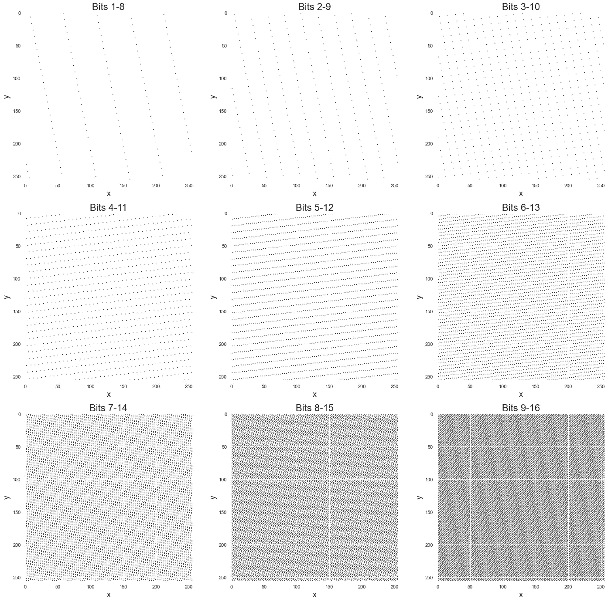
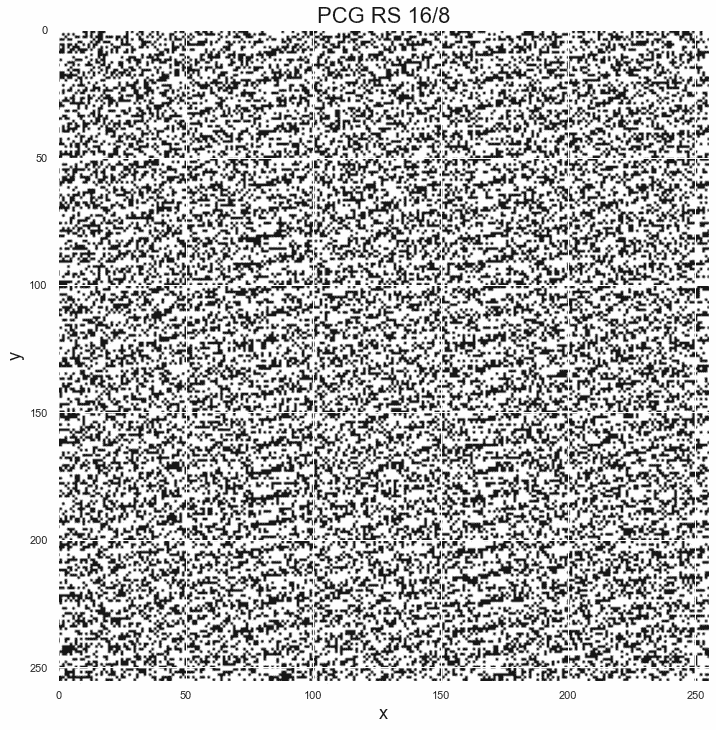
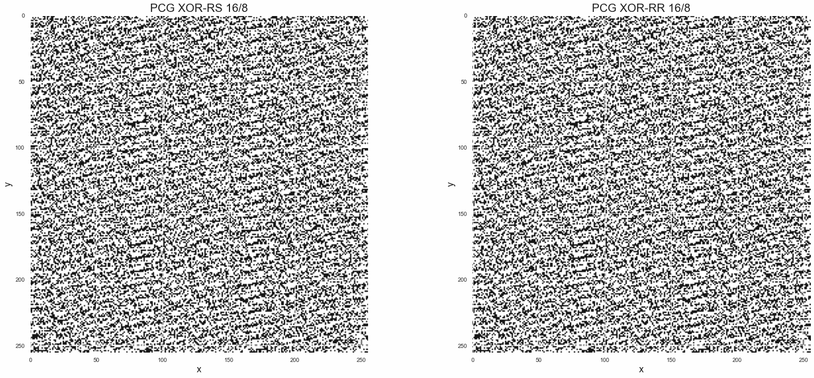

# python 的随机数是从哪里来的？

> 原文：<https://towardsdatascience.com/where-does-python-get-its-random-numbers-from-81dece23b712>


迪伦·诺尔特在 [Unsplash](https://unsplash.com/s/photos/lottery?utm_source=unsplash&utm_medium=referral&utm_content=creditCopyText) 上的照片

# python 的随机数是从哪里来的？

## 现代伪随机数发生器及其新的 NumPy 实现的简单说明

在生成正态分布的数字样本时，我很好奇它们“从哪里来”——特别是计算机如何能够创建遵循选择分布的数字，无论是正态分布、指数分布还是更古怪的分布。无论创建这些正态分布值的方法是什么([反转采样](https://en.wikipedia.org/wiki/Inverse_transform_sampling)、[博克斯-米勒](https://en.wikipedia.org/wiki/Box%E2%80%93Muller_transform)或快速的[金字形神算法](https://en.wikipedia.org/wiki/Ziggurat_algorithm))，它们都始于一个基本构件:一系列*均匀分布的*值。

这就引出了一个问题:这些是从哪里来的？在大多数情况下:从一个“伪随机数发生器”——或 PRNG。注意到 [NumPy 在 2019 年 7 月](https://numpy.org/devdocs/release/1.17.0-notes.html)改变了他们默认的 PRNG 以回应[这个 NEP](https://numpy.org/neps/nep-0019-rng-policy.html) (尽管互联网上仍然充斥着旧的做法)我很想知道:

*   他们为什么要改变它
*   PRNGs 最初是如何工作的

然后用简单的英语写下我的想法，同时附上一些有用的图表和代码示例。这是这些笔记，主要由 Melissa O'Neill 的[这篇](https://www.pcg-random.org/pdf/hmc-cs-2014-0905.pdf)(非常容易理解)论文和[这篇](https://www.youtube.com/watch?v=45Oet5qjlms&list=WL&index=171&t=364s)相关讲座指导，Melissa O ' Neill 是 2014 年 PRNG 的 PCG 家族的作者，现在形成了 NumPy 的默认 PRNG。

## 为什么是“伪”？

因为产生真正的随机性是很难的——对人类(试试你的运气[这里](https://www.expunctis.com/2019/03/07/Not-so-random.html)看看你怎么样)和机器都是如此。如果我们认为机器只是接受输入并根据我们给它们的指令产生输出，那么根据定义，输出将和输入一样随机。

有一些方法可以确保这种输入是“真正”随机的，这些方法主要涉及硬件来测量自然界中真正随机的东西(如大气噪声)，但通常我们用选定的(非随机)初始值来“播种”算法。即使我们使用发电机启动时的机器时间(作为整数)作为种子，这也不是 100%随机的。然而，我们也许应该首先质疑是否值得追求真正的随机性。

## 我们想要“真正的随机性”吗？

这要看上下文。如果我们认为随机性是可预测性的反义词，而可预测性是安全性的敌人，那么回答这个问题就容易多了。当我们使用随机数来生成用于安全(即加密)的密钥时，我们希望这些数字看起来尽可能随机，以最小化威胁的可能性。因此，在这种情况下，真正的随机数发生器是有用的。

在其他情况下，当涉及到生成模拟时，我们可能会有其他优先事项，抵消绝对零可预测性的愿望。我们可能对一个函数感到满意，当你知道初始值(或足够的序列)时，它是完全确定的和可预测的，当你:

*   不知道起始值
*   实际上，知道“足够多”的序列是不可能的

这就引出了下一个问题:

## PRNGs 的哪些特性是理想的？

**速度、尺寸和再现性**

这里没有什么特别的——我们想要的是能够快速生成大量可再现的随机数，并且不占用太多内存，特别是如果我们计划让它们在不同的线程中运行的话。

**均匀性**

如果我们知道生成的随机数将落在区间`[0, n]`内，那么我们希望该区间内的每个数字都有均等的机会被选中——否则，即使理论上*和*我们有很多数字可以选择，但实际上这个数字会小得多。举个例子，如果我们在区间`[0, 255]`中有可能的数字，但实际上我们的 PRNG 只选择了`3`或`250`，那么这根本不是随机的。另一方面，我们不一定想要一个保证一致性的算法。如果是这种情况，那么如果我们有一系列的`n`号码可供选择，并且我们已经选择了`n-1`号码，那么最终的号码根本不是随机的——它将仅仅是还没有被选择的号码。通过反向工作，我们可以看到，当我们到达范围的末端时，任何保证一致性的算法都将减少随机性，也称为“周期”。

**一个长‘期’**

如果我们承认，为了让计算机生成一个序列，我们必须给它一个函数，将前一个数字转换成下一个数字，那么如果我们最终得到一个我们以前见过的数字，我们将开始重复这个序列。只要我们从一个有界区间中选择数字，这种情况就一定会发生，因为如果我们在`[0, n]`中选择数字，那么根据定义，第`n+1`个数字一定是之前一个数字的重复。换句话说，在适当大小的序列**上，所有 PRNGs 都将复制，因此变得确定**。为了防止这种情况，我们可以在这种情况发生之前使数字的数量(句点)比我们希望采样的数字序列的长度大得多。

**图案缺失**

这似乎是显而易见的，但值得一提。例如，满足上述所有属性的一个好算法就是简单地“加 1”:



作者图片

这将是:

*   惊人的快，小，可重复(我们只需要知道`X_0`我们开始的价值)
*   统一:给定区间中的每个数字将被选择一次
*   长周期:只要我们不在某个值上“绕回”以确保数字大小不会变大，它就不会重复，即映射一个大数字，`y`，回到零并重新开始

换句话说，前面的条件提供了伪随机算法表现为随机的能力，但并不能保证这一点——我们仍然需要一个好的算法，当你不知道初始条件时，它缺乏可预测性。

这一位很关键，如果您知道算法的“状态”(比如上一个随机数和将其转换为下一个随机数的函数)，所有 PRNGs 都是确定的。关键是，如果没有这些信息，数字就会显得随机——就像一只火鸡认为圣诞节是一只“黑天鹅”,而农民却不是(随机性是相对于你的信息集而言的)。

## lcg

线性同余生成器(lcg)是最古老的 PRNGs 之一，幸运的是非常容易理解。



换句话说，为了得到序列中的下一个数字，我们取前一个数字，然后:

*   乘以某个常数`a`
*   添加一些其他常数`c`
*   当我们除以其他常数时取余数`m`

到目前为止，没有什么太“计算机科学 y”的可怕的单词或短语，如“矩阵线性递归”或“梅森素数”。让我们为`{a, c, m}`选择一些值，看看输出是什么样子。

具体来说，让我们以非常简单的 [Lehmer 1951 发生器](https://en.wikipedia.org/wiki/Lehmer_random_number_generator)的形式构成一个发生器- `a=3`、`c=0`，为了确保我们生成 8 位数字，让我们设置`m=2^8=256`。这最后一位只是意味着数字将保持在`[0, 255]`之间，因此适合 8 位。

```
**3, 9, 27, 81, 243**, 217, 139, 161, 227, 169, 251, 241, 211, 121, 107, 65, 195, 73, 219, 145, 179, 25, 75, 225, 163, 233, 187, 49, 147, 185, 43, 129, 131, 137, 155, 209, 115, 89, 11, 33, 99, 41, 123, 113, 83, 249, 235, 193, 67, 201, 91, 17, 51, 153, 203, 97, 35, 105, 59, 177, 19, 57, 171, 1, **3, 9, 27, 81, 243**, 217, 139, 161, 227, 169, 251, 241, 211, 121, 107, 65, 195, 73, 219, 145, 179, 25, 75, 225, 163, 233, 187, 49, 147, 185, 43, 129, 131, 137, 155, 209
```

那么我们已经看到了什么问题呢？

*   所有的数字都是奇数，所以我们根本没有一致地接触到所有的数字(任何可观察到的模式都是随机性的对立面)
*   这段时间很短——你可以看到我们在中途回到起点，然后开始重复自己

## 如果 lcg 如此糟糕，那么这与今天的 PRNGs 有关系吗？

因为 lcg*不*可怕。上面的 LCG *很糟糕，但这与作为一个数字生成器家族的 LCG 本身关系不大，而与我们参数化它的方式关系更大。事实上，下面的 LCG 被称为`drand48`，并且是`java.util.Random`的基础:*

但是与上面的 LCG 规范有一个关键的不同。

## 不只是输出‘状态’，而是它的一个函数

在第一个例子中，我们只是生成了序列中的下一个数字并输出它。如果是`255`，那么我们序列中的下一个数字是`255`。别开玩笑了。在上面的 LCG 实现中，情况并非如此——我们有下面的`yield seed >> 16`。在 python 中，这是一个按位运算符，将所有位向右移动 16 位，结果最右边的 16 位被丢弃。

我们可以举一个例子——如果我们有数字`1017`，我们可以用二进制表示为`11 1111 1001`(间距只是为了便于阅读)——如果我们做`1017 >> 3`，那么我们最后得到`111 1111`(也就是`127`)，也就是说，我们将所有内容向右移动 3 位，并删除右边的前 3 位。这只是一个这样的函数，它展示了一种提高产量的方法。现在，我们的 LCG 算法有了以下设置:

*   生成序列中的下一个数字——这是 LCG 的“状态”(只是术语)
*   使用“状态”生成“输出”——这是随后用于形成序列一部分的数字

这就是为什么我们可以有一个具有“8 位输出”的“16 位发生器”，因为发生器的“状态”是一个 16 位数字，但输出是一个 8 位数字，其中 8 位数字是通过对 16 位状态应用一些函数来创建的。正如我们将会看到的，创建具有不同输出状态的 PRNGs 可以极大地改善它们的统计特性。

## 随机图表:可视化随机性

为了获得关于各种算法有多随机的一些直觉，我们需要一种方法来可视化这种随机性。为此，我们将再次借用梅丽莎·奥尼尔论文中的一个观点。实际上，随机数发生器比我们将要做的要大得多(64 位状态，32 位输出)，但以下是想法:

*   创建一个具有 16 位状态的生成器，即种子/状态在范围`[0, 65535]`(其中上限为`2**16-1`)内
*   输出一个从 16 位状态导出的 8 位数字——即输出序列中的每个数字都在`[0, 255]`中
*   取序列并将相邻的点成对分组，即`[x_0, x_1], [x_2, x_3], etc`
*   这些对在一个 256 x 256 的图形中形成了`{x, y}`坐标
*   使用 PRNG 生成`2^16`坐标并绘制，如果没有配对坐标，则该坐标为白色，给定坐标上的配对越多，该坐标将越黑

在某种程度上，这将给我们一个很好的随机图像。如果我们有一个好的算法，我们会有一个有很多点的图，总体上看起来是随机的。通过一个例子就可以很容易地看出这一点。让我们用一个参数化好的“16 位状态，8 位输出 LCG”画出几个“随机图”。



作者图片

左上角的图表显示了当我们取 16 位状态数中最右边的 8 位时得到的结果。例如，如果我们迭代的“状态”是用二进制表示为`1111 1111 1000 0101`的数字`65413`，那么我们将输出最右边的 8 位- `1000 0101`(或`133`)。我们对所有的数字都这样做，将它们成对分组并绘制出来。

**我们可以看到，这些数字看起来一点也不随机——它们形成了整齐的直线。**这是[马萨格里亚定理](https://en.wikipedia.org/wiki/Marsaglia's_theorem)，显示了当我们的周期太小时 lcg 的问题(因此得到像这样的重复值)。然而，随着我们向更高的 16 位状态发展，情况开始有所好转。在右下方的图表中仍然有一个清晰的结构，但我们在覆盖空间方面做得更好。

因此，当看到这一点时，我们可以做出如下观察:**由 LCG 产生的 16 位状态数中的 8 位组越高，它们看起来越随机。**

## 输入 PCG

尽管 lcg 仍有广泛的实际用途，但它们不是 2019 年前 NumPy 的默认 PRNG。相反，在 NumPy 1.17 之前，使用了一种叫做[梅森扭扭器](https://en.wikipedia.org/wiki/Mersenne_Twister)的算法——具体来说是 mt 19937——因为其周期长度(绝对巨大)是一个[梅森素数](https://en.wikipedia.org/wiki/Mersenne_prime)(`2**19937 - 1`-2 的负 1 次方)而得名。然而，随着 1.17 NumPy 版本的发布，它切换到默认 PRNG 是一个 [PCG - *置换*(线性)同余发生器](https://en.wikipedia.org/wiki/Permuted_congruential_generator)。

PCG 是 Melissa O'Neill 创建的一个生成器家族，它巧妙地利用了上面的观察结果——尤其是图表。想法是这样的:

*   输出状态的函数，而不是直接输出状态，似乎增加了随机性
*   lcg 在低位(左上图)明显缺乏随机性，但高位往往“更随机”(右下图)
*   例如，如果我们有一个输出 8 位数的 16 位状态，那么我们只需要选择 8 位来输出
*   为什么我们不使用 16 位状态中最随机的前几位来选择将哪个函数应用于 16 位状态的其余部分，以生成 8 位输出
*   换句话说，让我们使用我们状态中最随机的部分来随机选择一个变换函数应用于状态的其余部分——一种随机的排序算法

让我们看一个简单的例子。

## PCG 的

上述 9 个图表执行以下操作:从 16 位状态计算 8 位输出，其中 8 位输出是通过预定的位移(从左上 0 到右下 8)生成的。但是，如果不是固定的换档，而是随机的换档呢？

我们从哪里得到这种随机性？从我们 16 位状态的最高几位开始。换句话说，如果我们有一个状态`57277` ( `1101 1111 1011 1101`)，我们可以:

*   使用最高的 2 位`11`来确定移位，在本例中为 3
*   将此移位应用于其他位，`01 1111 1011 1101` s.t .我们不是选择*最左边的* 8 位，`0111 1110`，而是将 3 向右移位并选择位`1111 0111`

在某种程度上，我们在查看上述 9 个图表时所做的是使用 8–15，9–16 图的随机性来随机选择我们是否从`{4-11}` - `{7-14}`图中选择一个数字。让我们看看这个是什么样子的:



作者图片

很明显，仍然有一些结构，但通过简单地取 16 位状态的最高 2 位，并使用它来选择状态其余部分的置换，改进是巨大的——因此命名为置换(线性)同余生成器。但这仅仅是一种这样的转换——位移。

其他变形呢？有大量的变换(异或、旋转等)可用于创建 PCG 族，其中高位随机选择哪种排列应用于线性生成的状态。让我们来看另外两种可以使用的排列。

## 旋转

我们可以(随机)选择的一种变换是比特的“旋转”。就像前面的`>>`操作符一样，我们将位向右移动并丢弃溢出，通过旋转，我们移动一个方向，但不是丢弃溢出，而是将溢出带到另一侧。

如果我们有数字`113`，用二进制表示为`111 0001`，我们可以执行`2`的“右旋转”来创建`011 1100`或`60`。这里，我们将最右边的 2 位(`01`)旋转到最开始的位置，并将所有内容下移。

## xorshift

我们可以应用的另一种变换是“xorshift”。还是那句话，我们用同一个例子来说明。再次采取`113` ( `111 0001`)我们可以:

*   将其下移一个量，例如 2，得到`001 1100`
*   将[按位异或](https://en.wikipedia.org/wiki/Bitwise_operation#XOR)函数应用于原始数字和移位后的数字

在这种情况下，我们将对`111 0001`和`001 1100`计算`xor`(或者 python 中的`^`)以获得`110 1101`(当只有 1 位为 1 时为 1，如果两者都为 1 或 0，则为 0)。

## PCG XSH-RS 和 PCG XSH-RR

现在让我们看看两种常见 PCG 的随机曲线图，看看它们与上面的相比如何。它们是:

*   PCG XSH-RS:首先计算一个 xorshift 操作，然后随机地*移位*结果位
*   PCG XSH-RR:首先计算一个 xorshift 操作，然后随机地*旋转*结果位



作者图片

同样，仍然有结构，但他们是一个显著的进步。这种结构的存在是因为我们使用的是“小型”发电机。正如 16 位状态的高 8 位比低 8 位更随机一样，32 位状态的高 16 位比低 8 位更随机。当我们使用越来越大的状态时，我们自然会增加周期。**将这两者结合在一起就是为什么即使是非常大的(96 位状态，32 位输出)lcg 也能通过** [**大碾压**](https://en.wikipedia.org/wiki/TestU01)**——Pierre L ' e cuyer 和 Richard Simard 打包的一组广泛的统计测试，用于测试 PRNGs 是否具有前面提到的理想特性。**

**给定随机选择的排列的附加随机性，PCG 的性能比 lcg 好得多，因此不需要如此大的状态来通过测试套件。正是因为这个原因，它们被作为 NumPy 中的默认 PRNG——确切的算法是 PCG XSL RR 128/64。**