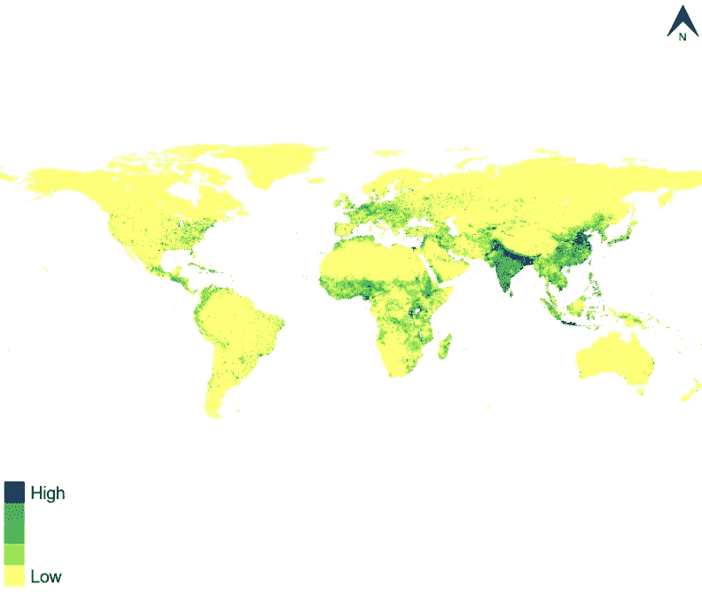
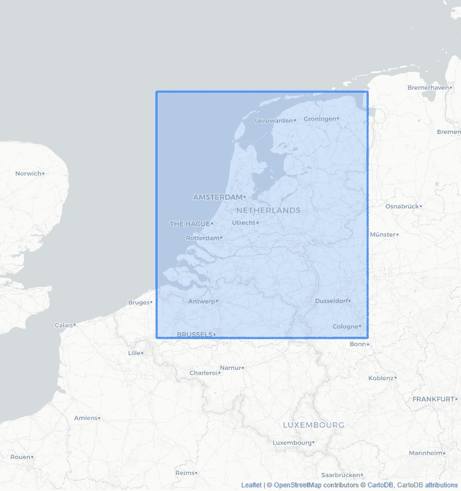
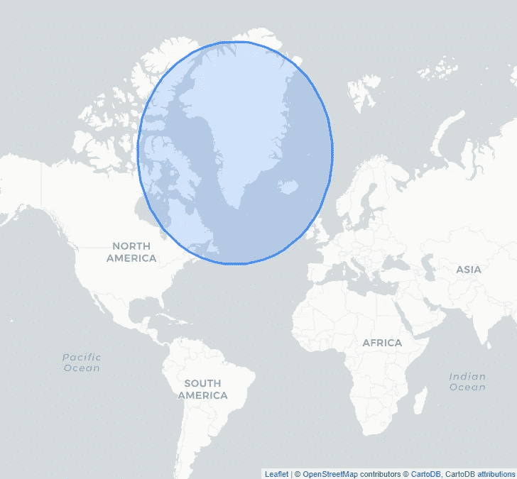
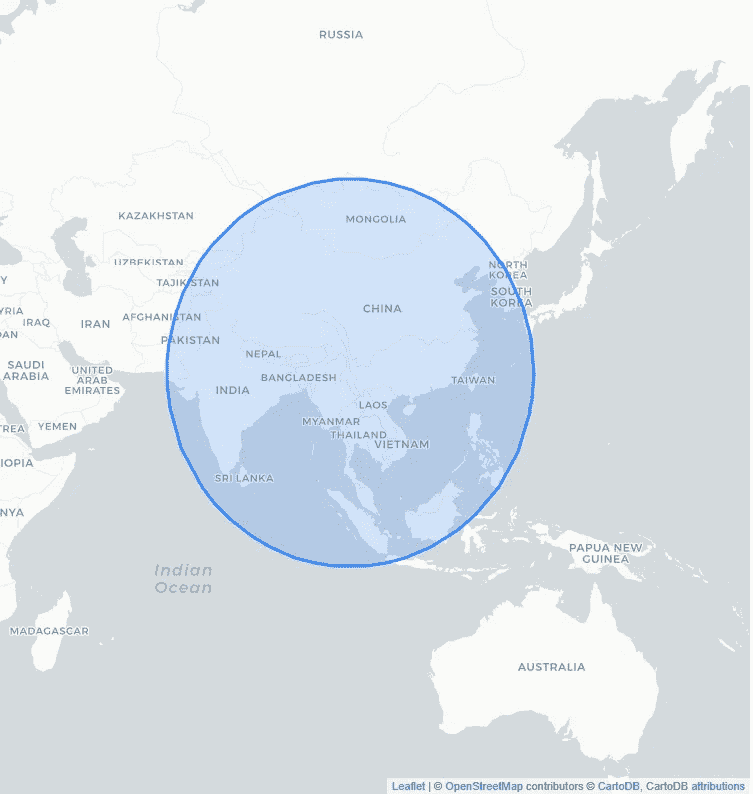

# 世界人口中心在哪里？

> 原文：<https://towardsdatascience.com/where-is-the-population-center-of-the-world-749dc3f86a63>

# 世界人口中心在哪里？

## *我们发现地球上有一个圈，50%的人住在这个圈内*

世界上的大部分权力集中在美国和欧洲等西方国家，使得这些地方在世界舞台上非常突出。但是如果从人口数量来看，世界的中心在哪里呢？受到 youtube 上一个真实生活故事视频的启发，我去寻找一个你能在地球上画的最小的圆，50%的人住在这个圆里面，50%的人住在外面。这个圆圈的中心可以被称为世界人口中心。

在这篇文章中，我们将深入探讨许多与地理相关的话题，这些话题是我在读博士时就有的激情所在。您将学习如何:

*   将网格数据读入 Python
*   将格网数据集与面相交
*   在地理投影之间转换数据
*   在平面地图上画圆，也称为大圆距离

在接下来的几节中，我将慢慢介绍我们的解决方案，从我们所有分析的人口数据开始。

github 上的[也有这篇文章和代码。](https://github.com/PaulHiemstra/population_circle_article)

# 人口来源数据

我们分析的核心是人口数据。我选择使用在 WorldPop 上[发布的 1 公里网格人口数据集。在比尔和梅林达·盖茨基金会的资助下，许多大学整理了这个数据集。它覆盖了全球，并提供了生活在特定网格单元中的人口数量:](https://www.worldpop.org/doi/10.5258/SOTON/WP00647)



[世界人口网格数据的可视化](https://www.worldpop.org/geodata/summary?id=24777)

我选择使用他们提供的最新数据集，即 2020 年的数据集。

```
array([[-3.4028235e+38, -3.4028235e+38, -3.4028235e+38, ...,
        -3.4028235e+38, -3.4028235e+38, -3.4028235e+38],
       [-3.4028235e+38, -3.4028235e+38, -3.4028235e+38, ...,
        -3.4028235e+38, -3.4028235e+38, -3.4028235e+38],
       [-3.4028235e+38, -3.4028235e+38, -3.4028235e+38, ...,
        -3.4028235e+38, -3.4028235e+38, -3.4028235e+38],
       ...,
       [-3.4028235e+38, -3.4028235e+38, -3.4028235e+38, ...,
        -3.4028235e+38, -3.4028235e+38, -3.4028235e+38],
       [-3.4028235e+38, -3.4028235e+38, -3.4028235e+38, ...,
        -3.4028235e+38, -3.4028235e+38, -3.4028235e+38],
       [-3.4028235e+38, -3.4028235e+38, -3.4028235e+38, ...,
        -3.4028235e+38, -3.4028235e+38, -3.4028235e+38]], dtype=float32)
```

`read`命令产生一个包含所有人口数据的 numpy 数组。一个显著的特征是所有的`-3.4028235e+38`值，文件的元数据显示它们是 NA 值。这主要包括没有人居住的水体。接下来，我们将这些值转换为适当的 NA 值，并对所有非 NA 值求和:

```
7.966754816
```

所以根据数据集，2020 年有 79 亿人生活在地球上。这完全符合我的预期。为了以后的使用，我们将这段代码重新打包成一个函数，它决定了一个`.tif`网格文件的总人口大小:

```
7966755000.0
```

# 将人口数据装箱

在第一步中，我们将地图上的所有人口网格单元相加。显然，在我们寻找包含一半人口的圆的过程中，我们不想把整个地图加起来。作为第一步，我们将确定一个小边界框内的总人口。为此，我们要确定哪个网格单元在盒子里面，哪个不在。在地理术语中，这被称为将边界框与 gridcells 相交。首先，我们构建我们感兴趣的边界框:



作者图片

这很好地显示了我们使用荷兰的边界框作为我们的第一个目标。

我探索的第一个解决方案涉及到将每个 gridcells 转换成一个地理点，并执行框和点之间的交集。这种解决方案的问题是，它占用了大量的 RAM，并且每次我试图生成点时，我的 Python 会话都会崩溃。为了补救这种情况，我选择将工作外包给 GDAL。GDAL 是一个带有 Python 绑定的地理空间处理库。

在 GDAL 中，我可以使用 warp 工具来执行所需的分析。然而，这要求所有输入数据都是磁盘上的文件。所以首先我们必须将边界框保存到磁盘，然后我们可以调用 GDAL:

在这里，我们使用 Warp 的切割功能将网格切割成边界框内的 gridcells，并将结果作为新的 tif 文件转储。之后，我们可以简单地使用我们的`get_population`函数来计算住在盒子里的总人数:

```
31.186402
```

这表明有 3100 万人生活在这个盒子里。这与居住在荷兰的 1700 万人非常吻合，加上比利时和德国的人口中心也在这个范围内。为了方便起见，我们将这些步骤封装到一个新的函数中供以后使用:

```
31.186402
```

# 将盒子升级为圆形

但是我们的挑战是用一个圆来执行这个操作，而不是一个盒子。幸运的是，上面给出的整个工作流程并不局限于一个盒子形状，而是适用于任何多边形类型的形状。因此，我们的下一个挑战是围绕一个特定的中心点以特定的半径构建一个圆。

这里的一个问题是，我们使用的人口网格是在经纬度坐标中定义的。圆形地球在平面上的投影使我们不能简单地在地图上画圆。我找到的[解决方案](https://gis.stackexchange.com/questions/121256/creating-a-circle-with-radius-in-metres)采用我们提供的纬度中心点，并将其重新投影到米距离的投影上。然后，我们在投影中构建一个圆，并将该圆投影回经纬度(WGS84):



作者图片

这很好地显示了我们的 2200 公里完美圆在经纬度投影中转化为一个椭圆形。这解释了为什么格陵兰岛在地图上比非洲大得多。我们的格林兰圈准备就绪，我们可以调用`get_population_in_shape`函数:

```
1.81848775
```

这证实了居住在格陵兰岛及其周围的人并不多，准确地说是 180 万。

# 寻找人口中心

在 Youtube 视频中，主持人命名了一个围绕孟吉镇的 3300 公里的圆圈，以展示世界上 50%的人口居住在其中的最小圆圈。使用我们的工具和数据，我们可以检查这一点:



作者图片

这表明，根据我们的数据，我们很接近，但世界上只有 48%的人生活在圈内。稍微调整一下半径，我们会发现，如果我们将圆扩大一点，我们可以得到精确的 50 %:

```
3983.822592
0.5000559
```

我的圈子需要更大一点，这可能与我使用的特定数据集有关。

基于这些工具，下一步可以使用优化算法来尝试并确定我们可以找到覆盖地球 50%人口的最小圆的确切位置和半径。

这篇文章和代码也可以在 github 的[上找到。](https://github.com/PaulHiemstra/population_circle_article)

# 我是谁？

我叫 Paul Hiemstra，是荷兰的一名教师和数据科学家。我是科学家和软件工程师的混合体，对与数据科学相关的一切都有广泛的兴趣。你可以在 medium 上关注我，或者在 LinkedIn 上关注我。

如果你喜欢这篇文章，你可能也会喜欢我的其他一些文章:

*   [掌握数据科学并不是学习一系列技巧](/mastering-data-science-is-not-learning-a-series-of-tricks-df66d8529c29)
*   [学习 AI 机器人玩井字游戏系列文章](https://towardsdatascience.com/tagged/rl-series-paul)
*   [牛郎星图解构:可视化气象数据的关联结构](/altair-plot-deconstruction-visualizing-the-correlation-structure-of-weather-data-38fb5668c5b1)
*   [面向数据科学的高级函数式编程:使用函数运算符构建代码架构](/advanced-functional-programming-for-data-science-building-code-architectures-with-function-dd989cc3b0da)
*   [通过规范化扩展您的回归曲目](/expanding-your-regression-repertoire-with-regularisation-903d2c9f7b28)

# 人口数据归属

world pop([www.worldpop.org](http://www.worldpop.org/)——南安普顿大学地理与环境科学学院；路易斯维尔大学地理和地球科学系；纳穆尔大学地理系)和哥伦比亚大学国际地球科学信息网络中心(CIESIN)(2018 年)。全球高分辨率人口分母项目-由比尔和梅林达盖茨基金会资助(OPP1134076)。【https://dx.doi.org/10.5258/SOTON/WP00647 