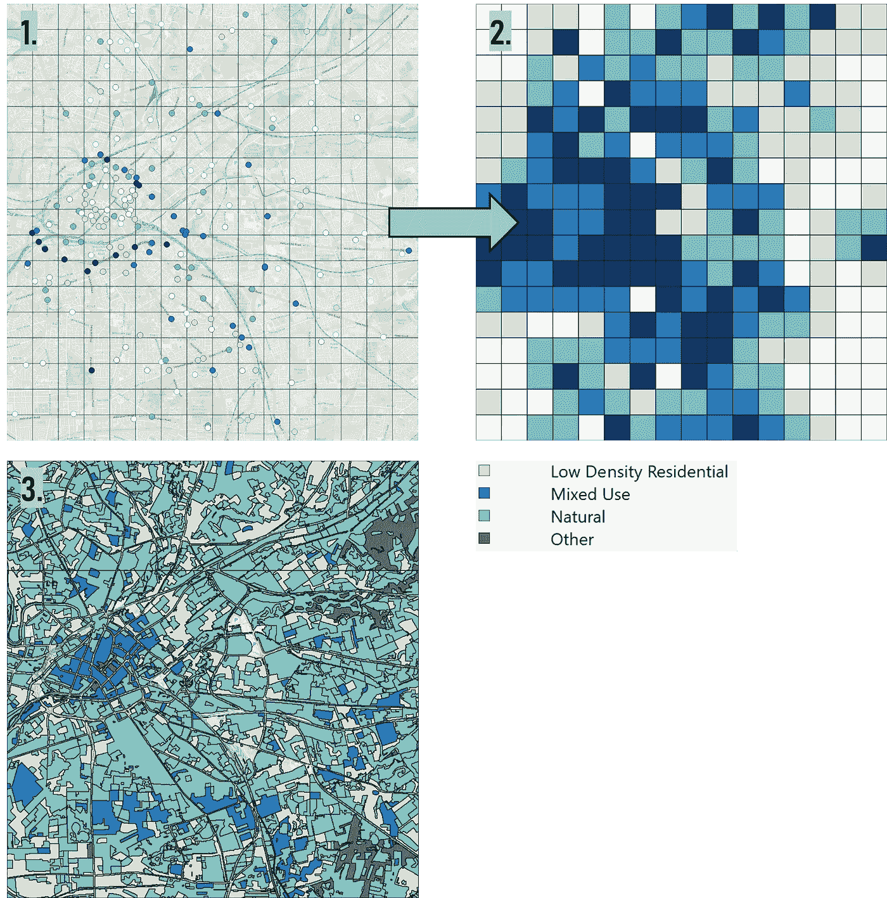
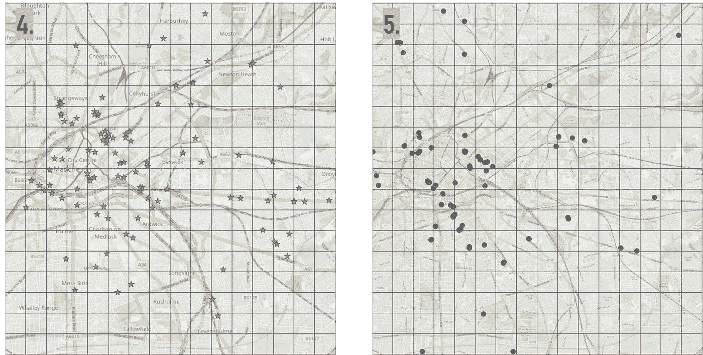
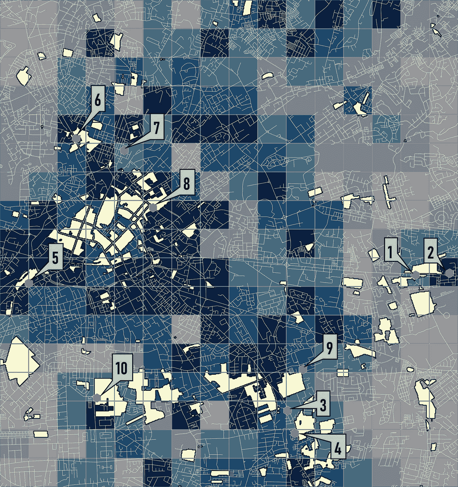

# 我们应该在哪里放置电动汽车充电站？(使用 QGIS 和纸浆)

> 原文：<https://towardsdatascience.com/where-should-we-be-placing-ev-charging-stations-using-qgis-and-pulp-d2bb7b664a55>

## [实践教程](https://towardsdatascience.com/tagged/hands-on-tutorials)

# 我们应该在哪里放置电动汽车充电站？(使用 QGIS 和纸浆)

## 曼彻斯特电动汽车充电站最佳位置模型开发之旅


曼彻斯特市的道路图——图片由作者提供

到说服潜在的电动汽车(EV)购买者，发展现有的充电站网络至关重要。术语“里程焦虑”描述了电动汽车车主担心在旅行中耗尽电动汽车电池的情况。目前，大多数电动汽车车主都可以使用家庭充电，而对于那些住在公寓或公寓的人来说，家庭充电几乎是不可能的，这在曼彻斯特市尤为明显。因此，为了满足所有潜在买家的需求，有必要明智地发展充电网络。

# 使用 GIS 数据

本研究的方法是高度重视地理信息，如交通流量、现有电动汽车充电、充电器的潜在停车场位置和土地使用分类。



68 公里网格中的 GIS 数据输入—作者提供的 QGIS 图像

充电需求是根据 39 至 140k 范围内不同测量点的每日汽车交通流量计算的(图 1)。因为交通流量的测量点不是均匀分布的，在某些区域可能会缺失，所以构建了一个 68 km 的格网，在其中计算每个格网单元的平均交通流量(图 2)。对于那些不包括任何测量点的网格，交通流量将是周围网格的平均值。图 3 所示的土地使用分类也用于确定快速和慢速充电器的合适位置，因为它假设快速充电器将安装在商业或混合使用区域，而慢速充电器则分布在公寓和公寓周围。



停车场(左)和现有的电动汽车充电器(右)——图片由 QGIS 作者提供

图 4 显示了潜在的电动汽车充电地点，我们在这些地点使用了市政管理的停车场，主要是因为这些数据容易获得(您可以根据您的可行地点进行更改)。图 5 显示了现有的电动汽车充电地点，因此，这些地区的充电需求已经得到满足。反过来，我们的模型必须通过选择充电需求最高的最合适的停车场来考虑这些因素。

# 开发优化模型

T 这一节讲述了 Python 代码的组成部分，完整的图片可以在 [github](https://github.com/obedsims/Musk-Model.git) 找到。我们的第一步是创建一个函数，为需求位置(网格单元的质心)和潜在的电动汽车充电位置(停车场)生成集合。

```
def gen_sets(df_demand, df_parking):
    *"""Generate sets to use in the optimization problem"""* # set of charging demand locations (i)
    demand_lc = df_demand.index.tolist() # set of candidates for charging station locations (currently    existing parking lots) (j)
    chg_lc = df_parking.index.tolist()

    return demand_lc, chg_lc
```

其次，使用距离矩阵来生成服务区的概念，如果需求质心和停车场之间的距离大于 500 米(驾驶员愿意为汽车充电的步行距离被认为是 500 米),则二进制变量将被设置为 0，否则其值将为 1。这也可以在 QGIS 中使用距离矩阵函数来执行。

```
# distance matrix of charging station location candidates and charging demand location
coords_parking = [(x, y) for x, y in zip(df_parking['Easting'], df_parking['Northing'])]

coords_demand = [(x, y) for x, y in zip(df_demand['centroid_x'], df_demand['centroid_y'])]

distance_matrix = distance.cdist(coords_parking, coords_demand, 'euclidean')
scaling_ratio = 1
distance_matrix2 = scaling_ratio * distance_matrix
distance_matrix3 = pd.DataFrame(distance_matrix2,index=df_parking.index.tolist(), columns=df_demand.index.tolist())
```

然后，我们需要创建一个包含所有参数`gen_parameters`的函数，以及一个包含每个网格单元 *i* 中现有电动汽车充电站当前满足的需求的函数`gen_demand`(这来自 GIS 建模)。然后，我们可以将混合整数线性问题公式化，该问题包括目标函数、变量和约束。我们的目标函数旨在通过从收费收入中减去总资本和运营成本，使加油站的利润最大化。除了保证网格单元 *i* 在站的服务区域中的需求之外，这些约束确保在站充电的汽车少于站的容量和充电需求。

```
def optimize(df_demand, df_parking):

    # Import i and j set function
    demand_lc, chg_lc = gen_sets(df_demand, df_parking)

    # Import parameters function
    di, m, p, t, ci_j, cr_j, ce_j, pe, alpha, lj, N, distance_matrix     = gen_parameters(df_demand, df_parking)

    # Import current demand of car park z in cell i
    diz = gen_demand(df_demand)

    # set up the optimization problem
    prob = LpProblem('FacilityLocation', LpMaximize) # Variables
    n = LpVariable.dicts("no_of_chgrs_station_j",
                         [j for j in chg_lc],
                         lowBound=0)
    q = LpVariable.dicts("Remaining_dem_station_j",
                         [j for j in chg_lc],
                         0)
    c = LpVariable.dicts("Tot_costs_station_j",
                         [j for j in chg_lc],
                         0)
    x = LpVariable.dicts("UseLocation", 
                         [j for j in chg_lc], 
                         0, 1, LpBinary) # Equality Equations r = np.full([len(demand_lc), len(chg_lc)], None)

    for i in demand_lc:
        for j in chg_lc:
            if distance_matrix[i][j] <= 500:
                r[i][j] = 1
            else:
                r[i][j] = 0 # Create empty dictionary for the remaining demand in cell i zip_iterator = zip(demand_lc, [None]*len(demand_lc))
    dr = dict(zip_iterator)

    # For each cell i subtract the existing number of charging   stations from the charging demands in cell i for i in demand_lc:
        for j in chg_lc:
            dr[i] = di[i] - diz[i] * m[j]
            if dr[i] < 0:       # limit minimum demand to zero
                dr[i] = 0 # Objective function prob += lpSum(p[j] * t[j] * x[j] - c[j] for j in chg_lc)

    # Constraints for j in chg_lc:
        prob += c[j] == (cr_j[j] + ce_j[j] + ci_j[j] + 0.1 * ce_j[j] + 0.1 * ci_j[j]) * n[j]+ pe * alpha * q[j]
    for j in chg_lc:
        prob += q[j] - n[j] * m[j] <= 0                            
    for j in chg_lc:
        prob += q[j] <= lpSum(r[i][j] * dr[i] for i in demand_lc)
    for i in chg_lc:
        prob += lpSum(x[j] * r[i][j] for j in chg_lc) - 1 <= 0
    for j in chg_lc:
        prob += n[j] - x[j] >= 0
    for j in chg_lc:
        prob += n[j] - lj * x[j] <= 0
    prob += lpSum(x[j] for j in chg_lc) == N 

    prob.solve()
```



红点表示电动汽车充电器的最佳停车场

## 结果

如果我们只考虑实现 10 个快速充电器(40 分钟充电到 80%)，优化产生上述结果。停车场 1-6 都位于通往城市的交通要道沿线(较暗的区域)，表明充电需求较高。除此之外，所有确定的快速充电器位置都位于商业/混合使用区域(黄色区域)周围，如超市、商场和餐馆。您还会注意到，更大比例的充电器位于市中心之外(图中左)，因为所有现有电动汽车充电器中约有 50%位于市中心，满足了现有需求。

# 结论

如果你已经到达这一部分，我希望这个案例研究已经鼓励你在你自己的城市重现这一点，你所需要的是一些在英国容易获得的地理信息，如交通流量，你可能想要放置站的地方和现有的电动汽车充电位置。该模型中充电站的最优位置主要由交通流的地理分布和基于土地利用分类的不同充电可能性决定，因此地理信息在优化过程中起着重要作用。然而，这种模式有一些局限性。在未来的研究中，改变网格的大小对于找出它的灵敏度是必不可少的。此外，充电需求的建模方式没有考虑交通流的结构，特别是车辆的起点和终点。因此，在每个需求节点中，电动车辆电池的状态是未知的。

欢迎在评论中分享你的想法，或者在 LinkedIn 上给我发你的问题，我会试着发布关于能源和气候变化的数据科学内容。

# 参考

[1]:边，，弗雷德里克·沃林，安德斯·阿韦林，，于志新(2018 年 8 月)寻找公共充电站的最佳位置——基于地理信息系统的 MILP 方法[https://www . science direct . com/science/article/pii/s 1876610219300803](https://www.sciencedirect.com/science/article/pii/S1876610219300803)

[1]:葛，s，冯，刘，(2011 年 9 月)。基于网格划分法的电动汽车充电站规划。在电气
和控制工程(ICECE)，2011 年国际会议上(第 2726-2730 页)。IEEE。

# 数据源

[现有电动汽车充电器位置](https://www.gov.uk/guidance/find-and-use-data-on-public-electric-vehicle-chargepoints)

[市政会管理的停车场](https://www.manchester.gov.uk/open/homepage/3/manchester_open_data_catalogue)

[道路形状文件](https://www.ordnancesurvey.co.uk/business-government/products/open-map-roads)

[土地利用分类](https://data.gov.uk/dataset/8b8c5df3-d7e3-484c-89d8-c7b819205002/national-historic-landscape-characterisation-250m-grid-england/)

[日交通流量](https://roadtraffic.dft.gov.uk/local-authorities/85)