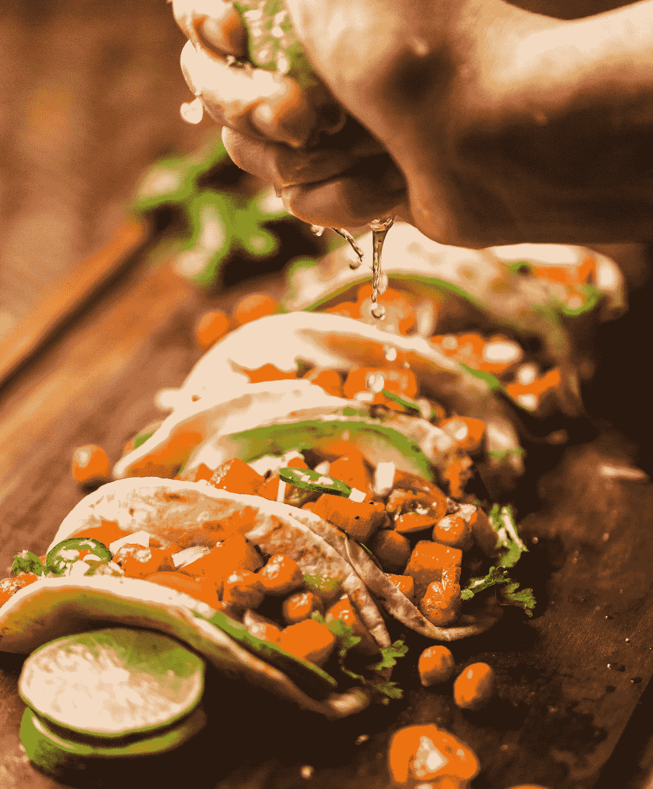
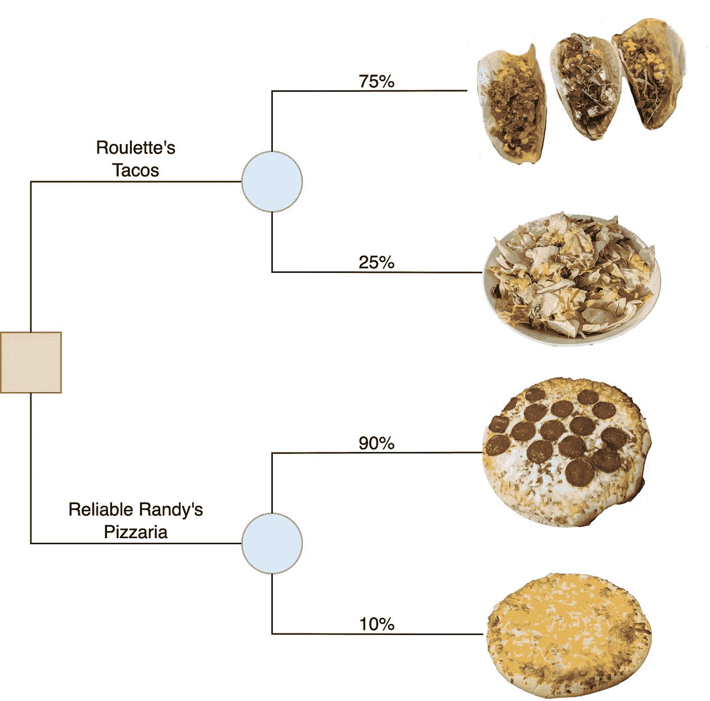
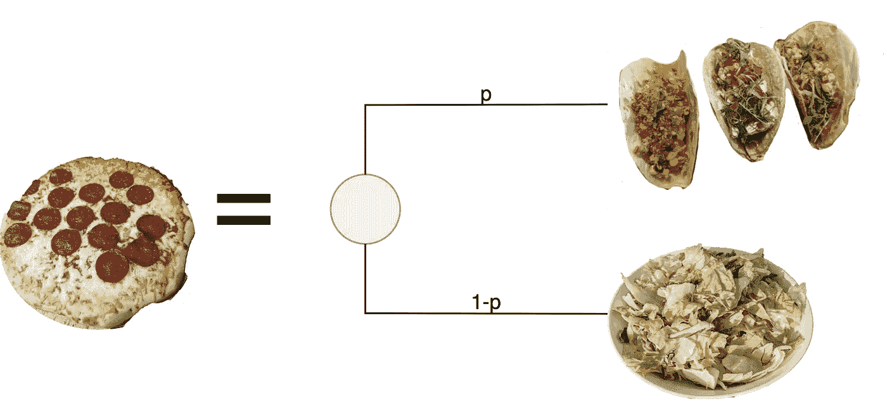
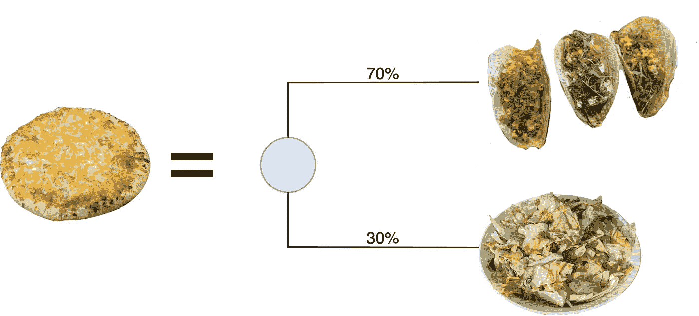
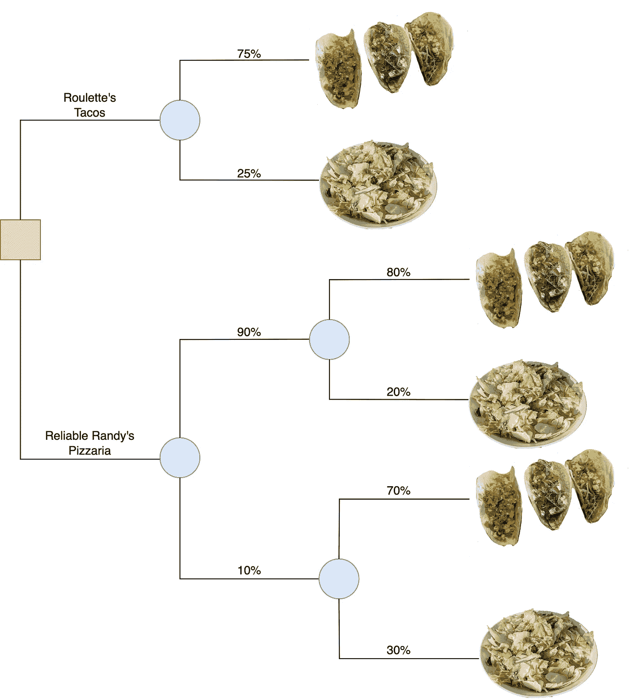
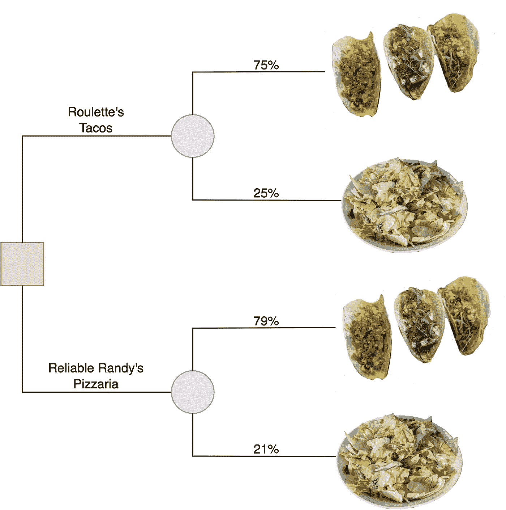

# 我们应该在哪里吃饭？决策分析的五个规则解释

> 原文：<https://towardsdatascience.com/where-should-we-eat-the-five-rules-of-decision-analysis-explained-67684c3a5001>

## 温和地介绍将数据科学与可操作价值联系起来的学科

乍得·蒙塔诺在 [Unsplash](https://unsplash.com?utm_source=medium&utm_medium=referral) 上的照片

作为一名数据科学家，我发现决策分析领域是我工作中被低估的工具。当我对统计和编程的热情将我拖进杂草深处时，决策分析将我的注意力拉回到全局影响上。

决策分析的核心由五条规则组成，这些规则开启了一个强大的量化框架。这些规则最初是由罗纳德·霍华德教授制定的，并在他的书*【决策分析的基础】*中进行了概述。

> 这些规则概述了决策的“代数”。它们提供了在数学上严格的框架中捕捉主观信念和偏好的能力。

在本帖中，我们将探索决策分析的每一条规则，以回答这个时代的一个重大谜团— *今晚我们应该在哪里吃饭？*

# 晚餐的决定

我们正试图决定我们想在以下两个餐馆中的哪一个吃晚餐:

1.  **轮盘赌墨西哥卷饼:**轮盘赌墨西哥卷饼是德克萨斯州奥斯汀的一家新的(虚构的)墨西哥卷饼店，所以你知道它很不错。他们的鲑鱼玉米饼有库存的时候非常好吃。不幸的是，他们提供的唯一一餐是沙拉，这令人失望。
2.  **可靠的兰迪披萨店**:可靠的兰迪披萨店有很好的意大利辣香肠披萨。他们偶尔会卖完辣香肠，但他们总是有奶酪披萨作为备用。

# 规则

我们现在将使用决策分析的五个规则来分解这个决策。到最后，我们就知道今晚去哪里吃饭了。

## 1.概率规则

> 我们必须用概率来量化决策中的所有不确定性。

第一条规则指导我们分配概率来量化决策中的任何不确定性。这些概率本质上是贝叶斯*而非频率主义*的，因为它们捕捉了决策者的主观信念。**

晚餐的决定有两个不确定性:

1.  当我们到达时，轮盘赌的墨西哥玉米卷是否有墨西哥玉米卷。
2.  我们到的时候可靠的兰迪家是否会有意大利香肠。

根据过去的经验(数据)，我们认为轮盘赌的墨西哥玉米卷有 75%的可能性会有墨西哥玉米卷，可靠的兰迪的墨西哥香肠有 90%的可能性会有。

概率评估是数据科学为决策分析工作流做出贡献的地方。也许我们可以使用建模技术来分析数据，以获得更精细的见解。例如，一个优秀的数据科学家可能会计算出一个概率，说明我们去餐馆的时间。事实上，决策分析的一个核心概念是信息 (VOI)的[价值，它基于数据科学家更新决策者信念的能力来量化数据科学家工作的价值。见](https://en.wikipedia.org/wiki/Value_of_information)[这里](/three-of-the-most-underrated-data-science-concepts-47d58ef7187d)更详细的讨论 VoI。

> 在决策分析中，数据科学的作用是告知决策者的信念。

基于我们的信念，我们可以用下面的**决策树**来表示决策:

图片作者。总结晚餐决定的树。我真的拍了照片，吃了所有展示的食物。

注意，在决策树中，**方块代表决策，圆圈代表彩票。**

红色方块代表关于我们将选择哪家餐馆的决定。一旦我们选择了一家餐馆，我们将面临一次不确定的抽奖，关于他们将提供哪些饭菜。

## 2.顺序规则

> 我们必须根据我们的偏好排列所有可能的结果。

在晚餐决策中，有四种可能的结果:轮盘赌的墨西哥玉米卷，轮盘赌的沙拉，可靠的兰迪的意大利香肠披萨，可靠的兰迪的奶酪披萨。

**我们必须以非循环的方式对结果排序**。例如，我们不能更喜欢墨西哥玉米卷而不是沙拉，沙拉而不是奶酪披萨，奶酪披萨而不是墨西哥玉米卷，因为这导致了偏好的循环。

在这种情况下，排序我们的偏好很简单。玉米饼是最好的选择。之后，意大利香肠披萨是我们的第二选择，其次是奶酪披萨。沙拉令人失望，所以我们将它放在底部。我们的顺序是:

1.  轮盘赌店的玉米卷
2.  可靠兰迪店里的意大利香肠披萨
3.  可靠兰迪的奶酪披萨店
4.  轮盘赌上的沙拉

## 3.等价规则

> 如果我们更喜欢 A 而不是 B and B 而不是 C，那么存在一个概率 *p* 使得我们对 B 和一个 A 的概率为 *p* 和 C 的概率为 *1-p* 的彩票不感兴趣

等价法则允许我们将每一个可能的结果等同于最好和最差结果之间的抽奖——墨西哥玉米卷和沙拉。让我们从意大利香肠比萨饼开始。

我们需要确定*无差异概率*、 *p、*使得:

图片作者。我们需要在墨西哥卷饼和沙拉之间进行抽签，我们认为这两种食物和意大利辣香肠披萨一样受欢迎。

比起意大利香肠比萨饼，我们更喜欢墨西哥卷饼；比起沙拉，我们更喜欢意大利香肠比萨饼。因此，自然地，一定有一些沙拉风险，我们愿意接受美味的墨西哥玉米卷，而不是一个肯定火辣香肠比萨饼的机会。

考虑两种极限情况:

*   如果 p=1 ，我们将对意大利辣香肠披萨和墨西哥玉米卷不感兴趣。我们没有。我们更喜欢玉米卷！
*   如果 *p=0* ，我们将对保证的意大利香肠比萨饼和保证的沙拉无动于衷。我们没有。披萨好吃多了！

所以， *p* 介于0 和 1 之间。

> 无差异概率仅仅描述了我们的偏好。它不是根据数据计算出来的。

我对有保障的意大利香肠比萨饼和有 80%机会吃墨西哥卷饼和 20%机会吃沙拉的彩票不感兴趣。所以，对于可靠的兰迪的意大利辣香肠披萨，我们将使用 *p* =80%。

我们还需要确定我们对奶酪披萨的无差异概率。奶酪比萨几乎和意大利香肠比萨一样好，但仍然比沙拉好得多。我的无差异概率是 70%，所以我同意下面的说法:

图片作者。我对保证奶酪比萨饼和这里显示的墨西哥玉米卷和沙拉之间的彩票不感兴趣。

## 4.替代规则

> 如果我们在 B 和 A 和 C 之间的一张彩票之间无动于衷，我们必须愿意用 B 来代替彩票。

替换规则允许我们用我们在上一节中确定的彩票来交换决策树中的意大利香肠比萨饼和奶酪比萨饼。此过程给出了以下决策树:

图片作者。在用比萨饼代替他们的等价彩票后的决策树。

替换是有帮助的，因为现在我们的决策树只有两种可能的结果——玉米卷和沙拉。注意，可靠的兰迪披萨店的彩票可以用全概率法则简化。

有靠谱兰迪分支的玉米饼总概率是(0.90 x 0.80) +(0.10 x 0.70) = 79%。我们发现，用同样的方法或通过识别总概率总和必须为 100%,分支的沙拉的总概率是 21%。

这种简化产生了以下决策树:

图片作者。使用全概率法则简化“可靠的兰迪比萨店”分支后的决策树。

## 5.选择规则

> 如果我们更喜欢 A 而不是 C，我们面对 A 和 C 之间的多张彩票，我们必须选择 A 概率最高的彩票。

这个规则是直观的。我们已经把我们的决策树减少到了在墨西哥卷饼和沙拉之间的两次抽签。比起沙拉，我们更喜欢玉米饼，所以一定要选择玉米饼概率较高的彩票，也就是可靠的兰迪披萨店。

轮盘赌的墨西哥卷饼实际上是墨西哥卷饼和沙拉之间的抽奖，有 75%的机会是墨西哥卷饼。根据决策分析的规则，我们确定可靠的兰迪比萨店相当于在墨西哥卷饼和沙拉之间进行抽奖，有 79%的机会得到墨西哥卷饼。

看来我们今晚要吃披萨了！

# 结论

在这篇文章中，我们探讨了决策分析的五条规则。这些规则是强大的定量决策框架的基础。尽管我们探索的晚餐例子非常简单，但它有助于为更复杂的决策建立直觉。

> 决策分析的核心是将信念和偏好转化为理性行动。

感谢你阅读这篇文章。如果你对更多决策分析和统计内容感兴趣，关注我[中](https://tyler-c-buffington.medium.com/)或 [LinkedIn](https://www.linkedin.com/in/tyler-buffington-phd-82a1a212a/) 。

# 参考

1.  罗纳德·霍华德，《决策分析的基础》IEEE 系统科学与控制论汇刊 4.3(1968):211–219。