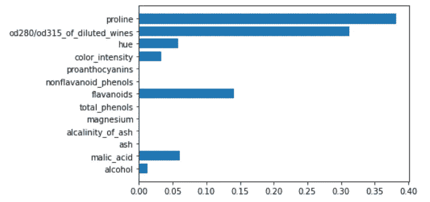
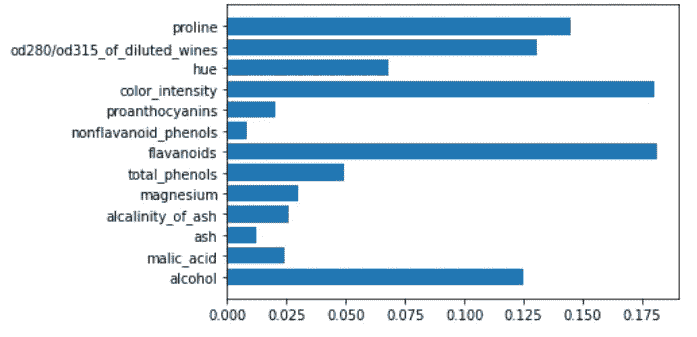
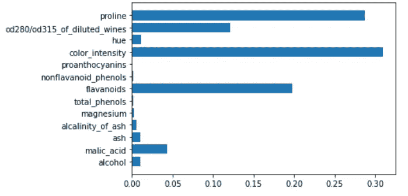
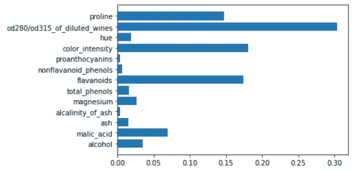
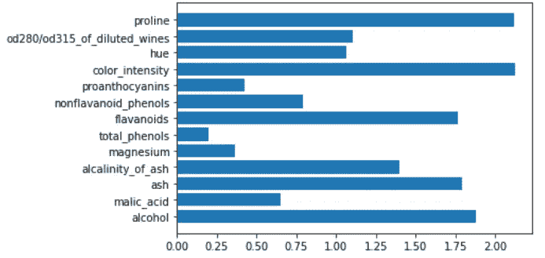
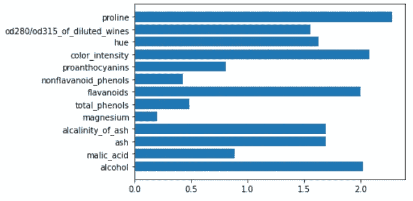
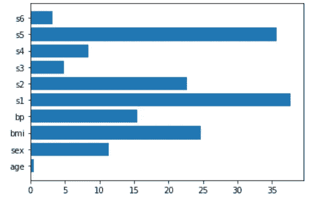
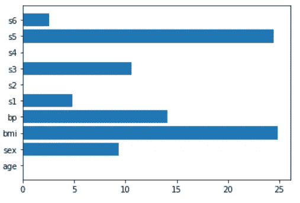
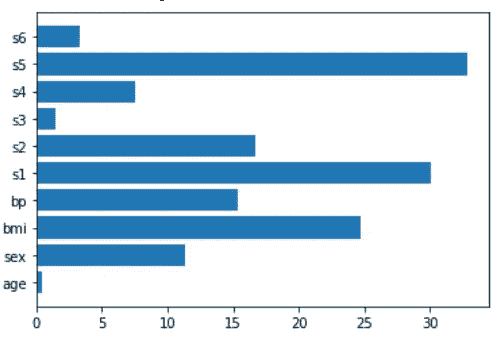
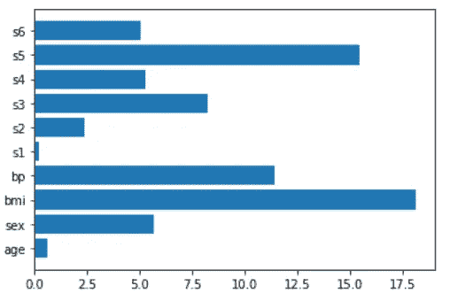

# 哪些模型是可解读的？

> 原文：<https://towardsdatascience.com/which-models-are-interpretable-5c7d2d0aa208>

## 一些可解释的机器学习模型概述


作者图片

模型解释是有监督机器学习中的一项基本任务。解释模型如何表示信息对于理解支配我们数据的动态是至关重要的。我们来看几个容易解读的模型。

# 为什么我们需要解释我们的模型？

数据科学家的角色是从原始数据中提取信息。他们不是工程师，也不是软件开发者。他们挖掘内部数据，从矿井中提取黄金。

了解一个模型做什么和如何工作是这项工作的一部分。尽管有时黑盒模型比其他模型更好，但如果我们需要从数据中学习一些东西，它并不是一个好主意。相反，一些本质上非常擅长解释如何将数据转化为信息的模型，必须总是优先选择和深入研究。

机器学习模型是一种将信息翻译成合适且可理解的语言的方法，这种语言就是数学。如果我们能把一些东西翻译成数学，我们就能从中学到更多，因为我们可以根据需要掌握数学。因此，模型不仅仅是我们可以用来预测顾客是否会购买某样东西的算法。这是一种理解“为什么”具有特定特征的客户可能会购买某些东西，而另一个具有不同特征的客户不会购买任何东西的方式。

因此，模型解释对于给我们所寻找的信息以适当的形式是至关重要的。

# 通过特征重要性进行解释

解释模型如何“思考”我们的数据以提取信息的一种可能方式是查看特征的重要性。重要性通常是正数。该数字越大，模型对该特定功能的重要性就越高。

在本文中，我将展示一些模型，这些模型使用 Python 和 scikit-learn 库为我们提供了它们自己对特性重要性的解释。让我们永远记住，不同的模型赋予我们不同的功能重要性。这是完全正常的，因为每个模型都是一种看待信息这个奇妙而复杂的棱镜的方式。我们从来没有完整的视图，所以特性的重要性很大程度上取决于我们选择的模型。

我们先导入一些库和 scikit-learn 的“wine”数据集。

```
import numpy as np 
from sklearn.datasets 
import load_wine,load_diabetes 
from sklearn.tree import DecisionTreeClassifier 
from sklearn.ensemble import RandomForestClassifier,GradientBoostingClassifier from sklearn.linear_model import * 
from sklearn.svm import LinearSVC,LinearSVR 
import xgboost as xgb 
import matplotlib.pyplot as plt 
from sklearn.pipeline import make_pipeline 
from sklearn.preprocessing import StandardScaler
```

现在，让我们加载数据集并存储要素的名称。

```
X,y = load_wine(return_X_y=True) 
features = load_wine()['feature_names']
```

现在，我们准备计算不同类型模型的特征重要性。

# 决策树

基于树的模型根据特征在整个树中提供的叶子纯度的总改善来计算特征的重要性。如果一个特征能够正确地分割数据集并提高特征的纯度，那么它肯定是重要的。为了简单起见，基于树的模型中的重要性分数被归一化，使得它们总和为 1。

在 scikit-learn 中，每个基于决策树的模型都有一个名为 *feature_importances_* 的属性，其中包含了特性的重要性。拟合我们的模型后就可以访问了。

让我们看看一个简单的决策树模型会发生什么。

```
tree = DecisionTreeClassifier() 
tree.fit(X,y) 
plt.barh(features,tree.feature_importances_)
```



作者图片

正如我们所见，一些特征的重要性等于 0。也许它们并不比例如“脯氨酸”特性更能提高纯度。

一个非常重要的基于树的模型是随机森林，它对特征重要性非常有用。一般来说，集成模型对每个弱学习者给出的每个特征的重要性分数进行平均，然后像在决策树中一样将最终分数再次归一化。

以下是如何计算随机森林模型的要素重要性。

```
rf = RandomForestClassifier() 
rf.fit(X,y) 
plt.barh(features,rf.feature_importances_)
```



作者图片

例如，随机森林给出的特征重要性可用于执行[特征选择](https://www.yourdatateacher.com/2021/10/11/feature-selection-with-random-forest/)。

甚至梯度推进决策树模型也能给我们自己对特征重要性的解释。

```
gb = GradientBoostingClassifier() 
gb.fit(X,y) 
plt.barh(features,gb.feature_importances_)
```



作者图片

即使对于 XGBoost 也是如此。

```
xgboost = xgb.XGBClassifier() 
xgboost.fit(X,y) 
plt.barh(features,xgboost.feature_importances_)
```



作者图片

# 线性模型

线性模型也能给我们特征的重要性。实际上，它是一个特性的系数的绝对值。如果我们使用多类线性模型进行分类，我们将对与单个要素相关的系数的绝对值进行求和。

在计算要素重要性时，所有线性模型都需要标准化或规范化的要素。默认情况下，一些模型需要这种变换，但是如果我们想要相互比较系数，我们总是必须应用它。这就是为什么我将使用 scikit 中的 pipeline 对象——在训练模型之前学习标准化我们的数据。

让我们看一个线性核支持向量机的例子。

```
svm = make_pipeline(StandardScaler(),LinearSVC()) 
svm.fit(X,y) 
plt.barh(features,np.abs(svm[1].coef_).sum(axis=0))
```



作者图片

这同样适用于逻辑回归。

```
logit = make_pipeline(StandardScaler(),LogisticRegression()) logit.fit(X,y) 
plt.barh(features,np.abs(logit[1].coef_).sum(axis=0))
```



作者图片

可用于特征重要性的其他线性模型是回归模型，因此我们必须加载一个回归数据集来查看它们是如何工作的。对于下面的例子，我将使用“糖尿病”数据集。

```
X,y = load_diabetes(return_X_y=True) features = load_diabetes()['feature_names']
```

让我们看看线性回归是如何计算特征重要性的。

```
lr = make_pipeline(StandardScaler(),LinearRegression()) lr.fit(X,y) plt.barh(features,np.abs(lr[1].coef_))
```



作者图片

套索回归是一个非常强大的模型，可以用于特征重要性(也可以用于[特征选择](https://www.yourdatateacher.com/2021/05/05/feature-selection-in-machine-learning-using-lasso-regression/)

```
lasso = make_pipeline(StandardScaler(),Lasso()) lasso.fit(X,y) plt.barh(features,np.abs(lasso[1].coef_))
```



作者图片

套索回归最亲密的朋友是岭回归，它也很有帮助。

```
ridge = make_pipeline(StandardScaler(),Ridge()) ridge.fit(X,y) 
plt.barh(features,np.abs(ridge[1].coef_))
```



作者图片

我们将看到的最后一个模型混合了套索和岭回归，它是弹性净回归。

```
en = make_pipeline(StandardScaler(),ElasticNet()) en.fit(X,y) plt.barh(features,np.abs(en[1].coef_))
```



作者图片

# 结论

模型解释通常是通过计算特征重要性来完成的，一些模型给了我们他们自己对特征重要性的解释。对于那些不能给出特征重要性的模型，我们可以使用一些模型不可知的方法，比如 SHAP(例如，对[解释神经网络](https://www.yourdatateacher.com/2021/05/17/how-to-explain-neural-networks-using-shap/)非常有用)。正确使用特征重要性比模型本身的预测能力更能提高数据科学项目的价值。

*原载于 2022 年 6 月 5 日*[*【https://www.yourdatateacher.com】*](https://www.yourdatateacher.com/2022/06/06/which-models-are-interpretable/)*。*