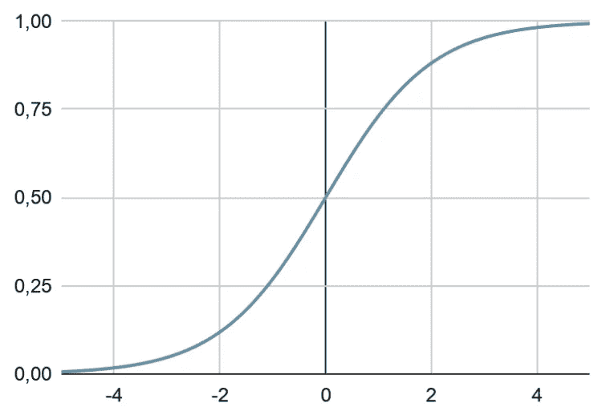
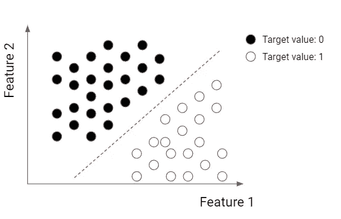
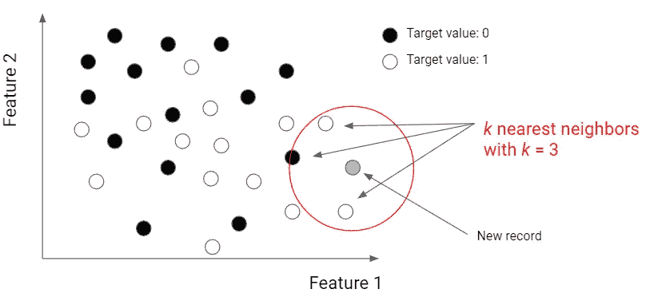
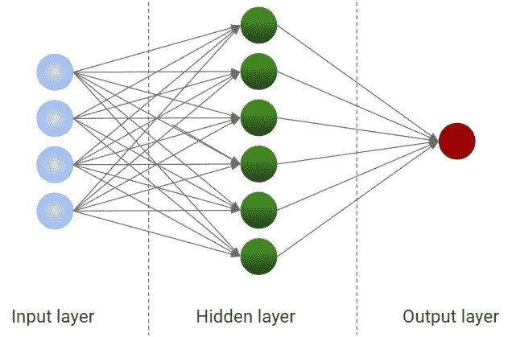

# 哪些模型需要规范化数据？

> 原文：<https://towardsdatascience.com/which-models-require-normalized-data-d85ca3c85388>

## 关于需要预处理数据的模型的简要概述


作者图片

数据预处理是每个机器学习项目的重要组成部分。应用于数据的一个非常有用的转换是规范化。有些型号要求它必须正常工作。让我们看看其中的一些。

# 什么是正常化？

标准化是一个与变量缩放比例相关的通用术语。缩放将一组变量转换为一组具有相同数量级的新变量。它通常是线性变换，因此不会影响特征的相关性或预测能力。

为什么我们需要规范化我们的数据？因为有些模型对特征的数量级很敏感。例如，如果一个特征的数量级等于 1000，而另一个特征的数量级等于 10，则一些模型可能“认为”第一个特征比第二个特征更重要。这显然是一种偏见，因为数量级并没有给我们任何关于预测能力的信息。因此，我们需要通过转换变量，使它们具有相同的数量级来消除这种偏差。这就是缩放变换的作用。

此类转换可以是标准化(将每个变量转换为 0–1 区间)和标准化(将每个变量转换为 0 均值和单位方差变量)。我在另一篇文章中广泛地谈到了这些转变。根据我的经验，标准化工作得更好，因为如果有异常值，它不会收缩变量的概率分布，例如，标准化会收缩。因此，我将在整篇文章中谈论标准化。

# 需要规范化的模型

我们来看看一些需要在训练前进行缩放的模型。对于下面的例子，我将使用 Python 代码和 scikit-learn 的 Pipeline 对象，它在应用模型之前执行一系列转换，并返回一个可以像模型本身一样调用的对象。

我将要使用的缩放函数是标准化函数，由 *StandardScaler* 对象执行。

# 线性模型

除了线性回归，所有的线性模型实际上都需要归一化。Lasso、Ridge 和 Elastic Net 回归是强大的模型，但它们需要标准化，因为所有变量的惩罚系数都是相同的。

```
lasso = make_pipeline(StandardScaler(), Lasso()) ridge = make_pipeline(StandardScaler(), Ridge()) en = make_pipeline(StandardScaler(), ElasticNet())
```

逻辑回归也需要标准化，以避免在训练阶段出现梯度消失的问题。



逻辑回归。作者图片

```
logistic = make_pipeline(StandardScaler(), LogisticRegression())
```

如果您在没有预先规范化的情况下训练线性回归，则不能使用系数作为要素重要性的指标。如果您需要执行要素重要性(例如，用于降维目的)，则必须提前对数据集进行规范化，即使您使用的是简单的线性回归。

```
lr = make_pipeline(StandardScaler(), LinearRegression())
```

# 支持向量机

支持向量机是基于距离的强大模型。他们试图在特征的向量空间中找到一个超平面，该超平面能够根据目标变量的值线性地分离训练记录。



SVM 的例子。作者图片

经过一些修改，SVM 甚至可以用于非线性函数和回归目的。

由于距离对要素的数量级非常敏感，因此也有必要对 SVM 应用缩放变换。

```
svm_c = make_pipeline(StandardScaler(), LinearSVC()) # For classification svm_r = make_pipeline(StandardScaler(), LinearSVR()) # For regression
```

# k 近邻

KNN 是一种非常流行的基于距离(通常是欧几里德距离)的算法。预测考虑了要素空间中给定点的 k 个最近邻。



k-最近邻。作者图片

就像 SVM 一样，即使是 KNN 也需要使用规范化数据。

```
knn_c = make_pipeline(StandardScaler(), KNeighborsClassifier()) # For classification knn_r = make_pipeline(StandardScaler(), KNeighborsRegressor()) # For regression
```

# 神经网络

最后，神经网络对特征的数量级非常敏感。激活函数总是需要归一化的数据，否则训练阶段将遭受消失梯度问题，就像逻辑回归一样。



神经网络。作者图片

```
nn_c = make_pipeline(StandardScaler(), MLPClassifier()) # For classification nn_r = make_pipeline(StandardScaler(), MLPRegressor()) # For regression
```

# 结论

缩放是一个非常重要的预处理变换，它可以极大地影响训练阶段。如果执行不当，模型的结果肯定是不可靠的。这就是为什么当模型需要时，使用适当的规范化技术是很重要的。

如果你对我在这篇文章中谈到的模型感兴趣，我在我的[Python 中的监督机器学习](http://yourdatateacher.com/supervised-machine-learning-in-python-online-course/)在线课程中广泛地谈到了它们。

*原载于 2022 年 6 月 12 日*[*【https://www.yourdatateacher.com】*](https://www.yourdatateacher.com/2022/06/13/which-models-require-normalized-data/)*。*