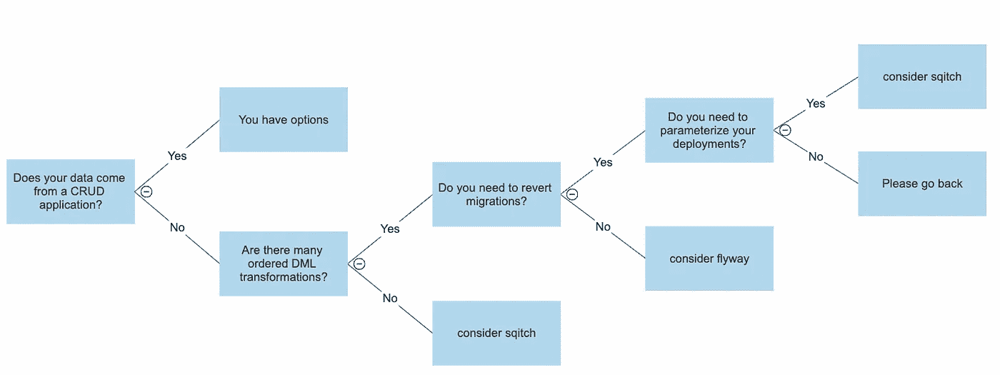
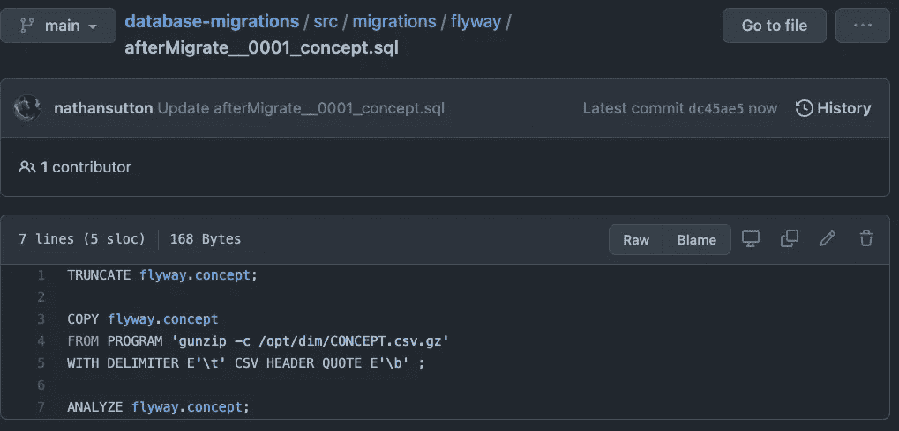
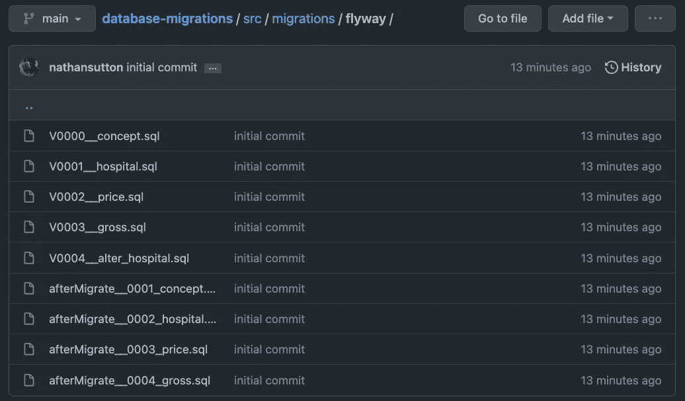
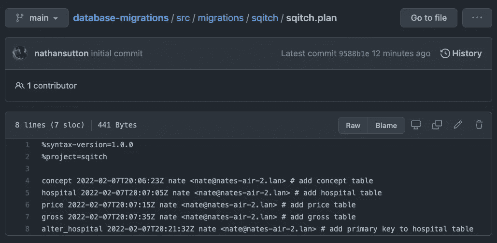
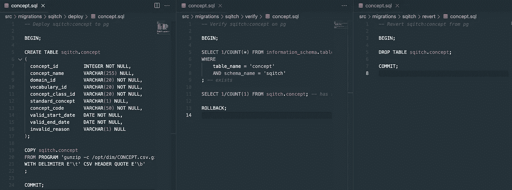
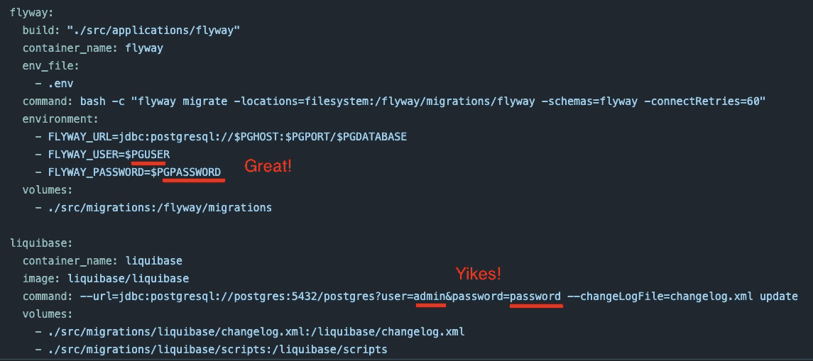

# 您应该使用哪种工具进行数据库迁移？

> 原文：<https://towardsdatascience.com/which-tool-should-you-use-for-database-migrations-4e0b9c44b790>

根据您的需求选择一个范例。

我所有的数据团队都有一个关系数据库作为我们运营的核心。当你有一个关系数据库，你将不可避免地要改变它！这篇文章将帮助你在三个有用的版本化数据库迁移框架之间做出选择——分别是****和 [**liquibase**](https://www.liquibase.com/pricing?utm_term=liquibase&utm_campaign=brandsearch&utm_source=google&utm_medium=ppc&hsa_acc=7217304035&hsa_cam=12808646352&hsa_grp=119923141903&hsa_ad=517707365974&hsa_src=g&hsa_tgt=kwd-370520217004&hsa_kw=liquibase&hsa_mt=e&hsa_net=adwords&hsa_ver=3&gclid=Cj0KCQiAxoiQBhCRARIsAPsvo-wjD1EMdIGF00wKitSh_7kJhUUUIsxq6bHntP0Q8DzrpU3yq0iZI7YaAqDIEALw_wcB) 。GitHub 中有一个关联的[存储库](https://github.com/nathansutton/database-migrations)，它遍历 dockerized PostgreSQL 数据库中相同表的每个实现。****

# ****TL；博士；医生****

********

****帮助你决定的快速决策树(图片由作者提供)****

# ******为什么是这三种？******

****我将本指南的重点放在 sqitch、flyway 和 liquibase 上，因为它们都有两个重要的特征。首先，它们几乎可以与任何关系数据库一起工作——这就排除了微软优秀的 DACPACs。第二，它们都允许用户用普通的 SQL 编写迁移——这省去了像 Alembic 和 T21 这样的迁移的 ORM 实现。****

# ****您的数据来自 CRUD 应用程序吗？****

> ****你有选择****

****许多 OLTP 工作负载的定义特征是后端从应用程序层接收和存储数据。所有这三种迁移工具都擅长于保持数据库及其应用程序同步的基本功能。迁移是自动应用于数据库的，而数据仍然保持在相同的表中。****

# ****你的数据来自云存储吗？****

> ****考虑飞行路线****

****相比之下，许多 OLAP 工作负载可以通过从云存储(如 S3 或 Azure Blob 存储)再次加载所有暂存文件来轻松复制。Flyway 作为一个 SQL 执行器在这里大放异彩，它可以可靠地再现给定数据库的状态。特别是，在不同类型的普通 SQL 文件中，很容易将 DML 与 DDL 分开。这允许您再次运行相同的转换，但是加载最新的数据。****

********

****Flyway 擅长在“回调”中用新数据重复相同的任务****

# ****有很多有序的 DML 变换吗？****

> ****考虑飞行路线****

****如果您的数据操作语言在准备好用于下游之前在多个表之间移动数据，那么 flyway 比 sqitch 具有独特的优势，因为您可以很容易地从文件名中推断出执行的顺序。 Flyway 分为“版本化迁移”(V*前缀，通常是您的 DDL)和“回调”(afterMigrate*前缀，通常是您的 DML)。我的大多数团队都使用 XXXX 数字脚本作为命名约定。在下面的简化示例中，很容易看出毛表是在价格表之后加载的[。](https://github.com/nathansutton/database-migrations/tree/main/src/migrations/flyway)****

****这种可解释性对于负责批量分析工作负载的开发人员来说是超级有帮助的。【*警告:由于我专注于数据科学*，所以有所偏颇。事实上，我部署的所有统计模型都依赖于管道，这些管道迭代地清理和聚集数据，直到它们为模型做好准备。如果您不受实时操作的约束，这就意味着在某个时间间隔会出现大量的“请按顺序执行这个 SQL”。Flyway 是一种每次都能得到相同结果的可靠方法。****

********

****执行的顺序在文件系统中是清楚的(图片由作者提供)****

****相比之下，sqitch.plan 文件中的 sqitch 隐藏了相同的排序逻辑。当团队使用交叉引用的票号作为他们的文件名时，这变得更加困难。现在，你必须在三个地方查找，以找出什么(文件系统)，什么时候(sqitch.plan)，以及为什么(JIRA 等人)做了任何事情。****

********

****执行顺序在 sqitch.plan 中是显而易见的，但在文件系统中却不明显(图片由作者提供)****

# ****您需要恢复迁移吗？****

> ****考虑 sqitch****

****Sqitch 在开发中有更多的开销，因为您必须编写逻辑来进行更改，编写逻辑来测试它是否工作，编写逻辑来在测试失败时恢复更改。这在开始时需要做更多的工作，但是它有一个很好的特性，即您可以将迁移回滚到历史上的任何给定时间点。**不幸的是，** [**回滚迁移是 flyway**](https://flywaydb.org/documentation/command/undo) 中的一项付费功能。****

********

****信任但用 sqitch 验证(图片由作者提供)****

# ****您使用环境变量来参数化您的部署吗？****

> ****避免 liquibase****

****如果你还没这么做，我会很惊讶的。将数据库秘密置于版本控制之外是安全性 101。**不幸的是，使用环境变量是 liqui base**T5[**的付费特性。flyway 和 sqitch 都支持现成的参数化。当然，您可以深入并修改它们的 docker 入口点，但是为什么有必要这样做呢？！**](https://docs.liquibase.com/commands/liquibase-environment-variables.html)****

********

****请将您的秘密置于版本控制之外(图片由作者提供)****

# ****还是不确定？****

****[**分叉这个存储库**](https://github.com/nathansutton/database-migrations) 来尝试构建一些您的核心表结构。配置文件和卷映射等所有棘手的事情都已解决，您可以简单地将迁移切换到这三个工具中的任何一个。****