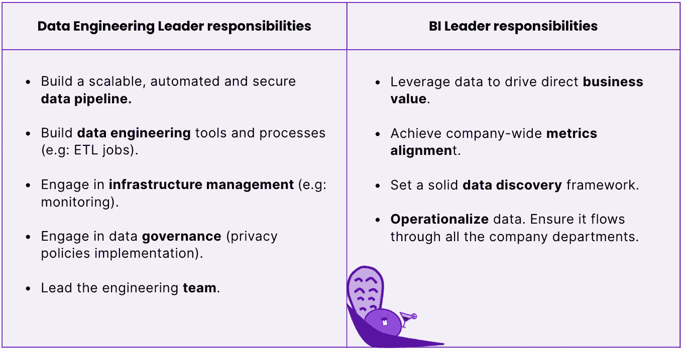

# 你是哪种类型的“数据主管”？

> 原文：<https://towardsdatascience.com/which-type-of-head-of-data-are-you-5203915d6445>

## 隐藏在“数据主管”头衔背后的角色

不同的“数据主管”角色—图片由 [Castor](https://www.castordoc.com/) 提供

# 介绍

在过去的几年里，我们看到了数据量的爆炸式增长。随着这一角色的演变，进入这一职位的人的类型也在演变。那么什么样的人应该成为数据领导者呢？这个问题没有简单的答案。数据主管的工作并不是放之四海而皆准的，担任这一角色的人也是如此。

这个职称怎么用有问题。因为“数据负责人”这个词用得很不严谨，所以你无法真正判断一家公司在寻找什么。他们可能在寻找商业智能领导者或数据工程领导者。或者他们两个都想要！也许他们只是在找一只独角兽。也可能他们根本不知道自己想要什么。这导致了员工的困惑，他们不知道自己在这个模式中的位置，也使公司很难根据他们的需求雇佣合适的人。本文旨在帮助大家达成共识。

大多数时候，当一家公司宣称他们需要“数据主管”时，他们可能意味着他们需要:

1.  **BI 领导者或经理:**知道如何通过清晰地展现业务问题或机遇来理解数据的人
2.  **数据工程领导者:**擅长根据 IT 标准确保数据准确和可用的人

这是两种截然不同的角色。我同意它们有时会重叠，但它们通常需要不同类型的人，戴着不同类型的帽子。你怎么知道你想成为哪种类型的数据头？所需的背景/技能？我们在这里都涵盖了。

数据工程领导和 BI 领导有不同的职责——图片由 [Castor](https://castordoc.com/) 提供。

# 类型 1:工程领导者

## 代表团

数据工程领导者是使数据科学家的工作成为可能的人。他们与工程师和数据分析师合作，确保公司的数据基础设施可扩展、可靠、安全且经济高效。

# 他们是做什么的？

工程领导者专注于建立数据科学团队和组织的技术骨干。他们在幕后工作，使分析工作成为可能。他们的任务是创建一个可扩展的、自动化的、安全的、端到端可审计的**数据管道**。他们的工作可能包括为**数据工程**(例如 ETL 作业)**基础设施管理**(例如监控)，以及**安全和治理**(例如隐私政策)构建新的工具或流程。当组织足够成熟时，工程领导者可能会从事数据科学和机器学习。如果你自己也是这种角色，你很可能同时身兼数职:优先处理项目；领导工程师团队；与其他部门沟通，了解他们可以从您的部门中获得什么，同时跟上行业趋势，以保持您的组织的竞争力。我们深入研究每一个类别。

## 数据工程

工程负责人的一个关键职责是监督和优化**数据集成过程**。数据集成指的是将来自不同来源的数据组合成一个真实的单一来源的活动:**数据仓库**。这是数据工程生命周期的第一步，可以使用 ETL 工具来完成。数据工程师通常负责完成这项任务，但也可能由业务分析师、数据科学家和软件开发人员共同完成。数据工程负责:

*   确保始终有足够的资源支持管道。
*   跟踪和监控管道中每个组件的容量利用率，包括存储、计算、网络带宽和延迟考虑因素。
*   定期审查绩效指标，以便在问题变成关键问题之前发现问题。

## 基础设施管理

作为一名工程领导者，关注数据基础设施的细节是不可取的。这意味着了解您的数据是如何存储的，它是如何在您的系统中移动的，以及您如何将它整理成正确的形状以供分析。数据工程领导者需要知道有哪些工具可以用来处理数据。他们还应该了解这些工具是如何工作的，这样他们就可以做出明智的决定，决定何时应该使用它们，或者哪些功能值得整合到现有的工具中。数据基础设施工具在过去几年中激增，跟踪生态系统变得非常困难。出于简化的目的，我们将指南[整合在一起](https://notion.castordoc.com/)。不要犹豫去看看。

## 安全和治理

安全性和治理也是数据工程领导者的日常工作。

*   **数据治理**是一组确保以高效的方式管理数据资产的流程。在数据工程的上下文中，这意味着确保您有一个关于如何处理数据、如何跟踪数据质量以及谁将使用数据的计划。数据质量是对数据的准确性、相关性和及时性的衡量。这也是对其支持业务流程的有用性的一种度量。良好的数据质量计划将确保您组织的所有信息在被任何应用程序或服务(即用户)使用之前都是最新和准确的。这有助于减少公司内部的错误，并在以后解决问题时节省时间(和金钱)。
*   **数据安全&隐私**:作为数据工程师领导，你有责任确保你的系统符合安全标准。这意味着保持行业领先的工具和协议，以确保您公司的敏感信息免受黑客和其他恶意行为者的攻击。请记住:每次您对您的系统进行更改或部署更新时，都有可能危及用户的隐私。

数据工程领导职位向首席技术官汇报，包括领导一个数据工程师团队。数据工程师负责存储和处理数据，构建和维护数据管道，并创建将数据加载到记录系统(SOR)中的 ETL 作业。他们还与数据科学家合作，了解如何扩展和优化 SOR，以支持业务需求。

# 他们的背景是什么？

工程领导者通常具有计算机科学、软件工程或同等经验的背景。他们也有领导开发团队的经验，包括远程或亲自管理团队。

数据工程负责人负责制定技术路线图，并确保其符合公司的业务战略。这包括建立一个敏捷过程(比如 Scrum)来管理发布，与客户一起定义需求，编写技术规范，审查其他开发人员编写的代码，并且在关注成本和保持质量控制的同时完成所有这些工作。

# 数据工程领导者的关键指标

数据工程领导者的任务是最终为公司的其他利益相关者提供干净可靠的数据。因此，衡量他成功的关键指标主要与数据质量有关，包括数据的准确性、一致性、完整性和可靠性。数据工程主管还负责公司内部良好的数据管理，以及自动化流程以提高生产率。自动化和良好的数据管理的自然结果是**基础设施成本节约**。如果您想评估自己作为数据领导者的表现，这也是一个不错的指标。我们已经编辑了一个[小指南](https://www.castordoc.com/blog/top-10-metrics-for-a-data-team)，解释这些指标如何工作以及如何测量它们。

# 类型 2:商业智能领导者

# 代表团

BI 领导者的使命是利用数据推动业务成果。这可能意味着任何事情，从帮助公司做出更好的决策，到优化收入和利润，到改善客户体验。数据业务负责人可能不太懂技术，但有很强的业务知识。他们能够理解如何使技术团队符合业务的需求。

# 他们是做什么的？

BI 领导者对其组织的数据计划的成败负责，但他们不需要成为每个工具如何工作的专家或能够详细解释它。他们需要知道事情作为一个整体是如何运作的，以及每个部门的目标是什么，但不一定要知道如何使用特定的技术来实现这些目标。

商业智能领导者的使命是利用数据推动商业价值。在某种程度上，他们更直接地接触投资回报的产生。具体来说，他们为三件事而战:**、数据发现**、**可操作化**和**指标一致性**。

## 发现

数据发现是查找、理解和使用数据做出决策的过程。为了在数据驱动的决策中取得成功，您需要一个可靠的数据发现流程。

将数据发现作为常规业务流程的一部分(而不仅仅是事后的想法)，您会发现自己比以往任何时候都更快地做出更好的决策！

数据发现从询问您想要实现的目标开始。换句话说，访问组织中的所有信息是不够的；了解如何使用这些信息也很重要。数据发现确保来自不同团队和小组的人一起收集和分析数据，以便让每个人都了解他们在做什么——无论他们是在尝试新产品创意，还是在查看今年迄今为止表现最好的广告活动。

## 指标一致性

BI 领导还围绕**指标**强制执行公司范围内的一致性。如果没有强大的度量流程，后者最终会分散在电子表格、内部仪表盘和数据工具中。由于数据中的**多重定义**和**缺乏信任**，报告收入等本应简单的指标会变得非常棘手。分散的系统导致团队在定义、所有权和度量标准的准确性上产生分歧。

为了确保在整个公司范围内一致地管理指标，您可以执行以下操作:

*   为您创建的任何框架或代码库编写文档。如果您已经购买了数据目录工具，您可以在专用于此目的的部分记录您的指标。
*   确保组织中的所有部门都使用指标存储。这应该是一个工具，他们可以记录他们的指标，它应该支持可视化，以便用户可以看到随着时间的推移趋势。您还应该实施良好的文档实践来支持您的知识工人对数据的访问。

## 操作化

如果数据工程师领导寻求为公司的其他部门提供干净的数据，那么数据业务领导的任务就是将这些数据操作化。操作化是一种方法，包括让“操作”团队(销售、营销，..).我们将它与仅将数据用于报告和商业智能的更经典的方法区分开来。运营分析不是使用数据来影响长期战略，而是为企业的**日常运营**提供战略信息。简而言之，就是让公司的数据发挥作用，让组织中的每个人都能做出更明智、更快速的决策。

只有当数据发现已经成为常规业务流程的一部分，而不仅仅是事后的想法时，才能实现数据的可操作性。运营团队并不总是习惯于处理数据。如果您实施了一个强大的 [**数据发现**](/data-documentation-best-practices-3e1a97cfeda6) 流程，领域专家只会将数据作为他们日常运营的一部分，而独立于技术团队。

通常，将数据交给其他团队需要投资一个坚如磐石的数据文档工具。这将确保公司数据:

*   易于**搜索**(包括自己搜索)允许所有部门在需要时访问信息。
*   易于**理解**:用户可以快速理解他们的源系统中每个表内存在什么。

这三大支柱交织在一起。没有数据发现或指标协调，就无法实现数据操作化。BI 负责人通常并行推动这三个项目。

# 他们的背景是什么？

BI 领导者通常具有市场营销/销售或产品管理背景。他们有与客户打交道的经验，了解他们想要实现的目标。他们知道如何将其转化为团队可操作的项目。关键是他们自己生活在战壕中，知道如何在现实世界中让事情发生——而不仅仅是在纸上。

他们也有足够的技术知识来理解工程师们在做什么以及他们为什么这样做。他们能够清楚地表达他们正在做什么，以及为什么它很重要。他们知道设定目标，衡量进展，让人们对取得的成果负责。

# 商业智能领导者的关键指标

数据业务领导者所影响的变量比数据工程领导者所影响的变量更难量化。您可以查看记录的数据集的**百分比来评估发现工作，但是围绕指标衡量一致性更难。衡量数据可操作性的一个好方法是看你允许其他团队独立解决**的问题的数量**。例如，当数据团队相对年轻时，它可能会收到来自营销团队的许多关于归因的请求。随着数据民主化程度的提高，运营团队可以轻松访问数据，依赖数据团队解决归属问题的需求也随之降低。营销团队在解决这类问题时变得更加独立，最终将归因相关请求的数量降至零。衡量数据可操作性的一个好方法是**查看各种类别中请求数量的减少**。该指标准确衡量企业能够使用数据的程度。你能从列表中剔除的问题越多，你的数据就越容易操作。**

# 结论

并不是没有一个叫做“数据主管”的角色，只是大多数公司实际上并不存在。

相反，当一家公司决定他们需要有人来负责他们的数据时，他们通常会联系两个非常不同的角色:BI 领导者和数据工程领导者。问题是这些角色之间没有任何关系！对一家公司来说，明确定义你所寻找的那种个人资料是很难的。寻找数据负责人的公司通常会寻找能够帮助他们理清所有混乱数据的人。但这有更多的粒度，每个人都会从公司澄清他们在招聘过程中的确切角色中受益。‍

# 关于我们

我们写了利用数据资产时涉及的所有过程:从[现代数据堆栈](https://notion.castordoc.com/)到数据团队组成，再到数据治理。我们的[博客](https://www.castordoc.com/about/blog)涵盖了从数据中创造有形价值的技术和非技术层面。如果你是一名数据领导者，并希望更深入地讨论这些话题，请加入我们为此创建的[社区](https://notion.castordoc.com/unsupervised-leaders)！

在 Castor，我们正在开发一个数据文档工具 Figma，Slack generation。

或者对 Fivetran，Looker，Snowflake，DBT 的狂热爱好者来说是数据方面的。我们将目录软件设计得易于使用、令人愉快且友好。

想去看看吗？联系我们，我们将向您展示一个演示。

‍

*原载于*[*https://www.castordoc.com*](https://www.castordoc.com/blog/which-type-of-head-of-data-are-you)*。*