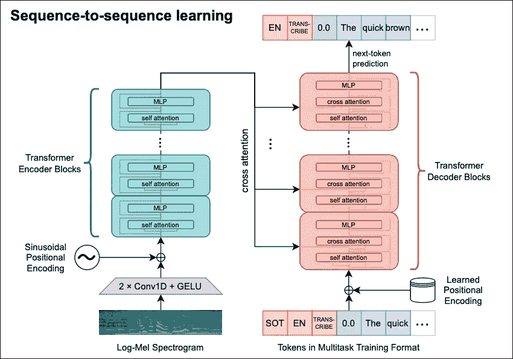
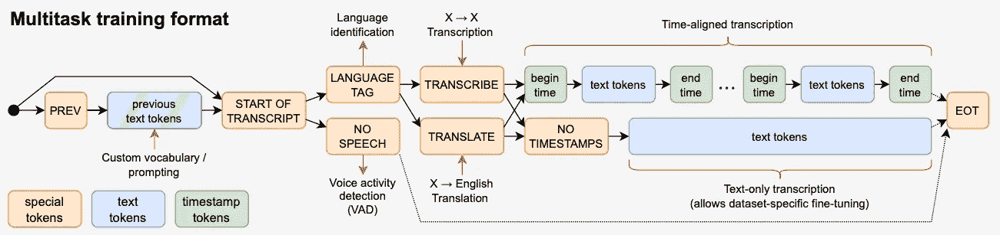
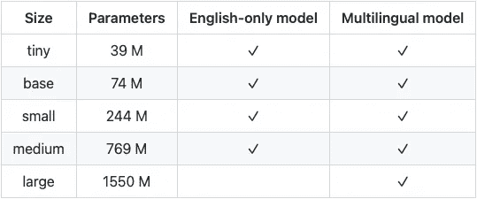
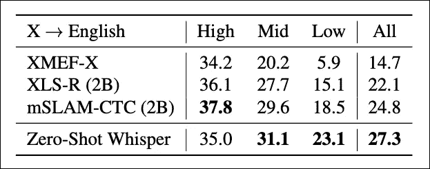
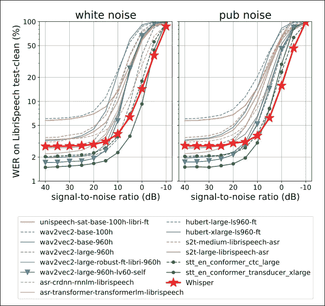

# 耳语:以人类水平的性能转录和翻译音频文件

> 原文：<https://towardsdatascience.com/whisper-transcribe-translate-audio-files-with-human-level-performance-df044499877>

## 一个兼容 97 种语言的人工智能模型——以及如何使用它


照片由 [DeepMind](https://unsplash.com/@deepmind?utm_source=medium&utm_medium=referral) 在 [Unsplash](https://unsplash.com?utm_source=medium&utm_medium=referral) 上拍摄

**现在很明显，深度学习研究的大方向已经发生了根本性的变化。**

几年前，大多数创新论文的*操作方式*是这样的:选择一个*数据集 X* ，在该数据集上构建并训练一个新模型，并通过报告 SOTA 结果来证明你的模型是最好的。但是如果我们在数据集 Y 上测试这个模型会发生什么呢？

比如:在 **ImageNet** 数据集上训练一个强大的 **ResNet** 。该模型将在分类猫和狗方面表现出色，但在分类卡通狗、手绘狗或梵高风格的狗等图像时会有困难。

**OpenAI** 已经开始了这种范式的转变，推出了概括得很好的模型，如[***CLIP【1】***](https://medium.com/p/f8ee408958b1)。为此，他们使用元学习方法，专注于零射击分类:

> 零镜头分类是模型对看不见的标签进行分类的能力，而无需对它们进行专门的分类训练。这种学习方法更好地反映了人类的感知。

遵循同样的步骤， **OpenAI** 发布了***Whisper【2】、***an**A**automatic**S**peech**R**ecognition(ASR)车型。在其他任务中，*耳语*可以转录大型音频文件，具有人类级别的性能！

在这篇文章中，我们详细描述了 *Whisper 的*架构，并分析了该模型是如何工作的，以及它为什么如此酷。

让我们开始吧！

# 耳语——概述

让我们简单描述一下 *Whisper 的*特征:

*   **开源:**模型由 **OpenAI** 创建并开源。我们稍后将看到如何使用它的编程教程。
*   **多任务训练:**该机型架构新颖，适合多任务训练。*耳语*是为 i) **语言识别**，ii) **语音活动检测**，iii) **转录，**和 iv) **翻译**而训练的。
*   多语种:除了英语，*耳语*接受了 96 种其他语言的培训。
*   **多样数据:**模型在 68 万小时的音频上训练。其中 65%的时间用于英语语音识别，17%用于多语言语音识别，18%用于英语翻译。
*   **卓越的性能:**作者称 *Whisper* 在英语语音识别方面达到了人类水平的性能。
*   **Whisper vs 商业产品:**实验表明 *Whisper* 直接挑战商业竞争对手如**亚马逊 Alexa** & **Siri** ，甚至胜过他们——尽管论文中掩盖了他们的名字。

> **限制:**据我所知，OpenAI 不会公开他们的训练数据集。他们只报告评估数据集。

# **嘀咕对我们有什么好处**

该模型在许多行业都有显著的应用，包括我们的日常生活，例如:

1.  我们可以即时转录大型音频文件，如播客。
2.  我们可以毫不费力地抄写演讲稿。
3.  为我们的 Youtube 视频或其他内容制作准确的字幕会容易得多。此外，使用非英语语言不是一种限制。如果我们需要翻译，耳语者也可以处理！
4.  学生们再也不用在听课时记笔记了！
5.  有听力障碍的人生活质量会好得多。想象一下，如果你能超级准确地转录你的话。

> 额外收获:open ai 有机会利用 Whisper 为其下一款 GPT 型号 GPT 4 无缝创建一个更好、更多样化的数据集。

# 耳语建筑

**图 1** 展示了**耳语**的顶层架构。让我们一步一步地描述这个数字:



**图 1:**Whisper 的顶层架构及其主要组件([来源](https://cdn.openai.com/papers/whisper.pdf))

*Whisper 的*实现的核心就是大家熟知的【4】的**编解码变压器。作者选择使用原始版本，而不是更新的复杂版本——他们不想通过模型改进让*耳语*变得伟大。**

至于输入，音频被分成 30 秒的块，并转换成一个**对数-梅尔频谱图【附录 A】**。然后通过具有 **GELU** 激活函数的两层 **CNN** 对声谱图进行处理，并用**正弦位置嵌入**进行丰富。现在，输入可以由变压器的编码器部分进行处理。当编码器完成时，它发送`K`和`V`注意力编码向量，由解码器交叉处理。

解码器有更多的工作要做。请记住， *Whisper* 是一种多任务架构——解码器必须首先决定要做什么，然后再进行预测。每个不同任务的流程在**图 2:** 中有更好的说明



**图 2:** 密语解码器部分的不同任务([来源](https://cdn.openai.com/papers/whisper.pdf))

> 我强烈建议访问该报的网址，并在那里获得更高质量的图片。

所以，解码器从 *SOT* 开始(<|***start-of****-****抄本| >*** token)。然后，它必须确定音频中是否有真实的语音。如果有，解码器预测该语音的特定语言标记，例如英语的 ***EN*** 。如果不是，解码器预测***<| nospeech |>***令牌。用户也可以明确指定语言。

接下来，解码器决定(根据用户请求)首选任务是转录还是翻译—由***<|转录| >*** 和***<|翻译| >*** 标记指定。最后，该模型通过为该情况包含一个***<| notimestamps |>***标记来指定是否预测时间戳。

概括地说，每个可能任务的流程是:

*   输入音频→无语音
*   输入音频→语言识别→ **转录** →时间戳
*   输入音频→语言识别→ **转录** →无时间戳
*   输入音频→语言识别→ **翻译** →时间戳
*   输入音频→语言识别→ **翻译** →无时间戳

就是这样！我们现在已经知道了*耳语*是如何端到端工作的。

作者创造了 9 种模型变体，每种都有不同的尺寸。此外，这些模型中的一些只有英语，而另一些是多语言的。



请随意查看[论文的附录](https://cdn.openai.com/papers/whisper.pdf)并检查每个模型的训练配置和超参数。

# 耳语的竞争优势

*自动语音识别*任务对于深度学习来说并不新鲜。让我们看看为什么*耳语*脱颖而出:

## **大规模弱监管方法**

这种方法定义了*耳语*的核心哲学——事实上，这个短语包含在了报纸的名字中。

训练 ASR 系统的传统方法是让它们以无人监管的方式从原始音频格式中学习。这种方法消除了对人工干预的需要，但是对于更具体的任务(也称为**下游任务**)，该模型可能需要额外的微调。

当然，总有被监督的方式。然而，这取决于找到大量由人类仔细标记的高质量音频数据的能力。同样，这很有挑战性。

*耳语*的作者变得有创意并想到:让我们尝试使用大量数据(**大规模**)来训练我们的模型，这些模型不一定具有黄金标准的质量(**弱监督**)。**这里的关键是数据的数量和多样性**。最终，这种方法是成功的——*Whisper*可以显著地扩展和推广。

## 多任务流水线

作者想要建立一个不仅仅能够进行语音识别的模型。

一个潜在的担忧是，在许多任务上联合训练一个单一的模型可能会造成干扰。如果一个任务被单个模型更好地学习，而不是被集成到试图同时学习其他任务的父模型中，会怎么样？

经过一些实验，作者发现不仅不同任务之间没有干扰，而且*耳语*从并行学习所有任务中受益匪浅！

# 实验结果

接下来，作者对上述说法进行了测试，并展示了 *Whisper* 与其他型号相比的表现。

## 英语转录评价

请记住，作者不只是想创建一个在数据集 X 上优于所有 SOTA 模型的模型。他们的目标也是创建一个能在相似数据集上轻松概括的模型。换句话说，他们想创造一个能适应**分布变化*【Apendix B】****的模型。*

*首先，我们来看看**表 1** :*

**

***表 1:** Whisper 在各种数据集上优于 SOTA wav2vec 模型([来源](https://cdn.openai.com/papers/whisper.pdf))*

*从**W**ord**E**error**R**ate(或**WER)——**越少越好。这里的任务是转录。 *Wave2vec* 在 LibriSpeech 数据集上进行了专门的训练和微调，而 *Whisper* 则没有。*

*在 *LibriSpeech* 数据集上，两个模型是相等的。然而， *Whisper* 在所有其他数据集上都远远超过 *Wav2vec* ！*

## *英语翻译评估*

*同样，作者在翻译任务中将 *Whisper* 与其他 SOTA 模特进行了比较。结果如**表 2** 所示:*

**

***表 2:** 耳语模特与其他 SOTA 模特在音频到英语翻译上的 BLEU 评分([来源](https://cdn.openai.com/papers/whisper.pdf))*

*除了低资源设置外， *Whisper* 的表现优于其他所有机型。平均而言，*耳语*获得更高的 BLEU 分数。记住 *Whisper* 是在零射击配置中使用的——其他模型已经使用各自的数据集进行了充分的训练。*

*此外，由于 *Whisper* 的目的是很好地进行归纳，作者想要测试 *Whisper* 如何处理噪声数据。结果如**图 3 所示:***

**

***图 3:**Whisper 的 WER 与其他添加了噪声的模型([来源](https://cdn.openai.com/papers/whisper.pdf))*

*这些发现相当有趣:*

*NVIDIA STT 的*型号在低噪音方面表现最佳，但 *Whisper* 可以更好地扩展。最终，*耳语*在高噪音下胜过所有机型。该分析还展示了 *Whisper 的*卓越的泛化能力。**

# *如何使用 Whisper —编码示例*

*接下来，我们将展示如何使用 **HugginFaces 库来使用 *Whisper* 。**完整的例子可以在[这里](https://jovian.ai/nkafr/whisper-openai)找到。*

## *第一步:安装`[ffmpeg](https://ffmpeg.org/)`*

*让我们从安装依赖项开始。首先，我们需要命令行工具`[ffmpeg](https://ffmpeg.org/)`*

```
***# on Ubuntu or Debian**
sudo apt update && sudo apt install ffmpeg

**# on MacOS using Homebrew (https://brew.sh/)**
brew install ffmpeg

**# on Windows using Scoop (https://scoop.sh/)**
scoop install ffmpeg*
```

*因为我们的演示将在 **Colab** 上运行，所以我们选择第一个选项。*

## *第二步:下载 Whisper*

*接下来，用`pip`安装*耳语*。该命令将总是从 *OpenAI* 库下载最新版本。*

```
*pip install git+https://github.com/openai/whisper.git*
```

*我们现在已经完成了 *Whisper* 及其依赖项的安装。*

## *步骤 3:下载样本音频文件*

*我们将使用来自 archive.com 公共领域的**葛底斯堡演讲**音频文件**【5】***

*然后用 ***耳语* CLI** 转录我们的音频文件。就这么简单！*

*输出还包括每个数据段的时间戳。*

*该命令还创建了 3 个文件:`gettysburg_johng_librivox.m4b.vtt gettysburg_johng_librivox.m4b.srt`和`gettysburg_johng_librivox.m4b.txt`。其中包含各种格式的字幕和片段。*

*默认情况下， *CLI* 命令使用`small`型号版本。关于参数和如何处理命令的更多信息，请看一下[原始脚本](https://github.com/openai/whisper/blob/main/whisper/transcribe.py)。*

## *翻译示例*

**耳语*可以处理多种语言，翻译成英文。我们来看一个例子，不过这次我们用*耳语*搭配 **Python** 。*

*首先，我们将从 Youtube[6]下载一段希腊语视频，并将其转换为音频文件。我们需要安装`pytube`库:*

```
*!pip install pytube*
```

*这是我们将要转录的视频——它包含了希腊人最著名的演讲！*

*让我们从转录音频开始。我们将使用`large`版本来提高精确度:*

*除了几处差异之外，这份抄本非常准确。此外，请注意，音频非常嘈杂——这是在拥挤的体育场发表的演讲，人们在鼓掌、吹口哨等等。*

*最后，我们将同一个音频文件传递给*耳语*进行翻译:*

*翻译几乎无可挑剔。有趣的是，在英语翻译过程中，希腊语中的一些差异被修正了。*

*显然， *Whisper* 更适应英语——这并不奇怪，83%的训练数据集是为英语保留的。*

# *结束语*

*耳语是一个非凡的模型，也是人工智能社区的一个里程碑。*

*以人类水平的表现转录 97 种语言的音频文件的能力是无可比拟的。这一惊人的成功源于 *Whisper* 采用的新颖方法(以及 *OpenAI* 的许多其他模式)。*

*这种方法着重于学习如何根据任务不可知的信息归纳出新的任务。此外，这是人类感知的工作方式:人类只需要几个例子就可以根据他们过去的经验对以前看不见的物体进行正确的分类。*

# *感谢您的阅读！*

*我每个月写一篇关于 AI 的有影响力的论文的深度分析。
**保持连接！***

*   *订阅我的[简讯](https://towardsdatascience.com/subscribe/@nikoskafritsas)！*
*   *在 Linkedin 上关注我！*
*   *[**加入介质**](/@nikoskafritsas/membership) **！**(附属链接)*

# *参考*

1.  *亚历克·拉德福德等 [*从自然语言监督中学习可转移的视觉模型*](https://arxiv.org/pdf/2103.00020.pdf)*(2021 年 2 月)**
2.  *亚历克·拉德福德等人[通过大规模弱监督的鲁棒语音识别](https://cdn.openai.com/papers/whisper.pdf)*(2022 年 9 月)**
3.  *A.瓦斯瓦尼等人[*关注就是你需要的一切*](https://arxiv.org/abs/1706.03762)*(2017 年 6 月)**
4.  *A.Baevski 等人[语音表征的自我监督学习框架](https://arxiv.org/pdf/2006.11477.pdf) *(2020)**
5.  *林肯葛底斯堡演说[https://archive.org/details/gettysburg_johng_librivox](https://archive.org/details/gettysburg_johng_librivox)
    许可:公共领域*
6.  *[PASOKwebTV](https://www.youtube.com/c/pasokwebtv) 频道*

# *附录*

***【A】梅尔频谱图:** 使用**傅立叶变换**将每个周期信号从 t *时域*转换到*频域*。换句话说，我们创建了信号的**频谱。**但是如果我们要对一个非周期信号进行变换呢？*

*我们可以通过对信号的几个加窗段执行 FT 来计算几个**频谱**。我们将它们“缝合”在一起，这叫做 [**声谱图**](https://www.mathworks.com/help/dsp/ref/stft_output.png) **。***

***Mel** **谱图**是使用 *Mel 标度的特殊**谱图**。*在 *Mel 音阶*中，音高被转换成一个新的音阶，这样音高声音中的相等距离与听者的距离相等。例如，人耳可以分辨 3k 和 3.5k Hz 之间的差异，但却很难分辨 11k 和 11，5k Hz 之间的差异，即使这两对相差相同的值(0.5 Hz)。这就是我们使用*梅尔标度的原因。**

***【B】分布偏移:** 分布偏移是一个模型训练的数据随着时间的变化而发生的现象。因此，久而久之，模型的效率降低，预测变得不准确。*

*这种现象经常出现在生产中的机器学习系统中。例如，用户的行为或其他外部因素可能会随着时间而改变——这将对部署的模型产生负面影响。*

*有时，*分布转移*与术语*‘概念漂移’互换使用。然而，它们并不相同。**