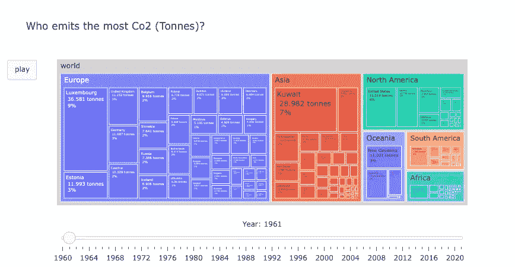
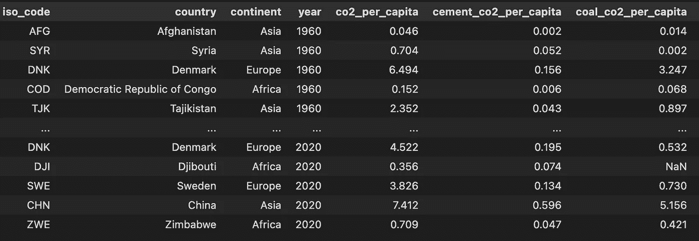
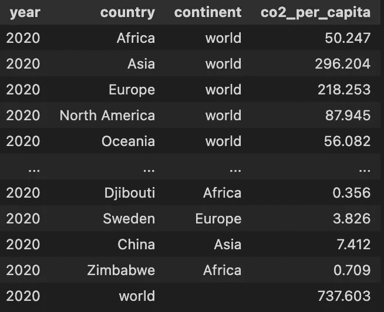

# 谁排放的二氧化碳最多？带有 Plotly.graph_object 的树状图动画

> 原文：<https://towardsdatascience.com/who-emits-the-most-co2-a-treemap-animation-with-plotly-graph-object-1f3c0e4918cc>

## 使用 Plotly Gragh_object 制作一个带有滑块的动画树形图，用于更改数据显示

*【找到本文代码* [*这里*](https://github.com/lanchuhuong/Plotly-Dash/blob/master/Plotly_Dash_Emission_Viz.ipynb) *。]*

作者图片

在本文中，我们将学习如何使用 Plotly 库的 Graph_object 模块，通过“树形图”可视化来可视化分层数据。

**Plotly Express vs . Plotly Graph _ object**

Plotly Python 库是一个用于交互式可视化的开源库。Plotly Express 模块提供了一个快速简单的实现，作为使用简单语法创建最常见图形的起点，但在涉及更高级的图表类型或自定义时，它缺乏功能性和灵活性。

与 Plotly Express 相比，Plotly Graph Objects (Go)需要更多的编码，但更具可定制性和灵活性。用 Plotly 库生成的每个图形实际上都使用了图形对象，除非是用字典手工构造的。

您可以在一次函数调用中使用 Plotly Express 模块，用几行代码创建一个树形图。然而，Plotly Express 不提供添加更多类似滑块动画的交互式功能。在本教程中，我将向你展示如何使用 Go 来创建带有滑块动画的动画树状图。

得到💬任何数据科学或编程问题的 GPT 式答案。为成千上万的人生成摘要和学习笔记📚只需一次点击即可获得学习资源。👉

 [## 面向数据科学家和开发人员的免费学习资源。精选的博客、教程、书籍和…

### 机器学习和人工智能工程师的培训课程、黑客马拉松、活动和工作

aigents.co](https://aigents.co/learn) 

# 准备数据

本文使用了 1947-2020 年的 CO2 排放数据，这些数据是开放数据，可以从数据【1】中的[我们的世界免费获取。数据集包含温室气体排放属性，如二氧化碳、甲烷、一氧化二氮...等等。](https://github.com/owid/co2-data)

数据集中的一些属性。图片作者。

树形图使用嵌套的矩形可视化分层数据。分级数据通常存储为矩形数据框，不同的列对应于分级结构的不同级别。

要创建树形图，在正确的层次结构中创建数据集是非常重要的，否则，它将不起作用。该顺序从层级的底部到顶部开始，底部级别是指“*子代”*，顶部级别对应于“*根父代*”。

首先，我的数据集包含每个国家和每年的排放量，我们称之为 df_ghg_country。由于每个国家/孩子属于一个洲，每个国家的“*中间父*将是洲。因此,“大陆”列将是 df_ghg_country 中子“国家”的父列。接下来，所有的大陆将组成“*世界*”。因此，在大陆级别，大陆将是孩子，而"*世界*"将是"*根父"*。

为了使树形图工作，每个父矩形的总值/大小需要等于所有嵌套子矩形的总和。要获得每个中间父/洲矩形的大小，将所有相应子/国家的值相加。这可以通过创建一个新的数据框架来获得各大洲每年的二氧化碳排放总量来实现。然后，在这个新数据框中创建父列，它应该接收值“world”。我们姑且称这个数据框为 df _ GHG _ continental。下面的代码将完成这项工作:

要获得每年根父/世界矩形的大小，只需将所有国家每年的所有人均二氧化碳值相加，即可创建一个新的数据框。这个就叫 df_ghg_world 吧。由于“world”本身是最终的父项，它没有父项，因此该数据集的父列将接收空值。创建 df_ghg_world 可以通过下面的代码实现:

要制作包含所有等级的最终数据集，只需连接所有上述数据框 df_ghg_country、df _ GHG _ continental 和 df_ghg_world。最终的数据集将如下所示:

作者图片

# 用滑块动画创建树形图

**做一年的树状图地块**

要使用 Plotly Graph_Objects 制作树形图，我们需要使用 Go。图，并至少提供以下参数:

1.  每个矩形的标签
2.  每个矩形的大小/值:设置与每个矩形相关的值。该值用于指定每个矩形的大小。
3.  父母

随着更多关于外观改进的争论，动画树状图来了！

2020 年人均二氧化碳排放量。作者图片

**添加滑块动画:**

我们的数据是一个时间序列数据集。为了了解每个国家对全球二氧化碳排放量的贡献如何随着时间的推移而变化，我们将添加一个动画，自动向前移动一个滑块，该滑块负责改变我们想要可视化的显示数据。

我们可以使用 go.layout 和 go.Figure 中的滑块和帧参数来实现这一点。通过创建一个帧列表，其中每个帧都对应于特定年份的树形图，每个帧都将在动画中逐一显示。详细步骤和代码如下:

1.  使用 plotly.go 创建一个图表列表，其中包括数据中每年的树形图。
2.  使用 Plotly.go.frame 将步骤 1 中的每个图形转换为一个框架，从而创建一个框架列表。

3.制作一个滑动条列表，列表中的每个元素都是每个滑动条外观的字典。

请注意，在步骤 2 中为每个框架指定的名称应该与上面代码片段中第 8 行 args 内部指定的名称相同。

4.创建布局对象，它是一个字典，其中滑块(在步骤 3 中)是一个参数，播放按钮包含在“updatemenus”键中

5.使用带有布局和框架参数的 Go.figure 创建图形。框架(在步骤 2 中)被添加为图形对象中的关键点。这些帧指向一个图形列表，当动画被触发时，每个图形都将被循环显示。布局对象(在步骤 4 中创建)被传递给 Go.Figure 中的布局构造函数。

你现在可以和这张地图互动，看看在过去的 60 年里，每个国家的二氧化碳排放量是如何变化的。每个矩形的大小与特定国家的人均二氧化碳份额成正比。

1960-2020 年期间每个国家的人均二氧化碳排放量。图片作者。

现在你有了它，一个令人惊叹的使用 Plotly 的 Graph_objects 模块的动画树形图可视化。请在评论中告诉我你的想法！

[1]公开数据:数据中关于我们世界的二氧化碳和温室气体排放的数据。[访问链接。](https://github.com/owid/co2-data)

[2] [阴谋地文档](https://plotly.com/python-api-reference/generated/plotly.graph_objects.Figure.html)

*感谢您的阅读。如果你觉得我的帖子有用，并且正在考虑成为中级会员，你可以考虑通过这个* [*推荐会员链接*](https://medium.com/@huonglanchu0712/membership) *:)来支持我，我将收取你的一部分会员费，不需要你额外付费。如果你决定这样做，非常感谢你！*