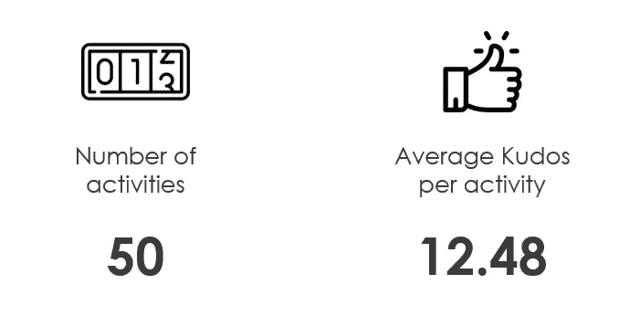
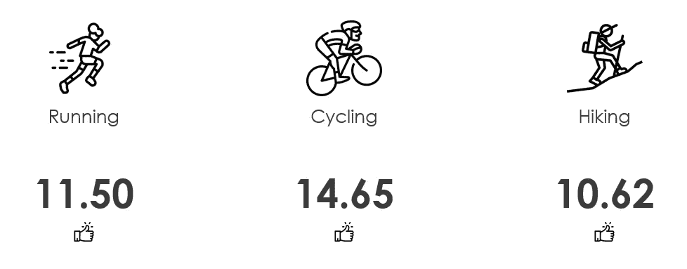
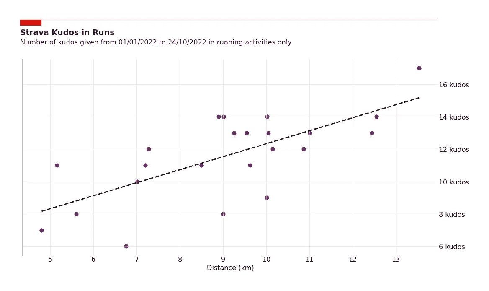
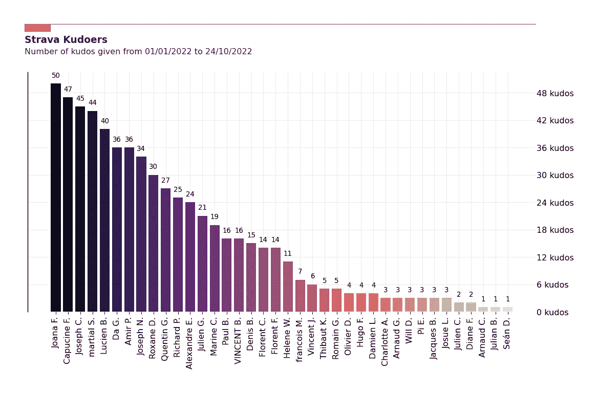

# 谁是你在斯特拉发的头号支持者？

> 原文：<https://towardsdatascience.com/whos-your-number-1-supporter-on-strava-5a888230f361>

## 探索 Strava API 并使用 Python 找到答案

维克多·比斯特罗夫在 [Unsplash](https://unsplash.com/s/photos/cycling?utm_source=unsplash&utm_medium=referral&utm_content=creditCopyText) 上拍摄的照片

# 头号动机

在过去的几年里，Strava 成了我追踪骑行和跑步活动的首选应用。这款应用有很多很酷的功能，其中一个就是你的朋友可以为你的活动给你好评。有时候，这些荣誉只是激励你继续前进的动力。

2022 年，当我准备攀登阿尔卑斯山并比以前更经常使用 Strava 时，我注意到有些人在荣誉方面比其他人更慷慨。但是我不知道是谁，这让我开始思考。有没有一种方法可以比应用程序提供的更深入地了解我的统计数据？嗯，有。

在本文中，我使用了一种非常常见的“提取转换负载”方法来构建项目。我将展示我如何设法从 Strava 获取活动数据(提取)，计算新的见解(转换)，并构建“Kudos Graph”和其他可视化工具，以了解应该感谢谁的支持(加载)。

随着时间的推移，我发现这种方法是组织类似数据项目的好方法。在开始之前，最后注意一点，这里显示的所有内容都是可复制的，代码可以在 Github(本文末尾的链接)上获得，因此您可以构建自己的代码。

让我们开始编码吧！

# #2 API 连接和授权

这可能是本文中不太有趣的部分，但却是必要的部分。为了使用 Strava API 并获得您的数据，您首先需要在网站上注册一个应用程序(没有看起来那么可怕)，并获得授权令牌。

1.  注册一个应用程序可以在登录时通过以下链接完成:【https://www.strava.com/settings/api】T4。这将为您提供您的客户端 ID 和客户端密码。
2.  第一步只会让你到此为止，并授予你访问顶线数据。要访问活动级别数据，您需要遵循以下链接:[*http://www.strava.com/oauth/authorize?client_id=****【REPLACE _ WITH _ YOUR _ CLIENT _ ID】****&response _ type = code&redirect _ uri = http://localhost/exchange _ token&approval _ prompt = force&scope = profile:read _ all，activity:read_all*](http://www.strava.com/oauth/authorize?client_id=[REPLACE_WITH_YOUR_CLIENT_ID]&response_type=code&redirect_uri=http://localhost/exchange_token&approval_prompt=force&scope=profile:read_all,activity:read_all)
3.  在登陆页面点击“授权”，在出现的网址中写下你得到的授权码: *http://localhost/exchange _ token？state =&CODE =****【THIS _ IS _ THE _ CODE _ YOU _ NEED _ TO _ COPY】****&scope = read，activity:read_all，profile:read_all*

我从 Benji Knights Johnson 的这篇文章中得到了所有这些，文章中对这些步骤进行了更详细的解释:

<https://medium.com/swlh/using-python-to-connect-to-stravas-api-and-analyse-your-activities-dummies-guide-5f49727aac86>  

现在让乐趣开始吧。

# #3 认证

我们需要做的第一件事是认证，即从 Strava 获取访问令牌。下面的函数将通过一个 POST 请求做到这一点，该请求包含我们在上一节中获得的到端点[https://www.strava.com/oauth/token](https://www.strava.com/oauth/token)的细节(客户端 id、客户端秘密、刷新令牌和授权码)。

# #4 提取数据

在本节中，我们创建两个函数来:

1.  **获取档案中所有活动的列表。**
    使用我们之前得到的访问令牌，并指定两个定义我们感兴趣的活动范围的日期，我们得到这两个日期之间所有活动的列表及其主要特征。
2.  **获取特定活动的 kudoers 列表。**
    不幸的是，先前请求的结果中不包含活动的 kudoers 列表。我们需要构建 get_kudos 函数，该函数返回单个活动的 kudoers 列表，由 activity_id 标识。

# #5 转变数据

现在我们已经得到了我们想要的数据，我们的想法是只保留我们需要的，并把它放在熊猫数据帧中。

下面的转换函数从活动列表中提取以下数据:

1.  用作活动的唯一标识符的活动 id。
2.  每项活动的 kudos 数。
3.  通过在一个循环中利用 get_kudos()函数，得到一个活动的所有 kudoers 的列表。
4.  每次活动的距离。
5.  每项活动花费的时间。
6.  活动的类型。

⚠️:strava API 的使用是有限制的。我们被限制为每 15 分钟 100 个电话，每天 1000 个电话。

在这个项目中，我们调用 API 一次来获取活动列表，然后对每个活动调用一次来获取每个活动中的 kudoers 列表。

这意味着，如果在考虑的窗口中有超过 100 个活动，代码将不能工作，您需要稍微修改它以符合 API 使用限制。

# #6 荣誉图(以及其他一些见解)

剩下唯一要做的就是利用我们刚刚构建的函数，开始绘制一些有趣的东西！

就我而言，我正在考虑我在 2022 年的活动，直到今天——2022 年 10 月 24 日。

从我们的数据结构中，可以非常容易地获得给定期间的一些高级 KPI:

高级 KPIs 按作者分类的图片

因为我们在前一节中获得了每项活动的运动类型，所以我们也可以很容易地调查某些类型的活动是否比其他活动更容易获得荣誉。以下是每种活动的平均荣誉数:

每种活动类型的平均 kudos 数—按作者分类的图片

即使它不是最受欢迎的活动类型，跑步是我拥有最多数据点的运动，所以这是我试图挖掘更多的地方。我们可以试着理解为什么一项活动会比另一项活动获得更多的荣誉。让我们来看看跑步的距离和活动将获得的荣誉之间可能的相关性。

事实证明，似乎存在正相关关系，即跑步时间越长，kudos 的数量就越高，如下图所示。诚然，鉴于我们考虑的数据点数量很少，这一结果的统计学意义是有争议的。这里唯一确定的结论是，我需要跑得更多。

我们可以在分析中走得更远，看看其他变量的影响，但我将把这留给另一篇文章。

跑步的距离和获得的荣誉数成正相关——作者图表

最后，我们可以绘制“荣誉图”,从中我们可以看到谁是我们最大的支持者，并大声喊出来。
当然，有些人比其他人更沉迷于 Strava，当他们向下滚动活动提要时会给予称赞，而其他人只会偶尔打开应用程序，只对他们碰巧看到的最近活动给予称赞。
这张图表绝不是在评判人们是否给予赞扬，它只是简单地展示了你在其他地方看不到的新见解——即使是在这款应用的高级版本中也看不到。

显示最高支持者的“荣誉图”——按作者分类的图表

# #7 最后的想法

毫无疑问，我们可以利用从 Strava API 获得的所有数据做更多的事情。这只是回答一个不寻常的问题的第一枪，也是一个很好的练习。

如果你想分析你的 Strava 活动，找出谁是你最大的支持者，完整的代码可以在这里找到:
[*https://github.com/Guigs11/strava_kudo*s](https://github.com/Guigs11/strava_kudos)

*感谢一路看完文章！
欢迎在下方留言，如有任何问题/备注，也可通过*[*LinkedIn*](https://www.linkedin.com/in/guillaume-weingertner-a4a27972/)*联系我！
更多来了！*