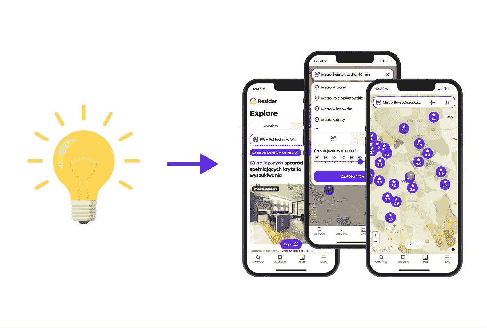
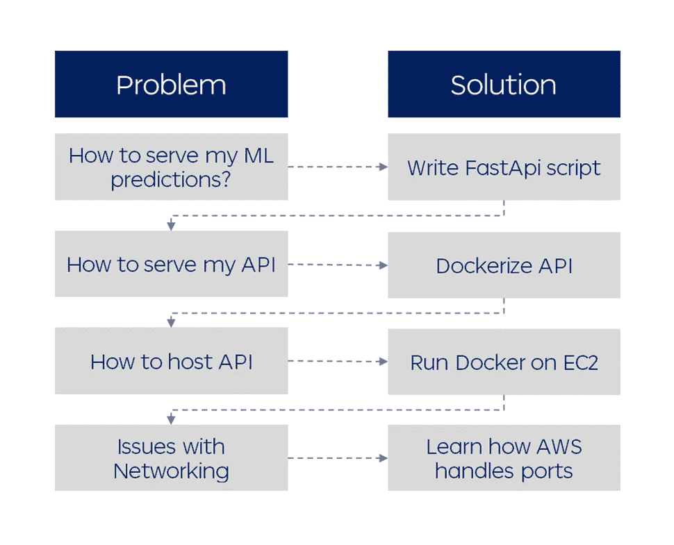
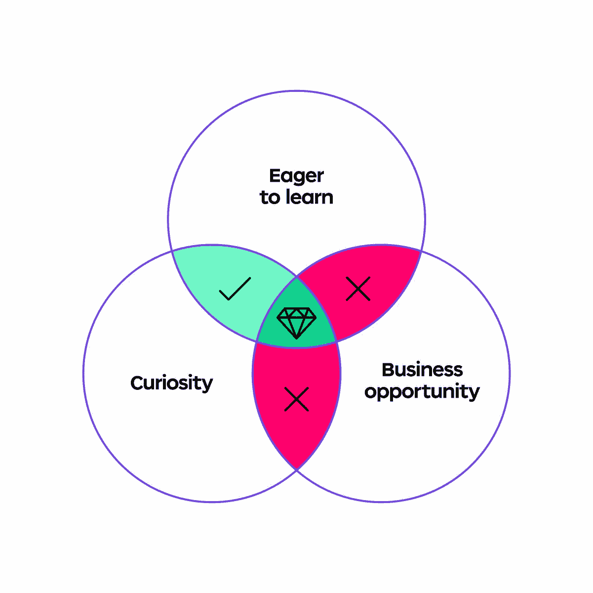
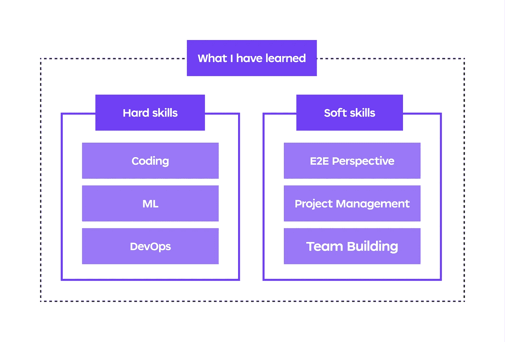

# 为什么宠物项目是培养整体数据科学技能的最佳方式

> 原文：<https://towardsdatascience.com/why-a-pet-project-is-the-best-way-to-develop-holistic-data-science-skills-b5f2db7e113a>

## 创建自己的项目并从头开始构建数据产品可以加速您的学习

作者图片

大约两年前，我在数据科学技能发展方面遇到了一点瓶颈。随着快速的进步，我已经度过了兴奋的初始阶段，对编码、分析和 ML 有了相当好的了解，但感觉我错过了更广阔的视角。

在我的全职工作中，我正在应对有趣的挑战，但它们的范围有限，而且我缺少开发完整产品的技能。我尝试在课程中学习像 Docker 或 AWS 这样的技能，但我觉得它们只是触及了表面，并没有真正让我为现实生活做好准备。

## 如果你曾经有过类似的感觉，我强烈建议启动一个宠物项目，让你走出平台期，加速你作为数据科学家的成长

我认为构建一个完整的数据项目是解决上述问题的好方法。我也在寻找新的公寓出租，并决定通过关注房地产数据来一举两得。

两年后，一个小小的副业项目扩展成了一个房产对比引擎— [www.resider.pl](http://www.resider.pl.) ，一个拥有成千上万用户和背后伟大团队的网站。在这篇文章中，我将分享这段旅程开始时的一些要点，以及如何通过一个宠物项目加快你的职业和技能发展的技巧。

# 一个宠物项目为你的技能发展创造了最终的路线图和测试平台

一旦你经历了预测泰坦尼克号幸存者的最初兴奋，并获得了一些 Coursera 证书，你就会意识到你仍然缺少的技能范围是巨大的。参加课程学习并获得证明你在深度学习、Docker、AWS 或 GCP 方面能力的证书很容易。

## 上述方法的关键问题是它没有回答两个关键问题:

*   你是否学到了正确的技能，以及它们如何解决你的问题？
*   你真的学会了它们并自信地从头开始实施它们了吗？

开发一个宠物项目与学习过程相反——你的路线图是由你在项目中遇到的实际技术问题引导的。解决这些问题的能力是对你技能的最终考验——如果解决方案不起作用，你需要继续学习。

## 问题解决循环

作者图片

上面的例子展示了我在项目开始时遇到的一个问题-解决方案循环。

*   我知道如何构建定价模型，但不知道如何提供快速预测，所以我学习了如何用 FastApi 创建 API。
*   然后我意识到，虽然它在我的电脑上工作得很好，但我不能把它运到其他任何地方，这导致了学习 Docker。
*   一旦我有了一个 dockerized API，我意识到我需要把它放在某个地方，这样它就可以被网站前端访问。AWS EC2 是我最初的选择，这是关于如何使用虚拟机的一堂很好的课
*   在这个过程的最后，我遇到了一个完全意想不到的处理端口和安全设置的问题——这个问题在课程中很少提到，但在现实生活的项目中几乎每次都会碰到

当接近项目的这一部分时，我对 FastApi、Docker 或 AWS EC2 一无所知，但是找到解决实际问题的方法感觉更自然。让整个 API 设置工作起来也是一个明显的测试，证明我对所有涉及的步骤都理解得足够好。

在整个项目中，我不断重复上面的循环，这让我永远不会耗尽学习新东西的想法。从问题开始，然后找到最佳解决方案，这让我学会了在 AWS Ground Truth 上进行 Dala 标记，用 spaCy 建立命名实体识别模型，或者用 CatBoost 建立价格基准模型。

## 一旦你迷上了解决问题的反馈循环，学习就会有更多的回报！

# 为什么你会把你的空闲时间用来做没有报酬的工作？

如果我们同意宠物项目对技能发展很有帮助，那么还有一个非常重要的问题——保持动力。

## 宠物项目动机的 3 个关键驱动因素:

作者图片

我相信求知欲和好奇心对于你的项目成功是完全不可或缺的。如果你对你试图解决的问题没有热情，你可能会在一个流行的话题上创造一个模仿者，没有任何独特或有用的东西。一旦你遇到第一次挑战，对这个话题的兴趣也能防止你气馁。

愿意学习是另一个必备条件。宠物项目是一个长期的游戏，以技术技能的提高为主要目标。如果你是一个已经完成了 10 个类似项目的程序员，你会对免费做第 11 个项目感到兴奋的机会是相当小的。

如果你看到了最终将你的宠物项目转变成一项业务的潜力，那就更好了，因为它可以在未来保持项目发展的势头。但是如果你的唯一目标是赚钱，那么当事情变得比预期困难时，你很可能会失去动力，放弃这个项目。

# 在我的宠物项目上花费数千小时，我得到了什么？

作者图片

从一开始，这个项目的发展速度比我最初预期的要快得多。老实说，我最初并没有计划在日常工作之外每周花大约 20 个小时编写额外的代码，但这真的会上瘾，随着每个问题的解决，下一个改进的想法就会出现。

## 硬技能

这个项目最切实的好处是加速学习和提高我的硬技能。当我开始这个项目时，我有几年的编码经验和一些 ML/DS 知识，但我必须从头开始学习构建 E2E 产品的大部分技能。

对我来说，这是一个艰难的旅程，从一个有抱负的数据科学家在 Jupyter 笔记本上进行实验，到建立数据库，数据管道，API，以及云中全面数据项目所需的一切。

开始一个宠物项目的另一个好处是，如果它足够有趣，你可以让其他具有互补技能的人参与进来，一起学习。对我来说，情况确实如此，当我让 Filip(目前是 Resider 的 CTO)加入时，学习曲线甚至更快了，因为他已经具备了大量的开发运维及云技能，这是我能够从他那里学到的。

## 软技能

如果你是一名程序员，有一个很大的风险，那就是你会过于专注于自己的专业领域，而与业务或其他技术领域(如前端或设计)有点脱节。

在团队中从事自己的项目是项目和产品管理的一个很好的速成班。它也给你一个很好的视角，让你了解不同的领域是如何影响整个开发过程的，以及它们是如何联系在一起的。

它也教会了我一些谦逊，关于产品开发不同领域的重要性。起初，我真的认为一个伟大的数据产品即使使用蹩脚的 UI 也会保护自己——因为它太神奇了，人们最终会发现它的。Alek(目前是 Resider 的 CPO)花了很大的耐心和毅力才说服我，事实恰恰相反，没有出色的 UI，即使是最好的分析和 ML 领域也注定会失败。

## 在安全的环境中犯错

你自己的项目是一个犯错的机会，在典型的企业环境中，这可能会让你丢掉工作。当你在一家大公司工作时，犯错是代价高昂的，所以你需要格外小心每一个变化和新功能。

在你自己的项目中，你能够更快地开发一切，这转化为更快的学习。在这个过程中，您可能会意外地终止生产 API，从数据库中删除重要记录，或者搞乱整个登录面板。您可以快速修复它，并学会在更昂贵的环境中不重复同样的错误。

# 建立一个宠物项目是艰难的，但也是值得的

尽管 Resider 至少在一年前就已经度过了宠物项目阶段，现在正在发展成为一项全面的业务，但初始阶段是我的数据科学之旅中最有趣的部分之一。

尽管有很多必要的工作和几十个小时的踩水时间，我觉得没有更好的学习方法了。这个项目为我提供了一个清晰的路线图，让我在从事我真正感兴趣的事情的同时发展整体的技术技能，这帮助我保持动力。

## 我希望这篇文章能激励你开始一个宠物项目，如果你已经在着手一个项目的话，也能提供一些建议

# 感谢您的宝贵时间！