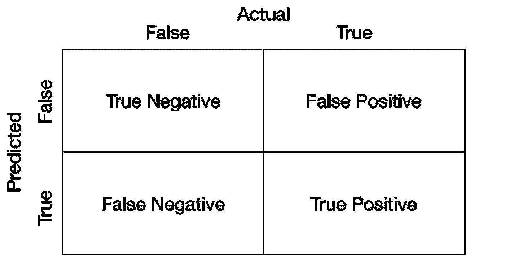
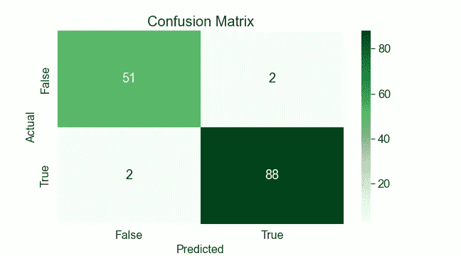
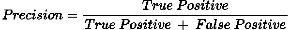
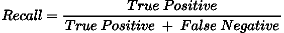
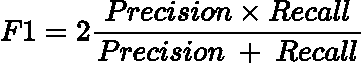
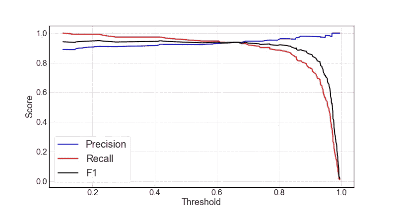

# 为什么准确性不是一切:精度和召回简单解释

> 原文：<https://towardsdatascience.com/why-accuracy-isnt-everything-precision-and-recall-simply-explained-25bc093c7cda>

## 解释数据科学中精确度和召回率的重要性

阿菲夫·库苏马在 [Unsplash](https://unsplash.com?utm_source=medium&utm_medium=referral) 上拍摄的照片

# 介绍

数据科学面试中的一个常见问题是*‘当你 99%的数据属于一个类别时，你如何衡量一个分类模型的性能？’*

这是一个直截了当的问题，然而许多人却结结巴巴，不知道如何回答。

在本文中，我们将通过讨论**召回率、精确度以及两者的调和平均值(F1 分数)来探索上述问题的答案。**

# 准确性问题

让我们从解释为什么准确性可能不是一个好的衡量标准开始。如果 99%的数据集属于一个类，那么通过简单的猜测，任何模型都可以达到 99%的准确率！

该模型将简单地很好地学习来预测单个类别，从而获得与类别分布相等的准确度分数。

即使没有机器学习模型，我也可以纯粹猜测样本属于哪一类，准确率达到 99%！

因此，对于这个特殊的问题，精确度不是衡量模型性能的好指标。因此，我们必须寻求替代的测量方法。

> 注意:有时准确性是一个很好的衡量标准，但这完全取决于作品的背景。

# 混淆矩阵

在我们继续之前，理解**混淆矩阵**很重要。这将您的结果分为正确和不正确的两类**分类**,在测量性能时比测量准确度更能提供信息。

由作者生成的图像。

每个象限显示了我们对这两个类别的分类情况。我们可能有 99%的准确率，但我们可能总是错误地分类 1%的类别！

这显然是不好的，我们可以从混淆矩阵中推断出这一信息，以确保我们充分预测了这两个类别。

下面是我使用 Sci-Kit Learn 的[混淆矩阵函数](https://scikit-learn.org/stable/modules/generated/sklearn.metrics.confusion_matrix.html)为基本逻辑回归分类器用 Python 编写的一个生成的混淆矩阵:

作者用 Python 制作的图像。

用于生成上述图的完整代码可以在我的 GitHub 上找到，如下所示:

  

# 精确

精度度量:**在我们预测为真的样本中，有多少是真的。**

从数学上来说，这可以计算为:

作者用 LaTeX 制作的图像。

> 假阳性在统计学中被称为第一类错误。

如果样本的概率为 **≥ 0.5** ，大多数算法将该样本指定为阳性，如果 **< 0.5** ，则将该样本指定为阴性。该边界值被称为**阈值。**当我们增加阈值时，**精度也增加并趋向于 1。**

这是有意义的，因为概率为 0.9 的样本比概率为 0.5 的样本更有可能是阳性的。因此，我们对放入阳性类别的样本更具选择性和精确性。

当我们想要高度选择性和正确地将哪个样本分类为真实样本时，例如**电子邮件垃圾邮件检测**，就需要使用 Precision。

# 回忆

召回措施:**在所有真实样本中，我们正确地将多少归类为真实。**

在数学上，它的计算方法是:

作者用 LaTeX 制作的图像。

> 假阴性在统计学中被称为**第二类**错误。

**随着阈值的降低，召回率增加并趋于 1。**这是因为我们开始将越来越多的样本归类为阳性，最终，在阈值为 0 时，一切都是阳性的。因此，我们不会有假阴性，因此 Recall 将等于 1。

当我们想要确保捕获所有真正的阳性时，回忆是有用的，即使这意味着增加我们的假阳性(假警报)。这很重要，例如，在癌症检测的情况下，标记它比不标记它更重要。

# F1 分数

然而，我们现在有一个问题。提高阈值可以最大限度地提高准确率，但会降低召回率。那么解决办法是什么呢？

**F1 得分**是通过取召回率和精确度之间的**调和平均值**而在召回率和精确度之间折衷的值；

作者用 LaTeX 制作的图像。

我们使用调和平均值的原因是为了**放大极值**的影响。例如，假设我们的精度为 0.9，召回率为 0。这个的算术平均值是 0.45。然而，相应的模型显然是不好的，因为我们将捕捉到非常少的真正的积极因素。

# 召回率、精确度和 F1 与阈值图

下面是使用 [Sci-Kit Learn 的精确回忆曲线函数](https://scikit-learn.org/stable/modules/generated/sklearn.metrics.precision_recall_curve.html)的我的基本逻辑回归模型的回忆、精确和 F1 分数作为阈值的函数的图:

作者用 Python 生成的图像。

生成上述图形的完整代码可以在我的 GitHub 中找到:

  

在上图中，我们看到当阈值较低时，召回率为 1，而当阈值较高时，精确度为 1。此外，请注意当回忆开始减少时，F1 分数如何显著下降，这表明调和平均值如何惩罚极值。

# 结论

在本文中，我们已经讨论了为什么准确性并不总是您的模型的最佳性能指标。相反，你应该确定它的精确度和回忆分数，以及一个混淆矩阵来全面分析你的结果。当您有一个不平衡的数据集以确保您的模型按预期执行时，这一点尤其重要。

# 和我联系！

*   要在媒体上阅读无限的故事，请务必在此注册！T3*💜*
*   [*当我在这里发布注册邮件通知时，可以获得更新！*](/subscribe/@egorhowell) 😀
*   [*领英*](https://www.linkedin.com/in/egor-howell-092a721b3/) 👔
*   [*推特*](https://twitter.com/EgorHowell) 🖊
*   [*github*](https://github.com/egorhowell)*🖥*
*   ***🏅***

> ***(所有表情符号由 [OpenMoji](https://openmoji.org/) 设计——开源表情符号和图标项目。许可证: [CC BY-SA 4.0](https://creativecommons.org/licenses/by-sa/4.0/#)***