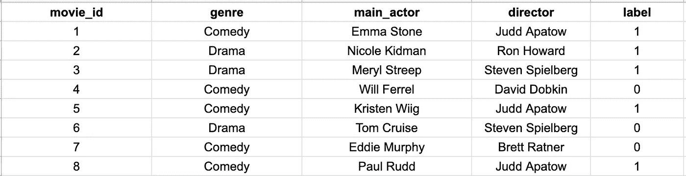
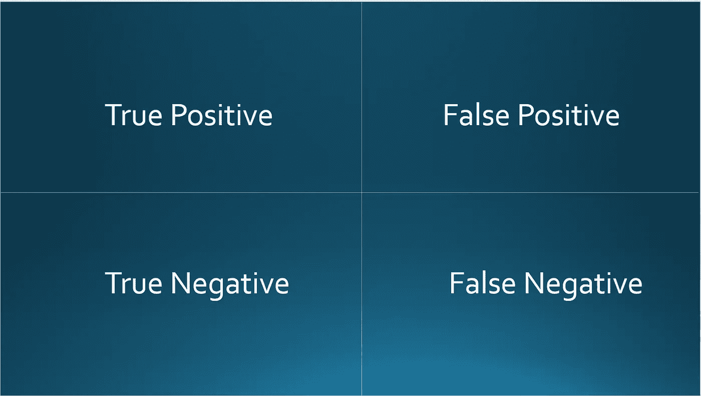
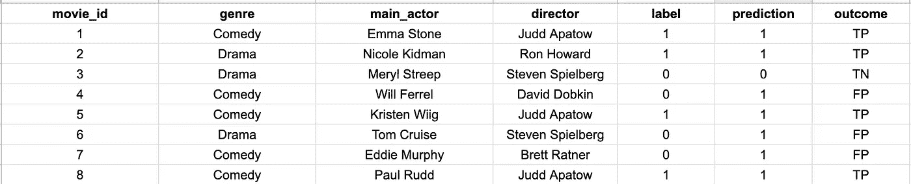
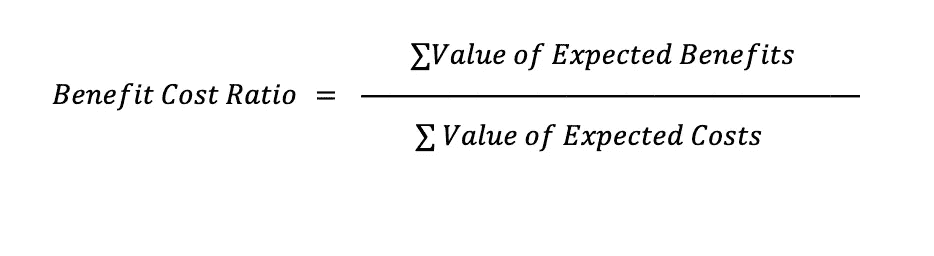

# 为什么精确的模型并不总是有用的

> 原文：<https://towardsdatascience.com/why-accurate-models-arent-always-useful-382f0cd64cfb>

## 经济效用函数如何将你的模型与你的客户联系起来

Afif Kusuma 在 [Unsplash](https://unsplash.com/photos/376KN_ISplE) 上拍摄的照片

首先，我想说，围绕如何评估您的模型，有很多优秀的技术内容。F1 分数、MSE、MAE、Huber 损失、精确度、召回率、交叉熵损失以及许多其他指标都是互联网上广泛讨论的术语。然而，这些指标通常侧重于使您的模型适合您的数据，而不是优化您的模型以适合您的业务——至少以直接的方式。

通常缺少的是一个经济分析框架来优化模型的**效用**。效用被简单地定义为顾客可以从服务中获得的乐趣或价值——在这种情况下就是你的 ML 模型。

虽然这个概念没有在 ML 课堂上教授，但我认为做经济分析和效用评估对于在现实世界中建立实用、持久的模型是非常重要的。在技术和非技术利益相关者联合起来共同开发机器学习模型的经济层之前，机器学习在您的组织中的商业价值和边际效用并没有得到很好的定义。

**注意:**这篇文章是为从事人工智能产品的技术型 ML 人员以及产品经理和非技术型利益相关者而写的。在这篇文章中会有一些数学，但是我已经在这篇博客的结论部分包括了高层次的概念步骤。

# 一个带有二进制分类器的 ML 例子

想象一下，你有一个非常优柔寡断的朋友，他永远不知道一部新电影是否值得看。因为你是一个令人难以置信的好朋友，也是一个优秀的人工智能实践者，你决定建立一个简单的[二元分类](https://en.wikipedia.org/wiki/Binary_classification)模型来预测你的朋友是否会喜欢或不喜欢一部即将上映的电影。

你做了艰苦的工作，为你朋友看过的许多不同的电影标注你的偏好。你做一些特征工程，提取主要演员、类型、导演和其他特征，添加到你的训练数据中。您还可以添加一个标签，表明您的朋友是否喜欢这部电影(1)或不喜欢(0)。最后，你有一个如下的数据集。

电影偏好数据集示例，按作者排序的图像

你遵循正常的机器学习协议，用你最喜欢的分类器训练一个模型，并用 300 部电影的测试集测试它。

您发现您的模型具有相当高的准确性——90%的标签被正确预测。有鉴于此，你可以构建一个基于这种模式的应用程序，并将其交付给你的朋友，这样他们就可以开始变得更果断了！

几周后，你和朋友一起吃午饭，问他们是否在用你的应用。你的朋友犹豫了一下，并透露虽然许多推荐都是准确的，但仍有一对夫妇没有达到目标，因此他们停止使用该应用程序。

# 当只有准确性不起作用时

## 分类结果

发生了什么事？你的朋友为什么停止使用该应用程序？

要回答这个问题，我们必须看得更深一点。在二元分类器中，你意识到实际上有两种可能是对的，也有两种可能是错的。

下图是可能的预测结果。要了解假阳性、假阴性、真阳性和真阴性，请查看此[链接](https://en.wikipedia.org/wiki/False_positives_and_false_negatives)。

作者图片

在你朋友的例子中，这些是 TP、FP、FN 和 TN 的定义

> TP =你正确地推荐了一部你朋友喜欢的电影(标签= 1，预测= 1)
> 
> TN =你正确地没有推荐你的朋友不喜欢的电影(标签= 0，预测= 0)
> 
> FP =你错误地推荐了一部你朋友不喜欢的电影(标签= 0，预测= 1)
> 
> FN =你错误地没有推荐一部你朋友会喜欢的电影。(标签= 1，预测= 0)

数据集中的预测和结果，按作者分类的图像

## 经济分析

在这个阶段，我们开始构建我们的经济层。第一阶段包括 2 个步骤:

1.  列出与您的模型相关的所有收益和成本
2.  衡量每项收益和成本的美元价值

在你为你的朋友设计的电影解决方案中，假设一个 FP 的成本是一张电影票 20 美元，浪费了 2 个小时的时间。也有一些负面的情绪伤害，你可以把它转换成一个特定的金额——在这个例子中是 12 美元。对你的朋友来说，获得正确预测的好处价值 50 美元。如果你的朋友错过了一部你的应用程序没有推荐的电影，你解释为 5 美元，他们也不会感觉很糟糕。

其中一些成本已经以美元计算，因此更容易分解。其他成本更难，因为它们是时间和情感成本，你必须深入了解你的朋友(或客户)才能量化。经过一番努力，你为了你朋友的收益和成本，把上面的整合成下面的定义。

> A =花费的时间= 10 美元
> 
> B =看一部烂片的情感伤害= 50 美元
> 
> C =错过一部好电影的精神损失= 12 美元
> 
> D =看一部好电影的情感快乐= 50 美元
> 
> E =错过一部糟糕电影的情感快乐= $5
> 
> F =电影票价格= 20 美元

寻找和衡量不同的成本和收益，然后将其转化为一种可解释的货币，这是构建效用优化层所缺少的但却是必不可少的一步。

# 沟通经济学和 ML

您现在构建一个函数，将您朋友的量化成本和收益与分类结果联系起来。为了保持方程的简单，我们添加了上面方程中定义的变量标签(A、B、C 等)。在此阶段，我们将不同的收益和成本相加，为每个分类结果创造美元价值。

例如，误报是 80 美元，因为你加上了电影票的价格，看电影花费的 2 小时时间，以及观看一部糟糕电影的情感伤害。真正的肯定是 10 美元，因为对你的朋友来说，看这部电影值 50 美元，但他们花了 40 美元的时间和金钱。为了简单起见，我们假设每部电影都是 2 小时。

> 假阳性= F+2(A)+B = 20+(10 * 2)+$ 50 = 80
> 
> 假阴性= C = 12 美元
> 
> 真正= D-F-2(A) = $50 -$20 -($10*2) = $10
> 
> 真负值= E = $5

## 效益成本比率

既然所有的成本和收益都与我们的分类结果相关联，我们可以引入一个效用函数。这不同于调优最精确的模型。

一个可能有用的经济效用函数的例子是**收益成本比。**这是一种流行的计算方法，是一般金融和经济分析的一部分。**对这一比率的高层次解释是，大于 1 的值意味着收益大于成本，小于 1 则意味着相反。**

作者图片

我们可以执行以下步骤:

1.  计算 TPs、TNs、FPs 和 FNs 的数量
2.  使用您为每个结果计算的成本作为权重来计算效益成本比

回到电影的例子，回想一下，我们有一个 300 部电影的测试集，其中 90%被正确预测。按照上面的说明操作后，对于每种类型的分类器结果，您会得到以下数量的数据点。

> TP 预测= 80 次预测
> 
> 总预测数= 190 次预测
> 
> FP 预测= 30 次预测
> 
> FN 预测= 0 预测

正如所料，300 个预测中有 270 个是正确的(TP + TN)。我们可以看到有 30 个误报，一个 FP 的成本是 80 美元。

我们的成本收益比是预期收益总额除以预期成本总额。

> [(权重* TP) +(权重* TN)] / [(权重* FP) +(权重* FN)]

我们的预期收益是 TP 和 TN，我们的预期成本是 FP + FN。如果我们应用为 TP、TN、FP 和 FN 计算的权重，我们可以创建以下等式。

> [($ 10 * TP)]+[($ 5 * TN)]/[($ 80 * FP)+($ 12 * FN)]

如果我们将所有计算出的数字应用于成本收益比:

> [10(80)+5(190)]/[80(30)+12(0)]= 1750/2400 =**. 729**

大于 1 的值意味着模型在增值。在我们的例子中，值是 0.729。这意味着尽管 300 个预测中有 270 个是正确的，但这个模型正在伤害你的朋友。难怪你的朋友不再使用该应用程序了！！

## 二元分类之外的经济函数

我们也可以将这个框架扩展到其他类型的问题。例如，在多类分类器中，您可以测量正确的、不正确的、遗漏的和超出范围的话语，然后将相应的权重应用于这些测量，以创建您的收益和成本。您也可以使用一个[一对一](https://scikit-learn.org/stable/modules/generated/sklearn.multiclass.OneVsRestClassifier.html)分类器来构建每个类级别的深度指标。一些类别标签可能比其他标签具有更高的精度更重要，因此可能应该设置经济指标来优化这些类别子集。

无论您使用什么型号，应用这种经济分析来帮助您决定生产中型号的正确设置都不会有什么坏处。

## 可行的步骤和更深入的 ML 指标

既然你已经量化了你朋友的偏好，你可能会决定你需要一个能为你朋友产生较少推荐的模型。实现这一点的一个方法是设置一个阈值，并衡量这个阈值如何影响你的效用函数。根据我在大公司和小公司的经验，我看到阈值被任意设置，经济层面将有助于增加一些背景知识来解释为什么阈值是这样的。还有其他方法来为你的模型分配阈值，我不会在这里讨论。

像 F1 这样的更深层次的指标确实考虑了精度和召回率(以及分类结果)，与只考虑精度相比，这可以更好地了解模型的性能。敏感性和特异性等概念是众所周知和讨论过的概念，与本文有重叠。

即使在这些情况下，经济函数仍然是有价值的，可以用来为不同的结果分配货币价值，并直接将您的模型与客户的需求联系起来。

# 现实世界中的经济函数

当然，现实世界比电影中的例子要混乱得多。整合收益和成本的过程可能需要多次迭代和大量时间。衡量“情感伤害”等方面也非常困难。要得到一个合适的衡量标准，需要对你的客户有非常深刻的了解，即使这样也可能不是 100%准确。您应用的权重可能不正确，并且存在主观上违背以客户为中心的风险。

为了减少偏见，创建这个经济层的过程落在了机器学习人员、产品经理和任何对客户有洞察力的利益相关者身上。

# 结论

在本文中，以下是我们采取的高级概念步骤，经济层步骤以粗体显示:

1.  来源，并准备您的数据
2.  建立和训练模型
3.  使用测试集生成预测
4.  使用预测，标记分类结果(在二元分类器的情况下，标记 TP、FP、TN、FN)
5.  **了解分类结果的成本和收益，并转换为美元。这需要 ML 人员与对客户需求有很好感觉的利益相关者一起工作。**
6.  **用步骤 5** 中计算的收益和成本值衡量分类结果
7.  **计算一个经济效用函数(或大于 1)，在本例中该函数是一个收益成本比**
8.  根据您的效用函数优化您的模型。这可能会影响准确性。在收益成本比的情况下，我们希望模型大于 1，而我们的原始模型小于 1。

总之，虽然人们普遍认为机器学习和人工智能为你的业务、客户和底线增加了很多价值，但开始衡量和优化这种价值很重要。

如果你对这种类型的内容感兴趣，并想探索更多，有一些奇妙的想法，以进一步探讨这些想法如何桥梁经济学和 ML。

    <https://www.linkedin.com/pulse/why-utility-determination-critical-defining-ai-success-bill-schmarzo/> 