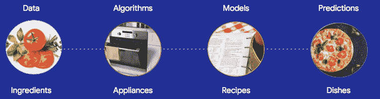
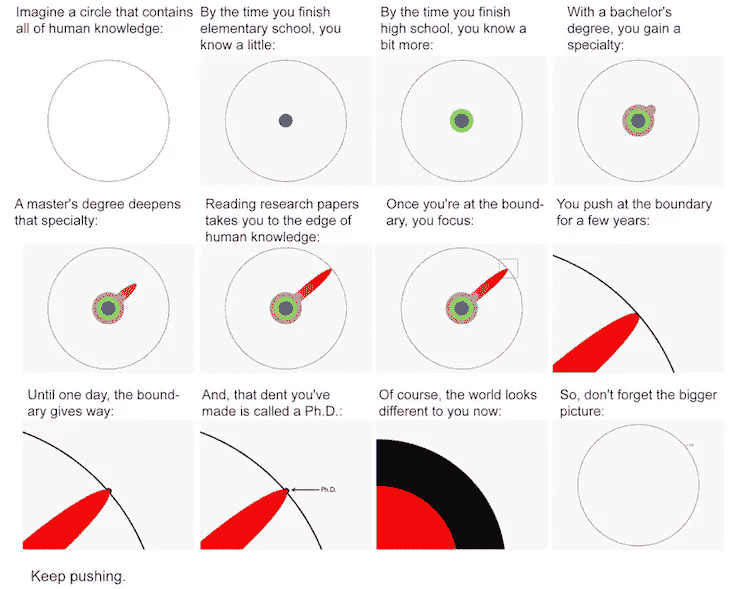

# 为什么人工智能研究员不应该成为你的第一个数据科学雇员

> 原文：<https://towardsdatascience.com/why-an-ai-researcher-shouldnt-be-your-first-data-science-hire-a043eb78e2e7>

## 等到你的团队更加成熟的 4 个理由

许多组织通过过分强调人工智能研究和在招聘狂潮中狼吞虎咽博士学位来开始他们的数据科学之旅。这是一个好主意，如果:

*   你正在投资一个[研究部门](http://bit.ly/quaesita_roles)，你不打算问你的研究人员他们最近为你做了什么。
*   你已经知道你正在解决一个有价值的、重要的问题，并且**知道用现有的算法不可能解决这个问题**。

为了研究而研究是一项高风险的投资，很少有公司能承担得起，因为从中得不到任何有价值的东西是一种非常现实的可能性。

图片来自 [Pixabay](https://pixabay.com/photos/research-letters-scrabble-words-3691930/) 。

如果你的目标是解决商业问题，这里有一些人工智能研究员不应该成为你的第一个雇员的原因:

1.  他们是你这种数据科学的初学者。
2.  他们对真实世界的数据没有经验。
3.  你没有适合他们的环境。
4.  你还没给他们找到好项目。

***如果你是一名研究人员，请阅读这一段:*** *研究人员，我一生中有很大一部分时间是作为你们中的一员度过的，所以我非常尊重当你被引导到尊重你的技能的工作中时，你能有多大的价值。这篇文章的重点不是让雇主远离你，而是避免一种对所有相关人员来说都很悲惨的情况:被雇佣到一个没有准备好欣赏你所能提供的最好的环境中。坚持让雇主做好功课，以确保你能胜任自己的工作。*

# #1 —研究人员是你这种数据科学的初学者

有两种不同的数据科学[；雇佣你真正需要的人。](http://bit.ly/quaesita_datasci)

*   **研究**(如人工智能研究、统计学研究、数据科学研究等。)
*   **应用**(如 AI 工程、应用统计学、应用数据科学等。)

用一个厨房的比喻来说，**人工智能研究**完全是关于*设备*的创新——创造通用工具的蓝图供他人使用。这是一个与**应用人工智能**非常不同的学科，后者更多的是在*配方中进行大规模创新*。如果你正在使用数据解决业务问题，应用人工智能是你需要的(而不是出售一种方法让别人用数据解决他们的业务问题)。

你卖的是哪个？该雇佣哪个团队取决于你的回答。作者创造的形象。

两者都非常有价值和重要，但是一方面的专业知识很少能转化为另一方面。当然，研究是寻找聪明勤奋的人的好地方，但是要知道他们将在工作中学习应用数据科学的大部分相关技能。点击了解更多[。](http://bit.ly/quaesita_fail)

# #2 —他们没有处理真实世界数据的经验

人工智能研究人员发明通用算法和方法供他人使用。他们不是来用你的具体数据解决你的具体问题的。事实上，虽然真实世界的数据可以为展示他们的发明创造一个很好的机会，但对研究人员来说，数据不需要太多就可以变得太真实。

没有人想承受额外的压力，要同时应对来自解决方案*和*的数据特性的速度波动。使用一个众所周知的、被充分理解的、没有太多惊喜的数据集会更安全。这就是人工智能研究人员喜欢使用**合成数据集**和**基准数据集**的原因。

合成的和真的味道不一样。来源: [Pixabay](https://pixabay.com/photos/vegetables-fruit-artificial-gmo-4046994/) 。

**模拟合成数据集**(根据配方由计算机生成)以创建受控条件。人工智能研究人员使用它们的原因与他们穿着实验服的同事不喜欢在肮脏的人行道上进行实验的原因相同。就像真实世界本身一样，真实世界的数据可能会非常混乱，分散人们对研究问题的注意力。

> 研究人员更喜欢避免真实世界的数据，原因与他们穿着实验室外套的同行不喜欢在肮脏的人行道上进行实验一样。

合成数据集的行为和复杂性是一个熟悉的朋友，因此调试没有那么可怕。即使研究团队转向业务问题的实时数据，他们也只有在确定数据集在合成数据集上的表现符合预期时才会这么做，这种心态与软件工程中的单元测试并无太大区别。

**基准数据集**可能是来自过去项目的模拟或真实数据集，研究社区使用这些数据集来比较不同研究团队之间的结果。如果你的算法在一个真实世界的数据集上得分 65%，而我的算法在另一个数据集上得分 98%，那么我的算法比你的好吗？如果不使用基准数据进行比较，就很难说。

使用基准数据集就像每个人都同意在同一杯纯净水上尝试他们的微波原型，看看谁能让它最快沸腾。真恶心，没人打算真的把水端给任何顾客。

这并不是说所有的人工智能研究人员都不喜欢真实世界的数据集——案例研究和概念证明都很棒，但你正在开发普遍有效的技术，拥有一个无菌的环境会减少你需要与之斗争的原因。

> 拥有一个无菌的研究环境会减少你需要对抗的原因。

但是我跑题了。我的观点是，研究人员不太可能有太多的经验来处理各种各样的真实世界[继承的数据集](http://bit.ly/quaesita_notyours)，包括缺点和所有缺点，这些都是在没有他们参与的情况下收集的。这正是你要强加给他们的数据。点击了解更多关于继承数据[的信息。](http://bit.ly/quaesita_notyours)

# #3 —你没有适合他们的环境

如果你正在考虑让研究员成为你的第一个雇员，你可能还没有合适的环境来充分利用他们。博士项目有一个共同点，那就是它们迫使学生专攻某一领域。

来源:[Matt may](http://matt.might.net/articles/phd-school-in-pictures/)博士图解指南，经许可使用。

专家是很棒的，如果没有他们，我们都会处于黑暗时代，但是他们没有被训练成你在[数据科学](http://bit.ly/quaesita_datascim)第一次雇佣中最需要的人:冷酷务实的多面手。

> 理想的数据科学新员工应该是多面手，他的热情是尽一切努力让数据变得有用。如果能完成任务，没有什么方法是太愚蠢或太廉价的。

在你的团队准备好高效工作之前，有许多零星的工作需要做。从[建立基础设施](http://bit.ly/quaesita_dataeng)到[获得数据资产](http://bit.ly/quaesita_provenance)到[与利益相关者争论](http://bit.ly/quaesita_dsleaders)到[壮大你的团队](http://bit.ly/quaesita_roles)。你理想的雇员是准备好卷起袖子做任何需要做的事情的人。

DALL E 2 完全知道我在说什么。(图片由作者生成。)

公平地说，许多博士幸存者迫不及待地将他们的毕业礼服扔到篝火上，进行彻底的职业转变，因此学位本身并不是数据科学的禁忌。远非如此。但是做研究的愿望与在应用领域成为第一个雇员的要求相冲突。

# #4 —你还没有为他们找到一个好项目

不要马上让研究人员加入进来。最好等到你的团队发展到可以理解他们需要一个研究员的时候。

> 研究人员专门发明解决问题的新方法，而不是解决问题的新方法。

由于研究人员专门发明解决问题的新方法而不是解决问题的新方案(区别很微妙但很重要！)只有当你确认解决问题所需的[算法](http://bit.ly/mfml_part4)尚不存在时，你才需要他们的帮助。这时你就要向研究人员寻求帮助来发明它们。

> 等到你用尽所有可用的工具后，再雇人为你制造昂贵的新工具。

大多数团队不会提前知道解决他们问题的工具是否已经存在，所以按照正确的顺序做事更有意义:在自己制作那支[太空笔](https://www.scientificamerican.com/article/fact-or-fiction-nasa-spen/)之前，先检查一支铅笔是否能完成工作。首先开始，如果你发现现成的解决方案没有给你太多的爱，*那么*你应该考虑雇佣研究人员。

# 摘要

只有当你有合适的问题让他们解决时，研究人员才属于研究部门之外——他们的技能是从零开始创造新的算法和测试，而现成的版本并不存在——否则他们将经历一个悲惨的西西弗螺旋(这将完全是你的错，而不是他们的错)。研究人员通常会花上十年以上的时间进行培训，这至少值得尊重，因为他们不会从事完全不相关的任务。

> 研究人员通常会花上十年以上的时间进行培训，这至少值得尊重，因为他们不会从事完全不相关的任务。

为应用项目雇佣研究人员的最佳时机往往是在你的分析师帮助你确定了一个有价值的项目，并且试图用应用数据完成该项目的科学家已经失败之后。当你让职业发明家上场时。

# 那么什么是更好的招聘顺序呢？

参见我的[数据科学和人工智能](http://bit.ly/quaesita_roles)十大角色指南，按招聘顺序排列。