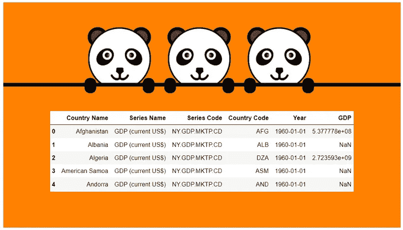
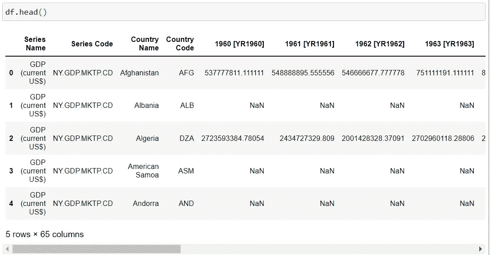
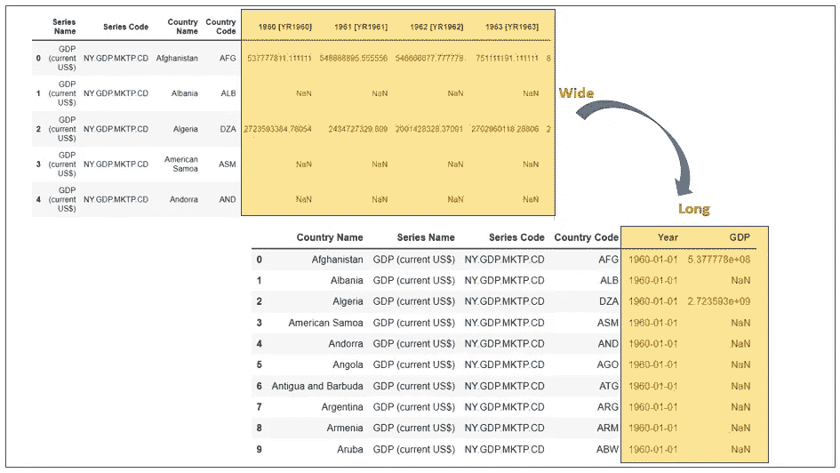
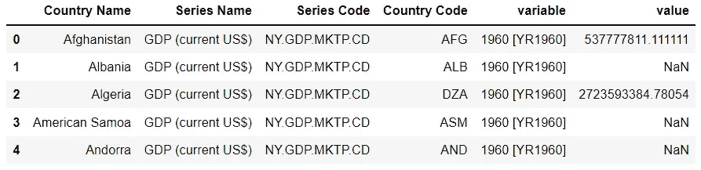
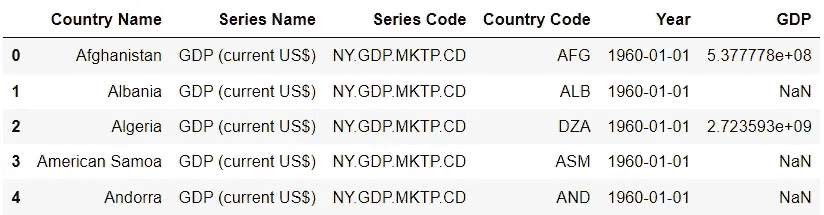
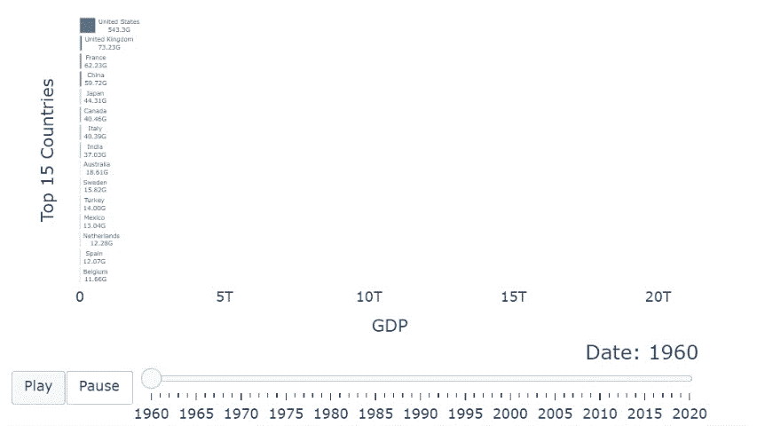

# 为什么以及如何将熊猫数据框由宽变长

> 原文：<https://towardsdatascience.com/why-and-how-to-reshape-a-pandas-dataframe-from-wide-to-long-ca90c89156b9>

## 一段简单的代码就完成了这个任务



图片由 [Pixabay](https://pixabay.com/illustrations/panda-animal-texture-unique-art-5364822/) 提供(作者修改)

作为数据科学家，我们知道数据并不总是以最适合分析或可视化的格式出现。将表格或 pandas 数据帧从宽格式转换为长格式就属于这种情况，我们需要对数据应用一些“技巧”来进行分析。

让我们看一个真实世界的例子来理解概念和技术。假设我们想要创建一个动画条形图竞赛图来说明世界前 15 个国家的 GDP 从 1960 年到 2020 年是如何演变的。你可以从[世界银行的网站](https://data.worldbank.org/indicator/NY.GDP.MKTP.CD?name_desc=true)下载原始数据。



作者图片

这是“宽格式”表格的典型示例。对于每个国家，我们在单独的列中有其每年的 GDP，总共有 61 列/年的 GDP 数据。基本上，表格按年份水平延伸，使其非常宽，因此得名“宽格式”。

虽然“宽格式”的表格看起来容易阅读，而且在现实中很常见，但用 Python 绘图却非常困难。我们需要“转置”表格/数据帧，这样我们就有一个变量表示时间列(在我们的例子中是“年份”)，另一个变量表示每年的值(在我们的例子中是 GDP)。



作者图片

那么用 Python 怎么做呢？为了将数据帧由宽变长，我们需要使用一个名为`pd.melt()`的 pandas 函数。在下面的代码中:

第 2 行:我们从 pandas 数据帧中得到“Year”列的列表。这些是要转置的列。

第 3 行:我们指定数据帧中的哪些变量是“id _ var”——基本上是不被改变/转置的列(即，我们的数据帧中的前四列)。我们还需要指定数据框架中的哪些变量将被转置——在我们的例子中，所有的年份变量(1960[YR1960]，1961[YR1961]，1962[YR1962]等等。)

重新成形的长格式数据帧将具有代表年份的“变量”列和代表每年的值(即 GDP)的“值”列。列名“变量”和“值”都是由`pd.melt()`给出的默认名称。



作者图片

我们可以进一步清理数据，比如将这两列重命名为“Year”和“GDP ”,并确保它们具有正确的数据类型。



作者图片

## 额外收获:使用重塑的数据框架创建一个条形图竞赛

现在我们可以使用`raceplotly`从**整形后的**数据帧中轻松创建一个条形图比赛动画。如果没有`raceplotly`，可以通过运行下面的命令行来安装:

```
pip install raceplotly
```

`raceplotly`中最重要和必需的论点是:

*   `item_column`:表示要分级的项目/条的列的名称(‘国家名称’)
*   `value_column`:表示用于排名的值/度量的列名(“GDP”)
*   `time_column`:表示时间变量的列名(“年”)



作者创建的 Gif

将一个表从宽转置为长听起来是一件复杂的事情，至少在 SQL 或 Excel 中是这样。但是在 Python 中，`pd.melt()`是一个非常方便和简单的方法，可以快速获得想要的结果。感谢阅读。我希望你喜欢这个快速 Python 教程！

数据源:

应用程序演示中使用的数据集是从世界银行网站[https://data.worldbank.org/indicator/NY.下载的开放数据集(无需许可)GDP.MKTP.CD？name_desc=true](https://data.worldbank.org/indicator/NY.GDP.MKTP.CD?name_desc=true)

你可以通过这个[推荐链接](https://medium.com/@insightsbees/membership)注册 Medium 会员(每月 5 美元)来获得我的作品和 Medium 的其他内容。通过这个链接注册，我将收到你的一部分会员费，不需要你额外付费。谢谢大家！