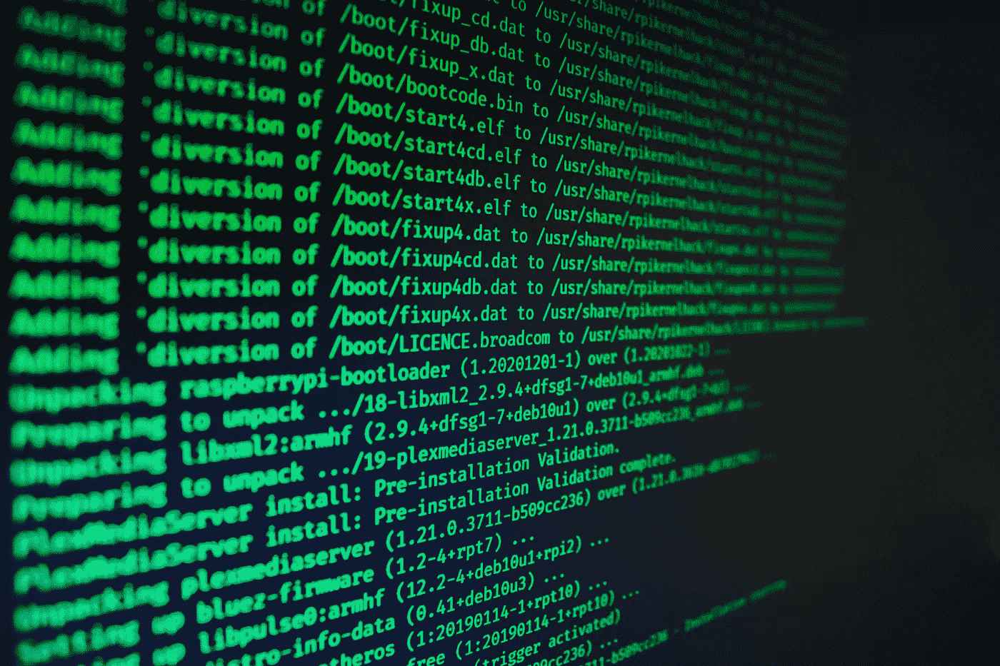
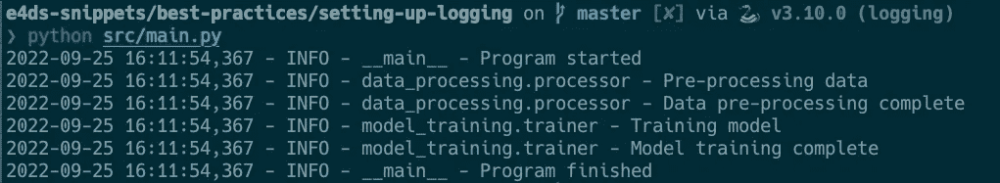

# 为什么以及如何为 Python 项目设置日志记录

> 原文：<https://towardsdatascience.com/why-and-how-to-set-up-logging-for-python-projects-bcdd4a374c7a>



[杰克·沃克](https://unsplash.com/@jakewalker?utm_source=unsplash&utm_medium=referral&utm_content=creditCopyText)在 [Unsplash](https://unsplash.com/s/photos/computer-terminal?utm_source=unsplash&utm_medium=referral&utm_content=creditCopyText) 上拍照

**Python 的日志库非常强大，但在数据科学项目中通常没有得到充分利用。**

大多数开发人员默认使用标准的打印语句来跟踪应用程序或数据管道中的重要事件。

有道理。

“打印”完成了这项工作。它很容易实现，没有样板代码，也不需要阅读文档来理解如何使用它。

但是随着代码库变得越来越大，由于 print 语句的不灵活性，您可能会很快遇到一些问题。

**Python 的日志库为应用程序的调试和审计提供了更完整的解决方案。**

原则上，使用日志库很简单。尤其是对于单个脚本。但是根据我的经验，我发现很难清楚地理解如何为包含多个模块和文件的更复杂的应用程序设置日志记录。

不可否认，这可能只是由于我在开始使用库之前长期无法阅读文档。但是也许你有同样的挑战，这就是为什么你可能会点击这篇文章。

经过一点研究，下面是我如何用最少的样板代码和简单的配置文件为我的数据科学项目设置日志记录。

# 为什么使用日志记录而不是打印？

首先，让我们讨论一下在项目中使用 Python 日志库的理由。

## 日志记录主要是为了开发人员的利益

> 打印/记录声明是为了开发者的利益。不是电脑的。

日志记录语句有助于诊断和审核与应用程序正常运行相关的事件和问题。

在日志语句中包含/排除相关信息越容易，监控应用程序的效率就越高。

## 打印报表是不灵活的

它们不能被“关闭”。如果你想停止打印一个语句，你必须修改源代码来删除或注释掉这一行。

在大型代码库中，很容易忘记删除所有用于调试的随机打印语句。

## 日志记录允许您添加上下文

Python 的日志库允许您轻松地将元数据添加到日志中，例如时间戳、模块位置和严重性级别(调试、信息、错误等)。).这些元数据是自动添加的，无需硬编码到语句中。

元数据也是结构化的，以在整个项目中提供一致性，这可以使日志在调试时更容易阅读。

## 将日志发送到不同的位置并以不同的格式发送

打印语句将输出发送到终端。当您关闭终端会话时，打印语句将永远丢失。

日志库允许您以不同的格式保存日志，包括保存到一个文件中。对于记录日志以备将来分析非常有用。

您还可以同时将日志发送到多个位置。如果您需要记录多个用例，这可能会很有用。例如，从终端输出进行常规调试，以及出于审计目的在文件中记录关键日志事件。

## 通过配置控制行为

可以使用配置文件来控制日志记录。拥有一个配置文件可以确保整个项目的一致性以及配置与代码的分离。

这还允许您根据环境(例如开发与生产)轻松维护不同的配置，而无需更改任何源代码。

# 记录 101

在研究一个示例之前，需要解释日志模块中的三个关键概念:记录器、格式化器和处理程序。

## 记录器

用于生成日志的对象通过以下方式进行实例化:

```
import logginglogger = logging.getLogger(__name__)
```

“logger”对象创建并控制项目中的日志记录语句。

您可以随意命名记录器，但是最好为每个模块实例化一个新的记录器，并使用 __name__ 作为记录器的名称(如上所示)。

这意味着记录器名称跟踪包/模块层次结构，这有助于开发人员快速找到日志在代码库中的生成位置。

## 格式化程序

格式化程序对象确定日志消息的顺序、结构和内容。

每次调用 logger 对象时，都会生成一条日志记录。一个 LogRecord 对象包含一个[数量的属性](https://docs.python.org/3/library/logging.html#logrecord-attributes)，包括创建时间、创建模块和消息本身。

我们可以使用 Formatter 对象定义在最终的日志语句输出中包含哪些属性以及任何格式。

例如:

```
# formatter definition
‘%(asctime)s — %(name)s — %(levelname)s — %(message)s’# example log output
2022–09–25 14:10:55,922 — INFO — __main__ — Program Started
Handlers
Handlers are responsible for sending the logs to different destinations.
```

日志消息可以发送到多个位置。例如到标准输出(例如终端)和文件。

最常见的处理程序是 StreamHandler 和 FileHandler，前者将日志消息发送到终端，后者将消息发送到文件。

日志库还附带了一个[数量的强大处理程序](https://docs.python.org/3/library/logging.handlers.html#module-logging.handlers)。例如，RotatingFileHandler 和 TimedFileHandler 将日志保存到文件中，并在文件达到某个大小或时间限制时自动轮换日志所在的文件。

如果需要，您还可以定义自己的自定义处理程序。

## 关键要点

*   记录器是使用 logging.getLogger()实例化的
*   使用“__name__”以模块名称自动命名您的记录器
*   记录器需要“格式化程序”和“处理程序”来指定日志消息的格式和位置
*   如果没有定义处理程序，您将看不到任何日志消息输出

# 为项目设置日志记录

> 💻这个示例项目的完整代码可以在这个 [GitHub repo](https://github.com/julian-west/e4ds-snippets/tree/master/best-practices/setting-up-logging) 中获得

## 常见 Python 项目结构

下面是数据科学项目的典型项目布局。我们将使用它作为设置日志记录的示例项目。

```
# common project layout├── data             <- directory for storing local data
├── config           <- directory for storing configs
├── logs             <- directory for storing logs
├── requirements.txt 
├── setup.py
└── src              <- project source code
  ├── main.py         <- main script
  ├── data_processing <- module for data processing
  │  ├── __init__.py
  │  └── processor.py
  └── model_training   <- module for model_training
  ├── __init__.py
  └── trainer.py
```

我们有一个包含应用程序源代码的“src”目录。以及用于与代码分开存储数据和配置的目录。

程序的主入口点在“src/main.py”文件中。主程序从“src/data_processing”和“src/model_training”模块调用代码，以便预处理数据和训练模型。我们将使用来自相关模块的日志消息来记录管道的进度。

您可以通过编写 Python 代码来定义记录器或使用配置文件来设置日志记录。

让我们通过一个例子来研究这两种方法。

# 基本日志设置

我们可以为项目设置一个日志记录器，简单地将日志消息打印到终端。这类似于 print 语句的工作方式，但是，我们将使用来自 LogRecord 属性的信息来丰富消息。



作者图片:在终端上记录输出

在我们的“src/main.py”文件的顶部，我们启动记录器并定义处理程序(StreamHandler)和消息格式。

我们只需要在主文件中这样做一次，设置就会在整个项目中传播。

在我们想要使用日志记录的每个模块中，我们只需要导入日志记录库，并在每个文件的顶部实例化 logger 对象。如‘src/data _ processing/processor . py’和‘src/model _ training/train . py’代码片段所示。

就是这样。

# 使用配置文件

我们可以使用配置文件来定义格式化程序和处理程序，而不是在 main.py 文件的顶部使用 Python 代码来定义它们。

对于大型项目，我的首选方法是使用配置文件，因为它有以下好处:

*   您可以为开发和生产环境定义和使用不同的日志记录配置
*   它将配置从代码中分离出来，使得在具有不同日志记录需求的地方重用源代码变得更加容易
*   易于将多个记录器和格式化程序添加到项目中，而无需在源代码中添加太多的代码行

我们可以使用 logging.config.fileConfig 将 main.py 文件中的代码更改为从配置文件中加载。

在下面更新的代码中，我创建了一个函数(setup_logging ),它根据环境变量(例如 dev 或 prod)的值加载配置文件。这允许您在开发和生产中轻松使用不同的配置，而无需更改任何源代码。

在配置文件(logging.dev.ini)中，我们定义了两个记录器。一个将日志发送到终端，一个将日志发送到文件。

> 关于记录配置文件格式的更多信息可以在[记录文档](https://docs.python.org/3/library/logging.config.html)中找到

# 调试提示

最初在我的项目中设置日志记录时，我遇到了不少问题，在终端或文件输出中我看不到任何日志。

这里有一些建议。

## 确保您已经在配置中指定了所有的处理程序

如果在您的配置文件中有一个错误指定的处理程序，您可能在终端(或其他目的地)中看不到任何日志。不幸的是，日志库似乎无声无息地失败了，并且没有给出许多指示来说明为什么您的日志设置没有像预期的那样工作。

## 确保您设置了正确的“级别”设置

例如:logger.setLevel(日志记录。调试)。默认级别是日志记录。警告，这意味着只记录警告、错误和关键消息。如果您的日志消息使用 INFO 或 DEBUG，您需要显式设置级别，否则您的消息将不会显示。

## 不要混淆“日志”和“记录器”

承认这一点我很尴尬，但过去我花了很长时间试图找出为什么信息没有显示出来。原来我使用的是 logging.info()而不是 logger.info()。我想我会把它放在这里，以防不仅仅是我有错别字。值得一查。🤦‍♂️

# 结论

在这篇文章中，我们讨论了使用 Python 的日志库来帮助调试和审计应用程序的好处。

我强烈建议在您的项目中开始使用日志记录而不是“打印”语句，特别是对于在生产环境中使用的代码。

在理解了记录器、格式化器和处理程序的关键概念以及如何在不同的模块中启动记录器之后，设置日志就相对简单了。

可以使用 Python 代码配置日志记录，也可以从日志记录配置文件中加载日志记录。这篇文章的完整代码示例可以在 [GitHub repo](https://github.com/julian-west/e4ds-snippets/tree/master/best-practices/setting-up-logging) 中找到

```
This article was originally published on the [Engineering For DataScience](https://engineeringfordatascience.com/posts/python_logging/) blog
```

# 资源

*   [https://www . log Gly . com/blog/4-reasons-a-python-logging-library-is-better-put-print-statements-everywhere/](https://www.loggly.com/blog/4-reasons-a-python-logging-library-is-much-better-than-putting-print-statements-everywhere/)
*   [https://towards data science . com/8-advanced-python-logging-features-that-you-should-miss-a 68 a5 ef 1b 62d](/8-advanced-python-logging-features-that-you-shouldnt-miss-a68a5ef1b62d)
*   https://docs.python-guide.org/writing/logging/