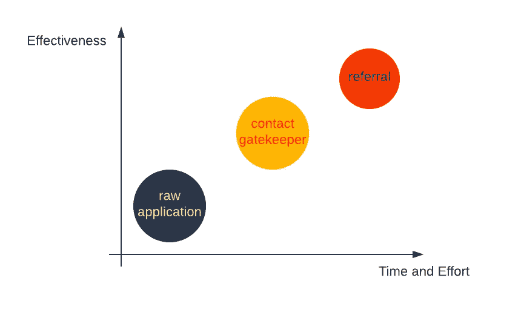

# 你为什么不接受数据科学的采访？

> 原文：<https://towardsdatascience.com/why-arent-you-getting-data-science-interviews-6c7a31c8970f>

## 数据科学面试

## 获得面试的方法和当你感到困难时的提示

蜜桃红·坎普斯·菲利佩在 [Unsplash](https://unsplash.com/?utm_source=medium&utm_medium=referral) 上的照片

很多关于获得数据科学工作的信息都集中在面试准备上，这非常重要！然而，许多人也发现自己对之前的阶段有疑问。**你如何获得数据科学面试机会？**

现在，如果你甚至还没有开始求职过程，我建议你在阅读这篇文章之前，从我的博客[如何选择正确的数据科学职位](/how-to-choose-the-right-data-science-position-in-2022-f940efd0a10a)开始。如果你已经知道你想要什么样的职位，这篇文章将会引导你经历一个模糊且有点可怕的过程，把这些申请变成面试。

具体来说，在这篇文章中，我将谈论获得面试的不同方法，以及如何有效地接近这些方法，以便你获得足够的面试机会，从而获得一份工作。我们将介绍**三种不同的获得面试机会的方式**以及**如果你已经找了一段时间的工作却还没有得到面试机会该怎么办**。

如果你更喜欢看而不是读，你也可以去我的 YouTube 频道看这个博客的[视频版](https://www.youtube.com/watch?v=bN2zt3Y_q3g&t=9s)。

让我们深入了解如何获得面试机会！

# 目录

*   [获得面试机会的不同方法](#2bfb)
    - [原始申请](#b6d9)
    - [接触守门人](#e6f9)
    - [引荐](#a645)
    - [一份好简历的重要性](#0b60)
*   如果我没有得到面试机会怎么办？
    - [诊断你的问题](#91dd)
*   [招聘季](#bf3d)
*   [结论](#7065)

# 获得面试的不同方法

获得面试机会有三种基本方式:原始申请、接触看门人和获得推荐。**此图**从时间/精力和有效性方面比较了这三种方法。让我们从最低努力到最高努力来回顾所有这些。

图片由[艾玛丁](https://medium.com/@emmading) |获得面试机会的三种方式

## 原始应用程序

原始申请只是意味着向职位空缺提交你的**简历**。要做到这一点，你需要从寻找工作机会开始。最常见的地方是典型的大型招聘网站，如 Linkedin 和 Indeed。但是在你去那些招聘网站之前，我建议你直接去你感兴趣的公司的网站。在那里你可以找到你正在寻找的特定角色，并且网站会有最准确和最新的招聘信息。

要做到这一点，你需要知道你想为哪些公司工作。为了更好地帮助这一点，我创建了两个知名科技公司的名单。一个列表是招聘分析驱动角色的公司，另一个列表是招聘算法驱动角色的公司。你可以通过链接下载 pdf 文件，然后点击该公司，进入他们的职业页面进行你自己的研究。如果你认为这些列表是有帮助的，请随意与你的朋友分享这个 pdf 文件或这个博客。

你可以做的另一件事就是花时间做一些个性化的事情，来增加你使用原始应用程序的机会。简单地向数百份工作发出相同的简历可能很有诱惑力，但要记住，其他人也是这么做的。

如果你想脱颖而出并获得面试机会，那么付出额外的努力是很重要的。对公司做一些调查，调整你的简历，使之最适合这个职位。这种努力显示了你对这份工作更高的兴趣，并且可以大大提高你的申请回复率。

正如你可能猜到的，原始申请是申请工作和获得面试的最常见方式，这意味着经常会有很多竞争。发出原始申请时，很难说你会和多少人竞争。这就是为什么你想把这和其他获得面试的方法结合起来。

## 联系看门人

获得面试的第二种方法是**联系** **看门人**。看门人是你感兴趣的公司的技术招聘人员或雇员。

要通过这种方法获得面试，我推荐 4 个基本步骤:

1.  列出你感兴趣的公司。
2.  找到这些公司看门人的联系信息。
3.  写一封电子邮件或 LinkedIn 信息，然后发出去。
4.  定期跟进，直到你被拒绝。

这是通过门卫获得面试的基础。我不会深究如何联系看门人的细节，因为我有另一篇关于这个主题的博客文章，里面有被证明有效的电子邮件模板。

## 参考

获得面试的最后一种方法实际上是最有效的，那就是通过**推荐**。因为这是进入面试阶段最有效的方法，所以我想更详细地谈谈如何寻求和利用推荐。

照片由[克里斯蒂娜@ wocintechchat.com](https://unsplash.com/@wocintechchat?utm_source=medium&utm_medium=referral)在 [Unsplash](https://unsplash.com?utm_source=medium&utm_medium=referral) 上拍摄

关于推荐，首先要知道的是实际上向谁寻求推荐。推荐是获得面试的最有效方法，但这并不意味着你应该开始在 LinkedIn 上随机询问一些人。如果你只是让陌生人给你介绍他们的公司，你可能根本得不到回复。

相反，**推荐人应该来自既了解你又熟悉你的工作的人。这就是人际关系网如此重要的原因。如果你想从一个你不太了解的人那里寻求推荐，花点时间努力一下。给他们买咖啡，做一次信息采访，了解他们。本质上，建立关系应该是寻求推荐的第一步。这是最需要时间和精力的方法，但也是获得面试机会最有效的方法。**

**了解转介流程**

假设你有愿意推荐你的人。你现在做什么？你的目标应该是让推荐你的人尽可能顺利地完成推荐过程。所以，首先，不要问他们公司有没有空缺。相反，你应该自己做调查，并把你感兴趣的确切职位信息发给推荐你的人。

现在怎么办？你是通过普通的求职网站申请工作还是怎样？推荐相对简单，但如果你不知道他们是如何工作的，他们可能会令人困惑。在大多数公司中，**推荐人将使用内部职位公告板提交推荐**。作为推荐人，你需要做的就是提供你的简历和你想申请的职位。

在许多情况下，你不应该通过正常途径申请工作，因为一旦你申请了，推荐就无效了。但是，也有一些公司会要求你同时自己申请。所以，最好的办法是在申请之前和推荐你的人澄清说明。

因此，推荐的基础是**找到你想要申请的确切职位，然后将你的信息交给推荐人**，这样他们就可以将你的申请作为推荐人提交。大多数情况下，你不必通过其他方式额外申请，你也不应该这样做，因为这会影响推荐过程。不过，请咨询推荐你的人来澄清这一点。

现在，如果你有一个朋友在谷歌这样的大公司工作，有多个职位空缺，你可能想知道你是否可以利用他们的推荐同时申请多个职位。

答案是视情况而定。有些公司会允许你一次申请多个职位，而有些公司不会。你需要向同意推荐你的人澄清。如果你可以一次申请多个职位，这是值得的，因为这将增加你获得面试的机会。

## 一份好简历的重要性

这就是获得面试的三种基本方式。你应该把这三者结合起来，给自己最大的机会去面试至少几家公司。值得一提的是简历的重要性，正如你所知，你需要一份好的简历来让任何方法为你所用。

在发送我们的申请、联系看门人或请求推荐之前，花时间**仔细检查你的简历**以使它尽可能的好是值得的。你的简历展示了你申请的职位所需要的技能吗？你在微调你的简历以最适合每个职位吗？

如果你不确定如何自己仔细检查你的简历，我有一份[免费简历清单](https://www.datainterviewpro.com/#resume)供你使用。

# 如果我得不到面试机会呢？

此时，很难不停下来问自己，“**如果我做了所有这些，但还是没有得到面试机会，那该怎么办？**”。

找工作时很容易灰心丧气。你可能已经找了一段时间的工作，但仍然没有得到面试机会。你是做什么的？如果你没有成功，你能做些什么来增加你的机会？

无论你是在找实习还是全职工作，最重要的是要记住保持势头！获得面试机会需要时间和大量的申请。如果你让自己变得气馁，放慢申请的速度，那么你只会减少获得面试的机会。往前压，一直走。

我说继续下去的原因是因为它确实比你预期的要花更长的时间来得到你的求职结果。招聘人员审查简历并回复你需要时间。不要期望马上从许多公司得到回复，在等待回复的时候，你能做的最好的事情就是继续找工作。

## 诊断您的问题

现在，如果你已经给了它时间，你的简历是最好的，你仍然没有得到面试，是时候开始认真考虑你的问题是什么了。为了找到能让你获得面试的解决方案，**你需要正确地诊断你的问题。**

我首先会考虑的是**你发了多少份申请。长时间找工作会让你觉得自己一事无成，但如果你没有发出足够多的申请，你找工作的时间就没那么重要了。一般来说，我会说，如果你申请了不到 500 份工作，接触了 10 个看门人，并要求不到 10 个推荐人，那么你需要做的第一件事就是发出更多。**

如果你发出了至少 500 份申请，等了 2 到 3 个月，得到的面试机会少于 5 次，那么你可能需要考虑你的目标职位。如此低的申请面试转换率可能表明就业市场认为你的背景与你所寻找的职位不匹配。

要解决这个问题，有两个选择。第一，你可以**切换目标位置**。如果就业市场似乎认为你不适合一个角色，那么你可能需要尝试另一个。如果你犹豫要不要这么做，你也可以尝试申请小公司和初创公司的工作。竞争没有那么激烈，你可能会有更好的机会获得面试机会。

很难放弃你想要的工作类型和你想要为之工作的公司类型，但有时你确实不得不考虑工作需求。如果你正在寻找的东西不起作用，你可能需要改变你正在寻找的东西。

# 招聘季节

我们关于面试的讨论差不多结束了，但是我还有一件事想提一下——招聘季节。

照片由 [Tim Gouw](https://unsplash.com/@punttim?utm_source=medium&utm_medium=referral) 在 [Unsplash](https://unsplash.com?utm_source=medium&utm_medium=referral) 上拍摄

在和学生打交道时，我发现有些人太在意进入公司的招聘季节。他们担心，如果他们在一年中的某个时间没有准备好，或者在某个时间没有申请，将不会有任何空缺。这些类型的担忧会让一个人发疯，让找工作的过程变得更有压力。

在找工作和考虑招聘季节时，你必须承认两个简单的事实。第一，这不是你能控制的。你无法控制公司何时决定招聘。不同的因素可能会影响公司的招聘决定，如整体经济、行业趋势和公司的财务状况等。所以不同的公司有不同的时间表。

第二，**许多公司一年到头都在招人**，尤其是初创公司和成长中的中型公司。可能有一段时间，一家公司的空缺职位比其他时间多，但许多公司全年都有一些职位可供选择。这两件事的底线是，在大多数情况下，对招聘季节感到紧张无助于你找到工作。

话虽如此，我不能说招聘季是一个神话。当公司得到新的预算时，招聘季节就会到来。具体时间因公司而异，但常见的情况是年初的人数多于年末的人数。

这意味着在 1 月、2 月和 3 月，许多公司已经计算出人数，并开始张贴空缺职位和雇用新员工，这可以使年初成为找工作的好时机。

对于学生和新毕业生来说，这也是一个美好的时刻，因为实习生和大学毕业生项目正在开放。你经常可以找到专为大学生和大多数大公司毕业生设计的求职页面。

例如，亚马逊有一个[学生项目](https://www.amazon.jobs/en/business_categories/student-programs)，通过 [Meta](https://www.metacareers.com/jobs?teams[0]=University%20Grad%20-%20Engineering%2C%20Tech%20%26%20Design&teams[1]=University%20Grad%20-%20Business&teams[2]=University%20Grad%20-%20PhD%20%26%20Postdoc) 和 [Google](https://careers.google.com/jobs/results/?category=DATA_CENTER_OPERATIONS&category=DEVELOPER_RELATIONS&category=HARDWARE_ENGINEERING&category=INFORMATION_TECHNOLOGY&category=MANUFACTURING_SUPPLY_CHAIN&category=NETWORK_ENGINEERING&category=PRODUCT_MANAGEMENT&category=PROGRAM_MANAGEMENT&category=SOFTWARE_ENGINEERING&category=TECHNICAL_INFRASTRUCTURE_ENGINEERING&category=TECHNICAL_SOLUTIONS&category=TECHNICAL_WRITING&category=USER_EXPERIENCE&employment_type=FULL_TIME&employment_type=PART_TIME&employment_type=TEMPORARY&jex=ENTRY_LEVEL) ，你可以设置一个过滤器来选择专门针对新毕业生和实习生的角色。对于较小的上市公司，如 Lyft 和优步，你可以找到专为那些希望开始职业生涯或寻找实习机会的人设计的页面。

# 结论

本帖到此为止！记住，有三种方法可以获得面试机会:

*   **原始应用程序**
*   **联系看门人**
*   **利用推荐**

推荐是最有效的，但是当你继续找工作的时候，你会想要使用这三种方法。记得保持势头，在你的简历和推荐上付出额外的努力！

一旦你真的获得了面试机会，接下来要担心的就是如何在面试中表现出色。我随后写了两篇博客关注这部分过程:一篇是关于准备面试时你需要知道什么，另一篇是关于让你的准备更有效的学习技巧。我强烈建议去看看。

# 感谢阅读！

如果你喜欢这个帖子，想支持我…

*   *订阅我的* [*YouTube 频道*](https://www.youtube.com/channel/UCAWsBMQY4KSuOuGODki-l7A) *！*
*   *跟我上* [*中*](https://medium.com/@emmading) *！*
*   *连接上* [*Linkedin*](https://www.linkedin.com/in/emmading001/) *！*
*   前往[emmading.com/resources](https://www.emmading.com/resources)获取更多关于数据科学面试技巧和策略的免费资源！

 [## 2022 年如何选择合适的数据科学岗位

### 选择毕业生、职业改变者或当前数据科学家的职位

towardsdatascience.com](/how-to-choose-the-right-data-science-position-in-2022-f940efd0a10a)  [## 如何获得数据科学面试:找工作、联系看门人和获得推荐

### 对于许多工作来说，获得面试机会自然是必不可少的，数据科学工作也不例外。虽然资源在…

towardsdatascience.com](/how-to-get-data-science-interviews-finding-jobs-reaching-gatekeepers-and-getting-referrals-63a51c0078af)