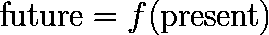
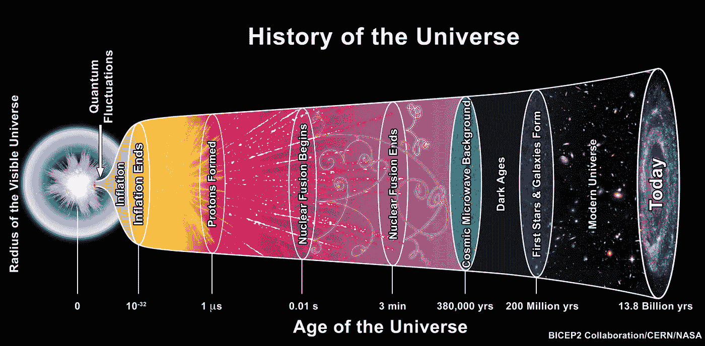
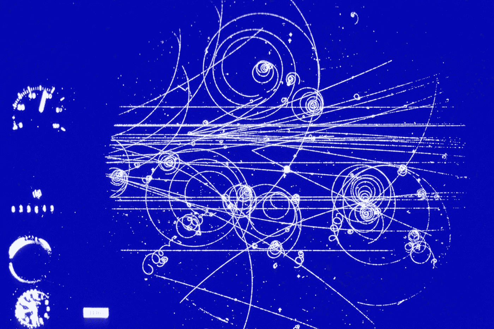

# 为什么因果关系是相关的:一个物理学家的观点(第一部分)

> 原文：<https://towardsdatascience.com/why-causation-is-correlation-a-physicists-perspective-part-1-742696d130e8>

我们都听说过这句话，“相关性并不意味着因果关系”，但从来没有人谈论因果关系到底是什么。基础物理学给了我们一个答案，它可能会让你吃惊:这一切都回到了相关性。

虽然雨和伞是相互关联的，但是每个人都同意伞不会引起雨(图片由 [Unsplash](https://unsplash.com?utm_source=medium&utm_medium=referral) 上的 [Alex Block](https://unsplash.com/@alexblock?utm_source=medium&utm_medium=referral) 拍摄)

这是一个城市的雨天，每个人都带着雨伞。是下雨导致人们打开雨伞的吗？还是人们打开雨伞导致了下雨？虽然雨和雨伞高度相关，但两个可能的因果关系中只有一个是有效的:当然是雨导致人们打开雨伞，而不是相反！

答案感觉很直观。事实上，人类通常非常善于对因果关系做出判断，因为这些判断有助于我们预测、计划和证明我们的行为。

除了日常生活，人类的进步有赖于我们从结果中解读原因。从诸如“人类导致了全球变暖吗？”抽象思维实验，如“是什么导致了宇宙的创造？”对于科学和社会来说，有一个清晰的因果关系概念是至关重要的。

如果因果关系如此直观，肯定有一个简单的定义，对不对？也许自然法则可以给我们一个直截了当的答案。

不幸的是，事实证明我们人类对因果关系的概念根本不存在。充其量，这种观念是一种涌现的现象，充满了偏见。令人惊讶的是，在定义因果关系方面，我们能做的最好的事情是依靠一种特殊形式的相关性。

好奇？请继续阅读。

# 黄金标准:受控实验

传统上，因果关系是通过受控实验来确定的(图片由[疾病预防控制中心](https://unsplash.com/@cdc?utm_source=medium&utm_medium=referral)拍摄)

统计学有多种方法帮助我们从结果中辨别原因——这是对*因果推断*的研究。做出因果推断依赖于*受控实验*的理念:我们考虑所有可能影响结果的变量，系统地隔离每个变量，并研究结果如何变化。这种方法为什么有效？

这归结于我们的自然法则。我们的世界受精确的数学方程支配，其中许多方程可以(近似地)写成以下形式:

尽管这个等式看起来微不足道，但它告诉我们，有一个明确的未来，可以通过当前状态持续预测，并且这种预测会随着时间的推移保持一致。受控实验充分利用了这一事实:受控变量总是在现在，而结果总是在未来。因此，受控实验允许我们将这些物理方程转换成

这是所有因果推论的标准假设。

但是光有方程还不足以区分原因和结果，因为即使是方程也有歧义。比如说我可以预测 2 = 1+1，得出 1 是因，2 是果的结论；我们可以把等式改写为 1 = 2**—**1，把因果倒过来！问题是方程只是关系，有多种写法和解读方式。为了区分原因和结果，需要一个额外的消除歧义的因素。

进一步说，这种因果模糊性根深蒂固，一直到自然的基本法则。解决这些含糊不清的唯一方法，是接受因果关系不是自然的基本条款，而是一个复杂的涌现现象，涉及人类的偏见。

# 因果难题

一场台球的“因果”游戏(由[乔纳斯·瑟吉斯](https://unsplash.com/@jonasthijs?utm_source=medium&utm_medium=referral)在 [Unsplash](https://unsplash.com?utm_source=medium&utm_medium=referral) 上拍摄)

为了进一步说明为什么因果关系很难定义，我们来玩一个台球游戏。想象我击中了⚪ ️(white 球)，它与⚫️(黑球)相撞，⚫️进了一个口袋。问题是:是什么导致⚫进入口袋？

我们中的许多人可能会得出以下结论:⚪击中了️️⚫️，因此显然⚪引起了运动。

但是让我们从⚪'s 的角度来考虑。⚪看到️⚫️冲向它，迎面撞上它，然后转向球洞(就像一个好战的醉酒司机！).虽然这种观点可能不常见，但认为⚫️是原因并非完全不合理。⚪ ️and ⚫️之间的唯一区别是台球运动员对⚪.有更直接的“控制”但是如果没有打台球的背景，就很难确定我们可以“控制”什么事情。

为什么这个台球场景是相关的？嗯，现实世界本质上是由许多微小的台球组成的:粒子不断地相互碰撞。每次两个粒子相互作用，我们都会遇到同样的因果难题。在粒子的世界里，没有“静止”或“活动”粒子的概念。

这个难题有一个解决方案:也许我们可以把台球(⚪和️️⚫️)都作为结果的原因。

但是台球就够了吗？不应该包括击球的人和台球桌吗？但是房间里的空气分子呢，它们不相关吗？地球？太阳系？整个宇宙呢？如果我们把一切都包括在内，那么这种因果关系的概念有什么用呢？

在认定一个事件的原因时，我们的界限在哪里？我们需要一直追溯到宇宙的开端吗？(鸣谢:TheAstronomyBum，[维基百科](https://upload.wikimedia.org/wikipedia/commons/c/cf/The_History_of_the_Universe.jpg))

在受控实验的语言中，问题是没有基本的方法从无数的可能性中选择出控制变量。

现在，定义因果关系的关键问题应该很清楚了。

1.  我们需要一种方法来明确地将对象和事件分为原因或结果。
2.  我们需要想出如何限制我们包含的对象/事件的数量，以便创建一个有用的因果关系概念。

这些问题似乎令人生畏。幸运的是，物理学有答案。由于我们讨论的复杂性，我决定写两篇独立的文章。第一篇文章将关注因果关系的界限，以及时间之箭如何区分原因和结果。第二篇文章将关注对因果关系这一原始概念的提炼，并探索我们对因果关系的直觉是如何产生的。

在我们的旅程中，我们会偶然发现许多深奥的物理学课题，包括相对论、宇宙学、量子物理学和混沌。

这趟旅程相当刺激，所以请系好安全带！

# 因果关系就是相关性

让我们从基础开始，我们有什么工具来定义这个因果关系的概念？物理学给了我们粒子间相互作用的方程式。问题是，对任何单个粒子或成分都没有任何优待——原因和结果之间没有简单的区分。

物理学告诉我们粒子是如何运动的，就像这里描绘的气泡室照片。然而，没有明确的因果关系(鸣谢: [CERN](https://cds.cern.ch/record/39474)

那么方程给了我们什么呢？这些方程最终是空间和时间中粒子之间的关系。换句话说:相关性！(其实在基础物理中，几乎所有的计算都涉及到 [*关联函数*](https://en.wikipedia.org/wiki/Correlation_function_(quantum_field_theory)) )。我们因此被迫得出一个惊人的结论:

> 没有因果关系的基本概念，只有相关性。因此，我们对因果关系的概念必须是一种从特定类型的相关性中衍生出来的宏观涌现现象。

这可能会让一些人感到震惊，因为我们经常被告知“相关性并不意味着因果关系”。我并不是说我们应该抛弃这句众所周知的格言；相反，我们只需要添加一个更有力的次要条款:

> 因果关系必须来源于某种特定形式的相关性。

那么，下一个问题是这些特殊类型的相关性是什么。它们在哪里开始和结束？在这个过程中的某个地方，人类的偏见必须发挥作用。

现在，我们将推迟对导致因果关系的相关性类型的讨论，因为这将迫使我们绕道进入量子世界——一个充满意想不到的相关性的领域。

同时，为了描述因果关系的开始和结束，宇宙需要参与进来。为此，我们需要爱因斯坦的帮助。

# 因果边界:以光速

可能最接近我们的因果关系概念的物理概念是*因果关系** 的概念。这个概念是爱因斯坦相对论的直接结果。

(**旁注:我将保留“因果关系”这个词来指代日常概念。物理学中的术语“因果关系”有一个非常特殊的技术含义，所以在这篇文章中，当我使用“因果关系”时，我只是指那个技术含义。*)

爱因斯坦的理论与因果关系的概念紧密相连(照片由[巴克罗姆·图尔萨诺夫](https://unsplash.com/@bakhrom_media?utm_source=medium&utm_medium=referral)在 [Unsplash](https://unsplash.com?utm_source=medium&utm_medium=referral) 上拍摄)

为了理解相对论和因果关系是如何关联的，爱因斯坦设想了一个假设的场景:太阳突然消失，地球会发生什么？

在爱因斯坦的理论出现之前,(错误的)答案来自牛顿的理论:太阳的引力会瞬间消失，所有的行星会瞬间偏离它们的轨道。

牛顿的回答深深困扰着爱因斯坦:一个近 1 亿英里外的东西消失，怎么会立刻影响到我们？那感觉就像幽灵般的远距离行动！

为了纠正这个结论，爱因斯坦认为，起初，地球不会感觉到任何变化。只有在巨大的重力扰动(以光速传播)到达我们的星球后，我们才会开始感受到它的影响。重要的一点是，需要有一个信使(在这个例子中是引力波)，把我们认为是因果的东西联系起来。爱因斯坦将这一深刻的观察推广到宇宙万物:

> 为了让一个事物与另一个事物进行有意义的互动，需要有一个信使。此外，信使的速度不能超过光速。

这些宇宙间的联系是因果关系的前兆。另一个深刻的认识是，这些关系最终编码在宇宙的几何(或形状)中。不管怎样，撇开题外话，我们现在可以定义爱因斯坦理论中的*因果关系*。

> 当两个事件可以通过信使联系起来时，它们被称为因果联系

这实际上意味着什么？它告诉我们，当考虑地球上的事件时，我们可以安全地忽略银河系另一端“现在”正在发生的事情——忽略定义“现在”意味着什么的微妙之处。因此，这意味着不可能有一场协调的银河间战争(抱歉，星战迷们！).

无论如何，现在物理学已经给了我们宇宙中这种特殊的因果关系(如果你愿意，也可以称之为因果关系)，我们已经准备好定义因果关系的最一般形式了。

# 时间的因果箭头

爱因斯坦的相对论带来了另一个强有力的概念:事件的时间顺序。可以从数学上证明，当两个事件按上述定义有因果关系时，事件的时间顺序是一致的。

一致的时间方向是将相关性转化为因果关系的关键因素(鸣谢:[卢西恩·阿利克夏](https://unsplash.com/@lucian_alexe?utm_source=medium&utm_medium=referral)

这种一致性是我们每天都认为理所当然的。例如，我们都同意我们的父母出生在我们之前，2000 年发生在 2020 年之前。这都要归功于我们宇宙的因果结构，它给了我们事件一致的时间顺序！

现在，把原因和结果分开有两种选择:原因在结果之前或之后。这就是人类(或人为)偏见的来源。由于大爆炸，我们的宇宙被构造成我们都经历相同的时间流。因为我们*只能*操纵现在的条件来影响未来的事件，所以只有一种自然的方法来定义因果关系:

> 过去的事件导致未来的事件

虽然这听起来完全是同义反复，不言而喻，但这一点也不明显，它可以从爱因斯坦对宇宙的数学描述中推导出来。事实上，甚至有一个一致的一般概念的因果关系是一个伟大的王牌爱因斯坦的理论！

因果关系的另一个奇怪的另一面是因果关系*断开*事件的时间顺序可能是模糊的！意思是像这样的问题，“智慧生物何时在宇宙中首次进化？”从技术上来说是一个观察者依赖的陈述。所以当外星人来访的时候，可能会有一个无法解决的争论，到底哪个文明先来！

# 从相关到因果

下面是我们对因果关系讨论的总结:

*   物理定律只给出相关性，而不是因果关系。所以因果关系一定是这些关联的子集
*   爱因斯坦的理论创造了一个因果关系的概念，这是宇宙结构的一部分
*   一致的时间箭头，结合爱因斯坦的因果关系，允许我们将过去定义为原因，将未来定义为结果

以上所有这些给了我们最普遍的因果关系:现在正在发生的每一个事件，从你在屏幕前阅读这篇文章，到夏威夷海浪的涨落，它们都是由一系列类似的事件引起的，这些事件涵盖了地球和宇宙的整个因果历史！

回到我们之前的台球游戏，这意味着我们事实上必须包括宇宙起源的一部分，才能完全抓住游戏的因果关系。这呼应了卡尔·萨根的一句名言

> 如果你想从零开始做一个苹果派，你必须首先创造宇宙

所以，看起来我们所做的一切都是徒劳的，但是我们仍然没有一个可行的定义，来解释在我们的日常生活中，什么是由一件事引起另一件事。

为了弥合这些差距，我们将不得不考虑讨论中的相关性的大小(这将在本文的第二部分讨论)。要判断某样东西是否应该作为原因的一部分，人类的偏见就必须介入。例如，虽然大爆炸是人类在地球上存在的原因，但在寻找癌症的治疗方法时，我们不会将其包括在内。这在很大程度上是因为我们无法控制大爆炸，包括它也不会帮助我们治愈癌症！

然而，这是否意味着我们的因果推理和科学方法是被误导的或错误的？答案是否定的。因果关系是一个非常有用的概念，可以帮助我们提取关于世界的信息。基础物理学揭示的是，我们应该将因果关系视为一种复杂的现象，这种现象来自基本定律和人类直觉的结合。缺乏一个基本的定义只是再次强调我们应该停止对如何定义因果关系的迂腐，并接受它的效用，以提取洞察力并帮助我们导航世界。

最后，我们的因果概念也强调了我们共同的人性，因为它依赖于我们共同的宇宙经验和代理感。我认为我们都应该珍惜这样一个事实，那就是我们都在同一把因果保护伞之下，并为物理定律赋予我们理解这个宇宙的能力而欢欣鼓舞。

如果你喜欢这篇文章，你可能会对我下面列出的其他见解感兴趣。如果你想从物理学家的角度看一个不同的话题，不要犹豫给我发信息，因为我很乐意与你分享更多的想法。👋

     