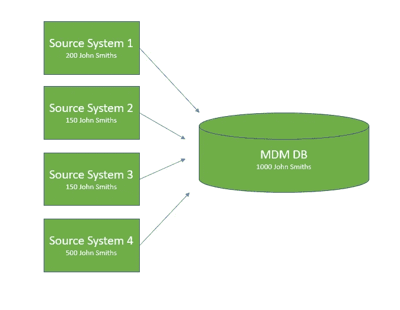
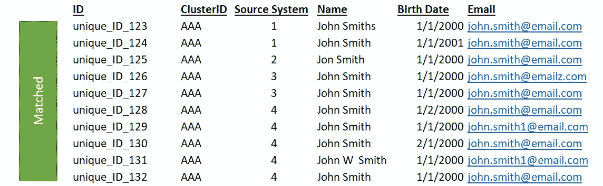
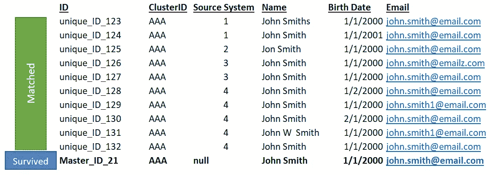

# 为什么数据治理很重要:主数据管理(MDM)

> 原文：<https://towardsdatascience.com/why-data-governance-matters-master-data-management-mdm-5d9af0f64573>

## 什么是主数据管理？

坎凯奥·维莱辛在 [Unsplash](https://unsplash.com?utm_source=medium&utm_medium=referral) 上拍摄的照片

*这是关于* [*数据治理*](/why-data-governance-matters-5385d722c4c6) *及其相关性系列的一部分。主数据管理(MDM)通常被认为是数据治理的一部分。*

# 目录

*   什么是主数据？
*   什么是主数据管理？
*   MDM 解决什么问题？
*   重复数据为什么不好？
*   MDM 是如何工作的？
*   结论

# 什么是主数据？

先从了解**主数据**开始。毕竟，这是我们的目标。

关于 [Wikipedia](https://en.wikipedia.org/wiki/Master_data) : *主数据的定义表示包含最有价值的、在整个组织中共享的一致同意的信息的业务对象。* [1]

另一个:*关于为业务交易提供上下文的业务实体的数据。* [1]

有点模糊对吧？这是一个很难定义的术语。以下是一些被视为“主”数据的示例:

*   客户
*   制品
*   服务
*   供应商

如果你没有得到它，不要担心，随着我们继续前进，它会变得有意义。

# 什么是主数据管理？

用我自己的话来说，我将 MDM 描述为“试图确保主数据是独特的，并且具有最小的质量问题”

Wikipedia: *主数据管理(MDM)是一门技术支持的学科，其中业务和信息技术共同确保企业官方共享主数据资产的统一性、准确性、管理性、语义一致性和责任性。[2]*

我认为真正理解 MDM 的唯一方法是首先理解它要解决的问题。但希望这些定义至少模糊地设置了舞台。

# MDM 解决什么问题？

MDM 旨在解决**重复的主数据。**

这里的主要思想是在整个企业中存在主数据的重复记录。例子包括:

*   具有不同地址和电话号码的同一客户的多个实例，等等。
*   多个版本的产品名称相同，但属性不同。或者更糟的是，多个属性相同但名称略有不同的产品
*   名称相同但属性不同的多个供应商

让我们看看一个虚构的汽车修理店“汽车修理 ABC”的重复客户示例。

*   Ben 在 Car Repair ABC 有一个现有帐户，但他意外地用不同的电子邮件打开了另一个会员帐户。这导致了他们系统中的两个 Ben 实例。这是一个由于内部控制限制而创建重复记录的例子。
*   ABC 公司的广告部有自己的数据库，其中包含当前客户和潜在客户。该数据库与销售、会计等客户记录没有一对一的匹配。*这是一个由于企业内部孤立/分割的源系统流程而存在重复记录的例子。*
*   并购:汽车维修 ABC 收购了一家较小的汽车商店。如果 Sally 在合并前在两家商店都有帐户，则合并后可能会有多个 Sally 实例。*这是一个与 M & A 相关的重复的例子。*

这些是重复数据的几个基本示例。重要的是要记住，这个问题不仅仅是客户数据的问题。同样的原则也适用于产品、服务、员工或任何其他[主数据](https://en.wikipedia.org/wiki/Master_data)。

# 重复数据为什么不好？

有了这些重复的数据，越来越难知道什么是真的，什么是假的。我们的客户到底是谁？我们的产品是什么？

> “在一个又一个案例研究中，重复的主数据与错过的收入、利润和效率机会联系在一起…在传统的架构环境中，数据没有集成，因此无法在所有应用程序中唯一地识别和一致地描述客户，或者在整个公司范围内统一跟踪产品。缺乏这种数据凝聚力的组织不可能认识到他们业务的总价值”——Val Lovicz*【3】*

此外，如果没有治理主数据的基础，数据科学家获得洞察力或创建模型的能力就会受到限制。如果重复使我们的结论不准确，客户回归模型会带来什么样的价值？

# MDM 是如何工作的？

第一步是在一个新的地点创建唯一的主记录，一个真实的单一来源。假设在所有不同的企业源系统中有 1000 个“John Smith”的实例。有多少独一无二的“约翰·史密斯”，多少是重复的？这就是 MDM 要解决的问题！

MDM ETL 流程的高级视图——将特定类型主数据的所有实例集中到一个地方。(图片来自作者)

在将所有的源记录编译到一个数据库中，并为每个实例指定惟一的 id 之后，会发生两个步骤:匹配和存活。

**匹配**:这里的基本概念是有一个算法可以遍历所有的记录(在我们的例子中，是 1000 个约翰·史密斯)。然后，它将创建约翰·史密斯的聚类，它认为这些聚类是同一个人。这些聚类是通过一系列逻辑匹配规则来确定的，这些规则将某些共享属性置于其他属性之上。例如，规则可以将出生日期的匹配优先于电子邮件的匹配。

匹配算法已经确定 John Smith 的这 10 个实例(来自我们的 mdm db 的 1000 个实例)都是同一个人的副本(图片来自作者)

**存活**:通过匹配过程形成 John Smith 的聚类后，下一步是选择每个聚类共享的最强的属性，并将这些属性“存活”到一个主记录中。

底部新的“幸存”黄金记录在所有记录中提取了最强的实例，在群集内，形成这个特定“John Smith”的最准确、唯一的实例(图片来自作者)

即使有几个实例不一致(例如，姓名“Jon Smith”或电子邮件“john.smith@emailz.com”)，最强的属性仍保留在底部加粗的主记录中。“最强”属性由每个集群中的大多数实例共享，或者由生存配置中更细微的逻辑规则决定。

# 结论

MDM 是数据治理的重要组成部分，几乎每个大型企业都使用它。这是数据分析师/科学家在职业生涯中应对各种数据环境时需要了解的一个基本概念。

我建议查看下面的资料来源中列出的文章，Val Lovitz 的“超越匹配”,通过更全面的示例进一步了解匹配是如何工作的。

希望这篇文章对那些坚持到最后的人有所帮助。干杯！

考虑通过我的推荐链接加入 Medium:【https://andrewhershy.medium.com/membership 

# 来源

[1] [主数据—维基百科](https://en.wikipedia.org/wiki/Master_data)

[2] [MDM —维基百科](https://en.wikipedia.org/wiki/Master_data_management#Drivers_for_master_data_management)

【3】[超越匹配](https://profiseecom.z13.web.core.windows.net/Resources/White_Papers/Beyond_Matching_GRM.pdf) —瓦尔·洛维茨