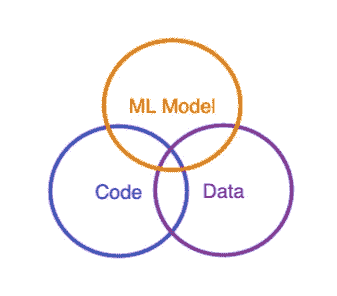

# 为什么人们说将一个 ML 模型部署到生产中如此困难？

> 原文：<https://towardsdatascience.com/why-do-people-say-its-so-hard-to-deploy-a-ml-model-to-production-814548d446b5>

## 多方面的变化给 ML 服务带来了特殊的挑战

丹·洛马尔在 [Unsplash](https://unsplash.com/photos/WajTuzeanUk) 上拍摄的照片

你已经听到过这样的说法，你已经听到过这样的文字，你已经听到过分析师和供应商在屋顶上唱着这样的话: [87%的数据科学项目从未投入生产](https://venturebeat.com/2019/07/19/why-do-87-of-data-science-projects-never-make-it-into-production/)。

这是为什么呢？

当然，这要视情况而定，但更准确的答案是构建 ML 服务比构建其他类型的软件更复杂。虽然 ML 应用程序与传统的软件和数据工程项目有许多相同的复杂性，但是 ML 引入了一个新的工件，增加了一层复杂性:模型本身。

我是这样开始思考的:

*   在传统的软件工程中，你主要关心的是**代码**。
*   在数据工程中，你主要关心的是**代码**和**数据**。
*   在 ML 工程中，你主要关心的是**代码、**数据、和**模型**。

图片作者[作者](https://www.linkedin.com/in/timliu9/)

也不仅仅是我。在最近的一篇文章中，软件思想领袖马丁·福勒分享了为什么 ML 服务如此复杂:

> “除了代码之外，对 ML 模型和用于训练它们的数据的更改是另一种类型的更改，需要管理并融入软件交付过程。”

在本文中，我将深入探讨您需要了解这三个组件中的每一个以及它们如何相互作用，并提供一些管理它们以部署您的模型的技巧和建议。

# 维度 1:代码

代码在 ML 应用程序中的角色本质上是“粘合剂”,它:

*   公开一个 API
*   转换数据以提取适当的特征
*   使用模型进行推理
*   整合业务逻辑

在很大程度上，它是一个相当已知的量，并具有确定性。换句话说，给定相同的输入，它将产生相同的输出。即使你的代码是有状态的(不推荐)，我也认为“状态”是输入的一部分。

以下是您在管理 ML 服务代码时可能面临的几个挑战:

# 对代码的更新会导致回归

特征提取代码通常由数据科学家编写。当需要创建 API 时，开发人员需要将代码从培训环境迁移到预测服务。此外，他们可能必须将服务的输入(可能是一个 REST 请求)转换成可用的数据。开发人员和数据科学家绝对希望更新这些代码，因为他们对服务进行迭代，这可能会导致回归。

**温馨提示:**

*   除非有令人信服的理由，否则不要使用 Python 创建模型服务。大多数数据科学家使用 Python。它使部署过程更加简化。根据我的经验，用户在重新部署一个新模型时会从“几周/几个月”减少到几天。有些团队需要高得离谱的性能，宁愿把所有代码都转换成 Rust/Go。大多数人不知道。对了，AWS Sagemaker 是用 Python 写的。
*   请记住，即使在 Jupyter 笔记本上也要实施良好的编码实践。你会惊讶地发现，什么样的代码最终会进入生产环境。

# 依赖性更新可能会产生不可预见的后果

预测服务中的依赖项非常重要，因为如果没有精确配置，不仅代码的行为可能与预期不同，模型本身也可能做出与定型环境不同的预测。为了使服务正确运行，应该使用 ML 库、运行时和依赖项的正确版本。也就是说，依赖关系必须不时更新，以至少跟上安全补丁。

提示:确保您使用的 Python 和 ML 库的版本与用于训练模型的版本相同。您可以使用“pip 冻结”来确定您正在使用的版本。

# 部署环境可能不稳定

可伸缩预测服务需要适当的环境才能正确运行代码。例如，特定的 ML 库只能在特定的 OS 发行版上运行。Docker 是配置可再现环境的标准，但是为 ML 用例配置 Docker 可能极具挑战性。如果配置正确，它将为您提供一个干净的工件，您可以从中部署到许多不同的服务，并提供在本地运行服务的能力，以便您可以在出现问题时进行调试。

**温馨提示:**

*   确保 Docker 映像(或相关的运行时)公开了服务的健康、文档和监控端点。
*   对于 GPU 支持，使用 [Nvidia 的 docker image](https://hub.docker.com/r/nvidia/cuda) ，它为 GPU 工作负载提供了一个良好的开箱即用基础。相信我，你不会想在“cuda 地狱”里结束的

# 维度 2:数据

一旦您解决了与管理代码相关的关键挑战，就该查看数据了。

**数据**在某种程度上是确定性的，但是花费了数年时间来构建数据管道，很难知道你将接收什么类型的数据和多少数量的数据。你会一直感到惊讶。出于这个原因，我会说数据是拼图中最易变的一块。

一旦您的服务投入生产，就无法知道数据将如何随时间变化——这是否意味着突然收到坏数据，或者只是随着用户行为的改变而经历数据的变化。虽然数据变化通常无法预测，但您仍然可以通过某些策略来管理它。

# 数据可能会漂移并导致服务质量下降

随着时间的推移，数据的变化可能会导致各种问题:模型可能会产生不太准确的预测或根本无法执行。数据漂移，或生产输入数据的变化，可能发生在久而久之或随着季节的变化。重要的是要知道它是否正在发生，以便您可以在必要时重新培训您的模型。

**温馨提示:**

*   经常快速部署会让您对自己的渠道更有信心。不仅如此，它还有其他好处，如防止因输入数据漂移而出现问题。
*   使用 ML 专用监控工具，如 [WhyLabs](https://whylabs.ai/) 、[显然，ai](https://evidentlyai.com/) 或 [Aporia](https://www.aporia.com/) 可以帮助检测数据漂移和监控性能。

模型性能也可以改变久而久之，但可能更难以监控，因为它需要您将预测与下游结果结合起来。例如，将 ML 驱动的产品推荐和产品是否被消费者实际购买之间的点连接起来。

**提示:**监控性能通常包括与下游指标相结合。确保将您的推理结果发送到与您想要连接的指标相同的地方(可能是一个数据仓库)。

# 坏数据会中断服务

API 是一个强大的构造，因为它向外界公开了功能。这意味着您不太可能控制向您的服务发送什么。意外数据和不正确的数据一样糟糕，很可能在某个时候您的服务会同时收到这两种数据。尽量确保这不会削弱你的系统。

**提示:**使用像 [Pydantic](https://pydantic-docs.helpmanual.io/) 这样的数据验证框架来验证传入的数据，这样它就不会意外地中断您的服务。

# 需要新数据来验证新模型

随着生产中数据的变化，您可能不需要冒险部署新的模型。因此，用您仍在验证的模型来测试生产数据会很有帮助。获取生产数据可能很困难，因为生产环境通常部署在安全的环境中。

**提示:**使用像 Istio 或 AWS App Mesh 这样的服务网格可以帮助分散生产流量，并帮助使用[影子管道](https://istio.io/latest/docs/tasks/traffic-management/mirroring/)验证新模型。

# 维度 3:模型

最后一个维度当然是模型本身。

我认为**模型**是一个确定性函数，尽管它是三维空间中最黑的一个。这类似于阅读“意大利面条代码”的体验，即使是最有经验的工程师也无法理解:一个经过训练的模型由复杂的向量组成，这些向量本身就非常难以理解，但给定一个特定的输入，输出对于模型的给定版本应该总是相同的。

模型可能会发生变化，因为数据科学家正在迭代模型性能，或者正在自动重新训练模型，以保持模型使用最新数据进行训练。一个模型在生产的过程中有很多机会崩溃。

# 模型可能很难复制

ML 框架有不同的方法来保存模型，以确保预测的可重复性。根据保存模型的方式，可能是序列化 Python 类，也可能只是保存模型的权重。这两种方法都可能无法重现模型，这取决于训练环境的上下文。如果模型保存不正确，那么它可能会在生产中产生不稳定的预测。

**提示:**保存模型时要做好调查，确保这是推荐的保存方式。例如， [Pytorch 拥有文档](https://pytorch.org/tutorials/beginner/saving_loading_models.html)，它解释了根据您的上下文来保存模型的各种方法。

# 人和系统之间的交接可能很复杂

保存模型可能会产生多个包含模型权重和相关元数据的文件。所有这些都是再次实例化模型所必需的。您将希望将这些工件移动到一个集中的位置，在那里自动化部署管道可以将模型交付到生产中。

问题是生产 CI/CD 管道可能位于云中的安全环境中。设计一个从数据科学家的笔记本电脑(或远程培训环境)到生产的安全、简化的系统可能会很复杂。

提示:试着找到一个标准，你可以用它来协调模特培训和模特服务。像 [MLFlow](https://github.com/mlflow/mlflow) 、 [BentoML](https://github.com/bentoml/BentoML) 、 [TFServing](https://github.com/tensorflow/serving) 和 [Cortex](https://github.com/cortexproject/cortex) 这样的工具有助于将模型协调到模型注册中心，并最终到达部署的目的地。例如，使用 MLFlow 管理您的实验和培训，使用 BentoML 管理模型服务和部署。

# 你可能会意外失去优秀的模特

为了回滚坏的更新或者调试工作模型，持久化模型的各种版本是极其重要的。您甚至可能想要在生产中运行多个模型版本(称为 A/B 测试),以便衡量哪个模型运行得最好。更复杂的部署可以运行模型版本实验，如" [multi-arm bandit](https://en.wikipedia.org/wiki/Multi-armed_bandit) "可以对模型进行实时评分，并将更多流量导向最佳模型。

**提示:**像 S3 或谷歌云存储这样的工具可以作为共享模型存储库，数据科学家和开发人员可以使用它来共享模型，这是一个很好的解决方案。

# 结论

拥有三个不同且不断变化的维度所带来的复杂性并不小，尤其是考虑到开发过程通常涉及多个利益相关者。我们仍然处于开发最佳实践的早期，因为操作 ML 项目是一个如此新的领域。随着更多的工具和从业者进入这个市场，毫无疑问，最佳实践将开始出现，就像它们在传统软件、DevOps 甚至数据工程中出现的那样。

[正如吴恩达所说](https://www.deeplearning.ai/wp-content/uploads/2021/06/MLOps-From-Model-centric-to-Data-centric-AI.pdf)，这些 MLOps 工具和流程的目标是让“人工智能成为一个高效而系统的流程”我们越能简化这些过程，公司就越能从 ML 中获益。