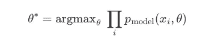
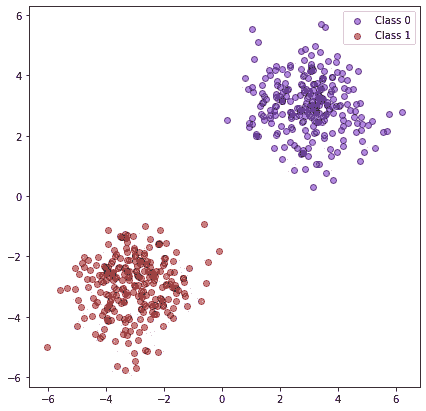
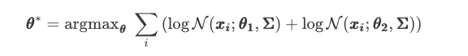
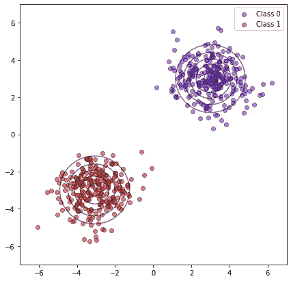
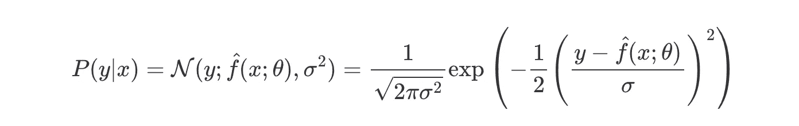
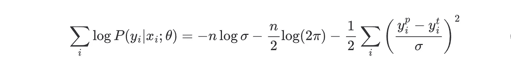
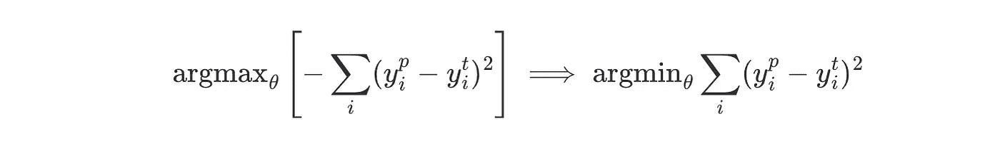

# 为什么我们要最小化均方差？

> 原文：<https://towardsdatascience.com/why-do-we-minimize-the-mean-squared-error-3b97391f54c>

## 你有没有想过为什么我们要最小化平方误差？在这篇文章中，我将展示最著名的损失函数背后的数学原因。


彼得·塞坎在 [Unsplash](https://unsplash.com?utm_source=medium&utm_medium=referral) 上拍摄的照片。最小化平方误差就像试图到达谷底。

学习机器学习时首先遇到的话题之一是线性回归。它通常被认为是回归的最简单算法之一。就我而言，当我学习线性回归时——早在我攻读物理学学位的时候——有人告诉我，线性回归试图找到最小化数据平方距离之和的直线。数学上这是 *y_p=ax+b* ，其中 *x* 是将用于预测 *y_t* 的独立变量， *y_p* 是相应的预测， *a* 和 *b* 是斜率和截距。为了简单起见，让我们假设 x∈R 和 y∈R 分别为 T16 和 T17 和 T18。我们想要最小化的量——也就是损失函数——是


MSE 损失函数

这种损失背后的直觉是，我们希望惩罚更多的大错误，而不是小错误，这就是为什么我们要平方错误项。对于损失函数的这种特殊选择，10 个 1 单位的误差比 1 个 10 单位的误差更好，在第一种情况下，我们将损失增加 10 个平方单位，而在第二种情况下，我们将损失增加 100 个平方单位。

然而，虽然这很直观，但似乎也很武断。为什么使用平方函数，而不使用指数函数或任何其他具有类似属性的函数？答案是这个损失函数的选择没有那么随意，可以从更根本的原理推导出来。我给你介绍一下*最大似然估计*！

# 最大似然估计

在这一节中，我将介绍最大似然估计，这是我在机器学习中最喜欢的技术之一，我将展示我们如何将这一技术用于统计学习。

# 基础

首先是一些理论。考虑一个数据集 ***X*** *={x1，…，xn}* 从分布 *p_real(x)* 独立抽取的 *n* 个数据点。我们还有分布 *p_model(θ，x)* ，它由参数 *θ* 索引。这意味着对于每个 *θ* ，我们有不同的分布。例如，可以有 *p_model(θ，x)=θ* exp()-θ* x)*，也就是指数分布。

我们要解决的问题是找到使 X 被 *p_model(θ*，x)* 生成的概率最大的 *θ** 。对于所有可能的 *p_model* 分布，这是最有可能生成 *X* 的分布。这可以形式化为


由于来自 ***X*** 的观测值是独立提取的，我们可以将等式改写为



虽然从数学的角度来看，这个方程完全没问题，但它存在一些数值问题。特别是，我们在乘以概率密度，密度有时可能非常小，所以总乘积可能会有下溢问题——即:我们无法用 CPU 的精度来表示值。好消息是，这个问题可以通过一个简单的技巧来解决:只需将 *log* 应用于乘积，并将乘积转换为总和。


由于对数是一个单调递增的函数，这个技巧不会改变 *argmax* 。

# 例子

让我们设计一个例子，看看如何在实际问题中使用这种技术。假设您有两个遵循高斯分布的数据点，或者至少这是您所怀疑的，并且您想要找到这些数据点的最可能的中心。



点由两个分别以(3，3)和(-3，-3)为中心的高斯分布生成。

我们的假设是这些分布遵循一个单位协方差的高斯分布，即:***【σ****=[[1，0]，[0，1]]。*因此，我们要最大化



其中***θ****=(****θ_****1、****θ_****2)*和***θ_****1**θ_****2*是中心

根据 MLE，使用下面的片段可以得到最合理的中心

```
**from** scipy.optimize **import** minimize
**import** numpy **as** np
**class** **ExampleMLE**:
    **def** **__init__**(self, x1, x2):
        self.x1 **=** x1
        self.x2 **=** x2
    **def** **loss**(self, x):
        mu1 **=** (x[0], x[1])
        mu2 **=** (x[2], x[3])
        log_likelihood **=** (**-** 1**/**2 ***** np.sum((self.x1 **-** mu1)******2) 
                          **-** 1**/**2 ***** np.sum((self.x2 **-** mu2)******2))
        **return** **-** log_likelihood *# adding - to make function minimizable
# x1 and x2 are arrays with the coordinates of point for blob 1 and 2 respectively.* p **=** ExampleMLE(x1**=**x1, x2**=**x2) 
res **=** minimize(p.loss, x0**=**(0, 0, 0, 0))
**print**(res.x)
```

在下图中，我们可以看到最合理的最大似然生成分布。在这种特定情况下，真正的中心在`(3, 3)`和`(-3, -3)`中，最优发现值分别是`(3.003, 3.004)`和`(-3.074, -2.999)`，因此该方法似乎是可行的。



最大似然法找到的最优高斯分布的原点和等高线图。

# 使用最大似然法进行预测

在上一节中，我们已经看到了如何使用 MLE 来估计分布的参数。但是同样的原理可以推广到预测给定 *x* 的 *y* ，利用条件概率*P(****Y****|****X****；θ)* 。在这种情况下，我们想要估计我们的模型的参数，在给定 *x* 的情况下更好地预测 *y* ，这是


使用和以前一样的技巧


现在，产生真实数据的过程可以写成 *y=f(x)+ϵ* ，其中 *f(x)* 是我们要估计的函数， *ϵ* 是过程的固有噪声。这里我们假设 *x* 有足够的信息来预测 *y* ，再多的额外信息也无法帮助我们预测噪声 *ϵ* 。一个常见的假设是这种噪声是正态分布的，即: *ϵ∼N(0,σ )* 。这种选择背后的直觉是，即使知道描述系统的所有变量，你总会有一些噪声，而这种噪声通常遵循高斯分布。例如，如果你取同一个城镇中所有相同年龄的女性的身高分布，你会发现一个正态分布。

因此，对于我们的情况，条件概率的一个好选择是



其中 *f^(x)* 是我们的模型，由 *θ* 索引。这意味着我们的模型 *f* 将预测高斯的平均值。

现在把条件概率代入我们想要最大化的方程，我们得到



其中 *y_ip* 是输入 *x_i* 的回归模型的输出。请注意， *n* 和 *σ* 都是常量值，因此我们可以将它们从等式中去掉。因此，我们想要解决的函数是



这相当于最小化平方误差损失！

但是为什么呢？我们在损失函数背后的直觉是，它惩罚大的小的错误，但是这与条件概率和正态分布有什么关系呢？关键是极值在正态分布中不太可能出现，所以它们会对可能性产生负面影响。例如，对于*p(x)= N(x；0，1)* 、*log⁡p(1)∶1.42*，而*对数⁡p(10)≈−50.92* 。因此，在最大化可能性时，我们将首选避免极值*(y _ t*-*y _ p)*的 *θ* 值。那么问题*的答案是为什么我们应该最小化 MSE？*是*，因为我们假设噪声呈正态分布。*

# 结论

我们刚刚看到，最小化平方误差不是一个任意的选择，而是有理论基础的。我们还看到，它来自于假设噪声呈正态分布。我们在这篇文章中研究的同样的过程可以用来获得多种结果，例如，方差的无偏估计、维特比算法、逻辑回归、机器学习分类等等。

这个故事最初发表在这里:[amolas.dev/posts/mean-squared-error/](https://www.amolas.dev/posts/mean-squared-error/)