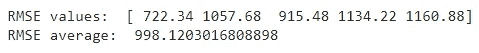

# 我们为什么要在机器学习模型中设置随机状态？

> 原文：<https://towardsdatascience.com/why-do-we-set-a-random-state-in-machine-learning-models-bb2dc68d8431>

## 随机状态=42


图片来自 [Pixabay](https://pixabay.com/?utm_source=link-attribution&utm_medium=referral&utm_campaign=image&utm_content=4879559) 的 [aalmeidah](https://pixabay.com/users/aalmeidah-4277022/?utm_source=link-attribution&utm_medium=referral&utm_campaign=image&utm_content=4879559)

你可能已经在你的机器学习模型中使用了 ***随机状态*** 。你知道 ***随机状态*** 是一个模型超参数，用来控制机器学习模型中涉及的随机性吗？

在 Scikit-learn 中，随机状态超参数用`random_state`表示。它通常采用下列值之一。

*   **无:**这是默认值。这允许函数使用来自`np.random`的全局随机状态实例。如果你用`random_state=None`多次调用同一个函数，这个函数在不同的执行中会产生不同的结果。
*   **int:** 我们可以用整数来表示`random_state`。是啊！我们可以使用包括 0 在内的任何整数，但不能使用负数，只能使用正整数。最流行的整数是 0 和 42。当我们对`random_state`使用整数时，该函数将在不同的执行中产生相同的结果。只有当我们改变整数值时，结果才会改变。

# 使用随机状态——一个经典的例子

下面我们用一个例子来看看 ***随机态*** 是如何工作的。为此，我们使用 Scikit-learn 的 **train_test_split()** 函数和 **LinearRegression()** 函数。 **train_test_split()** 函数用于将数据集分成训练集和测试集。默认情况下，该函数在分割前会对数据进行混洗(使用`shuffle=True`)。 **train_test_split()** 函数中的随机状态超参数控制洗牌过程。

有了`random_state=None`，我们在不同的执行中得到不同的训练和测试集，洗牌过程失去了控制。

使用`random_state=0`，我们在不同的执行中得到相同的训练和测试集。使用`random_state=42`，我们在不同的执行中得到相同的训练和测试集，但是在这一次，训练和测试集与之前使用`random_state=0`的情况不同。

训练集和测试集直接影响模型的性能得分。因为我们在 **train_test_split()** 函数中为`random_state`获得了具有不同整数值的不同训练和测试集，所以随机状态超参数的值间接影响了模型的性能得分。

现在，请看下面的代码。

**随机状态超参数的影响**(作者代码)

现在，我们为`random_state`尝试整数值 0、35 和 42，并重新执行上述代码三次。我们会得到以下结果。

*   对于`random_state=0`，我们得到 909.81 的 RMSE。
*   对于`random_state=35`，我们得到 794.15 的 RMSE。
*   对于`random_state=42`，我们得到 824.33 的 RMSE。

根据随机状态超参数中使用的整数值，我们得到模型的三个显著不同的 RMSE 值。

现在，有一个明确的问题。我们接受什么样的价值观为正确的 RMSE 价值观？我们不接受任何单一的价值。相反，我们得到这些 RMSE 值的平均值。最好尽可能多地(例如 10 次)重新执行上述代码，并获得平均 RMSE。手动做这个很无聊。相反，我们可以使用 sci kit-learn**cross _ val _ score()**函数来自动完成这项工作。

**执行交叉验证以获得平均 RMSE** (作者代码)



**交叉验证结果**(图片由作者提供)

# 使用随机状态的其他流行的机器学习算法

**train_test_split()** 函数是一个使用随机状态的经典例子。除此之外，下面的机器学习算法包括随机状态超参数。

*   **k means():**k means 算法中的`random_state`控制质心初始化的随机数生成。更多详情，请看[我写的这篇文章](https://medium.com/mlearning-ai/k-means-clustering-with-scikit-learn-e2af706450e4)。
*   **RandomizedSearchCV():**RandomizedSearchCV 函数中的`random_state`控制在不同执行中获取超参数组合样本的随机化。更多详情，请看[我写的这篇文章](/python-implementation-of-grid-search-and-random-search-for-hyperparameter-optimization-2d6a82ebf75c)。
*   **DecisionTreeRegressor()** 或**DecisionTreeClassifier():**这些算法中的`random_state`通过搜索最佳特征来控制节点分裂过程中涉及的随机性。它将定义树结构。
*   **RandomForestRegressor()**或**RandomForestClassifier():**这些算法中的`random_state`控制两个随机过程——在创建树时引导样本，以及在创建每棵树的节点分裂过程中获取随机特征子集以搜索最佳特征。更多详情，请看[我写的这篇文章](/random-forests-an-ensemble-of-decision-trees-37a003084c6c)。
*   **椭圆包络():**椭圆包络函数中的`random_state`决定了用于混洗数据的随机数发生器。更多细节，请阅读我写的这篇文章。

# 何时使用随机状态

以下几点给出了“我们为什么要在机器学习模型中设置随机状态”这个问题的答案—今日话题。

我们通常在机器学习模型中使用随机状态，原因如下。

*   **一致性:**有时，我们需要模型的不同执行之间的一致结果。当我写数据科学教程时，我总是为机器学习模型中的随机状态设置一个整数值。这是因为我需要在不同时间运行模型时得到相同的结果，并且我希望您在试用我的代码时得到相同的结果。
*   **实验目的:**有时候，我们手动调优我们的模型。在这些情况下，我们希望保持所有其他的超参数，包括随机状态常数，除了我们正在调整的那个。为此，我们可以为机器学习模型中的随机状态设置一个整数。
*   **提高模型性能:**有时，您可以通过使用不同的随机状态多次运行您的模型来获得显著的性能提高。这是因为`random_state`也是一个超参数，我们可以调整它以获得更好的结果。这在编写教程和参加机器学习竞赛时非常有用。但是不建议在生产环境或其他类似的实际场景中使用这种方法，在这些场景中，准确度分数的微小变化都会严重影响最终结果。

# 何时不使用随机状态

这是一个令人困惑的问题。当您没有为随机状态超参数指定一个整数时，默认的`None`总是在后台应用。`None`允许函数使用来自`np.random`的全局随机状态实例。这也是模型所依赖的一种单随机状态！

换句话说，不指定随机状态并不意味着函数不使用随机状态。它使用一个由 NumPy 随机状态实例定义的。

这要危险得多，在生产环境、医疗领域等现实生活场景中应该避免。作为一个解决方案，我们可以通过做[交叉验证](/k-fold-cross-validation-explained-in-plain-english-659e33c0bc0)来得到平均值，就像我之前讨论的那样。

# 摘要

不同类型的随机化任务涉及机器学习模型和其他相关功能。当分割数据集、分割决策树或随机森林中的节点、初始化聚类中的质心时，会发生随机化。随机状态超参数用于控制机器学习模型中涉及的任何此类随机性，以获得一致的结果。

我们可以使用交叉验证来减轻机器学习模型中涉及的随机性的影响。

随机状态超参数直接控制不同函数的多种类型的随机性。

```
from sklearn.model_selection import train_test_split
from sklearn.ensemble import RandomForestRegressorX_train, X_test, y_train, y_test = train_test_split(**random_state=42**)rf = RandomForestRegressor(**random_state=42**)
```

即使我们对两个随机状态使用了同一个整数，每个函数的随机性也是独立控制的。互不影响。

今天的帖子到此结束。

如果您有任何问题或反馈，请告诉我。

我希望你喜欢阅读这篇文章。如果你愿意支持我成为一名作家，请考虑 [***注册会员***](https://rukshanpramoditha.medium.com/membership) *以获得无限制的媒体访问权限。它只需要每月 5 美元，我会收到你的会员费的一部分。*

[](https://rukshanpramoditha.medium.com/membership)  

非常感谢你一直以来的支持！下一篇文章再见。祝大家学习愉快！

## 接下来阅读(推荐)——我写的！

通过例子学习如何做交叉验证。

[](/k-fold-cross-validation-explained-in-plain-english-659e33c0bc0)  

了解随机森林如何在幕后工作，以及随机森林中涉及的两种随机性。

[](/random-forests-an-ensemble-of-decision-trees-37a003084c6c)  

了解参数和超参数之间的区别。

[](https://rukshanpramoditha.medium.com/parameters-vs-hyperparameters-what-is-the-difference-5f40e16e2e82)  

特别感谢 Pixabay 上的 [aalmeidah](https://pixabay.com/users/aalmeidah-4277022/) ，为我提供了这篇文章的封面图片。请注意，我稍微编辑了图像。

[鲁克山·普拉莫蒂塔](https://medium.com/u/f90a3bb1d400?source=post_page-----bb2dc68d8431--------------------------------)
**2022–04–30**