# 为什么我们在深度学习中使用交叉熵——第二部分

> 原文：<https://towardsdatascience.com/why-do-we-use-cross-entropy-in-deep-learning-part-2-943c915db115>

## 解释人工神经网络中最广泛使用的损失函数之一

> **注**。这是第一部分的延续:[为什么我们在深度学习中使用交叉熵——第一部分](https://medium.com/towards-data-science/why-do-we-use-cross-entropy-in-deep-learning-part-1-e787f885c1c)

*熵*、*交叉熵*、*二元交叉熵、*和 C *分类交叉熵*是深度学习中的关键概念，也是用于构建神经网络的主要损失函数之一。都来源于同一个概念:**熵**，这个概念你可能从物理和化学上比较熟悉。然而，没有多少课程或文章深入解释这些术语，因为正确地解释它们需要一些时间和数学知识。

在第一篇文章中，我提出了三个不同但相关的熵概念，以及熵公式的来源。然而，仍然有一个关键概念需要解决，因为深度学习不使用熵，而是使用它的近亲，称为**交叉熵**。这个术语是什么意思，如何解读，应用在哪些深度学习问题上，是本帖的重点。

由 [mahdis mousavi](https://unsplash.com/@dissii?utm_source=unsplash&utm_medium=referral&utm_content=creditCopyText) 在 [Unsplash](https://unsplash.com/s/photos/deep-learning?utm_source=unsplash&utm_medium=referral&utm_content=creditCopyText) 上拍摄的照片

# 交叉熵

回想第一篇帖子([链接](https://medium.com/towards-data-science/why-do-we-use-cross-entropy-in-deep-learning-part-1-e787f885c1c))，熵公式可以解释为 ***一条编码消息的最优平均长度*** 。

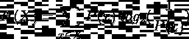

使用二进制编码(对数基数为 2)的离散随机变量 X 的熵公式。图片由作者提供。

> **注 1** 。回想一下上一篇文章，对数的底并不重要，因为改变对数的底相当于乘以一个常数。这只适用于优化和比较方法，其中常量被忽略。

作为熵的替代，**交叉熵**被定义为随机变量 *X* 的熵，使用概率分布*P(X)*编码，但是使用不同的概率分布 *Q(x)* 来计算平均值。

换句话说，**一个随机变量 *X* 分布为 *Q(x)* ，但是使用分布 *P(x)的编码系统，它的最佳平均消息长度是多少？***

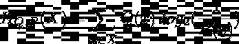

使用二进制编码的交叉熵公式(log_2)。图片由作者提供。

> **注 2** 。定义交叉熵的另一个常用符号是 H(Q，P)。然而，为了保持符号与熵公式一致，我考虑使用子索引。

为了弄清楚，让我们举个例子。我将采用与第一篇文章相同的例子，但请记住，它适用于任何离散随机变量。

在这个例子中，我们正在研究对我们的实验室实验进行编码的最佳平均长度，这可能导致 6 种不同的结果( ***微状态*** ):微状态 1 (M1)、M2、…、M6。
现在让我们假设我们有一些参数 ***K*** 可以在我们的实验中修改，这样当我们使用 *K* 的不同组合时，我们可以获得结果(微观状态)的不同概率分布

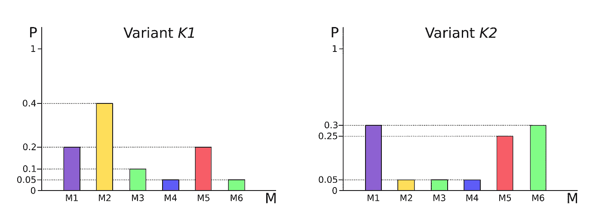

变体 K1 和变体 K2 的实验结果的概率分布。Y 轴(概率)已被缩放以提高可视化。图片由作者提供。

如我们所见，熵是概率分布的函数，即分布 *P(x)* 和 *Q(x)* 的熵不必相同。原因在于，为了计算熵，我们已经将每个结果的相应概率设置为成本值(详细解释参见第一部分的熵公式一节)，换句话说，**P(x)的编码不一定与 Q(x)** 的编码相同。虽然两种情况下 *X* 是同一个随机变量，但改变的是它的分布。

现在出现了下面的困境:**如果我们只能使用一种编码系统来发送实验变量 K1 和 K2 的结果，那么哪种编码会更优，因此我们应该使用哪种编码？**编码 K1 还是 K2？

这个问题的解决方案是通过计算每个变量 K1 和 K2(相对于另一个变量)的熵和交叉熵，并使用编码系统 K1 和 K2 对结果进行平均以获得全局平均长度。

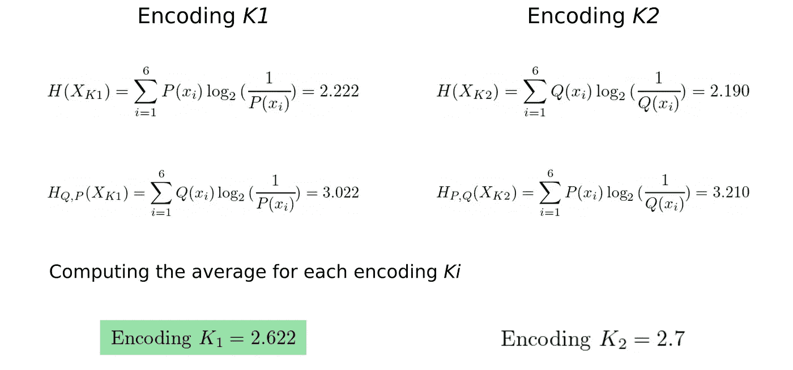

K1 和 K2 哪个编码系统更好？从顶部到底部计算两种编码的熵和交叉熵。注意，编码指的是分配给特定结果 xi 的成本 log_2(1/P(xi))。作者图片

根据计算，用于发送 K1 和 K2 变体的消息的最佳编码系统是来自 K1 的编码系统**，其产生最短的长度(2.622)。**

有人可能会认为这两种编码之间的差异并不显著，因为在处理位时，结果必须四舍五入。然而，当消息中包含的单词序列足够高时，这种差异是显而易见的。假设你的信息是一条最多 280 位的推文。使用编码 K1，你平均能够发送 280/2.622 ~ 106 个单词，而使用编码 K2，你能够交流 103 个单词(谁没有在一条推文中不能多写 3 个单词的痛苦呢？)随着你增加每条信息的字数，这种差距还会继续扩大。

> **注 3** 。再者，还有一个概念叫做[分数位](https://colah.github.io/posts/2015-09-Visual-Information/#fractional-bits)，这是一种在交流多个最优长度为十进制的单词时，最大化单词最优长度的方法。

一个重要的观察结果是交叉熵是不对称的，所以

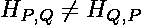

交叉熵是不对称的。作者图片

# 深度学习中的交叉熵

我们已经看到了一个如何将交叉熵应用于问题的例子，但由于深度学习对(仅仅)编码消息不太感兴趣，所以这个功能为什么、何时以及如何进入场景？

答案当然在于它的应用，那么我们来介绍一下交叉熵在深度学习中解决的问题。

## 用于分类任务的深度学习

假设您想要将心电图信号(ECM)分类为一组代表心血管疾病的不同模式。实际上，即使对于最有经验的心脏病专家来说，这也是一项非常困难的任务，因为心脏异常的模式可能非常微妙，健康人和心脏病患者之间的差异非常小。

> **注 4** 。如果你对如今如何使用深度学习解决 ECM 的分类感兴趣，请参考[这篇文章](https://www.ncbi.nlm.nih.gov/pmc/articles/PMC8802771/)。

强迫模型仅仅**预测一个从 *1* 到 *K*** *，*的整数，其中 K 是类的数量(ECM 模式)，**不是一个好的策略**。使用这个系统，我们的模型的误差将是“绝对的”，在这个意义上，我们将能够判断模型的表现是好是坏，但不能判断它的预测有多坏或多好。
假设模型预测了类别 2，但正确结果是类别 4，那么我们如何计算误差？计算正确类别和预测类别(| 4–2 | = 2)之间的距离(或 MSE)不能用作误差测量，因为这样我们就可以说预测类别 2 比预测类别 9(| 4–2 |<| 4–9 |)更好，也就是说，基于我们的人类标准，我们假设类别 2 比类别 9 更接近类别 4。此外，该方法还假设类别 3 与类别 4 的接近程度与类别 2 的接近程度相同，这在实践中是不可能评估的:鳄鱼、猫和狗有多相似？也许猫和狗是 1 个单位的相似，但那么鳄鱼和猫又有多少个单位的相似呢*猫 vs 狗*？我们不能简单地这样做，因为我们不能用猫和狗的度量单位来比较鳄鱼和猫！

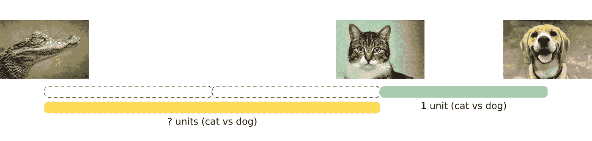

我们不能用猫和狗的对比来比较鳄鱼和猫。照片由[加埃塔诺·塞萨蒂](https://unsplash.com/ja/@gaetanocessati?utm_source=unsplash&utm_medium=referral&utm_content=creditCopyText)拍摄于 [Unsplash](https://unsplash.com/s/photos/crocodile?utm_source=unsplash&utm_medium=referral&utm_content=creditCopyText) (鳄鱼)[劳埃德·亨内曼](https://unsplash.com/@lloydhenneman?utm_source=unsplash&utm_medium=referral&utm_content=creditCopyText)拍摄于 [Unsplash](https://unsplash.com/s/photos/cat?utm_source=unsplash&utm_medium=referral&utm_content=creditCopyText) (猫) [Marliese Streefland](https://unsplash.com/@marliesebrandsma?utm_source=unsplash&utm_medium=referral&utm_content=creditCopyText) 拍摄于 [Unsplash](https://unsplash.com/s/photos/dog?utm_source=unsplash&utm_medium=referral&utm_content=creditCopyText) (狗)。由作者编辑。

另一种思考问题的方式是**概率**，其中模型将估计 ECM 呈现每个模式的概率，而不是输出 *1* 、 *2* 或 *K、* **。**

> 我们网络的输出将是所有 *K* 类的概率分布

因此，概率大于> *0.5* 的 ECM 模式将是网络在输入 ECM 信号中已经分类的模式。

> **注 5** 。这种将数据样本分配到其最可能的类别的简单而直观的假设来自于[朴素贝叶斯分类器](https://en.wikipedia.org/wiki/Naive_Bayes_classifier)的概念，在理想情况下，我们知道真实的潜在条件概率是最好的可能分类器，其中 *P(类别 k | x)* 较大(给定数据样本 x，读取属于类别 k 的概率)。

现在，为了计算误差，我们还必须为预期输出(即真实类别)定义一个概率分布，因为我们希望为正确类别定义概率 1，为其余类别定义概率 0，这与使用*一键编码*一样简单。所以 1 类会是*【1 0 0…0】*，2 类*【0 1 0…0】，*等等。

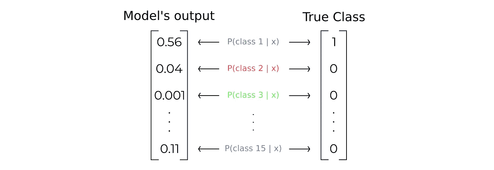

## 范畴交叉熵

在这一点上，我们已经定义了问题方法和模型输出的形式，但是我们还没有建立任何损失函数。

我们需要找到一种方法来测量模型输出和真实类别向量之间的差异，即我们需要定义**两个概率分布**之间的距离度量。

毫不奇怪，数学家们已经想到了能够解决这一需求的工具。解决方案在于[信息几何](https://en.wikipedia.org/wiki/Information_geometry)领域下的**发散**概念

*`在信息几何中，* ***散度*** *是一种统计距离:一个二元函数，它在一个统计流形上建立了从一个概率分布到另一个概率分布的分离(其中每个点代表一个概率分布的空间)(* [*维基百科*](https://en.wikipedia.org/wiki/Divergence_(statistics)) *)*

目前有不同的散度测量值([见](https://en.wikipedia.org/wiki/Statistical_distance#Divergences))，然而，其中一个非常特殊，因为它大大简化了我们的计算:kull back–lei bler 散度 **。**

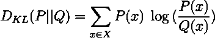

库尔贝克-莱布勒散度的数学定义。图片由作者提供。

值得注意的是，库尔贝克-莱布勒散度是不对称的:

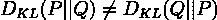

库尔贝克-莱布勒散度是不对称的。图片由作者提供。

因为我们使用 Kullback-Leibler 散度作为误差度量(概率之间的距离越大。分布模型的预测越差)，我们希望**最小化**它。

> **注 6** 。以下推导摘自[这段](https://www.youtube.com/watch?v=Pwgpl9mKars&t=210s)视频。

定义:
P* →真实类分布
P →预测模型分布
θ →模型参数
P*(y|x) →给定输入数据*x*P(y | x；θ) →在给定输入数据 *x* 和参数 *θ* 的情况下，属于 *y* 类的模型的预测概率

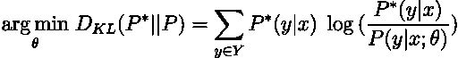

为分类问题重写的 Kullback-Leibler 散度。**请注意，求和是针对所有可能的类别** Y(在我们的 ECM 问题类别 1-15 中)，它实际上与输出概率向量一起运行。图片由作者提供。

和操作条款:

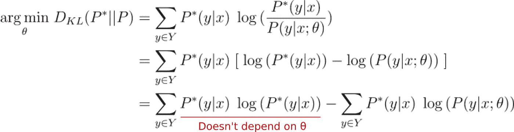

由于第一项不依赖于模型的参数(θ),我们可以将其视为常数值，因此在优化问题中可以忽略它。图片由作者提供。

最后，我们可以证明:

> 最小化 Kullback-Leibler 散度相当于最小化真实类别概率分布(P*)和预测(P)之间的交叉熵

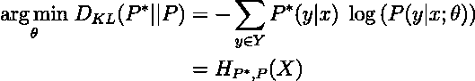

最小化 Kullback-Leibler 散度等于最小化真实类问题之间的交叉熵。分布(P*)和预测值(P)。图片由作者提供。

也就是说，**在优化问题中，交叉熵可以被视为两个概率分布之间距离的度量**。

> **注 7** 。我们也可以考虑计算 KL 散度 D_{KL}(P||P^*，因为我们知道 KL 是不对称的。然而，这样做会导致数学上的不确定性。运算这些项并去掉不依赖于θ的项后，我们得到下面描述的公式。当 P*(y|x) = 0(记住 P*(y|x)是一个热码编码向量)且 log(0)未定义时，会出现不确定性。

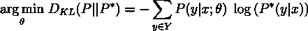

由于不确定性日志(0)，计算 KL 散度 D_{KL}(P||P^*是不可能的。图片由作者提供。

计算多个类别的交叉熵被命名为**分类交叉熵**，以区别于二元交叉熵。在深度学习库中，如 Tensorflow，已经存在一个预先构建的函数来计算分类交叉熵:

`tf.keras.losses.CategoricalCrossentropy()`

## 二元交叉熵

在前一个问题中，我们必须将一个数据点 x 分类到多个类中，但是对于只有两个类的二进制分类问题呢？

我们也可以用概率来思考这个问题。唯一的区别是，现在我们模型的输出不是一个概率向量，而是代表输入数据点 x 属于第一类的概率的单个值，因为我们可以通过应用 P(类 2) = 1-P(类 1)来计算属于第二类的概率

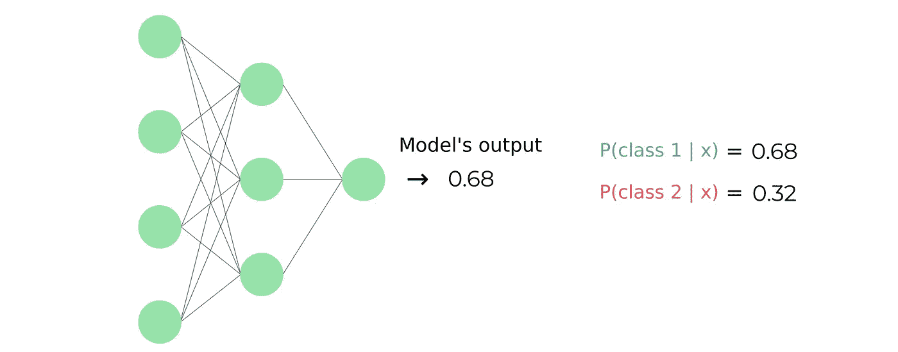

二元分类模型。**回想一下，所有可能类别的概率之和必须等于 1** 。图片由作者提供。

我们可以再次应用交叉熵公式。利用现在我们只有两个类的事实，我们可以展开求和:

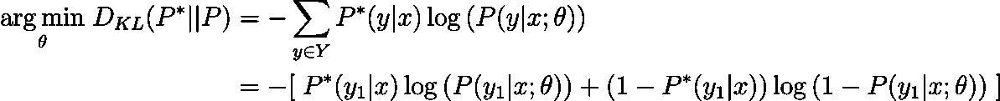

二元交叉熵的推导。因为只有 2 个类，所以满足 P(类 2) = 1-P(类 1)，其中 P(类 1) = P(y1|x)。图片由作者提供。

然而，我之前没有提到的一个事实是，损失函数通常是在一批数据点上计算的，所以平均损失是在这些点上计算的。然后，您可能会看到二进制交叉熵(BCE)为:

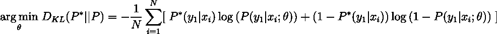

N 个数据点批次的 BCE 公式。图片由作者提供。

同样，分类交叉熵，大多数深度学习库都有一个预建的二元交叉熵函数。在张量流的情况下:

`tf.keras.losses.BinaryCrossentropy()`

# 结论

到目前为止，在这一系列的两篇文章中，我已经介绍了*熵*、*交叉熵*、*分类交叉熵*和*二元交叉熵*的直觉和形式推导，以及它们在分类问题中的应用。用几行文字总结所有内容:

*   **(Shannon)熵** =编码消息的最佳平均长度，其中公式中的对数底定义了可能的编码字符(二进制代码为 2)
*   **交叉熵** =分布为 *Q(x)* 的随机变量 *X* 的最优平均消息长度，但在优化问题中使用分布 *P(x) →* [的编码系统，可以看作是两个概率分布](#)之间距离的度量
*   **分类交叉熵** =交叉熵作为损失函数应用于多分类问题(当有两个以上的类别时)
*   **二元交叉熵** =在二元分类问题中作为损失函数应用的交叉熵(当只有两个类别时)

最后，如果你想阅读更多关于如何使用神经网络模型进行分类的内容，我推荐阅读我的文章[5 分钟内 Sigmoid 和 SoftMax 函数](https://medium.com/towards-data-science/sigmoid-and-softmax-functions-in-5-minutes-f516c80ea1f9?source=user_profile---------3----------------------------)，其中我解释了用于输出多类和二元问题中概率分布的两个激活函数。

 