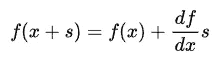
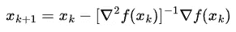
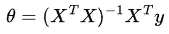

# 机器学习中为什么要用梯度下降进行优化？

> 原文：<https://towardsdatascience.com/why-do-we-use-gradient-descent-for-optimization-in-machine-learning-19428760a7ed>

## 选择计算优化技术

马里乌斯·哈克斯塔德在 [Unsplash](https://unsplash.com?utm_source=medium&utm_medium=referral) 上的照片

我注意到，大多数机器学习指南都直接进入梯度下降，而没有探索为什么我们实际上使用这种方法来优化我们的模型。从数学的角度来看，这似乎很奇怪。梯度下降依赖于梯度的知识来“滑下斜坡”，但在学校，当我们想找到一个函数的最小值，其梯度可以计算，我们通常不应用梯度下降。相反，我们只是通过直接求解梯度为 0 时，解析地找到最小值。那么，为什么当我们转向计算机领域时，我们会突然改变策略并使用迭代技术呢？此外，为什么我们使用梯度下降，而不是，例如，牛顿下降，其他流行的迭代优化技术？

# 牛顿下降

首先给不熟悉的人介绍一下牛顿下降法。这扩展了对函数使用线性近似的思想。考虑寻找 **x** 使得 **f(x)=0** 的问题。让我们构建一个线性近似:

作者图片:线性函数逼近

让我们挑选 **x_k** 和 **x_{k+1}** 来求解 **f(x)=0** 的线性近似:

作者图片

现在，我们需要切换到优化框架。我们想要一个算法，收敛到梯度为 0 的驻点。所以如果我们用函数项代替梯度项，我们可以得到最终的牛顿下降公式:

图片作者:牛顿后裔

# 梯度下降与分析优化

相比解析优化，我们使用梯度下降优化模型的主要原因是它通常更快！解析解通常需要复杂的线性代数运算，例如矩阵求逆，这在大规模计算时计算成本非常高，并且可能在数值上不稳定。

为了演示这一点，我们将使用简单的 OLS 线性回归作为例子。在这种情况下，给定输入观测值矩阵、 **X** 和目标向量 **y** ，线性 OLS 解为:

作者图片:线性 OLS 解析解

不过这里要注意的关键是方阵求逆，它的时间复杂度为 **O(n )** ，其中 n 是特征的数量**。**因此，这对于机器学习中经常遇到的更大的问题来说并不是很适用👎。

同时，计算梯度下降中使用的梯度要简单得多，计算机可以非常快速地运行这些计算数千次，即使是在更大的范围内👍。

# 梯度下降 vs 牛顿下降

现在，让我们继续比较梯度下降和牛顿下降，这两种算法都是迭代优化算法。起初，牛顿血统看起来占了上风:

1.  👍**更快的收敛速度**:与梯度下降中的*次线性*收敛速度相比，牛顿下降具有*二次*收敛速度。这意味着与梯度下降相比，它需要更少的步骤来收敛。
2.  👍**更快的二次收敛速度**:此外，在二次函数中(例如一直使用的线性 MSE)，牛顿收敛改进为一步下降！！

然而，有几个主要缺陷阻碍了它的使用:

1.  **👎没有可调的学习率**:再看一下更新等式，你会注意到没有学习率项。事实上，牛顿下降假设学习率为 1，这意味着由于不灵活的下降步骤，没有保证全局收敛，梯度下降中没有发现这个问题。这显然是一个大问题，因为模型初始化现在会影响收敛。这也意味着下降模式不太清晰。虽然梯度下降会逐渐收敛到一个值越来越小的解，但牛顿下降往往会跳跃很多，这使得评估进展更加困难。
2.  **👎逆 Hessian 计算**:牛顿更新方程使用逆二阶偏导数矩阵，称为 Hessian。然而，这并不能保证存在！作为对称矩阵，对于 Hessian 的逆的存在，也必须是*正定*。但是即使它确实存在，大规模的计算也是极其昂贵的！这意味着即使牛顿下降需要更少的步骤来收敛，梯度下降对于机器学习中的用例来说通常仍然更快。

我希望这激发了更多使用梯度下降作为机器学习中优化的基础。

如果您觉得这篇文章有用，请考虑:

*   跟踪我🙌
*   [**订阅我的电子邮件通知**](https://medium.com/subscribe/@rohan.tangri) 永不错过上传📧
*   使用我的媒介 [**推荐链接**](https://medium.com/@rohan.tangri/membership) 直接支持我并获得无限量的优质文章🤗

推广的方式，我真的希望你觉得这篇文章有趣，让我知道你的想法！！