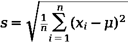
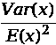
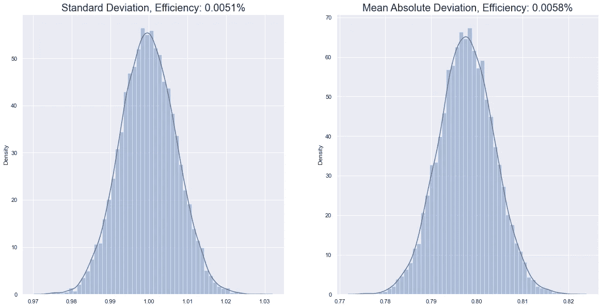
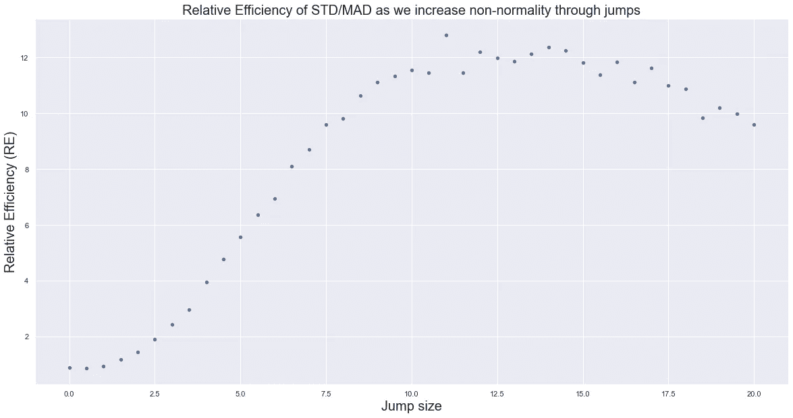
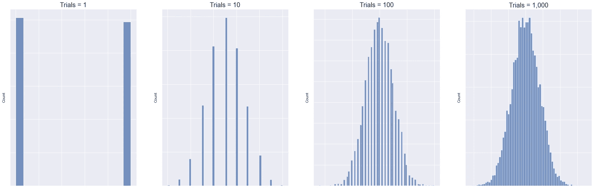
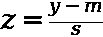

# 为什么我们要用标准差？

> 原文：<https://towardsdatascience.com/why-do-we-use-the-standard-deviation-51d5d1a502a8>


照片由[алексарцибашев](https://unsplash.com/@lxrcbsv?utm_source=unsplash&utm_medium=referral&utm_content=creditCopyText)在 [Unsplash](https://unsplash.com/s/photos/statistics?utm_source=unsplash&utm_medium=referral&utm_content=creditCopyText) 上拍摄

## 费希尔、参数化、效率和 CLT

感觉就像知识已经进步了，而且还在继续进步，速度如此之快，以至于在学校没有时间来解释事情是如何以及为什么会是现在这个样子。对我来说，标准差就是其中之一:简单地表述为测量离差的方法，没有解释我们为什么要做这个复杂的平方、平均、平方根的过程。这里的目的是简要回顾一下理论统计学的历史(激动人心！！！)并在此过程中理解它如此流行的历史和理论原因；或许还有为什么不应该。

## 这是什么？

先快速定义。换言之，给定一组数据，如果我们:

*   计算每一点与平均值的偏差
*   平方偏差
*   将它们相加，然后除以计数(得到平均方差)
*   求总和的平方根

我们得到标准差(STD)。更正式地说，如果我们有一个随机变量`X`，并且我们通过收集`n`个观察值`{x_1, x_2, ...x_n}`(例如，可能是随机人的身高记录)形成一个样本，那么我们可以计算样本标准差为:



作者图片

在这个定义中，我们假设我们知道总体均值(不使用样本均值作为估计)。如果我们没有，我们会用样本平均值替换总体平均值，并利用[贝塞尔的修正值](https://en.wikipedia.org/wiki/Bessel's_correction)(除以`n-1`而不是`n`——如果对此感兴趣，那么我在这里写了一个直观的解释器)但总体来说，想法是一样的。取离中心点的平方偏差的平均值，然后求它们的平方根。

## 为什么看起来像那样？

我不认为这太夸张了，当你真正看到它时，它似乎有点复杂。当然，数学运算很简单——但除了它从你 11 岁起就已经被灌输到你的大脑中这一事实之外，我们为什么会这样表述它其实并不那么明显。

给出的一种解释通常如下:

*   我们对观察结果进行平方处理，使它们都是正面的
*   求平方根会将数量返回到原始测量单位

换句话说，我们需要所有的值都是正的，以防止负偏差抵消正偏差(我们希望所有测量的离差累积起来)，然后我们希望最终的数字与我们测量的数据相当。在这个例子中，走在街上，问人们他们有多高，我们希望我们的离差以米为单位，而不是以米的平方为单位，所以我们对总和求平方根。

但是这个解释并不完整。有很多方法可以让价值观变得积极。我们可以取它们的绝对值，也可以使用不同的(偶数)指数，比如 4。如果我们不使用幂(平方),那么我们就不需要在最后求平方根，把量返回到正确的单位。为了理解为什么会这样，我们需要回顾一下历史。

## 统计与概率

在学校，我总是发现很难剖析概率和统计之间的区别。他们成对出现在我的大脑中，尽管我的大脑有许多缺陷，但这并不一定感觉像他们中的一个。因为在当今世界，他们有点像成对出现的*和*。但情况并非总是如此。

概率已经存在了一段时间，但主要与机会游戏有关——硬币、卡片和骰子。给定一个固定的“数据生成过程”(即掷硬币或掷骰子)，概率涉及的问题有:预测在`n`试验中`x`的概率是多少？不涉及数据本身，更多的只是纯粹的数学——给定一个数学函数(我们知道),它产生某种结果的概率是多少？

类似地，统计学也存在，但不像我们今天所知道的那样。如果我们追溯到 1900 年代以前，统计通过对国家感兴趣的数量进行描述性统计来关注“国家事务”，这个词本身来自拉丁语“地位”或“政府”。在某种程度上，统计过去只是描述性的统计——给定一些数据，我们能否想出一些方法将所有信息浓缩成几个数字来表示？没有真正发展起来的用数据做概率陈述的概念。对以下问题的回答:

*“我们有多大把握在样本数据中收集的平均身高等于整个人群的真实平均身高？”*

简单地说“我不知道”。那么是什么改变了呢？

## 费希尔和参数化

20 世纪的到来带来了像高尔顿、T2、皮尔森这样的公司，并在 1901 年成立了 T4 生物技术公司。皮尔逊在他的课堂笔记中首次引入了术语“标准差”，你可以在这里看到[他对它的使用(有趣的是，他还在这里创造了短语“正态”来指代正态分布，而不是德莫维尔和高斯之前使用的“误差定律”)。](https://royalsocietypublishing.org/doi/10.1098/rsta.1894.0003)

然而，真正推动事情发展的是罗纳德·费雪，他在很大程度上被认为是建立了现代“推理”统计学。是他推动了可能性(而不是逆概率)的概念。如果概率给你一个框架，并要求你计算某一组数据从该框架中出现的几率，那么就是他将统计学表述为一种逆过程:给定一组观察到的数据，最有可能生成该数据的框架是什么？

我们如何计算出“最可能框架”？我们对它进行估计——特别是通过选择一个分布，然后使用数据来推断给定数据时最有可能的参数化。举个例子，给定一组数据，我们想知道总体均值最可能的估计值是多少。正是费雪的影响使我们使用样本均值的统计。正是费雪的影响让我们陈述了:

*   我们能“期望”样本意味着什么
*   统计数据的分布应该是怎样的

通过这种新发现的对什么是估计总体参数的最佳统计的关注，费希尔的标准差的论点得以诞生。

## 费希尔对爱丁顿(大约 1920 年)

眼下的问题如下。给定两种测量离差的方法——STD 和 MAD——哪一种最好？费希尔用他新发现的统计“效率”的概念来回答这个问题。简而言之，他认为如果有两种做事方法，那么我们应该选择方差最小的一种。这意味着，在任何给定的一天，当我们采样并计算统计数据时，该统计数据更有可能接近我们希望知道的数量(总体参数)。

这是一个很难不同意的论点。然后他证明了(带着一些假设)STD 比 Eddington 喜欢的 MAD 更有效。事实上，我们可以通过自己画一些样品来证明他展示的东西。我们可以:

*   从标准正态分布(均值为零，方差为 1)中生成 10，000 个观察值的 10，000 个样本
*   计算每个样本的样本标准偏差和平均偏差(每个样本 10，000)
*   绘制它们的分布
*   计算“相对效率”(RE)

其中，re 定义为其“效率”的比率，对于随机变量`x`，其定义为:



作者图片

```
Relative Efficiency, STD/MAD: 87.20%
```



作者图片

那么这说明了什么呢？左图显示样本 STD 的分布，而右图显示样本 mad 的分布。然后，我们计算每种方法的效率，可以在每张图表的顶部看到，STD 的效率略好于 MAD。当我们观察它们的相对效率时，我们发现 STD 的效率比 MAD 高 12.5%左右。费希尔通过分析证明了这个结果，这个结果使得争论偏向于 STD。

## 有什么注意事项吗？

是的。与许多统计结果一样，上面的结果是由下式得出的:

*   渐近地
*   假设所讨论的抽样变量是正态分布的

爱丁顿(理所当然地)对这个结果感到沮丧，这个结果有助于指导下面的数学理论，因为这不是他在作为科学家的日常生活中所看到的。在某种程度上，这是一个科学家的手动波动的实际观察与一个运用极限定理的数学家的整洁优雅的数学证明，正如经常发生的那样，整洁的数学赢得了胜利(另一个例子见 1970 年后宏观经济学文献的方向——保罗·罗默关于它的好论文[在这里](https://paulromer.net/trouble-with-macroeconomics-update/WP-Trouble.pdf))。事实证明，在非正态性存在的情况下(甚至是最微小的量)，结果会发生逆转。事实证明，生活中几乎没有什么是完全正常的。

## 证明它

就像以前一样，让我们用一些模拟来证明这一点。在上面，我们生成了样本，并使用 RE 比较了效率。让我们再做一次，但这次我们将使用 Taleb 工作中的一个巧妙技巧来创建一个“混合分布”,这样我们最终会得到:

*   以前“窄”分布的大多数观察结果
*   来自更广泛的异常值生成分布的一些观察

最终结果是我们的分布不再是完美的正态分布。换句话说，这意味着我们将:

*   来自高斯`N(0, 1)`的样本具有概率`1-p`
*   来自高斯`N(0, (1+a))`的样本具有概率`p`

其中我们将`p`设置为一个小数值 s.t .我们只是偶尔从产生异常值的高斯分布中得到观测值。我们可以看到，当我们设置`a=0`时，我们回到了之前的世界，在那里我们有一个恒定的方差`1`。现在，让我们执行以下操作:

*   重复之前的取样，但采用上述程序
*   对不同的`a`值重复此步骤

我们将确定概率`p=0.01`。



作者图片

这说明了什么？从最左边开始，它表明当`a=0`我们回到完美的高斯世界，STD 在相对效率(RE)方面胜过 MAD。然而，随着我们开始将非正态性纳入我们的数据，这种情况很快发生逆转，MAD 的效率有时是 STD 的 12 倍。

## 为什么？

一个原因是想一想 MAD 和 STD 是怎么公式化的。STD 通过平方偏差为每个偏差创建正值。我们可以把这个平方看作是对每个偏差应用一个权重，这个权重就是偏差本身的大小。由于这个优点，较大的偏差得到较大的权重。当我们像上面所做的那样引入非正态性时，我们最终得到一些大的偏差(超过和高于高斯),这相应地导致标准偏差增加，超过等权重 MAD 函数所发生的情况。正是这种对异常值的响应造成了 STD 统计的可变性，从而导致其失去效率。

也正是这一特性导致学生在学校被教导“去除异常值”——因为它们破坏了标准差的效率。所有这些导致了标准差占优势的第二个原因。

## 标准差与常态有着内在的联系

这一点越看越明显-甚至人口标准差的符号也与正态分布中比例参数的符号相同。在没有高阶矩的分布中(完全对称，没有过度峰度)，你真正需要的是标准差。对于像钟形曲线这样的凸凹凸函数，一旦有了平均值和标准差，就大功告成了，这些统计数据中有足够的信息来描述完整的分布。

这一点和标准差与正态分布的独特性质在[这篇文章](https://stats.stackexchange.com/a/3904)中得到了很好的说明。这本书很值得一读，但我会试着解释一下。让我们假设以下情况:

*   我们有一个盒子，里面装满了写有数字 0 或 1 的彩票
*   我们挑选出`n`张彩票，把写在上面的数字加起来——称之为总值`y`
*   我们这样做了一万次

然后我们可以查看我们拥有的`y`的值，并创建一个直方图，在那里我们计算某个`y`出现的次数。例如，如果我们设置`n`等于 10，那么我们将为每个`y`抽取 10 个数字(0 或 1)。我们能得到的最大值是 10，最小值是 0，我们期望平均值是 5 ( `n/2` ) -平均来说，我们期望 50%的时间画 0，50%的时间画 1。如果我们要绘制直方图，我们将得到一个钟形曲线，随着样本数量增加，我们的钟形曲线将变得更加平滑。



作者图片

随着增长，获得任何特定数字的可能性变小(因为有太多的数字可供选择)。我们在上面的图表中看不到这一点，因为我已经移除了轴标签。然而，假设直方图以条形面积表示频率，随着`n`变大，每个条形的`height * width`变得越来越小(从左图到右图)。

我们可以通过归一化来解决这个缩放问题——我们可以通过减去某个中间值`m`来将它们居中，并通过使用某个分散值`s`来将其缩小以创建`z`，而不是只取值的直接和`y`:



作者图片

然后，我们可以绘制这些值的直方图——`z`的**中心极限定理与直方图的面积有关，这就是标准偏差的来源。** CLT 指出，随着`n`变大，数量`z`的直方图上这些标准化的条的面积接近极限值——对于`m`和`s`的一些选择。

**事实证明，为了使这成为真，对** `**s**` **的唯一选择是标准差。**换句话说，没有其他衡量离差的方法能达到这个目的(比如 MAD)。我认为这从根本上证明了标准差的概念与正态分布的内在联系——没有标准差就没有 CLT。标准差是我们可以用来确保上述直方图的极限分布成为正态分布的唯一离差度量。

## 性病占优势有问题吗？

一如既往:视情况而定。如果我们处在一个纯高斯主义的世界里，原因是:

*   拥有一个真正足够大的样本，让 CLT 能够正常发挥作用(而不是我们还在收敛的半路上)
*   一个真正的高斯变量(通常由游戏构造而成，游戏规则是由造物决定的)

那我们就不用担心了。

然而，对于更真实的情况，当我们面对不完全正态的对称分布时，值得考虑使用 MAD 作为离差的替代度量。特别是如果我们最终进入大偏差的领域，这些大偏差实际上是我们唯一关心的*偏差，因为它们是支配所有其他事件的事件(一场灾难性的洪水对一系列小阵雨)。如果你觉得这个东西有趣，那么进一步的信息可以在[这里](https://emilkirkegaard.dk/en/wp-content/uploads/Revisiting-a-90-year-old-debate-the-advantages-of-the-mean-deviation.pdf)和[这里](https://royalsocietypublishing.org/doi/10.1098/rsta.2014.0252)找到。*