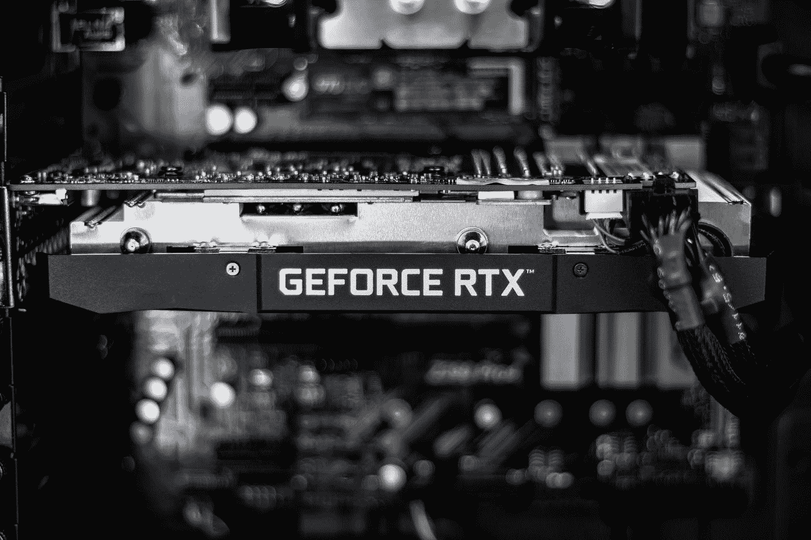

# 为什么显卡对机器学习有帮助？

> 原文：<https://towardsdatascience.com/why-does-a-graphics-card-help-in-machine-learning-8f365593b22>

## 理解显卡对于机器学习进步的重要性

克里斯蒂安·威迪格在 [Unsplash](https://unsplash.com?utm_source=medium&utm_medium=referral) 上拍摄的照片

显卡，也称为图形处理单元(GPU)，负责在计算机中计算图像，然后可以在显示器上显示。它代表处理器的计算和监视器之间的接口。然而，显卡的发展现在已经非常先进，除了这个功能之外，它们还可以在计算过程中支持和减轻 CPU 的负担。

# 显卡是怎么工作的？

计算机的处理器计算某个程序想要在屏幕上显示什么数据，并将其作为所谓的图像数据输出。这些数据大多是数字，然后由 GPU 转换，以便可以在显示器或其他设备上显示。

许多膝上型电脑和计算机包含已经安装在电路板(即主板)上的图形卡。这样的**集成显卡** (IGP)没有自己的内存，也是访问电脑的主内存。由于 IGP 没有内存组件，其尺寸非常小，因此主要用于小型设备，如平板电脑或笔记本电脑。然而，由于共享工作存储器，这种设计伴随着低时钟速率和低性能。因此，IGP 主要用于主要用于办公应用或浏览的设备。

与此相对的是**专用显卡**，自带内存，即所谓的 VRAM。然而，这也增加了尺寸并需要其自身的冷却。因此，专用 GPU 是独立的组件，通常通过 PCI 接口连接到主板。由于它们自己的内存，它们的功能要强大得多，例如，用于游戏或[机器学习](https://databasecamp.de/en/machine-learning)目的的设备。剩余文章的大部分将主要讨论专用显卡，因为现在有更多的用例需要这样的 GPU。

# 显卡有哪些组成部分？

在许多情况下，GPU 由以下组件组成:

*   风扇
*   冷却装置
*   图形处理器
*   记忆
*   存储接口
*   板
*   图形输出接口(VGA、Displayport 等。)

Rafael Pol 在 [Unsplash](https://unsplash.com?utm_source=medium&utm_medium=referral) 上的照片

我们现在将详细介绍最重要的组件:

## 图形芯片

显卡芯片做显卡的实际工作，是系统的大脑。这是图像计算的地方。例如，其他组件主要用于尽可能多地装备图形芯片，以便它能够以最高性能工作，而不必等待内存。

## 图形存储器

图形存储器存储计算图像和视频文件所需的所有数据。如前所述，独立内存可用于绕过对计算机主内存的访问，从而保持计算机的性能。

内存大小和连接在选择中起着决定性的作用，因此图形内存不会遭受性能损失。总的来说，显卡中没有任何组件需要妥协，否则，无论其余组件多么强大，整个系统的性能都会受到影响。

## 存储接口

存储器接口决定了可以访问数据的带宽。带宽越高，短时间内可以传输的数据就越多，这对于高帧率的电脑游戏，也就是有很多变化的图像来说，尤为重要。

存储器接口的更高比特率通常可以等同于更高的性能。你可以把内存接口想象成图形芯片的“存储器”。比特率越高，可用的存储区域就越大。反过来，有了更多的区域，数据可以更清晰地放置，从而可以更快地再次使用。在许多显卡中，内存接口是阻碍系统性能提升的瓶颈。

## 冷却装置

强大的 GPU 只有结合足够的冷却单元才能真正发挥性能。否则，GPU 可能会很快过热，必须降低性能以防止损坏。然而，GPU 通常应该能够在短时间内承受 100°C 的温度。

根据 GPU 的不同，使用**主动**或**被动冷却**。主动冷却仍然是从旧设备中得知的，当性能提高时，这些设备会发出明显的风扇噪音。主动冷却的特点是主动尝试将热量从芯片中带走。在大多数情况下，仍然使用风扇，风扇根据热模式以更高或更低的速度运行。然而，这样做的缺点是，在大量使用时会出现已经描述过的声音模式。

另一方面，在被动冷却中，热量通过冷却介质(如液体)从芯片中散发出去。冷却装置的表面设计得非常大，以便能够在负载下吸收大量热量。这意味着即使在高性能下也不会有额外的噪声。

# 哪些应用需要好的显卡？

正如我们已经看到的，所有具有视觉输出的程序都需要一个显卡来创建相应的图像和视频。然而，集成显卡对于许多程序来说已经足够了。

除此之外，还有一些特殊的应用程序需要更高的图形性能，因此没有强大的专用显卡是不行的。其中包括:

*   **游戏**:为了在充满动作的电脑游戏中实现快速的图像变换，强大的显卡必须能够在短时间内处理大量数据。
*   **3D 建模**:当设计和规划新的汽车、机器或其他部件时，会创建 3D 模型来可视化组件。如果要从不同的角度观察元件，图形卡必须在几分之一秒内计算出新的视图，否则图像可能会抖动。
*   **图像处理和视频编辑**:如今，图像和视频的分辨率越来越高，即它们包含的像素比以前更多。为了能够快速处理所有这些像素，GPU 也需要更高的性能。
*   [**机器学习**](https://databasecamp.de/en/machine-learning) :机器学习的主题实际上并不太适合前面的列表，因为这里不需要高分辨率或快速变化的图像序列。然而，强大的显卡对于机器学习也非常重要，因为所谓的张量用于工作和计算。这些非常类似于图像的数字表示。因此，GPU 计算机器学习模型的速度比传统处理器快得多。

# 如何找到完美的显卡？

首先，最好确定你愿意花在新 GPU 上的预算。这个市场就像许多其他市场一样，通常你只能以更高的价格获得更多的性能。目前，你不可能买到低于 180 €的好的专用显卡。以下所有型号在大多数情况下并不比已安装的 GPU 更强大。

中档型号的价格从 300 到 550 €不等，对于当前的游戏来说应该足够了。只有 550€以上的车型才能实现绝对顶级的性能。在许多排名中领先的显卡，配备 24 GB VRAM 的英伟达 RTX 3090 Ti，甚至在 1500€左右。

如前所述，GPU 嵌入在一个组件系统中，只有在与 PC 的其余部分顺利交互时才能提供最快的性能。所以，光有非常好的显卡是不够的，还要搭配新的组件，像强大的处理器。特别是新的和通常也是昂贵的 GPU 也应该被最新的组件包围，以便充分发挥它们的潜力。

最后，必须确保与以前的计算机兼容，否则，显卡将无法使用。为了安全起见，您可以使用许多免费的 PC 配置器之一，并检查兼容性。为此，您只需选择您已经拥有的组件，如 CPU、RAM、主板等。，然后选择您想要的图形卡。这将对组件是否适合在一起给出明确的答案。此外，不仅与其他组件的兼容性很重要，而且新 GPU 还有足够的安装空间。

# 这是你应该带走的东西

*   图形卡，也称为图形处理单元(GPU)，负责在计算机中计算图像，然后可以在显示器上显示。
*   图形卡可以安装在计算机的主板上，即集成的，或者作为外部组件连接，即专用的。
*   它由几个重要的组件组成，如图形芯片、图形内存、内存接口和冷却。只有当这些组件充分协调时，才能获得显卡的全部性能。
*   强大的显卡对于游戏、图像编辑和机器学习尤为重要。
*   选择新显卡时，应考虑与其他组件的兼容性。

*如果你喜欢我的作品，请在这里订阅*<https://medium.com/subscribe/@niklas_lang>**或者查看我的网站* [*数据大本营*](http://www.databasecamp.de/en/homepage) *！还有，medium 允许你每月免费阅读* ***3 篇*** *。如果你希望有****无限制的*** *访问我的文章和数以千计的精彩文章，不要犹豫，点击我的推荐链接:*[【https://medium.com/@niklas_lang/membership】](https://medium.com/@niklas_lang/membership)每月花$***5****获得会员资格**

*</what-is-a-computer-kernel-2320b9330eef>  </getting-to-know-microservices-da5a836a7abd>  </software-as-a-service-the-game-changer-for-small-it-departments-f841b292b02a> *