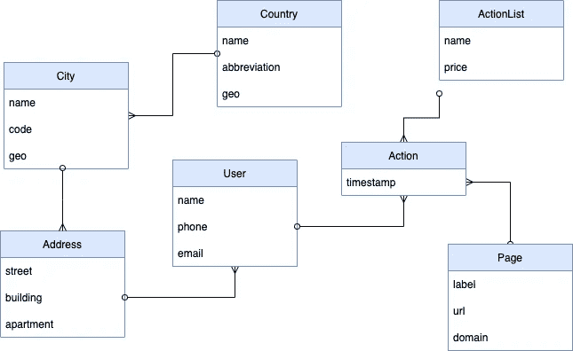
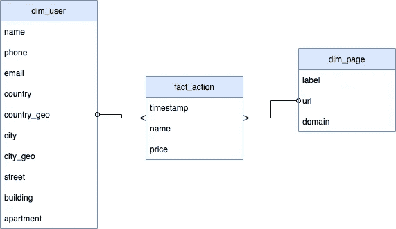

# 为什么数据需要按摩？

> 原文：<https://towardsdatascience.com/why-does-data-need-a-massage-5c7170bac45a>

## 数据转换基本原则的概述

图片由 [Unsplash](https://unsplash.com/) 上的 [Adeolu Eletu](https://unsplash.com/@adeolueletu) 拍摄

这篇文章是“创业分析”系列的一部分，因此它可能对那些刚刚开始弄清楚如何构建自己的 BI 解决方案的人有所帮助。我试图回答我在 BI 实施阶段开始时经常听到的最常见的问题。为什么我们需要做任何数据转换？这是一个非常合理的问题，因为数据转换可能是实施过程中最具挑战性、最耗费时间和金钱的部分。

这不是任何类型的教程，而是基本原理的鸟瞰。

# 为什么我们需要转换数据？

实际上，我们不需要。如果来源只是一个简单的系统或几个谷歌表，那么我们没有。然而实际上，我们通常从一开始就有很多来源，例如某种 CRM、Google analytics、google sheet、我们产品的数据库、网站等等。

转型的主要思路是:

*   加入数据
*   使数据非正常化

我相信连接不同来源的数据是显而易见的。我们需要将 GA 和 CRM 结合起来，以了解客户端设备和薪水、客户端位置和客户端偏好或产品类型之间是否存在任何关联。我们可能需要能够执行某种基于地理的群组分析，等等。
这是一个不太明显的想法，为什么我们需要“反规格化”，在我们的例子中什么是“反规格化”？

# 反规格化

源系统通常为处理用户请求、某种操作事件而优化。在大多数情况下，一种手术是与其他手术分开的。换句话说，当系统创建用户订单时，我们只对这个特定用户的信息感兴趣，不需要(或几乎不需要)其他用户的信息。从数据的角度来看，这里通常使用的是所谓的[规格化形式](https://en.wikipedia.org/wiki/Database_normalization)。

在这一点上，我必须补充一点，不是所有的计算机系统都是这样工作的，不是所有的计算机系统都使用关系数据库，但是为了简单起见，让我们假设我们处理的是一个类似于中等规模的电子商务商店的关系数据库。

在我们的例子中，我们需要收集的用户相关数据的 ER 图可以是这样的:

作者图表

系统可以执行某些预定义的操作，如用户创建、用户地址的更改、用户删除或停用、用户订单的位置等。所有这些预定义的操作通常在应用程序开发阶段变得清晰，并且可以由开发人员进行编码。当然，发展页可以像“永远”，但这是另一个故事。关键是我们定义，我们编码，我们使用正确的开发方法，每个人都很高兴。

从分析的角度来看，情况是不同的。我们可能需要计算按国家或地区、按操作、按第一个/最后一个操作名称、订单数或不同页面或网站上的其他用户操作细分的用户数。由于分析本身是一个数据驱动的过程，分析师通常无法预先制定需要什么样的具体切片分析。换句话说，在 BI 系统实现阶段，分析师可能需要执行的操作集不是预先定义的。

我们可以将分析师的请求看作是对 BI 系统的查询，或者更专业地说，是对分析数据库(数据仓库，DWH)的查询。并非所有的分析师都非常精通技术，不仅分析师对数据感兴趣，任何业务用户都可能需要访问数据来做出深思熟虑的数据驱动的决策。这意味着我们需要某种程度的抽象，为此目的的行业标准是[维度事实模型](https://en.wikipedia.org/wiki/Dimensional_fact_model)。这个模型的思想是定义一个简单的模型，由事实(比如我们的例子中的用户行为)和维度(任何可以分割数据的东西)组成。下面是它可能的样子:

作者图表

在这种情况下，任何分析查询都将始终是这三个具有不同聚合函数和过滤器的表的连接。我们现在不需要编码所有可能的查询。我们唯一需要实现的是一组度量(类似于 SQL 中的聚合函数)和一组维度。

这是一个非常基本的例子，[维度事实模型](https://en.wikipedia.org/wiki/Dimensional_fact_model)有它的复杂性和警告，但它应该足以让我们基本理解为什么我们需要转换数据，这是现在的重点。

# 怎么做

我前面提到的转换可以通过多种不同的方式执行，每个 BI 系统都有自己的机制，但一种常见的方式是在 DWH 级别(即数据库级别)执行大多数转换。如果这样的数据库支持 SQL 标准，那么我们需要的一切就是 SQL 查询。不仅仅是 SQL 查询，还有存储它们的地方、执行它们的机制和组织执行序列的方法。

人们可以使用许多数据库的嵌入式可能性来将对象(如视图和存储过程)存储在数据库本身和执行调度程序中，或者使用任何外部工具。我个人更喜欢使用一些外部工具，比如 DBT。它允许在 GIT 中存储所有内容，并提供了一种重用现有代码的机制，将查询与自动测试和文档结合起来，并具有许多其他优秀的特性。另外，它是一个开源工具。这是我的选择，我有一些成功的项目，所有的事情都是通过 MS SQL 或 PostgresSQL 完成的，不需要任何额外的工具。