# 为什么 FFT 只适用于高度复合的输入？

> 原文：<https://towardsdatascience.com/why-does-the-fft-only-work-for-highly-composite-inputs-7bbaa718351e>

## 以及如何调用复数来解决卷积上的 leet 码问题

美国国家海洋和大气管理局在 [Unsplash](https://unsplash.com/photos/Y7GUOQ83OMg?utm_source=unsplash&utm_medium=referral&utm_content=creditCopyText) 拍摄的照片

## 许多人认为复数是一个深奥的概念，出现在数学的深处，远离实际应用。

现在，考虑计算机视觉中最有影响力的算法是卷积神经网络。因此，尽可能高效地执行卷积的算法非常重要。为了开发最有效的算法，你需要调用复数。通过快速傅立叶变换(FFT)。

复数在算法开发领域的立足点主要是通过 FFT 算法，这种算法具有不合理的影响，以至于有人将其称为本世纪最重要的算法。我们将花一点时间激励它，然后探索它令人讨厌的特性，在这个过程中了解它的工作方式。

# I)动机:多项式和卷积

在我们纠结于如何快速执行傅里叶变换之前，让我们先了解一下为什么我们会在意。

Cormen 等人[clr_text_book]所著《算法导论》一书的第 30 章题为“多项式与 FFT”。为了从算法的角度理解 FFT，我们需要从多项式开始。一维多项式是形式为$x$的函数:

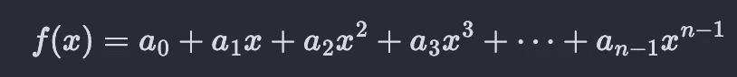

上面的等式可以产生直线、抛物线、椭圆等。由于 *x* 的最高幂是 *n-1* ，如果 *a_{n-1}，这将是一个 *n-1* 次多项式！= 0* 。现在，我们如何在计算机内存中表示一个一维多项式呢？最简单的想法是取系数， *a_0，a_1，… a_{n-1}* 并将它们放在一个数组中，因为系数完全指定了多项式。这被称为系数表示法。在面向对象的编程范例中，我们可以编写一个类，它的实例(对象)由系数数组定义。既然我们已经在计算机中表达了多项式，我们希望能够对它们进行算术运算。加法很简单。你只要把系数向量加在一起。如果一个多项式对应的数组比另一个大，没有问题。通过向较短的一个填充零，使它们大小相同。一旦你否定了第二个多项式的所有系数，减法实际上就是加法。让我们忽略除法，因为将两个多项式相除大多数时候会导致一个甚至不是多项式的东西。乘法是非常有趣的(既不是微不足道的也不是不可能的),我们将用它来激励 FFT。

假设我们要将两个多项式相乘——第一个多项式由系数给出: *a_0，a_1，a_2* 第二个由: *b_0，b_1，b_2* 。将它们相乘得到多项式:

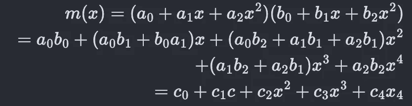

这个结果多项式具有系数 *c_0，c_1，c_2，c_3，c_4* ，其中:

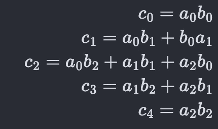

上面的等式看起来很混乱，但是它们简单地来自乘法的分配性质。这意味着第一个多项式中的每一项都要乘以第二个多项式中的每一项，这意味着一个双 for 循环，一个循环遍历第一个多项式的项，另一个遍历第二个多项式的项。

这是在下面的 Python 代码中实现的，该代码将表示要相乘的多项式系数的两个数组作为输入，并将相乘后的多项式的系数数组作为输出。

上面的函数很好很简单，只有两个循环。如果第一个多项式的次数为 *n* (意味着数组 *a* 具有 *n+1* 个元素，包括常数)并且第二个多项式的次数为 *m* ，则计算次数(乘法、加法等)为。)算法执行将大致为*C1+C2。(n. m)* 对于某些常数*C1*和*C2*(因为两个循环)。另一种说法是，该算法的时间复杂度是*O(n·m)*(因为它在任何计算机上花费的时间将与执行的计算次数成比例)。

对于特殊情况 *n=m* ，这变成了 *O(n )* ，这意味着运行时间与输入的大小成二次比例。为了简单起见，我们将在本节中假设这种特殊情况，在第三节中再次推广到 *n* 和 *m* 。

请注意，上面的 Python 代码只是将两个数组作为输入，并生成一个数组作为输出。在代码本身中没有关于多项式的显式上下文。事实上，在多项式领域之外，有一种操作的名称，它将向量*【a _ 0，a_1，a _ 2】*和*【b _ 0，b_1，b _ 2】*作为输入，并将向量*【c _ 0，c_1，c_2，c_3，c _ 4】*作为输出。这叫做“卷积”。除了等效于多项式乘法之外，它在概率论中用于确定两个随机变量之和的分布，并且也是卷积神经网络中的基本操作，卷积神经网络是当前计算机视觉中的前沿模型。

概括地说，用多项式的系数表示，我们可以轻松地执行加法和减法，但乘法有点困难。在计算机内存中，有没有其他方法来表达多项式，使乘法变得容易？

确实有。如果我们对多项式 *x_0，x_1，…x_{n-1}* 取任何$n$个输入，并在每个输入处对多项式求值(得到 *y_0，y_1，… y_{n-1}* )，那么对:

也会完全指定多项式(出于显而易见的原因，称为点值表示)。这是因为将这些 *x_i* 值中的每一个代入多项式并使其等于 *y_i* 会产生$n$个系数中的一个等式， *a_0，a_1，… a_{n-1}* (这里是未知的)。由于有 *n* 个方程和 *n* 个未知数，我们可以从这些方程中取出所有的系数，因此完全指定了多项式。

如果在这种表示中给我们两个多项式(两个多项式的次数都是 *n* 并且具有相同的 *x_i* ),那么将它们相乘就变得微不足道了。如果第一个多项式在 *x_0* 处为 *y_0* ，第二个多项式在 *x_0* 处为*y _ 0’*，那么在 *x_0* 处为它们乘积的多项式的值是多少？简单来说就是*y _ 0y _ 0’*。同样，我们可以得到所有*n*x _ I 的乘积值。

但是这张图有个问题。我们将两个 *n* 次多项式相乘得到的多项式的次数为 *2n* (因为两者的 *x^n* 项相乘将得到一个次数为 *2n* 的项)。因此，我们需要 *2n* 个点值。但是，如果我们只为两个输入多项式存储了 *n* ，我们就没有足够的项来计算它们的乘积，这需要 *2n* 个值。

我们需要的是，能够有效地从系数形式中，得到我们想要的任意数量的点的点值形式。然后，我们可以只为两个多项式生成 *2n* 个点值，并将每个 *i* 的两个多项式的 *y_i* 逐点相乘，以获得乘积多项式的点值表示。

假设我们有一个多项式的系数形式，想要得到点的点值形式: *x_0，x_1，… x_{n-1}* 。所以，我们想找到:

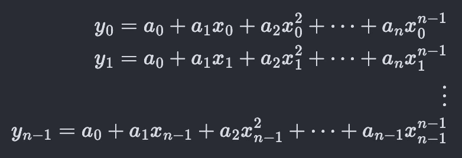

因此，我们有大约 *n* 个系数和 *x_i* 的幂之间的乘法运算要执行。也就是说，这种算法的运行时间将按比例缩放为 *O(n )* 。一旦我们得到这两个多项式的点值表示，进行实际的多项式乘法只是另一个不改变复杂度的 *n* 乘法， *O(n )* 。

由于使用之前的 Python 算法直接进行卷积也是一个 *O(n )* 运算，所以到目前为止，这种转移到点值表示的技巧对我们来说并没有多大作用。

但是我们还有一张牌可以打。可以选择一组 *x_i* ，使得移动到点值表示变得更加有效。快速傅立叶变换(FFT)算法使用特殊的 *x_i* 值来大幅提升性能。我们将在下一节深入研究这个算法。作为一个引子，那些特殊的 *x_i* 值是复数。在那之后，我们将选择多项式乘法。

为了概括这一部分，我们描述了一维多项式(只有一个变量， *x* )，考虑了将它们存储在计算机上，以及将它们相乘如何等价于它们系数的一维卷积。有一段时间，占主导地位的计算机视觉算法是卷积神经网络。这里的基本操作是将图像视为像素值的二维数组，并与另一个更小的二维数组(称为内核)进行卷积。除了机器学习之外，图像上的这种卷积运算对于检测边缘、模糊等目的也是有用的。这个在视频中被 3 蓝 1 棕[3b1b _ 卷积]很好的掩盖了。

图像实际上可以被认为是两个变量的多项式( *x* 和 *y* )，内核也是如此。卷积运算只是将对应于图像的多项式与对应于内核的多项式相乘。但那是另一天的话题。

# II)书中的算法

在上一节中，我们描述了我们的目标是如何将表示为系数数组的多项式有效地转换为点值表示。直接的方法包括简单地在所有点上评估多项式，并且其运行时间与系数的数量成比例为 *O(n )* 。然而，这是针对一组通用的 x _ I 的，我们承诺会有一些 x _ I*x _ I*会变得更有效。而那些特殊值就是单位的第 n 个*根。方程的解:*

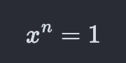

[clr_text_book]第 30 章中的算法可以做到这一点，但有一个警告，输入数组*的大小必须是 *2* 的幂。这有点令人失望，因为你在现实世界中遇到的大多数输入你都期望*不*是 *2* 的幂。

他们说可以处理非 2 次方大小数组的算法是存在的，但是超出了本书的范围。然后，在练习中，他们询问相应的算法，该算法将对 *3* 的幂起作用(但不询问实现)。这给了一个提示，如何得到一个更通用的算法。我们暂且假设$n$是 *2* 的一个幂，在这一节用一些图片描述书中的算法(这一节应该算是对书本身的补充)。然后，我们将描述是什么阻止我们将非幂的 *2* 输入传递给算法。最后，我们将归纳出一种算法，该算法适用于大小为 *3* 的幂的输入，并描述如何将一组这样的算法组合成一个更通用的算法，该算法可以适用于任何高度合数的输入。对于大多数 FFT 应用，我们可以自由选择输入大小。因为我们总能找到一个非常接近任何数的高度复合数，这就足够了。

## II-A)团结之根速成班

注意:如果你已经熟悉了单位的 n 次根，你可以直接跳到减半引理这一小节。

**数字 i**

没有一个实数，它与自身相乘的结果是 *-1* 。起初，人们满足于说平方根的概念根本不适用于 *-1* 等负数。但是，即使在试图寻找一般三次方程的*实*根时， *-1* 的平方根仍不断出现(结果是，它最终会抵消，产生一个实数)。而人们最终说“如果 *-1* 的平方根不存在于实数线上，不代表它在任何地方都不存在”。他们创造了一个新的数， *i* 被明确定义以满足与自身相乘将导致 *-1* 的性质。因为它存在于“实数”范围之外，所以它被称为“虚数”。事实是，所有的数字(实数或复数)都是我们为了理解世界而发明的虚构概念。

**复杂平面**

一旦你有了新的数字 *i* ，你可以把它乘以 *2* 得到一个新的数字 *2i* 。事实上，对于每一个实数，我们都可以把它乘以 *i* ，得到一个由复数组成的全新数系。我们可以把原来的数轴放在二维平面的 x 轴上，把新的复数放在 y 轴上。这种特殊的二维平面被称为“复平面”。请注意，将 *0* 乘以 *i* 得出 *0* ，就像任何其他数字一样。所以， *0* 是两条线相交的地方。在这个二维平面上具有坐标 *(x，y)* 的点可以写成: *x+iy* 如图所示。

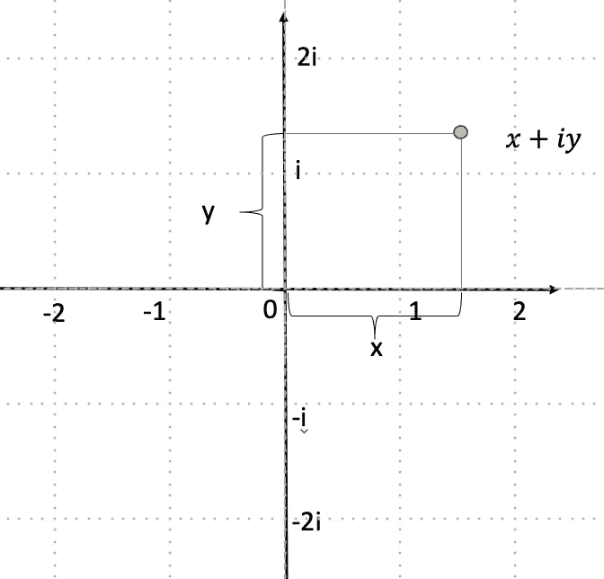

图 1:复杂平面。图片作者。

**单位圆**

虽然整个复平面很吸引人，但我们将只关注位于单位圆上的点，圆心在 *0* 。从原点(也是圆心)到每个点的距离是 *1* 。圆上的任何点(例如下图中的红点)完全由它与 x 轴的角度 *θ* 指定。可以看出，绿色和红色的点是斜边为$1$(圆的半径)的直角三角形的一部分。所以，红点的 x 坐标是那个直角三角形的底边， *cos(θ)* ，y 坐标是直角三角形的垂线， *sin(θ)* 。所以，点本身用复数表示: *cos(θ)+i sin(θ)* 。而以尤拉的著名身份，这位无非是 *e^{iθ}* 。

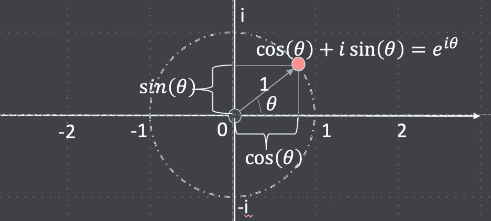

图 2:复平面上的单位圆。每个点都由一个数字来表示，θ是 x(实数)轴和指向该点的矢量之间的角度。图片作者。

所以我们已经确定，圆上的任何一点都由 *e^{iθ}* 指定。现在，当我们把这个数提高到 T2 的 n 次方时会发生什么？

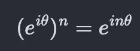

等式(2):将单位圆上的一个数提高到 n 次幂，只是将其旋转乘以 n。

我们在由角度 *nθ* 描述的同一个圆上得到一个新点。

**团结的根源**

现在，让我们回到寻找统一的第 n 个根的问题上。满足以下等式的值:

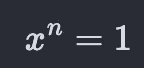

让我们从右手边开始。只是一个 *1* 。但是我们只想说单位圆上的点(形式为 *e^{iθ}* )？ *θ* 的哪些值导致 *1* ？当然， *θ=0* 满足这个要求，因为任何数的 *0 的幂*是 *1* 并且 *i* 乘以 *0* 是 *0* 。所以， *x=e^{i 0} = e⁰ = 1* 总是一个解。但是还有更多。

现在，想象从 *θ=0* 开始，逐渐增加 *θ* 。当我们这样做时，我们绕着圆圈移动。

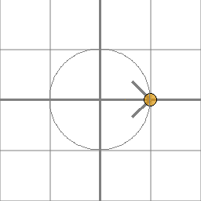

图 3:数字 1 由许多复数表示。每当圆圈循环一次，你就回到 1。作者使用[https://github.com/ryu577/pyray](https://github.com/ryu577/pyray)创建

在 *θ = 2𝜋* 会发生什么？我们绕着它转了一整圈，发现自己又回到了 *1* 处。
所以， *e^{i 2𝜋}* 也等于 *1* 。当我们继续增加 *θ* 超过这个值时，我们进行另一个循环，在 *θ = 2𝜋+2𝜋=4𝜋* 处，我们回到 *1* 处。这里的模式是，所有 2𝜋的整数倍都以 *1* 结束。所以，

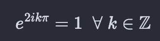

我们想要求解的方程变成了:

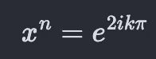

取两边的第 n 个*根*:

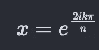

现在，我们的原始方程似乎有(可数的)无穷多个解。所以，我们从只有一个解( *x=1* )到现在的无限解。但是如果你更深入一点，你会发现并没有真正的无限不同的解决方案。你得到 *n* 不同的解决方案，然后它们开始重复。第一种解法是 *x=1* 对应 *k=0* 。第二个是 *ω_n=e^{2i𝜋/n}* 对应 *k=1* 。这被称为“单位的主根”,其他的都是这个的整数次方。第三个是 *e^{4𝜋 i/n} = ω_n* 对于 *k=2* 以此类推。一旦我们到了 *k=n* ，我们就得到了 *e^{2𝜋 n/n} = e^{2 𝜋} = 1* (与 *k=0* 时相同)。并且用 *k=n+1* 和 *k=1* 是同一个数。因此，只有范围从 *0* 到 *n-1* 的 *k* 的值产生了我们之前没有看到的明显的根。

我们来考虑一下 *n=3* 的情况。换句话说，我们现在正在寻找单位的立方根，这些数字满足:

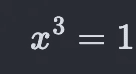

插入:

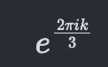

，对于 *k=0，1，2* ，我们得到以下 3 个不同的值，然后，它们开始重复。

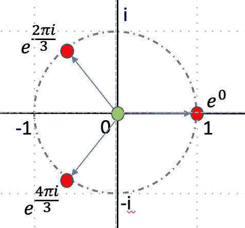

图 4:单位的立方根。作者图片

**减半引理**

现在，我们来了解一下最重要的概念，这个概念对于我们如何在快速傅立叶变换中获得加速非常重要，同时我们也来了解一下为什么 FFT 只能处理高度复合的输入。

如果你在$n$恰好是偶数时取第 *n* 个单位根，并将它们全部平方，你就得到第 *n/2* 个单位根。但是从上一节中，我们知道确切地有 *n 个*不同的 *n 个*根和 *n/2 个*不同的 *n/2 个*根。因此，当我们对第 n 个*的根求平方时，只有一半的根是不同的数字，而另一半的根只是环绕并重复现有的根。正是这种冗余的引入帮助我们节省了一些计算并加快了速度。*

这在下面针对 *n=8* 的情况进行了演示。将团结的每一个第 *8* 根平方带给我们四个不同的点，团结的第四个根。

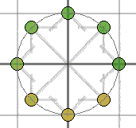

图 5:如果我们把单位的 8 次方根全部平方，前四个就成了单位的 4 次方根，接下来的 4 个循环并与前四个重合。图像创建使用:[https://github.com/ryu577/pyray](https://github.com/ryu577/pyray)

## II-B)各个击破

现在，让我们看看减半引理实际上是如何被用来创建一个有效的算法。记住，FFT 的问题陈述非常简单。给定一个多项式的 *n* 个系数(存储在一个数组中)，在单位的第 *n* 个根处计算该多项式。

首先考虑一种简单的方法，这种方法需要进行 *O(n )* 计算，我们可以把这些想象成一个表，沿着表的列放置 *n* 个系数(输入),沿着表的行放置 *n* 个单位根。在表格的 *i，j* 单元格中，我们将该行对应的 *ω* 提升到 *j* 的幂，并乘以 *a_i* ，即该单元格所在列的对应系数。然后，我们对所有行求和，得到每列一个元素(见下图的绿色部分)。这些 *n* 元素被打包成输出向量， *y* 。整个过程如下图所示。

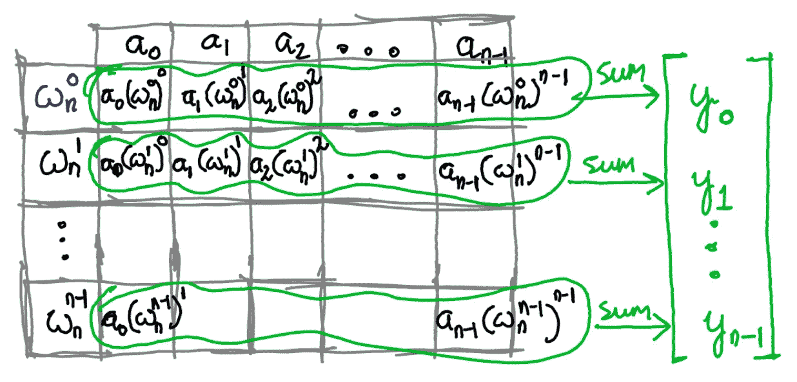

图 6:将简单的离散傅立叶变换可视化为矩阵。图片作者。

为了改进 O(n ) 的计算，我们使用了一个技巧，依赖于上一节中的减半引理，并帮助将问题分成更小的子问题。这是在许多 CS 算法中出现的分治策略，如合并排序、有序数组中的二分搜索法等。

由于引理涉及平方所有的单位根，我们试图仅用原始输入的平方来表达感兴趣的方程。我们想要做的所有评估都是在形式的单位的$n$个根中的每一个上的多项式:

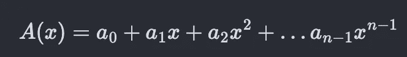

我们能修改这个方程，使它只涉及 *x* 中的多项式吗？让我们先摘低垂的水果。已经有 *x* 及其幂的系数，也就是均匀索引的系数。将这些和剩余的(奇数索引系数)分离出来，我们可以写出原始多项式:

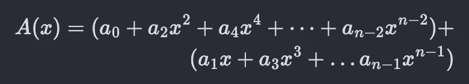

现在，我们希望将原始多项式分解成更小的多项式，这样我们就可以分而治之，

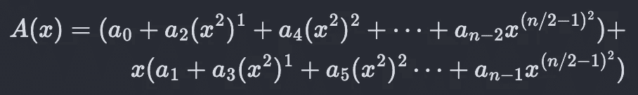

所以，我们成功地将原多项式分裂成两个多项式。这两个多项式都只涉及 *x* 的幂。由于第一个多项式甚至具有来自原始多项式的索引项，我们可以将其称为 *A_0(x)* (索引使得除以 *2* 的余数是 *0* )，类似地，第二个多项式可以称为 *A_1(x)* 。这给了我们:

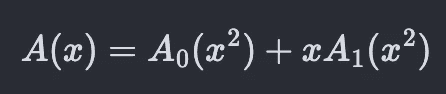

等式(3)

其中:

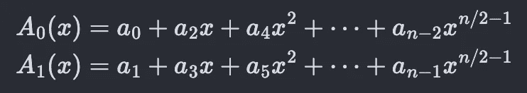

因此，在第 *n* 个单位根处计算 *A(x)* 、 *ω_n⁰、ω_n、… ω_n^{n-1}* 的原始问题简化为在第 *n* 个单位根的平方处计算多项式 *A_0(x)* 和 *A_1(x)* 。两个新多项式都更小，并且具有 *n/2* 个系数。

现在，上一节的减半引理出现了。当我们平方 n 个单位根中的每一个时，第一个 *n/2 个*恰好是不同的 *n/2 个*单位根。剩下的 n/2 个如图 5 所示循环重复。所以，我们不用再计算多项式了。因此，我们需要计算多项式的点数也减少了一半。并且由于 *n* 根的平方是 *n/2* 根，这两个子问题涉及在单位的 *n/2* 根处评估具有 *n/2* 系数的多项式，因此也是离散傅立叶变换问题，只是具有不同的(更小的)系数阵列。除法步骤现在完成了。但是现在我们知道了如何除法，我们就不仅仅停留在一个除法上了。相反，我们继续前进，直到我们遇到基本情况，这是一个长度为 1 的数组。此时，傅立叶变换就是数组本身的元素。划分问题的过程是 FFT 带来的速度的核心。下图直观地显示了这一点，以进一步加强直觉。我们为 *n × n* 乘法进行设置，如图 6 所示。但是接下来，我们将 *n × n* 矩阵分成两个更小的矩阵，每个矩阵的大小为 *n × n/2* 。矩阵的红色部分只是蓝色部分的重复，所以可以丢弃。这就使得两个更小的矩阵 *n/2 × n/2* 。

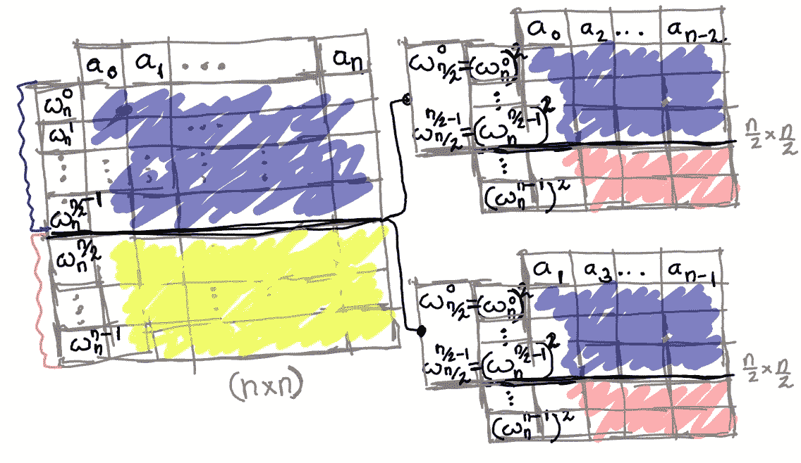

图 FFT 算法的除法步骤。将原矩阵分成两个 n*n/2 的矩阵。这些矩阵的红色区域不需要计算，因为它们是蓝色区域的重复。原始矩阵的蓝色区域是用等式(3)从两个较小的蓝色区域和用等式(4)从黄色区域计算的。图片作者。

为了获得原始矩阵的蓝色部分，即来自*0->n/2–1*的输出值，我们可以通过等式(3)使用两个分离矩阵的蓝色部分。为了得到原始矩阵的黄色部分，从 *n/2 - > n-1* 的输出值，我们可以使用下面的等式:

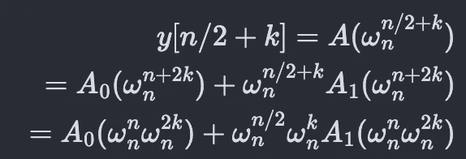

现在，根据定义，

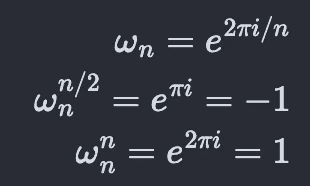

将这些代入方程(4)，

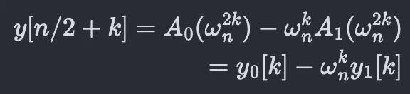

等式(4)

有了分而治之的工作原理的背景，我们可以介绍 Python 代码了(注意:它的初始框架是由 ChatGPT-3 编写的，其余部分是从[clr_text_book]第 30 章中的伪代码翻译过来的)。

第 10 行是递归的基本情况，大小为 1 的数组。这里，离散傅立叶变换仅仅是阵列本身。

第 20 行和第 23 行利用了我们的观察结果，即我们可以将 FFT 分成更多大小为一半的 FFT。

然后，第 29 行中的 for 循环组合两个较小的 FFT，并根据等式(3)(第 30 行)和(4)(第 31 行)产生较大的 FFT。

## II-C)复杂性分析

为了理解这种方法带来的加速，让我们看看更简单的简单实现，让我们考虑执行一个 *8* 元素数组的离散傅立叶变换。为了计算所有不需要分而治之的操作，让我们回到图 6 中的矩阵。

图 6:为了清楚起见重复了一遍。作者图片

在上面的矩阵中总共有 64 个单元，并且它们都需要至少一次乘法(将系数与复数相乘)。因此，这至少需要 64 次乘法(也需要计算复数根，但我们会忽略这一点，因为任何方法都需要它)。为了将它们相加并得到输出 *y* 向量，我们需要对每一行求和。将 8 个数相加需要 7 次加法，因此需要额外的 *7 × 8 = 56* 次加法。因此，朴素方法有 64 次系数复数乘法和 56 次加法。让我们看看各个击破的效果如何。

“fft_2”程序中算法的实现方式如下面的图 7 所示。我们从 8 元素数组开始，想要得到 DFT。我们在代码中引用的 *y_0* 和 *y_1* ，我们在下图中为左右数组调用 *y_l* 和 *y_r* (因为这就是它们在递归树中的排列方式)。当 *y_l* 被分割成两个更小的数组时，它们分别被命名为 *y_{ll}* 和 *y_{lr}* 等。我们看到只有三个递归层次进行算术运算。这并不奇怪，因为 log_2(8)=3 。在图的左边，我们看到递归树的每一层都发生了 8 次乘法和 4 次加法。总共有 24 次加法和 12 次乘法。与简单方法的 64 次乘法和 56 次加法形成对比。

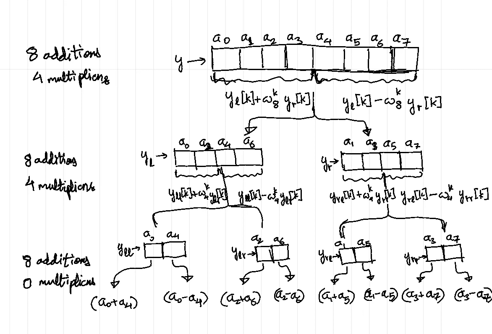

图 FFT 程序带来的计算优势。

一般来说，每次迭代中的问题大小被分成两个子问题，每个子问题的大小是原来问题的一半。然后，我们需要一个 for 循环(或 *O(n)* 计算)来组合两个子问题的输出，并解决感兴趣的原始问题。假设大小为 *n* 的输入数组所需的总操作数是 *T(n)* 。每次拆分成两个子问题，我们都需要做 *2T(n/2)* 的功来解决其中的每一个，然后 *O(n)* 的功来组合它们，意思是 *c.n+d* 对于某些常数， *c* 和 *d* 。这可以表述为:

继续这种模式，

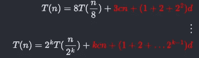

当 *n/(2^k)=1* 和 *n=2^k* 时我们停止。这意味着:

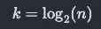

在那个阶段，我们得到$T(1)$这是零加法或乘法。代入上面的等式，我们得到:

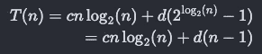

也就是 *O(n.log(n))* 计算。

# III)回到多项式

首先，让我们把第一节中的 lose end 连接起来，并描述这个新的分治算法将如何帮助执行多项式乘法比 double for-loop 快得多。假设我们有两个用系数数组表示的多项式。这些数组的大小是$n$和$m$。这两个多项式看起来类似于:

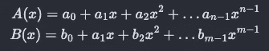

第一多项式的次数( *x* 的最高次)为 *n-1* ，第二多项式的次数为 *n-2* 。因此，乘积多项式， *C(x)* 的次数为 *n+m-2* ，如下所示:

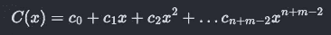

总共有 *n+m-1* 个系数。

为了进行乘法运算，我们首先要将两个输入多项式转换成点值形式。一旦到了那里，只要两者被评估的点是相同的，我们就可以逐点相乘得到$C(x)$的值。要指定$C(x)$的$n+m-1$个系数，我们需要$n+m-1$个点来计算它们。因此，我们希望$A(x)$和$B(x)$也按$n+m-1$点计算。但是，它们分别只有$n$和$m$个系数，对它们应用傅立叶变换将分别在$n$和$m$个单位根上对它们求值。所以，我们让它们都有$n+m-1$个系数。方法是假设它们都是 n+m-1 次多项式。只要在最后加上零系数。所以，这两个多项式变成:

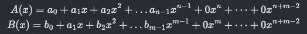

只需将这些较大的零填充数组传递给 FFT 例程，它将计算每个单位的第 *n+m-1* 根上的两个多项式的值。这些步骤将花费 *O((n+m))。log(n+m))* 时间。

然后将这两组 *n+m-1* 值逐点相乘，耗时 *O(n+m)* 时间。现在我们已经有了在这些 *n+m-1* 单位根上的 *C(x)* 的点值，我们可以回到那个多项式的系数表示。这最后一步被称为逆傅立叶变换(因为它做的事情与傅立叶变换相反)。而按照[clr_text_book]的定理 30.7，这也可以在 *O((n+m)log(n+m))* 时间内完成。事实上，FFT 程序只需要稍微修改一下，就可以转换成逆 FFT 程序。

整个过程耗时 *O((n+m))。log(n+m))* 时间，这比天真的方法的 *O(nm)* 要好。

[clr_text_book]的图 30.1 形象地显示了这两种方法(它们考虑了情况 *n=m* )。我无耻地把那个图贴在这里。

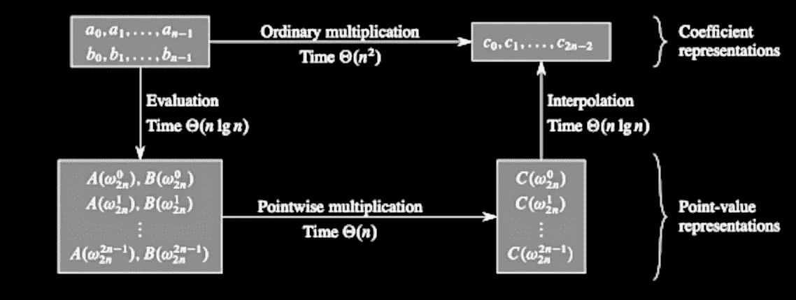

图 8:两个多项式直接相乘是 O(n)。但是有另一条路，一条捷径。图片摘自[clr_text_book]。

但是我们难道没有忘记我们的有效实现只对 *2* 的幂有效吗？如果 *n+m-1* 不是 *2* 的幂呢？一个解决方案是找到下一个更大的数字，它是 *2* 的幂。如果我们幸运的话，可能会很接近。但是如果 *2* 的下一个幂非常遥远呢？为什么我们会受到这种限制呢？

# 为什么是 2 的幂？

乍一看，似乎整个分而治之的模式就是我们被 *2* 的力量困住的原因。直到你意识到[clt_text_book]充满了分而治之的算法。例子是二分搜索法，排序算法像合并排序和快速排序等等。并且它们都没有仅作用于作为 *2* 的幂的输入的限制。即使你实现它们时假设输入大小是 *2* 的幂，然后给它们数组的大小不是 *2* 的幂，它们也能工作。事实上，FFT 是那本书里唯一没有推广到 *2* 的非幂的算法。如果给 fft_2 例程一个大小不正确的数组，会发生什么？没有东西损坏，没有爆炸发生，也没有抛出错误。但是，可悲的是，产生的值是不正确的。它们不会与你从简单方法中得到的相匹配。

限制的原因是使用了第二节中的减半引理。如果你在 *n* 为偶数时取第 *n* 个单位根并将它们平方，你将得到第 *n/2 个*个单位根，最后的 *n/2 个*值将很好地合并到第一个 *n/2 个*中。但是如果 n*n*不均匀，这整个事情就破裂了。首先， *n/2* 甚至不是一个整数。对复数求平方甚至不会产生单位的[n/2]根或任何东西。这就是为什么假设 when *n* 不相等只会导致错误的答案。因为我们希望能够一直进行到基本情况的分割， *n* 必须是 *2* 的幂，fft_2 例程才能工作。

但是，如果 *n* 不是 *2* 的强大力量，而是有惊无险呢？假设我们有: *n=3*2 ⁰* 。当然，我们可以尝试在 *n=4*2 ⁰* 处评估 FFT，但如果我们稍微修改 fft_2 例程，并在 *2* 假设失效时使用一种“弹出按钮”,即使这样也没有必要。当我们递归地将 *3*2 ⁰* 大小的数组分成两部分时，我们将保持均匀的数组大小，直到到达 *6* 。然后，当我们进一步把它分成大小为 *3* 的数组上的两个调用时，我们就默认了只计算多项式的简单方法。我们所需要的是在最顶端的一个“如果”条件，检查 *n* 是否是 *2* 的幂，如果是，返回到简单的例程。

但是如果我们有一个输入大小为 *n = 3⁷*2* 的数组呢？一旦我们用完了两种分割方式(这将很快发生)，我们最终会得到两个大小分别为 *3⁷* 的非常大的数组。在那一点上，你会希望有一个例程来处理 *3* 输入的功率，而不是 *2* 的功率。事实上，是有的。正如我们可以为其他分治算法选择“除法”的数目一样，我们也可以为 FFT 选择“除法”的数目。在下一节中，我们将介绍 FFT 的一个版本，fft_3，它基于 *3* 大小的输入功率工作。现在，我们可以有一个主例程，只要输入是偶数，它就将数组传递给 fft_2，如果它是 *3* 的倍数，则传递给 fft_3，并传递给原始实现作为最终的后备。但是我们可以有前 *m* 个质数的版本，fft_2、fft_3、fft_5、fft_7、fft_11 等等。现在，只要我们得到高度复合的输入数组大小，我们仍然可以获得 FFT 的所有好处。很容易找到一个仅比任何 *n* 稍大的高度复合数，这足以满足我们的多项式乘法和大多数其他用例。

# 3 次方的 FFT

最后，让我们介绍一种 FFT 算法，它工作在 *3* 的幂上，而不是 *2* 的幂上。这种方法显然可以扩展到任何数字(但我们想把它用于素数)。正如上一节所讨论的，fft_2 例程对输入大小而不是 *2* 的幂给出错误答案的原因是减半引理。如果我们想让它适用于 3 的幂，我们需要一个相应的“三等分引理”。

如果$n$是 *3* 的幂，并且你取第 *n* 个单位根并将它们全部立方，你得到第 *n/3* 个单位根。其他的 *2n/3* 根刚好缠绕并与 *n/3* 根重叠。

这将使我们能够将 FFT 分成三个子问题。但是，我们还想知道如何将它们组合成我们想要的 FFT 阵列。将等式(4)推广到三路分割的情况，数学计算如下:

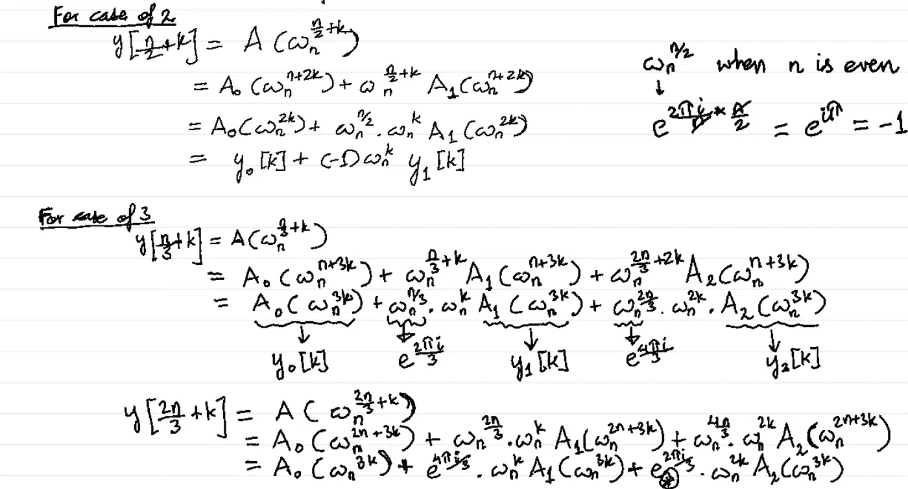

图 9:解决如何填充 3 路 FFT 分裂的数组。

在最后一步中，我们使用了以下事实:

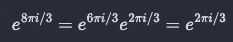

有了所有这些事实，我们就有了 fft_3 算法:

# 结论

FFT 不仅仅是一种局限于信号处理的算法，许多人在信号处理领域都有所了解。它有广泛的应用，甚至延伸到意想不到的领域，如微分方程和深度学习。这是一种将复数的数学之美与冷静、高效的算法思维相结合的算法。与其他分治算法不同，它有一个奇怪的怪癖，这意味着它只有在被分成精确的部分时才起作用。这就是为什么它的效率增益只适用于高度复合的输入。但是对于大多数实际应用来说，这不是问题，因为我们在选择输入大小方面有一些自由。即使对于大质数，也有办法利用它带来的效率。

如果你喜欢这个故事，成为推荐会员:)

[https://medium.com/@rohitpandey576/membership](/@rohitpandey576/membership)

# 参考

【Veretasium _ fft】:Veretasium 关于 FFT 算法的视频:[https://www.youtube.com/watch?v=nmgFG7PUHfo](https://www.youtube.com/watch?v=nmgFG7PUHfo)

[clr _ text _ book]:Cormen 等人的《算法导论》第三版。

[3b1b _ 卷积]:视频由 3 蓝 1 棕“但什么是卷积”[https://www.youtube.com/watch?v=KuXjwB4LzSA](https://www.youtube.com/watch?v=KuXjwB4LzSA)