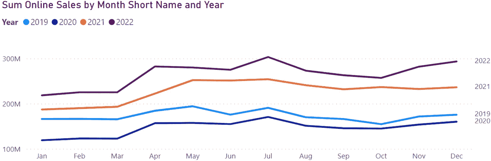
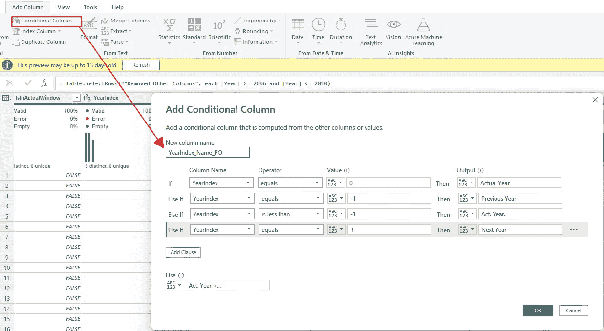
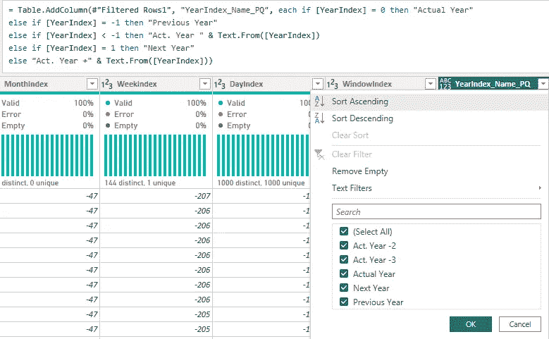
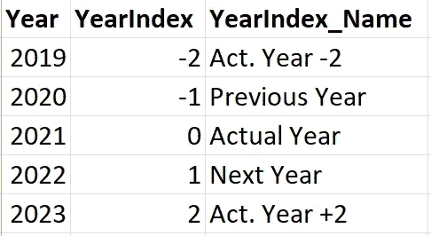
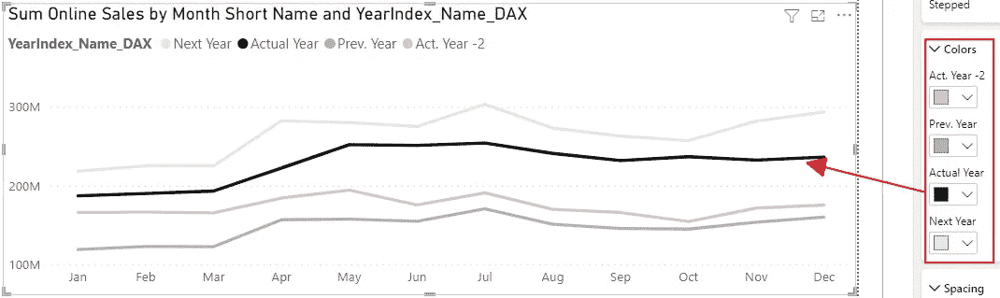
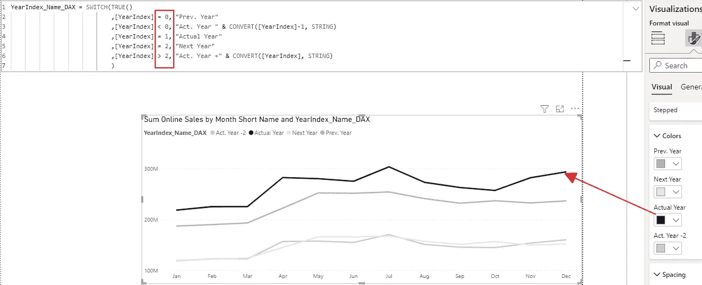
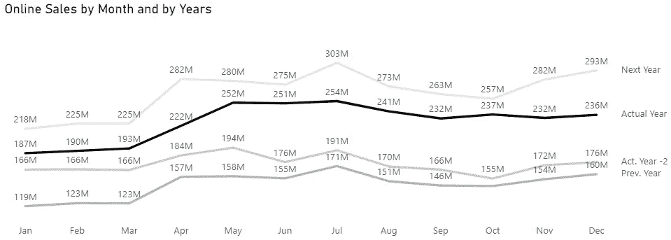

# 为什么折线图中的动态颜色需要在 Power BI 中采用不同的方法

> 原文：<https://towardsdatascience.com/why-dynamic-colors-in-line-charts-need-a-different-approach-in-power-bi-b1dc5ffe7549>

## 我们不能在 Power BI 中对折线图应用条件格式来控制线条的颜色。但有时我们想修正这些颜色。让我们看看我们如何能做它。


[斯凯工作室](https://unsplash.com/@skyestudios?utm_source=medium&utm_medium=referral)在 [Unsplash](https://unsplash.com?utm_source=medium&utm_medium=referral) 拍摄的照片

# 介绍

在我以前的文章中，我解释了如何使用 DAX 表达式控制颜色:

[](/how-to-control-colors-with-dax-expressions-in-power-bi-ef7e5c767eff) [## 如何在 Power BI 中使用 DAX 表达式控制颜色

### 我们现在可以添加很长时间的视觉着色规则。但是我们如何使用 DAX 表达式来控制这些颜色呢…

towardsdatascience.com](/how-to-control-colors-with-dax-expressions-in-power-bi-ef7e5c767eff) 

在那篇文章中，我引用了 IBCS 规则来选择高对比度的列视觉效果颜色，而不是标准的 Power BI 颜色。

我的一个客户问我如何将这些规则应用到线条视觉上。

这个问题导致了两个问题:

*   无法通过规则/条件格式来设置线条的颜色
*   如何确保解决方案是可持续的，并且不需要人工操作

让我们看一下这两个挑战的详细描述，以及我们是如何解决它们的。

# 这两个问题

客户希望看到以年份分隔的每月值:



图 1——线条视觉的起点(作者提供的图片)

为了满足客户的要求，我尝试为线条视觉效果的线条颜色设置一个 DAX 度量。

当尝试这样做时，我们意识到不可能设置一个规则来控制线条颜色。

好，然后我们可以手动将线条的颜色设置为固定的颜色。

但是，一旦我们获得其他年份的数据，Power BI 就会选择下一个可用的颜色，并将其分配给新系列。

这意味着客户需要每年手动设置一次颜色，以避免出现随机颜色。

他想要一个自动化和可持续的解决方案来解决这个问题。

# 使用日期表格

在与我的客户讨论的过程中，我们意识到我们需要稳定的标签，并给它们分配颜色。

然后，我们需要一种机制，在一年中的每次变化时转换标签。

有了这个想法，找到解决方案就迈出了一小步:用一个额外的列扩展日期表。

在我关于 Power BI 和 DAX 的第一篇文章中，我在我的数据表中提到了索引列:

[](/3-ways-to-improve-your-reporting-with-an-expanded-date-table-2d983d76cced) [## 使用扩展的日期表格改进报告的 3 种方法

### 时间是最重要的报道维度。您可以使用一个好的日期表来扩展您的报告功能。

towardsdatascience.com](/3-ways-to-improve-your-reporting-with-an-expanded-date-table-2d983d76cced) 

在本例中，有趣的列是 YearIndex 表。
基于此列，我们需要为所有行创建一个新列，规则如下:

*   当 YearIndex 为零时，标记实际年份
*   当 YearIndex 为负数时，标记相对于实际年份的前几年
*   当 YearIndex 为正数时，标记相对于实际年份的未来年份

使用这些规则，我们可以添加一个名为“YearIndex_Name”的列，该列具有固定标签:

*   实际年份
*   去年
*   明年
*   行动。年数—“前一年之前的年数”
*   行动。年+“下一年之后的年数”

正如我在上面引用的文章中所描述的，必须定期更新数据表(最多每天一次),以确保正确标记索引列。

现在我可以开始实施解决方案了。

在一个 SQL Server 数据库中，我在一个新列上用下面的 UPDATE 语句实现了这一点:

```
UPDATE [dbo].[Date]
  SET [YearIndex_Name] =
    CASE
      WHEN [YearIndex] = 0 THEN 'Actual Year'
      WHEN [YearIndex] = -1 THEN 'Previous Year'
      WHEN [YearIndex] < -1 THEN 'Act. Year ' + CONVERT(nvarchar(25), [YearIndex])
      WHEN [YearIndex] = 1 THEN 'Next Year'
      WHEN [YearIndex] > 1 THEN 'Act. Year +' + CONVERT(nvarchar(25), [YearIndex])
    END;
```

如果我不能更改源中的日期表，我会在超级查询中添加一个条件列:



图 YearIndex _ Name 的条件列(作者提供的图)

但是，由于这个 GUI 不允许输入复杂的表达式作为输出，我必须修改 M 表达式以获得所需的结果:



图 YearIndex _ Name 列的修改后的条件列(由作者提供)

完整的 M 表达式如下:

```
if [YearIndex] = 0 then "Actual Year"
   else if [YearIndex] = -1 then "Previous Year"
   else if [YearIndex] < -1 then "Act. Year " & Text.From([YearIndex])
   else if [YearIndex] = 1 then "Next Year"
  else "Act. Year +" & Text.From([YearIndex])
```

在用 DAX 生成的日期表中，我用下面的表达式实现了这一点:

```
"YearIndex_Name", SWITCH (
    TRUE()
    // This can be done with a DATEDIFF as well
    // The Syntax used here is shorter
    ,YEAR([Date]) - YEAR(Now()) = -1, "Previous Year"
    ,YEAR([Date]) - YEAR(Now()) < -1, "Act. Year "
                                & CONVERT(YEAR([Date]) - YEAR(Now()),STRING)
    ,YEAR([Date]) - YEAR(Now()) = 0, "Actual Year"
    ,YEAR([Date]) - YEAR(Now()) = 1, "Next Year"
    ,YEAR([Date]) - YEAR(Now()) > 1, "Act. Year +"
                                & CONVERT(YEAR([Date]) - YEAR(Now()),STRING)
    )
```

日期表的结果如下所示(实际日期为 09 年 3 月。2021):



图 4 —从带有 Year 和 YearIndex 列的日期表中提取(作者提供的图)

现在，我可以在 Power BI 中使用这个专栏，并使用 Line Visual。

# 新列的使用

在我的例子中，我使用数据库中的数据表。

为了进行测试，我使用以下表达式添加了一个计算列，而不是更改日期表并重新加载日期表:

```
YearIndex_Name_DAX = SWITCH(
    TRUE()
    ,[YearIndex] = -1, "Prev. Year"
    ,[YearIndex] < -1, "Act. Year " & CONVERT([YearIndex], STRING)
    ,[YearIndex] = 0, "Actual Year"
    ,[YearIndex] = 1, "Next Year"
    ,[YearIndex] > 1, "Act. Year +" & CONVERT([YearIndex], STRING)
    )
```

我可以用最小的努力改变这个表达式来模拟从一年到下一年的转换。

我添加了一个新的列作为图例。然后，我过滤视觉效果，只显示实际年份、前两年和后一年。

现在我给线条分配了固定的颜色:



图 5-指定颜色的线条视觉效果(作者提供的图片)

为了测试机制，我需要模拟一年的切换。

为此，我更改了 DAX 列的表达式，将 2022 年检测为实际年份，并更改了可视化的筛选器，以显示调整后的年份:



图 6 —移位数据的线条视觉效果(作者提供的图片)

正如你所看到的，实际年份仍然是黑色的，尽管数据是 2022 年而不是 2021 年，我们得到了下一年的新线条。

这证明了这种机制是有效的。

最后，我更改了设置以提高数据的可读性:



图 7 —可读性提高的线条视觉效果(作者提供的图片)

我必须反复检查这个设置，看看用户是否喜欢它，或者我们是否需要做其他的改变来提高可读性。

# 下一步是什么

Power BI 中的线条视觉对线条的颜色几乎没有控制。

在[https://ideas.powerbi.com](https://ideas.powerbi.com)上有一些条目可以改变这一点:

[基于数据集中列的折线图数据颜色](https://ideas.powerbi.com/ideas/idea/?ideaid=67c91efb-f372-eb11-8ced-0003ff454088)

[折线图标记颜色条件格式](https://ideas.powerbi.com/ideas/idea/?ideaid=1e2d9dea-24fc-ea11-b5d9-501ac524a3e3)

我添加了一个关于此处描述的主题的新条目:

[折线图中线条的条件格式](https://ideas.powerbi.com/ideas/idea/?ideaid=bf62a5fa-d376-ed11-a76e-281878bd0909)

请投票支持我和其他人的想法，以增加微软将此功能添加到 Power BI 的可能性。

我们需要用建议的机制来解决这个限制，直到这个特性在 Power BI 中实现。


照片由[弗雷德·希普](https://unsplash.com/@fred_heap?utm_source=medium&utm_medium=referral)在 [Unsplash](https://unsplash.com?utm_source=medium&utm_medium=referral) 上拍摄

# 参考

[IBCS —国际商务沟通标准](https://www.ibcs.com/)—IBCS 规则的网站，提供该规则手册的在线版本。

我使用 Contoso 样本数据集，就像我以前的文章一样。你可以从微软[这里](https://www.microsoft.com/en-us/download/details.aspx?id=18279)免费下载 ContosoRetailDW 数据集。

Contoso 数据可以在 MIT 许可下自由使用，如这里的[所述](https://github.com/microsoft/Power-BI-Embedded-Contoso-Sales-Demo)。

我扩大了数据集，使 DAX 引擎工作更努力。
在线销售表包含 7100 万行(而不是 1260 万行)，零售表包含 1850 万行(而不是 340 万行)。

[](https://medium.com/@salvatorecagliari/membership) [## 通过我的推荐链接加入 Medium-Salvatore Cagliari

### 阅读萨尔瓦托勒·卡利亚里的每一个故事(以及媒体上成千上万的其他作家)。您的会员费直接…

medium.com](https://medium.com/@salvatorecagliari/membership)