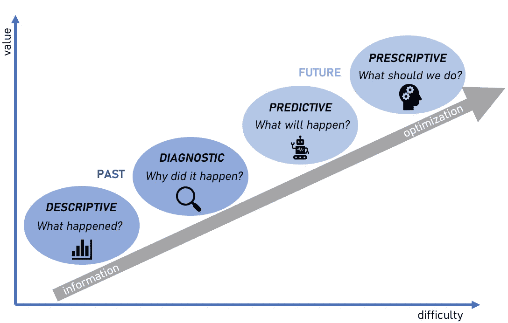
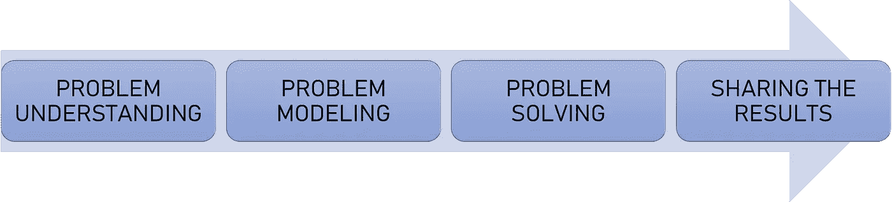

# 为什么每个数据科学家都应该学习数学优化

> 原文：<https://towardsdatascience.com/why-every-data-scientist-should-learn-mathematical-optimization-3ac102663456>

阿曼德·库利在 [Unsplash](https://unsplash.com?utm_source=medium&utm_medium=referral) 上拍摄的照片

**数据科学课程侧重于数据可视化、特征工程、数据处理、(无)监督学习、聚类、编程、深度学习，有时还包括数据工程。优化不是这些课程的一部分，大部分甚至没有提到！这是一个遗憾，因为它可以在许多业务流程中增加价值。优点是它的灵活性，简易性和牢固性。它拥有机器学习无法完成的能力。通过优化，你可以做出决策，而通过机器学习，你可以做出预测。好奇？继续读！**

# 数据分析的四种类型

> 如果你熟悉这四种类型的数据分析，你可以跳过这一节。

在下图中，您可以找到四种类型的分析。

四种类型的分析:描述性、诊断性、预测性和规定性分析。图片作者。

1.  **描述性分析**
    这种类型侧重于总结过去的数据。它被广泛用于跟踪 KPI。数据显示在仪表盘或报告中，并且每天、每周或每月持续更新。这是最简单的分析。你从数据库中提取数据，你可以开始可视化。
2.  **诊断分析** 深入挖掘，找出事情发生的原因，诊断分析就来了。这种类型的分析采用从描述性分析中发现的见解，并深入寻找这些结果的原因。一个例子是根本原因分析。
3.  **预测分析**
    预测分析想要告诉你一些关于未来的事情，预测可能会发生的事情。这是使用预测或机器学习技术来完成的。
4.  **规定性分析** 关于“下一步最好做的事”的建议属于规定性分析。在当前的情况下，决定采取什么样的行动是很困难的，但是这就是为什么规定性分析有可能为企业增加更多的价值。这里可以使用人工智能或数学优化(除了其他技术)。

# 最佳化

数学优化属于规定分析部分，这使它成为一种真正有价值的技术。它广泛应用于能源、医疗保健、物流、体育赛事、金融、制造和零售等领域。你可以优化包裹的路线，选择最具成本效益的方式来提供电力，创建工作时间表或以诚实的方式分配任务。

[马修·史密斯](https://unsplash.com/@whale?utm_source=medium&utm_medium=referral)在 [Unsplash](https://unsplash.com?utm_source=medium&utm_medium=referral) 上拍照

但是到底什么是数学优化呢？它是如何工作的？这一切都始于一个业务问题。想象一下，你是一家快递公司的一员，你发现包裹到达客户手中的时间太晚了。你收到投诉并开始分析。你的送货过程一定有问题。你会发现每个快递员只是随机抽取一定数量的包裹进行递送。在递送一个包裹后，递送者使用谷歌地图来查找如何到达下一个地址。哇，这么多优化的可能性！你开始思考:如果送货车装满了包裹，包裹离得很近，送货人沿着最短的路线走，会怎么样？这将对交付过程产生巨大的影响！交货时间将会改善，这将导致更少的投诉和更满意的客户！递送员可以在更短的时间内递送更多的包裹，并且货车使用更少的燃料。只有赢在这里！🎉

为送货人寻找最佳路线、选择彼此靠近的包裹以及装满货车都是可以使用优化解决的例子。要解决这类问题，您应该采取以下步骤:

图片作者。

你应该从理解问题开始。这包括定义问题，设定界限，与利益相关者交谈，找出你想要最小化或最大化的价值。

下一步(通常也是最难的一步)是对问题建模。你应该把你在第一步中发现的一切都转化为数学。这意味着定义**变量**、**约束**和**目标**。你可以把变量想象成你可以影响的值。例如，如果您想选择 x 个彼此相邻的包裹，每个包裹将收到一个组号。与包相关的组号可以是变量。约束是您希望在模型中使用的限制。假设一辆货车最多可以装载 600 公斤的包裹，这是一个限制的例子，一辆货车所选包裹的总重量不能超过 600 公斤。最后但同样重要的是，目标是您想要最大化或最小化的公式。如果我们在讨论一个路径问题，你可以想象你想要最小化总的旅行里程数。使用数学对问题建模后，您可以继续下一步。

如果你正确地做了前面的步骤，并且知道如何编码，解决这个问题并不难。对于求解步骤，你需要一个框架和一个求解器。一些示例框架是 [pyomo](http://www.pyomo.org/) 、[或 tools](https://developers.google.com/optimization) 、 [pulp](https://github.com/coin-or/pulp) 或 [scipy](https://scipy.org/) 。自由解算器的例子有 [cbc](https://github.com/coin-or/Cbc) 、 [glpk](https://www.gnu.org/software/glpk/) 和 [ipopt](https://coin-or.github.io/Ipopt/) 。也有可用的商业解算器，它们要快得多，如果你想解决有许多变量和约束的问题，你应该使用商业解算器。你用 Python 编写你的问题例如，你调用求解器并等待结果。现在可以继续最后一步了。

您可以分析求解器得出的结果，以发现性能的提高。您可以将这些结果与当前的流程进行比较，看看是否值得将该模型投入生产以不时地优化您的流程。

如果你想在简单的现实生活例子中看到这些步骤，你可以在这里找到它们。[本文](https://hennie-de-harder.medium.com/taking-your-optimization-skills-to-the-next-level-de47a9c51167)讨论更高级的概念。

# 结论

优化是如此强大，每个数据科学家都应该能够实现它，或者至少熟悉它解决复杂业务问题的可能性。这是对机器学习的补充，因为你可以做决定，而不是预测。不需要带标签的数据。此外，当数据分布发生变化时，没有必要重新训练模型。

感谢阅读，享受优化！❤

> 除了上面提到的文章，如果你想开始学习优化的基础知识，我可以推荐[这个 Udemy 课程](https://www.udemy.com/course/optimization-with-python-linear-nonlinear-and-cplex-gurobi/)和[OR 工具示例](https://developers.google.com/optimization/examples)。

## 有关系的

</how-to-handle-optimization-problems-daf97b3c248c>  </taking-your-optimization-skills-to-the-next-level-de47a9c51167>  

*别忘了* [*订阅*](https://hennie-de-harder.medium.com/subscribe) *如果你想在我发表新文章时收到电子邮件。*