# 为什么梯度裁剪方法加速了训练

> 原文：<https://towardsdatascience.com/why-gradient-clipping-methods-accelerate-training-d3094e3290a>

马丁·亚当斯在 [Unsplash](https://unsplash.com/s/photos/optimization?utm_source=unsplash&utm_medium=referral&utm_content=creditCopyText) 上的照片

## 加速方法现在有了理论依据

优化分析是**机器学习**中一个活跃的研究和兴趣领域。我们中许多上过优化课的人都知道，有一些加速优化方法，如 ADAM 和 RMSProp，在许多任务上比标准梯度下降法更好。尽管这些自适应方法被广泛使用，但是直到最近，它们为什么在非凸问题上表现良好的理论依据还不存在。今天，我想介绍一下 2020 年发表的一篇论文《为什么梯度裁剪会加速训练:适应性的理论辩护》。

**TL；DR**
在一种新颖的、宽松的平滑条件下，这种平滑条件是由梯度范数和 Lipschitz 常数的经验分析所激发的，对于为什么梯度削波/归一化梯度方法优于标准方法有一个理论解释。

# 贡献:

论文的贡献可以概括为:

*   一种宽松的平滑条件，允许局部平滑常数随梯度范数增加。
*   松弛光滑条件下*限幅*梯度下降和归一化梯度下降的收敛速度。
*   松弛光滑条件下*普通*梯度下降收敛速度的上下限，证明*普通*梯度下降可以任意慢于*削波*梯度下降。
*   类似地，*限幅*随机梯度下降和*普通*随机梯度下降的上界，证明了*限幅* SGD 可能任意快于*普通* SGD。

# l-光滑性

在引入提出的松弛光滑条件之前，让我们回顾一下 L-光滑函数的定义。

定义:目标函数 *f* 被认为 *L-* 平滑，如果:

(等式 1)

对于二次可微函数，这个条件等价于(设置 *y = x-h* ):

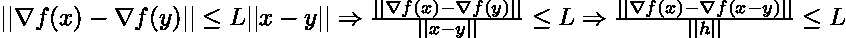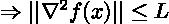

(等式 2)

作者解释说，L-光滑性的这一定义的局限性是，假设存在一个整体常数 L，它限制了梯度的变化。即使是简单的多项式函数如 *f(x) = x*x*x* 也能打破假设。一种补救方法是假设 L 存在于某个局部区域中，并表明迭代不会脱离该区域，或者运行基于投影的算法来保证迭代不会脱离该区域。然而，这种补救措施会使 L 变得非常大，并且不会有助于严格的理论收敛速度。

本文背后的主要动机可以归结为这个问题:

> 我们能否找到一个细粒度的光滑条件，在这个条件下，我们可以同时从理论上和经验上设计快速算法？

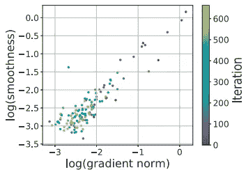

图一。梯度范数和 Lipschitz 常数(L)的图表显示了很强的正相关性。(来源:【https://openreview.net/pdf?id=BJgnXpVYwS )

为了从经验上理解梯度和李普希茨常数之间的关系，作者展示了梯度范数和李普希茨常数的图，该图显示了很强的正相关性(图 1)。正相关的假设是梯度和 Hessian 在它们的计算中共享分量，例如权重的矩阵乘积。**为了捕捉李普希茨常数和梯度范数之间的正相关性，作者提出了一个宽松的(较弱的)光滑性条件，允许局部光滑性随着梯度范数增长。**

# 松弛光滑条件

定义:二阶可微函数 *f* 是(L0，L1)-光滑的，如果:

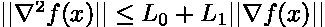

(等式 3)

这个定义是一个宽松的条件，因为可以平衡 L0 和 L1，使得 *L0 < < L* 和 *L1 < < L.* 其次，我们可以找到全局( *L0，L1* )光滑的函数，但不是*L-光滑的函数。*文中的一个引理有助于更好地理解松弛条件的第二个好处:对于多项式次数大于或等于 3 的一元多项式函数，该函数是( *L0，L1*)-光滑的，而不是*L*-光滑的。宽松条件只是要求 *f* 的二阶导数小于 *f* 的一阶导数，可以表示为 *:*

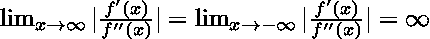

(等式 4)

这是真的，因为一阶导数必须是比二阶导数更高的多项式。然后，当 x 接近正/负无穷大时，分数的绝对值将是无穷大。

我们可以从*L*-smooth(eq 2)的定义中知道这个函数不是 *L* -smooth，它要求 *f* 的二阶导数的范数有界于某个常数 *L，*然而*f″(x)*无界*。*

# 问题设置和假设

有了动机和提出的条件，在进行理论分析之前，我们继续看问题的设置和必要的假设。

我们定义 *f* 为非凸优化问题。因为这个优化问题通常难以直接解决，所以通常的做法是进行优化，直到达到ε驻点。

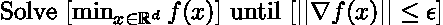

(4)

接下来，对要研究的函数类作出以下假设。

*   假设 1:函数 *f* 的下界为 *f* *，大于负无穷大。
*   假设 2:函数 *f* 是两次可微的。
*   假设 3:函数 *f* 是(L0，L1)-光滑的(等式 3)。
*   假设 4:给定一个初始化 x0，我们假设:

(等式 5)

假设 4 允许我们假设目标函数 *f* 的梯度范数可以由某个常数有界。这个常数 M 对于“坏的”初始化 x0 会更大，对于“好的”初始化会更小。

最后，为了放松全局假设，对于初始化 x0，上述假设仅需要在由 S 定义的局部区域中成立:

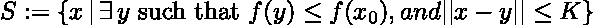

其中 K 是任何固定的正常数。(等式 6)

# 削波/归一化梯度下降的收敛性

**削波梯度下降**使用以下等式在每次迭代中更新其权重:

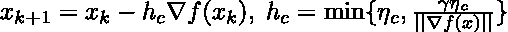

(等式 7)

**归一化梯度下降**有如下更新:

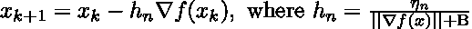

(等式 8)

通过更仔细的检查，我们发现这些更新非常相似。通过允许

我们有

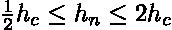

**这些更新相当于一个常数因子，因此对削波梯度的分析也适用于归一化梯度下降。**

然后，对于满足假设 1、2 和 3 并且在集合 S(等式 6)中的一类函数，限幅 GD 的迭代复杂度的上限为:

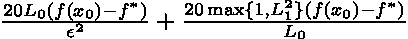

(等式 9)

在哪里

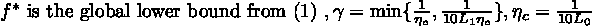

换句话说，限幅 GD 的上限为

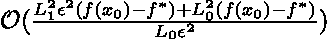

(等式 10)

# 香草梯度下降的收敛性

普通梯度下降在每次迭代中使用以下公式更新其权重:

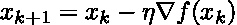

(等式 11)

对于满足假设 1、2、3 和 4 并且在集合 S(等式 6)中成立的一类函数，并且 M 如假设 4 中所定义的，标准 GD 的迭代复杂度的上限为:

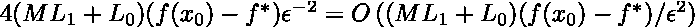

具有固定步长的标准 GD 的上限和 Big-O(等式 12)

作者进一步提供了固定步长香草梯度下降的下界，并表明它不能比以下更快地收敛到ε-驻点:

(等式 13)

请注意，普通 GD 的 Big-Omega(最佳情况)和 Big-O(最差情况)符号相差 log(M)倍。比较限幅 GD 的上界和普通 GD 的上界，我们可以知道，当 M 较大，或者问题初始化较差时，限幅 GD 可以任意快于 GD。

这在直觉上也是可以接受的。当权重初始化不良时，梯度可以取任意小或大的值，并且正则化(削波)权重将稳定训练，从而导致更快的收敛。这是凭直觉知道的，但直到现在才得到理论上的解释。

本文通过采用第五个假设，将复杂性分析扩展到非确定性(随机)梯度下降设置。它得出一个类似的结论，当 *M* 很大时，限幅 SGD 可以任意快于普通 SGD。

# 结论

今天介绍的论文最终弥合了理论快速算法和经验快速算法之间的差距。提供的分析让我们对加速优化方法的选择充满信心，并提醒我们正确初始化的重要性。

对于那些有兴趣在这一领域继续研究的人，作者留下了可能改进的方向。首先是将这种分析扩展到其他加速方法，如动量法。第二个方向是进一步研究经验激励的平滑条件，提供更紧密和更清晰的理论保证。

参考文献:
[1]张，何，苏，贾德贝，为什么梯度裁剪加速训练:适应性的理论辩护(2020)，2020