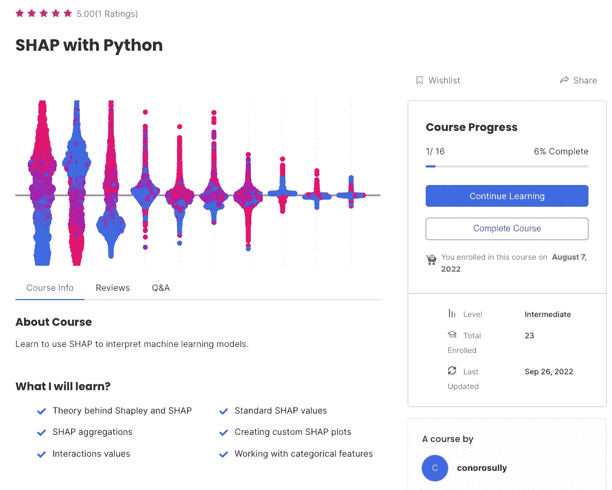

# 为什么我决定攻读机器学习博士学位

> 原文：<https://towardsdatascience.com/why-i-decided-to-do-a-phd-in-machine-learning-fdee03bb956f>

## 我离开工业界进入学术界的 5 个关键原因

由 [Unsplash](https://unsplash.com?utm_source=medium&utm_medium=referral) 上的[美元吉尔](https://unsplash.com/@dollargill?utm_source=medium&utm_medium=referral)拍摄的照片

紧张的日程安排、不合作的主管和低工资。你不必苦苦寻求建议*反对*读博士。更糟糕的是，这大部分来自学生自己。

那么为什么会有人想读博士呢？

我认真思考了我的决定，我想和你分享原因。如果你正在考虑读博士，希望他们能帮你做决定。

## 我不喜欢朝九晚五的生活

第一种是常见的。在面试过程中，一位教授问道:

"为什么这么多申请者都有 2-3 年的行业经验？"

他想了解这种趋势的原因。我不能代表其他人，但我只是…很无聊。

在很大程度上，我喜欢自己作为数据科学家的角色。我研究有趣的数据集，建立有影响力的模型。然而，我变得不快乐。我的学习开始停滞不前，我开始对僵化的朝九晚五的时间表感到沮丧。主要是由于我所处的行业，我没有目标感。是改变的时候了。

同样，我认为更广泛的趋势是由这种改变的需要所驱动的。我周围的朋友都在辞掉工作。我们中的许多人已经对成为专业人士的意义不再抱有幻想(如果你愿意，可以称之为四分之一生命危机)。同时，我们有了更多的人脉和经验。那些没有接受世俗的人正在利用这些来寻找更好的机会。

就个人而言，这次经历是一次觉醒。我一直很努力。我天真地以为自己会自然而然地得到一个好职位。我指的是提供有趣和满足感的工作。这不是真的。我意识到我需要自己找到它。

## 我发现了一个有趣且有成就感的项目

这一搜索让我获得了都柏林大学(UCD)的博士学位。我将应用 ML 来监控爱尔兰海岸线(我刚刚开始，所以请不要问我细节)。首先，我将使用开源卫星数据和计算机视觉方法。从那时起，我将对博士学位的方向有很大的控制权。

这种控制对我来说很重要。我的意图实际上是攻读可解释机器学习的博士学位。我发现这个子领域非常有趣，我已经写了很多关于方法的文章，比如和[PDP](/the-ultimate-guide-to-pdps-and-ice-plots-4182885662aa)。虽然这不是重点，但我将有自由在我的研究中融入 IML 方法。事实上，在遥感应用中需要这些。

> 大多数深度学习技术没有披露数据特征如何生效以及为什么进行预测。遥感大数据加剧了当前人工智能不透明和不可解释的问题。
> 
> — [教授王博士](https://www.mdpi.com/journal/remotesensing/special_issues/XAI_big_data)

最终，我仍然能够在 IML 探索我的兴趣。与此同时，处理气候数据给了我一种使命感。至关重要的是，为了满足我的第三个理由，我还会在这个过程中发展新的技能。

## 这将导致一个更有趣的工作

当我开始寻找改变时，我不仅仅是寻找博士职位。我也申请了工业界的职位。我甚至接受了一些采访。问题是我被最有趣的学校拒之门外。

我对更高级的数据科学角色感兴趣。即使用最新的工具并将 ML 应用于图像或文本数据。虽然我是一名数据科学家。我更关注表格数据，并且使用了过时的工具。任何建模都是通过简单的逻辑回归完成的。

我需要提高技能，是的，我能听到你在尖叫——“有比博士学位更好的提高技能的方法！”我同意，但这些都不符合我最后的理由。我也被 ML 研究科学家的角色所吸引。其中绝大多数都需要博士学位。

## 我喜欢写作

无论是学术论文还是期末论文，写作似乎都是博士生的主要压力来源。然而，这部分研究并没有让我担心。我真的很喜欢写作，在媒体上呆了 3 年后，我有了很多练习。

好吧，所以学术论文要严谨得多。尽管如此，我开发的技能使他们不那么令人生畏。同时，博士研究将有利于我的媒体页面。

为了不断创造新的内容，你必须不断学习新的东西。学习是任何博士学位的核心。重要的是，所有的工作都是开源的。与行业角色不同，这意味着我可以分享我学到的一切。灵活的时间表也让我能够平衡博士的工作量和内容创作。

## 我想在网上赚钱

我必须承认，我更喜欢通过写作赚钱。3 年的努力工作(和运气)创造了一个收入流，这将补充我的津贴。然而，网上赚钱容易上瘾，我决定更认真地对待它。

我最近推出了一个 [Python SHAP 课程](https://adataodyssey.com/courses/shap-with-python/)和一个[时事通讯](https://mailchi.mp/aa82a5ce1dc0/signup)(如果你注册，你将可以免费使用该课程)。我甚至开始告诉人们，我经营着一家小型(也称微型)在线企业。通过更好的内容创作，博士学位将帮助我发展这项业务。

(来源:作者)

经过 4 年的博士学习，希望它能提供一个重要的收入来源。我最想做的就是全职做这件事。然而，我的目标是赚足够的钱来扩展我的选择。这就是为什么我不需要仅仅根据薪水来做职业决定。

最后，这四个原因结合在一起。我需要改变，并且我找到了一个有趣且令人满意的机会。这个机会将允许我写作和发展我的网上业务。同时，内心的实用主义者也满足了。我还将发展技能，从而获得博士和商业之外的机会。

我读博士才一个月。然而，我已经学到了很多，也遇到了很多有动力和兴奋的人。希望能保持下去。否则，请留意这篇题为“为什么读博士是我一生中最糟糕的决定”的文章。

我希望你喜欢这篇文章！你可以成为我的 [**推荐会员**](https://conorosullyds.medium.com/membership) **:)** 来支持我

 [## 通过我的推荐链接加入 Medium 康纳·奥沙利文

### 作为一个媒体会员，你的会员费的一部分会给你阅读的作家，你可以完全接触到每一个故事…

conorosullyds.medium.com](https://conorosullyds.medium.com/membership) 

|[Twitter](https://twitter.com/conorosullyDS)|[YouTube](https://www.youtube.com/channel/UChsoWqJbEjBwrn00Zvghi4w)|[时事通讯](https://mailchi.mp/aa82a5ce1dc0/signup) —注册免费参加 [Python SHAP 课程](https://adataodyssey.com/courses/shap-with-python/)