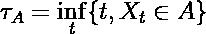
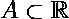
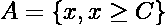
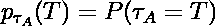
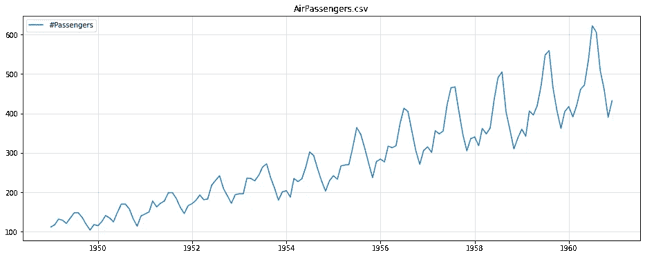
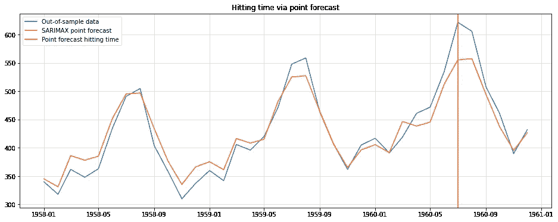
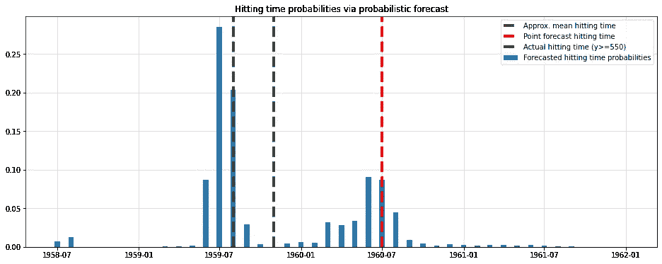
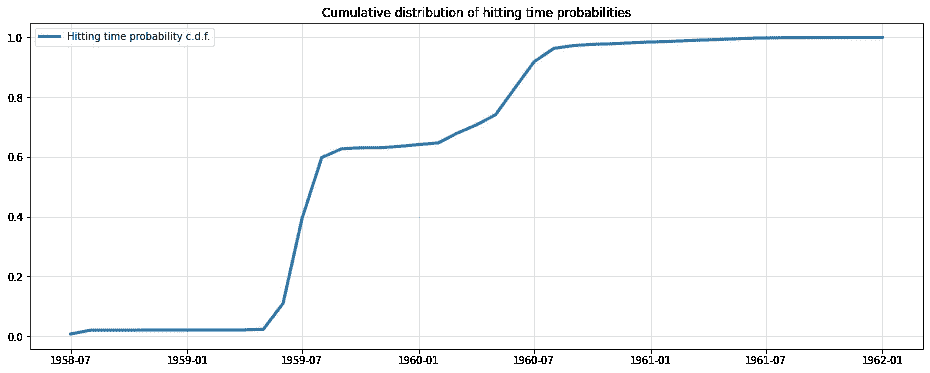

# 为什么我更喜欢概率预测——命中时间概率

> 原文：<https://towardsdatascience.com/why-i-prefer-probabilistic-forecasts-hitting-time-probabilities-726667b9c91d>

## 点位预测有利于决策。有了概率预测，你也可以做出正确的预测。

照片由[阿伦视觉](https://unsplash.com/@aronvisuals?utm_source=unsplash&utm_medium=referral&utm_content=creditCopyText)在 [Unsplash](https://unsplash.com/s/photos/time?utm_source=unsplash&utm_medium=referral&utm_content=creditCopyText) 拍摄

# 介绍

在数据科学中，预测通常涉及创建预测未来事件的最佳模型。通常，“最佳”模型是最小化给定误差度量的模型，例如*均方误差* (MSE)。最终结果是一系列数值，描述了时间序列的预测轨迹。统计学家或计量经济学家称之为*点预测。*

更传统的预测模型通常预测给定未来时期的整个概率分布。从现在开始，我们将这些*称为概率预测*。

概率预测的一个好处是能够导出点预测和*区间预测。*将后者视为应用于预测的置信区间的时序模拟。

当然，一个点的预测更容易传达给非技术利益相关者。谁想处理所有可能的结果——给我一个衡量标准来作为我决策的依据！

现在，确实存在着过于复杂的解决方案最终被贵公司搁置的风险。然而，我们也不应该仅仅为了取悦我们的非技术终端用户而过多地降低复杂性。

作为一个例子，让我们看看击中时间的问题。在你的标准数据科学课程中，这是一个相当不常见的话题。尽管如此，它还是很有用的。

# 击中次数和击中时间概率

为了我们的目的，我们用一个非常直观的定义:一个 [*击中时间*](https://en.wikipedia.org/wiki/Hitting_time) 仅仅是我们的时间序列第一次进入观察空间的某个子集。数学上，

(图片由作者提供)

在哪里

(图片由作者提供)

并且我们假设时间序列在实数中有实现。后者不是一个必要的要求，但使问题变得更加具体。

我们可以问的一个可能的问题是，当过程第一次超过给定的阈值时。我们感兴趣的子集是

(图片由作者提供)

有了`C`利益的门槛。现在，当我们谈论击中时间**概率**时，我们想知道击中时间的概率分布，即

(图片由作者提供)

对于连续时间的时间序列，`p`通常是一个概率密度..然而，由于数据科学中的大多数时间序列问题都是离散的，所以让我们也专注于这种情况。因此，`p`是通常更容易处理的概率质量函数。

不幸的是，击中时间的概率很难分析计算，而且往往难以处理。

幸运的是，概率模型可以通过蒙特卡罗模拟来回答击中时间的问题。我们将在下面进一步研究这种方法。

起初，击中时间概率的想法可能看起来像一个很好的玩具问题，几乎没有实际意义。然而，请考虑一个简单的容量规划问题。由于需求增加，公司可能必须决定何时扩大运营能力。

一方面，这在某种程度上肯定可以用一个点预测来回答。只需选择您预测超过阈值的时间戳作为您的预测命中时间。如果一个分数预测首先就足够了，那么一个击球时间的“分数预测”肯定也能很好地工作。

让我们看一个简单的例子:

# 在野外击中时间的概率

为了简单起见，我们使用古老的[航空乘客](https://www.kaggle.com/datasets/rakannimer/air-passengers)数据集。请记住，单个实验远远不足以得出任何概括的结论。

最辉煌的*航空乘客*数据集。(图片由作者提供)

虽然这些数据已经严重过时，但它足够简单，可以帮助我们快速地阐明观点。

## 命中时间点预测

首先让我们考虑如何使用标准点预测来解决命中时间问题。最终，我们只能确定我们的预测何时达到某个阈值。

这里我选择了**550**乘客的任意阈值。对于数据背后的虚构航空公司来说，这可能会为何时增加机队运力提供重要线索。

对于点预测方法，程序现在很简单:

1.  拟合任意时间序列模型(这里我们将使用 SARIMAX (12，1，1，1)模型来捕捉趋势和年度季节性)。
2.  在足够长的时间范围内进行预测，以使时间序列超过给定的阈值。
3.  将预测第一次超过阈值的时间戳标记为您的击中时间。

对于`statsmodels.tsa.sarimax.SARIMAX`，这看起来如下:

C>=550 的点预测和各自的预测击中时间。(图片由作者提供)

事后来看样本集，我们发现我们的击中时间预测晚了一年。在现实世界的应用程序中，迟到一年可能会对您的业务案例造成不利影响。

正如我们将看到的，概率变量给出了一个更完整的图像。不幸的是，我们不能以封闭的形式计算各自的概率质量函数。

## 命中时间概率的蒙特卡罗估计

幸运的是，`statsmodels` ' SARIMAX 提供了均值和标准差预测。由于预测分布是高斯分布，我们可以使用这个知识进行[蒙特卡罗模拟](https://en.wikipedia.org/wiki/Monte_Carlo_method)。从那里，我们可以估计每个月成为`C=550`的命中时间的概率:

击中次数(C>=550)的概率质量函数(蒙特卡罗估计)。(图片由作者提供)

这个看起来好多了。我们的模型预测，时间序列将最有可能在预测点预测前一年超过阈值。事后的数据也更加符合这一预测。

此外，我们还看到，预测击中时间点(红线)也不是概率变量的期望值(紫线)。这是很重要的，因为实际时间序列的点预测实际上是概率预测的平均值。

然而，由于 SARIMAX 的潜在动力，这并不能转化为平均击球时间。

最后，让我们看看我们的质量函数估计的累积分布函数:

击中时间概率的累积分布函数(蒙特卡罗估计)。(图片由作者提供)

在这里，超过阈值的概率在第二年已经超过 60%，而不是第三年。点预报打击时间不合适的另一个原因。

# 结论

虽然使用点预测通常更方便，但在某些情况下，这种复杂性降低可能会太多。即使在这个相当简单的例子中,“简单”方法也已经落后一年了。

当然，你特殊的击球时间问题可能会让你走上直路。但是，请记住，您只能在事后判断预测的质量。到那时，再转向上面讨论的更复杂但也更全面的方法显然为时已晚。

最终，概率性预测总是可以简化为单点预测。反之亦然，不幸的是事实并非如此。就我个人而言，我非常推荐概率路线，因为它还有许多其他优点。

在以后的文章中，我计划提供更多关于其他优势的见解。如果您感兴趣，请随时订阅，以便在那时收到通知。

# 参考

**【1】**Bas，Esra。*概率和随机过程基础*。斯普林格国际出版公司，2019 年。

**【2】**汉密尔顿，詹姆斯·道格拉斯。*时间序列分析*。普林斯顿大学出版社，2020 年。

Hyndman，Rob J .和 George Athanasopoulos。*预测:原理与实践*。OTexts，2018。

**数据集:**[https://www.kaggle.com/datasets/rakannimer/air-passengers](https://www.kaggle.com/datasets/rakannimer/air-passengers)(在开放数据库许可证(ODbL) 1.0 下许可)

*原载于 2022 年 12 月 6 日 https://www.sarem-seitz.com**的* [*。*](https://www.sarem-seitz.com/why-i-prefer-probabilistic-forecasts-hitting-time-probabilities/)