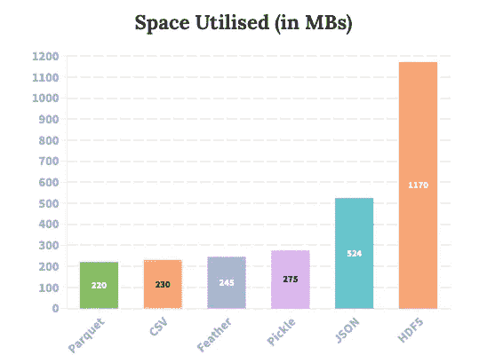
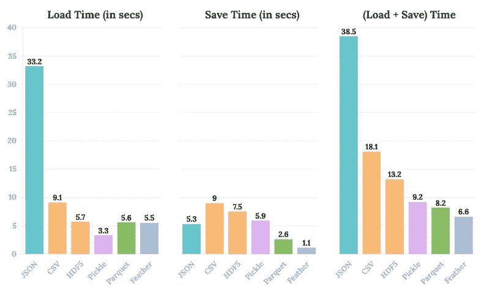

# 为什么我停止向 CSV 转储数据帧，为什么您也应该这样做

> 原文：<https://towardsdatascience.com/why-i-stopped-dumping-dataframes-to-a-csv-and-why-you-should-too-c0954c410f8f>

## 是时候告别 pd.to_csv()和 pd.read_csv()了

米卡·鲍梅斯特在 [Unsplash](https://unsplash.com?utm_source=medium&utm_medium=referral) 上的照片

构建端到端的数据驱动管道极具挑战性，要求也很高。我自己也经历过，这个过程非常繁琐，最终可能不可避免地会有许多中间文件。虽然这些文件通常用作检查点或帮助管道中的其他模块，但如果没有为这些中间文件选择合适的格式，可能会不知不觉地损害运行时和提升存储要求，因为首选格式总是 CSV。

作为一名数据科学家，我知道 CSV 在数据读取、写入、预览、探索等方面提供了巨大的灵活性。它是你、我和几乎所有使用数据框架的人的首选格式。我过去常常利用 CSV 格式导出数据帧**，直到最近**，我发现了一些节省时间和存储优化的 CSV 替代方案。

幸运的是，Pandas 提供了多种文件格式来保存数据帧，例如:

1.  战斗支援车
2.  泡菜
3.  镶木地板
4.  羽毛
5.  JSON
6.  HDF5

这促使我根据上述形式在以下参数上的体验表现对其进行排名:

1.  它们在磁盘上占据的空间。
2.  对磁盘进行读写操作所需的时间。

# 实验装置

出于实验的目的，我用 Python 生成了一个包含一百万行三十列的随机数据集——包括字符串、浮点和整数数据类型。

我将下面描述的每个实验重复了十次，以减少随机性，并从观察结果中得出公正的结论。下面的统计数据是十次实验的平均值。

# 实验

## 实验 1:保存后利用的磁盘空间

文件格式的内存利用率(图片由作者提供)

*   显然，如果你正在寻找一种内存优化的格式，HDF5 应该**而不是**成为你的首选。这里，所利用的磁盘空间是上图中最佳格式的两倍多——JSON，它本身的大小接近其他四种格式的两倍。
*   到目前为止， *Parquet、CSV、Feather 和 Pickle* 似乎是存储我们的数据帧的合适选项，因为它们都为相同数量的数据阻塞了辅助存储的大致相同的部分。

## 实验 2:加载和保存花费的时间

以各自的格式加载和保存数据帧所花费的时间。(图片由作者提供)

这是我们开始注意到使用 CSV 格式的缺点的地方。

*   现在让我们单独考虑加载时间。读取一个 CSV 文件所用的时间几乎是这里最好的选择——pickle 的三倍(T1)、三倍(T3)。此外，正如我们前面看到的，Pickle 和 CSV 占用的空间相同，为什么要选择较慢的选项呢？
*   关于节省时间，CSV 是可供选择的最昂贵的选项——消耗接近羽毛的八倍。

显然，在将数据帧存储为特定格式时，加载时必然会再次使用相同的格式。换句话说，一旦您将数据帧存储为 pickle，您就别无选择，只能将其作为 pickle 文件读取。因此，在上面的第三个条形图中，我们查看它们的总效率，即加载时间+保存时间。

*   遗憾的是，CSV 并不是我们的最佳选择。
*   与 Feather、Parquet 和 Pickle 相比，CSV 的平均速度**是这些格式的 2.5 倍**，这是非常高的。

在我看来， *Parquet* 和 *Feather* 是我们在这篇文章中探讨的六种文件格式中最好的选择。

# 结束语

我知道 CSV 很棒。我也爱他们，我是 CSV 的粉丝，原因数不胜数，比如:

*   如果需要，CSV 允许我只读取列的子集，从而节省 RAM 和读取时间。
*   CSV 本质上是一个文本文件。因此，Pandas 允许我查看 top-n(比如 5、10、15 等。)CSV 中存在的行。
*   Excel 是我最喜欢的工具之一，我可以直接在 Excel 中打开一个 CSV。

然而，CSV 正在扼杀你的管道。事实上是的。仅仅因为到处都有 CSV，您就要花费大量的时间进行读写操作。

除非您需要在非 pythonic 环境(如 Excel)之外查看数据框架，否则根本不需要 CSV。您应该更喜欢 Parquet、Feather 或 Pickle，因为正如我们在上面观察到的，它们提供的读写操作比 CSV 快得多。

所以下次当你准备执行 *pd.to_csv()* 的时候，想想你是否真的需要一个 csv。

作者使用 memegenerator.net 创建的图像