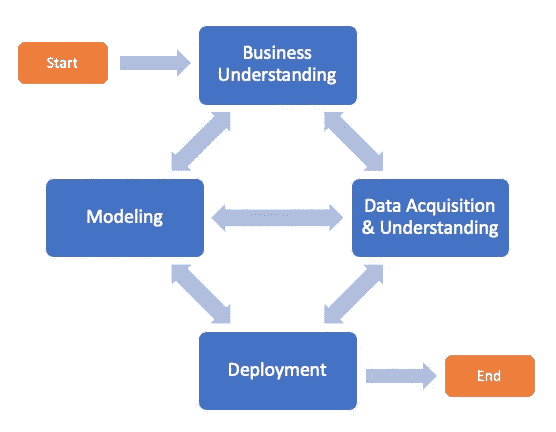
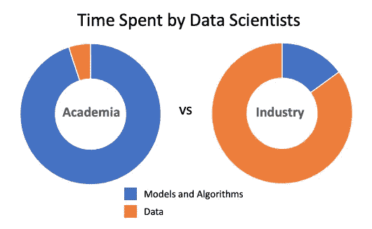

# 为什么我没有为我的第一份数据科学工作做好准备

> 原文：<https://towardsdatascience.com/why-i-wasnt-prepared-for-my-first-data-science-job-b727d5c8230b>

## 为什么你可能不是呢！

克里斯蒂安·埃尔富特在 [Unsplash](https://unsplash.com?utm_source=medium&utm_medium=referral) 上拍摄的照片

回到 2008 年，金融危机正如火如荼，我急需一份工作。我刚刚从应用数学的研究生院毕业，我不知道我要做什么工作。2009 年，我找到了第一份工作，成为一名数据科学家。第一天，我对自己在研究生院学到的技术和算法充满信心，但很快发现，我的学校教育并没有让我为工作中需要掌握的任何技能做好准备。

十多年过去了，我仍然遇到同样毫无准备的应届毕业生。但是为什么会这样呢？

# 数据科学生命周期

图 1:数据科学生命周期。图片作者。

为了回答这个问题，我发现自己在回顾数据科学的生命周期(图 1)。你会注意到生命周期并不是完全线性的。在数据科学行业工作了几年后，我发现随着更多信息的披露或准确性阈值没有完全达到，您可能会从一个阶段回到另一个阶段。然而，在学校里，我学到了一套简单的线性步骤:

*特征工程- >建模- >完成！*

线性生命周期并没有考虑到您将会发现的信息，这些信息可能会引导您回到生命周期中的前几个步骤。事实上，你甚至会发现你的问题无法用你现有的数据来解决。在行业中，一个新的机器学习产品首先是作为概念验证开始的，因为你不知道它是否会工作。不幸的是，在学术界，教授必须给你的工作打分，所以他们确保问题有解决方案。虽然这使得分级更简单，但对于行业实践来说是不现实的。在您开始概念验证或查看数据之前，您无法知道您的问题是否有解决方案。

这种二分法可能会导致新的数据科学家认为每个问题都有解决方案，而在行业中，您的数据可能无法解决您的问题，解决问题的技术尚不存在，或者有许多其他原因。当你的机器学习项目失败时，你和你的经理可能会开始认为机器学习项目有风险，预算中的美元可能会分配给其他风险较小的工作。如果你习惯了在学校 100%的成功率，这可能会非常令人沮丧。因此，数据科学家和管理者应该考虑失败，即学习机会是成功。

> “我没有失败。 **我刚刚发现了一万种行不通的方法。”—托马斯·A·爱迪生**

## 商业理解

回顾图 1 中的生命周期，您会注意到生命周期的第一步是业务理解。您应该从了解业务领域、其流程和数据开始每个概念的验证。拥有这些基础知识甚至可以帮助你发现新的问题来解决。不幸的是，在学校里，我只学会了如何解决问题，而没有学会如何*识别*它。

我经常从新数据科学家那里听到同样的故事:他们的老板希望他们识别机器学习用例，但他们不知道如何识别。如果幸运的话，他们可以直接接触到客户或真正伟大的产品所有者。但是这些人只能告诉他们他们的业务流程。他们可能没有机器学习的知识，所以他们可能无法识别适当的机会。

照片由 [Towfiqu barbhuiya](https://unsplash.com/@towfiqu999999?utm_source=medium&utm_medium=referral) 在 [Unsplash](https://unsplash.com?utm_source=medium&utm_medium=referral) 上拍摄

我也见过新的数据科学家试图不与客户交谈就完成一个项目。这样做的数据科学家可能会选择从他们的数据集中删除空值，但是如果他们与客户交谈，他们可能会发现用户在某些情况下选择不输入数据。这导致画面不完整，并可能在构建模型时造成偏差。访问客户可以帮助您快速了解各种客户行为甚至业务规则是如何影响数据集的。

从许多方面来说，业务理解是生命周期中最关键的部分，但在当今的数据科学课程中却常常缺乏。

## 数据采集和理解

在第一轮业务理解之后，下一步可能是获取数据集。在学校里，我可以立即获得多个数据集，但我发现在我的职业生涯中，获取数据可能需要几天、几个月或几年的时间！事实上，解决您的问题的数据可能还不存在。我理解学术界为什么会出现这种情况——你只有有限的时间做家庭作业，所以你不能让你的学生像业内人士那样花整个学期来获取数据。然而，这让学生对现实世界毫无准备。

数据科学项目中经常缺乏的另一个领域是数据理解。当我毕业时，我几乎没有在数据集上执行探索性数据分析的经验。在学校，我主要学习模型和算法，但一旦我开始我的第一份工作，我几乎所有的时间都集中在数据和数据中的偏见上。当你不花时间探索你的数据时，你就增加了放大你的机器学习模型中的偏差的可能性。正确探索数据和使用适当的数据采样技术是关键。

## 建模

我认为我所受的教育为我做好了充分的准备。不幸的是，我只花了大约 15%的时间在建模上。正如我在上一节中提到的，我其余 85%的时间都花在获取和理解数据上。

图 2:数据科学家在学术界和工业界花费的时间。图片作者。Andrej Karpathy 是特斯拉人工智能的高级主管，[描述了他在完成博士学位并开始在特斯拉工作后的类似经历。](https://youtu.be/y57wwucbXR8?t=521)

但是为什么学术界关注的是模型和算法，而工业界关注的是数据？可能是廉价、高质量、真实的数据集很难得到。虽然理解不同算法背后的理论以及如何使用它们很重要，但更重要的是理解数据和数据中的偏差。

举个例子，一个心理学家想要进行一项研究，但是没有足够的资金。为了降低成本，心理学家可能会在他们的研究中使用 18-24 岁的大学生。虽然心理学家可能会发现重要的结果，但他们样本中的个体可能并不代表整个人口。

计算机科学行业也存在同样的问题。大型科技公司花费**大量**时间来收集和标记数据，这需要很大的代价。最终，课堂数据集并不能让你做好在行业中需要做的所有注释、清理和预处理的准备。

## 部署

我们尚未讨论的数据科学生命周期的最后一个阶段是部署。你可能足够幸运，在你的第一份工作中，有一个机器学习工程师为你处理这个阶段；然而，我的经验是，我负责部署我在第一份工作中创建的模型——这是我在学校里从未学过的。学术界经常教你如何用你的模型做预测，但是他们通常不会涵盖将你的模型部署到云的最佳架构。

我在工作中学到的另一件事是，当你向真实用户部署一个模型时，你的数据会随着时间而改变，导致你的模型退化或做出完全不正确的预测。我曾经遇到过这种情况，一个企业主没有告诉我他们重命名并重组了文档上的类别。突然，我的模型预测了错误的类别，更新的数据点花了很长时间才出现，以至于模型在生产中几个月都做出不正确的预测。

模型降级和再培训是部署流程不可或缺的组成部分，应包含在数据科学课程中。

# 结论

如果你开始怀疑自己的第一份工作，只要知道你不是一个人！我接触过的每一个应届毕业生都有类似的感受，要弥合学术界和工业界之间的鸿沟，这个领域还有很长的路要走。

如果你是一名应届毕业生，我鼓励你更深入地研究我们在这篇文章中涉及的领域，以帮助弥合教育中可能存在的巨大差距。我还建议你作为数据科学家的第一份工作是加入一个更有经验的数据科学家团队。这将允许您从团队中的高级数据科学家所犯的错误中学习，而不是自己犯错误。

# 参考

1.  [https://www.datascience-pm.com/tdsp/](https://www.datascience-pm.com/tdsp/)
2.  https://youtu.be/y57wwucbXR8?t=521