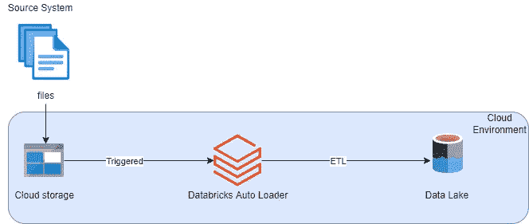
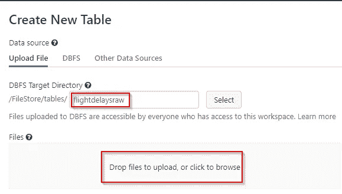
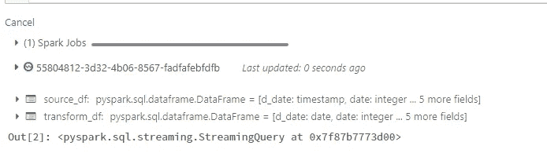
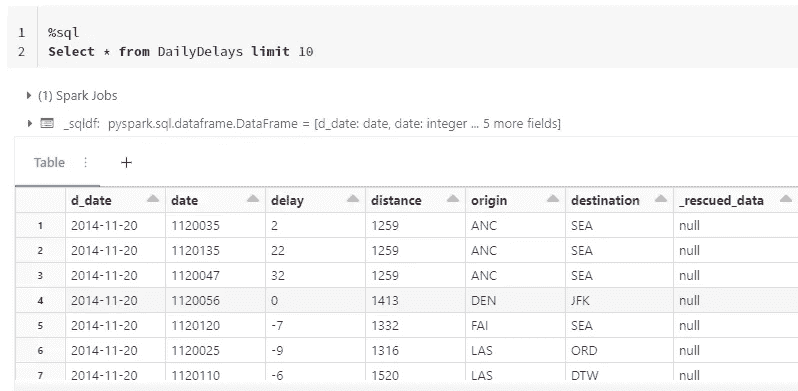

# 为什么增量 ETL 适合您

> 原文：<https://towardsdatascience.com/why-incremental-etl-is-right-for-you-121b4406bf03>

## 使用 Databricks 自动加载器的增量数据处理教程

嘶！你在听吗？在 [Unsplash](https://unsplash.com/s/photos/cat?utm_source=unsplash&utm_medium=referral&utm_content=creditCopyText) 上由 [Manja Vitolic](https://unsplash.com/@madhatterzone?utm_source=unsplash&utm_medium=referral&utm_content=creditCopyText) 拍摄的照片

企业环境中的数据通常会随着时间无限增长。例如:

*   网上商店的交易积累速度很快。
*   服务器上运行的应用程序的日志数据。
*   数百万在线购物者的点击流数据。
*   来自数百台互联设备的物联网传感器数据。

在上述所有情况中，共同点是数据会随着时间的推移而积累和扩展，需要明智地处理。

## 什么是增量数据处理？

> 在高级别上，增量数据处理是将新的或新鲜的数据从源移动到目的地。

增量 ETL 是数据湖架构中最重要的模式之一。可靠地加载新数据降低了成本，并有助于高效地扩展数据管道。

如今，大多数数据管道都是从云存储的某种形式的文件摄取过程开始的。

从历史上看，在数据湖中接收文件是一个复杂的过程，因为许多系统被配置为处理目录中的所有文件，或者工程师需要实现自定义逻辑来识别新数据。

通常定制逻辑相当复杂，事实上重新处理所有数据的方法相当昂贵。

如果您可以有效地加载新数据，而不必花费大量金钱来读取所有数据或创建自己的处理框架，会怎么样？现在有可能了。

## 什么是 Databricks 自动加载器？

一个现成的解决方案，允许您从云存储中增量加载新数据文件，而无需任何复杂的设置。

在引擎盖下，Autoloader 使用 [Spark 结构化流](https://docs.databricks.com/structured-streaming/index.html) API，以便从名为 *cloudFiles 的源类型中读取新数据。*

如果您熟悉 Spark 读写操作，那么自动加载器的实现非常直观。

仅使用以下 4 个参数，就可以使用自动加载器轻松地配置和设置增量数据处理流水线。

*   **数据源** —源数据的目录。自动加载器将自动接收到达此位置的文件。
*   **源文件格式** — *cloudFiles* 应该是自动加载器摄取的默认格式，您也可以指定一个选项 *cloudFiles.format* 来表示源文件本身的格式。
*   **表** —接收源数据的目的表。可以使用*来指定。表()*自变量
*   **检查点目录** —让自动加载器知道在哪里存储检查点的参数。检查点就像 Spark 流的簿记服务，它跟踪流的进度，也可以用来跟踪数据集的模式。

## 如何使用自动加载器增量摄取数据？

为了实现以下内容，您只需要一个 Databricks 工作区和一个集群来运行您的笔记本。

让我们熟悉一下我们将在本教程中使用的航班延误 CSV 数据示例。你可以在 [GitHub 库](https://github.com/xavier211192/Apache-Spark/tree/main/Incremental%20ETL)中找到 3 个不同日期的航班延误的 CSV 文件，以及一个跟踪笔记本。

数据集具有以下架构:

数据集的模式:按作者分类的图像

## 场景

现在让我们想象一下，您是一名数据工程师，负责创建和维护一个存储航班延误的数据湖表。每天，源系统将前一天的集体航班延误上传到云存储目录中。您的任务是每天以最佳方式处理这些数据。

## 设计

下面的示意图准确地描述了实施过程。正如人们常说的，图片比文字更有说服力，在数据工程中，视觉表现通常比一整页文字更能让人们正确看待事物。

> 我喜欢把这个叫做数据工程的伪代码！

自动加载器示意图概述:作者图片。

如上图所示，该解决方案可用于表示任何通用的文件接收场景，其中数据随着时间的推移积累在数据湖中以备将来使用。

## 履行

为了跟随并实现本教程，您需要从 [git repo](https://github.com/xavier211192/Apache-Spark/tree/main/Incremental%20ETL/data) 下载 CSV 文件，因为我们试图模拟源系统的行为。

为了保持示例的简单和易于复制，我们不会在本教程中使用任何类型的云存储解决方案，而是坚持使用内置的 Databricks 文件系统(dbfs)。

> 理想情况下，在生产设置中，源系统将文件发送到某种登陆/暂存云存储目录。

让我们把伪代码变成实际的实现。

用上面的代码准备一个空的笔记本。ETL 过程的第一步是从源目录中读取数据。语法与传统的 spark read 相同，只是稍有改动。

**提取** —我们以流的形式读取数据，因为 Auto Loader 利用了底层的 Spark 流。注意，我们需要指定 *cloudFiles* 作为格式来暗示我们想要使用自动加载功能。如前所述，我们还需要提供一个检查点目录，作为簿记功能的存储位置。

**转换** —没有转换的 ETL 很无聊。Spark 模式推理将我们数据集中的第一列作为`timestamp`读取。因此，我们可以应用一个简单的转换将时间戳列转换为日期类型。

**Load** —对于加载阶段，我们只需调用 Spark writeStream 方法，并传递检查点位置和我们希望存储数据的目标表名。目标表是一个增量表。如果不存在，执行将创建一个名为 DailyDelays 的增量表。

现在 ETL 代码已经准备好了，让我们开始展示。为了模拟源系统将文件上传到源目录，让我们使用工作区本身提供的文件上传选项上传我们的第一个 CSV 文件(可以在 git repo 中找到)。您可以在工作区菜单→数据→创建表格选项中找到它。记得在默认路径/FileStore/tables/后面添加一个后缀，如下所示，并上传第一个文件。

上传 CSV 文件:作者图片

文件上传后，运行带有 ETL 代码的单元，如果一切顺利，您将开始注意到流式查询被激活，如下所示。这意味着第一个 CSV 文件已经在处理中。

流式查询:按作者排序的图像

要确认数据是否被成功接收，请在另一个笔记本中查询如下所示的目标增量表，您应该已经看到了一些奇妙的结果。

目标表:按作者分类的图像

现在将第二个 CSV 文件上传到同一个目录中，看看魔法是如何展开的。无需调整/更新代码的任何部分，流式查询立即选取这个新文件进行处理，并将其吸收到同一个目标表中。显然，您可以通过查询目标表来确认这一点。如前所述，每个文件只包含某一天的延迟。如果你现在在表格中发现两个不同的日期，自动加载器已经发挥了它的魔力。

如果你仍然不能相信，让我们再做一次检查，上传第三个文件，几秒钟后，我们的目标表应该有 3 个不同日期的数据。

注意:如果您想知道为什么执行代码的单元持续运行并且从不停止，这是因为它运行一个活动的流查询。Spark 流查询有一个默认触发器，每 500 毫秒运行一次，这相当于在数据到达时连续处理数据。当您期望低延迟和接近实时的数据接收时，这非常有用。请注意，这意味着您的集群需要始终在线。

当然，每种情况都是不同的，在我们的示例中，我们确实说过数据每天只到达一次，让这个查询一直运行没有任何意义，最好是每天运行一次，但仍然只处理前一天到达的新文件。

这可以通过对我们现有的 writeStream 逻辑进行简单的更改来实现。通过引入 trigger once 方法，我们仍然可以利用这个强大的功能，以便查询只执行一次，然后自动停止。

自动加载器触发一次:作者图像

## 结论

增量数据处理不可避免地成为大多数数据管道的首选方法，如果使用得当，自动加载器和 Spark 流可以在数据管道的所有阶段完美地实现这一目的。许多供应商认识到对最佳数据处理方法的内在需求，将其作为内置功能提供，这并不奇怪。

它有几个优点:

*   处理速度更快，因为数据更少。
*   一致的性能，因为只处理更改的数据。
*   不用说，它直接影响处理数据所需的资源成本。

去吧，给自动装载机一个机会，我可以保证你永远不会回头！

CSV 文件以及助手笔记本可以在 [git repo](https://github.com/xavier211192/Apache-Spark/tree/main/Incremental%20ETL) 中找到。