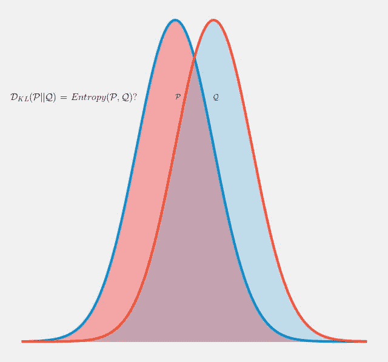
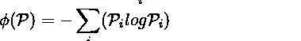
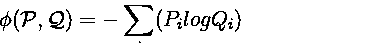
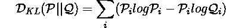
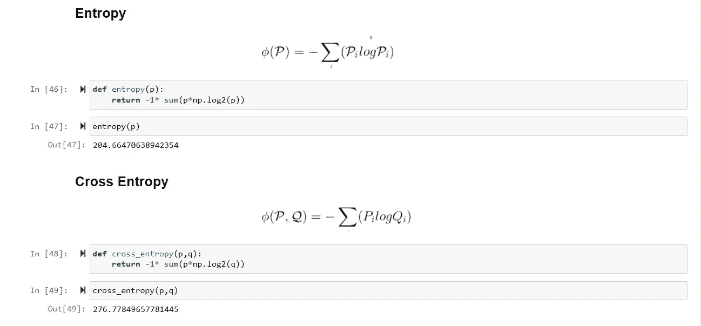
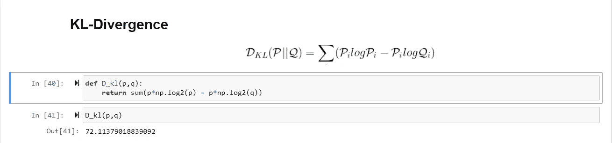
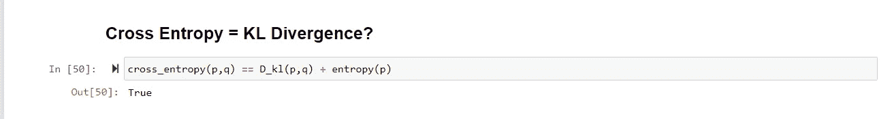

# 为什么交叉熵等于 KL-散度？

> 原文：<https://towardsdatascience.com/why-is-cross-entropy-equal-to-kl-divergence-d4d2ec413864>

图 1:从正态分布中抽取的两个概率分布(图片由作者提供)

尽管最初的概念建议使用 KL-divergence，但在构建生成性对抗网络[1]时，通常在损失函数中使用交叉熵。这经常给这个领域的新手造成困惑。在本文中，我们将介绍熵、交叉熵和 Kullback-Leibler 散度[2]的概念，并了解如何使它们近似相等。

当我们有一个以上的概率分布时，熵和 KL-散度的概念就起作用了，我们想比较它们彼此之间的公平程度。我们希望有一些基础来决定为什么最小化交叉熵而不是 KL 散度会产生相同的输出。让我们从正态分布中抽取两个概率分布 ***p*** 和 ***q*** 。如图 1 所示，这两种分布是不同的，但是它们都是从正态分布中采样的。

**1。**熵**熵**

熵是系统不确定性的度量。直观地说，它是从系统中消除不确定性所需的信息量。系统各种状态的概率分布 ***p*** 的熵可以计算如下:

**2。** **交叉熵**

术语交叉熵指的是存在于两个概率分布之间的信息量。在这种情况下，分布 ***p*** 和 ***q*** 的交叉熵可以表述如下:

**3。** **KL-Divergence**

两个概率分布之间的散度是它们之间存在的距离的度量。概率分布 ***p*** 和 ***q*** 的 KL 散度可以通过以下等式来测量:

其中等式右侧的第一项是分布***【p】***的熵，第二项是根据 ***p*** 的分布 ***q*** 的期望。在大多数实际应用中， ***p*** 是实际数据/测量值，而 ***q*** 是假设分布。对于 GANs， ***p*** 是真实图像的概率分布，而 ***q*** 是伪图像的概率分布。

**4。** **验证**

现在让我们验证 KL-divergence 确实与使用交叉熵进行分布 ***p*** 和 ***q*** 相同。我们在 python 中分别计算了熵、交叉熵和 KL 散度。

然后我们如下比较这两个量:

右手边的第二项，即分布 ***p*** 的熵，可以被认为是一个常数，因此，我们可以得出结论，最小化交叉熵代替 KL-散度导致相同的输出，因此可以近似等于它。

换句话说，我们的目标是在优化终止时达到分布 ***p*** 的不确定性水平，并且由于所有机器学习优化都是在受控数据集上执行的，该数据集在实验期间预计不会改变，因此，我们期望 ***p*** 的熵保持恒定。

**5。** **结论**

在本文中，我们学习了熵、交叉熵和 kl 散度的概念。然后我们回答了为什么这两个术语在深度学习应用中经常互换使用。我们还用 python 实现并验证了这些概念。完整代码请参考 github 资源库。[https://github.com/azad-academy/kl_cross_entropy.git](https://github.com/azad-academy/kl_cross_entropy.git)

参考资料:

[1] Goodfellow，I .等人，生成对抗网。神经信息处理系统进展。第 2672-2680 页，2014 年

[2][https://en . Wikipedia . org/wiki/kull back % E2 % 80% 93 lei bler _ divergence](https://en.wikipedia.org/wiki/Kullback%E2%80%93Leibler_divergence)