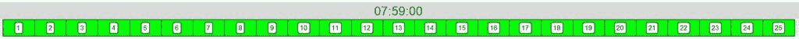
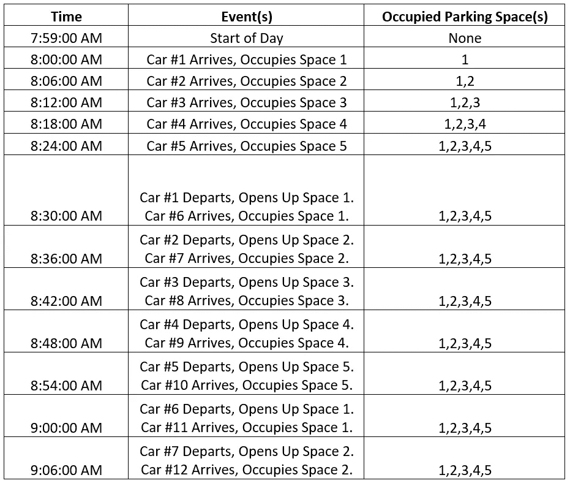
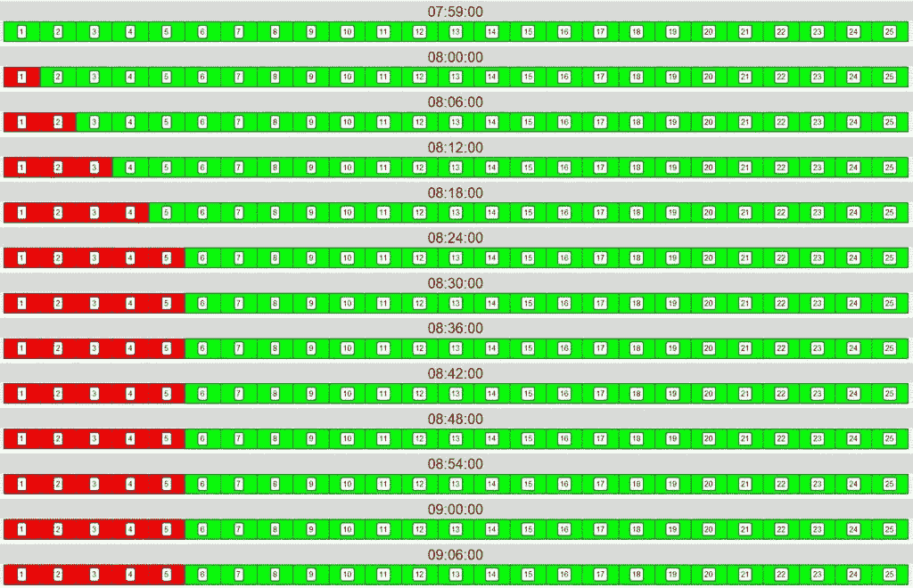
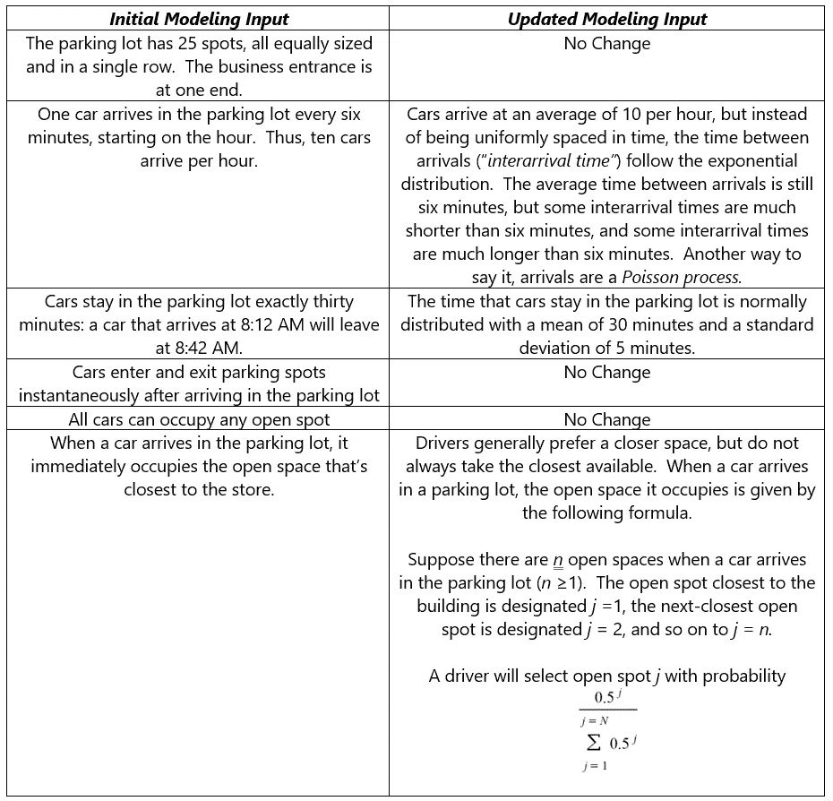
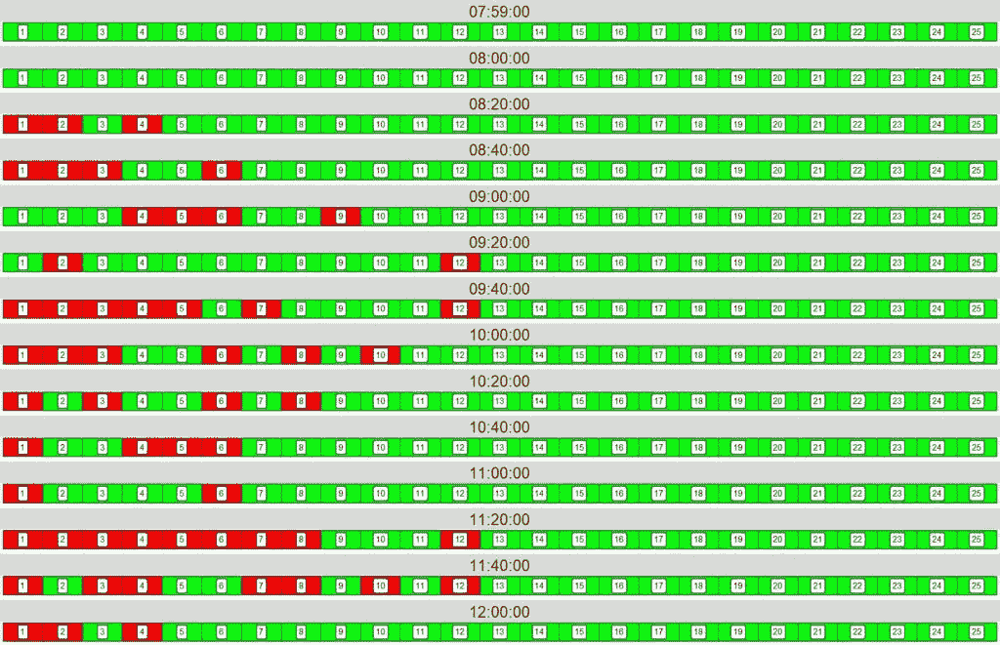
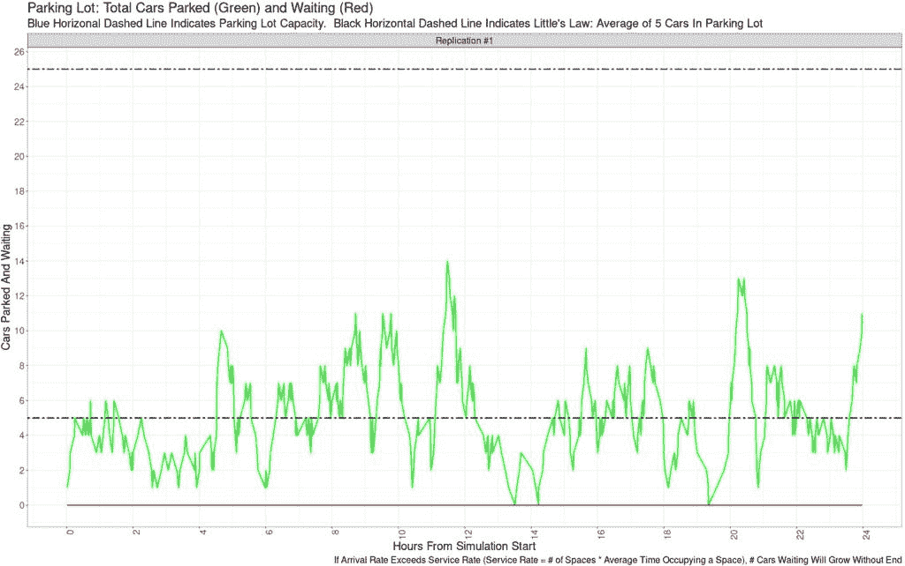
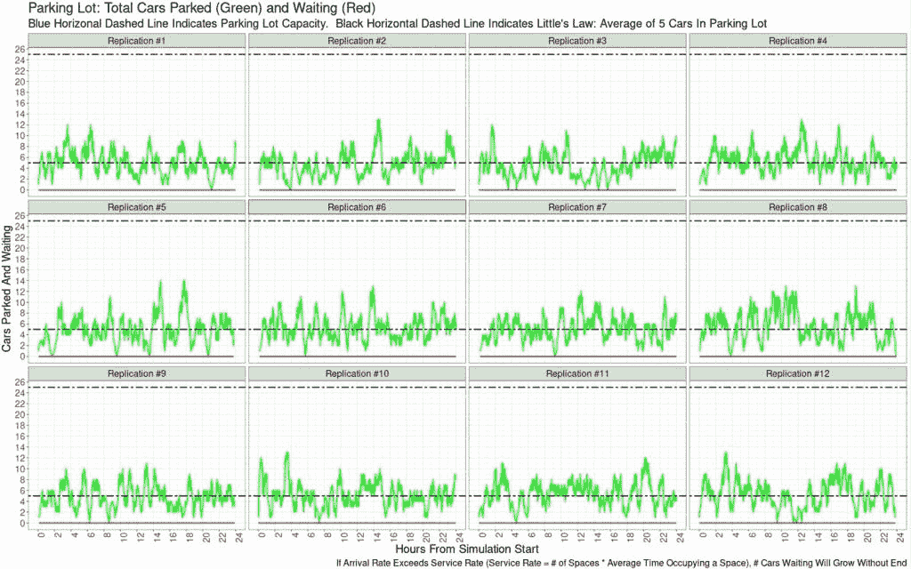
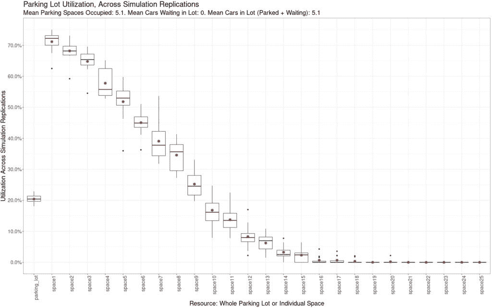
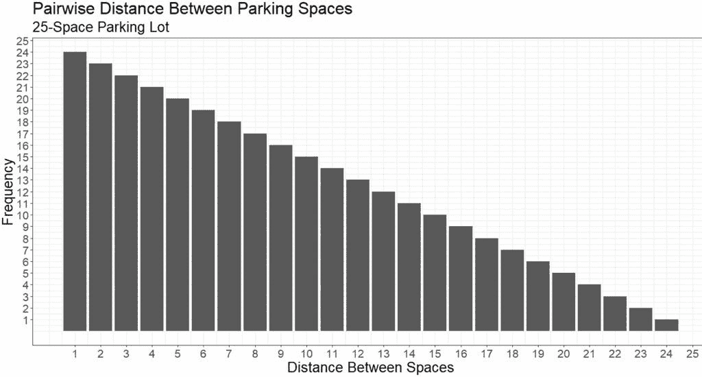
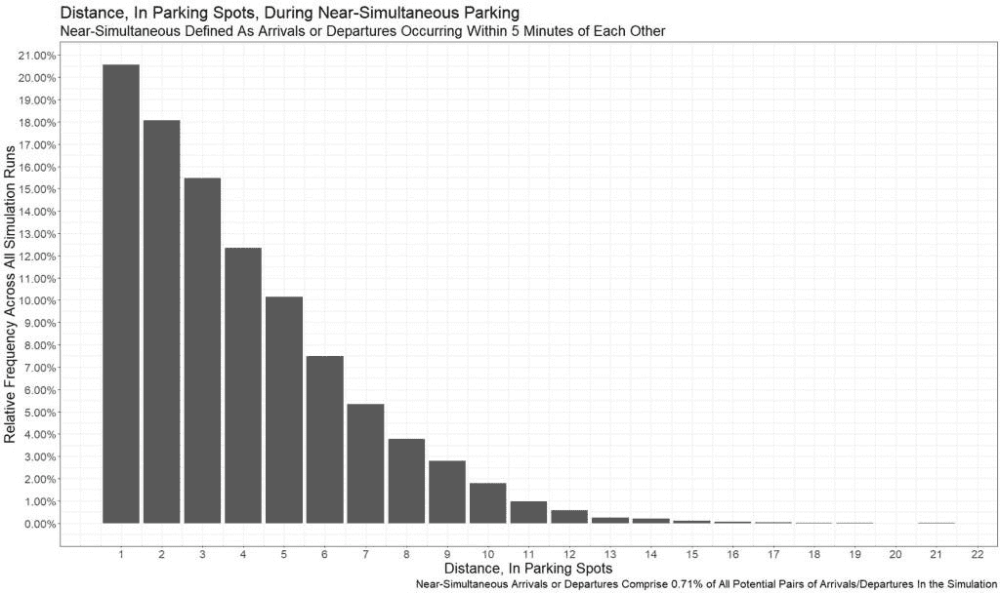

# 为什么每个人都停在我的车旁边？

> 原文：<https://towardsdatascience.com/why-is-everybody-parking-near-my-car-and-other-adventures-in-discrete-event-simulation-6d4c350f4bc3>

## …以及离散事件模拟中的其他冒险

我离开企业界已经一年多了。从那以后，我通过我的咨询公司 Data Driven Supply Chain LLC，将我的时间和才能投入到改善客户的供应链上。创业的一个好处是，虽然我的工作时间很长，但我在工作时有相当大的灵活性。如果我刚刚从早上 7 点到下午 2 点为一个客户编写了一个优化模型，我需要休息一下(我的计算机需要时间来运行这个模型)。是时候去健身房或者为今晚的晚餐买些杂货了。

我住在郊区，所以当我进行这些短途旅行时，我会开车。不久前，我开始注意到一些奇怪的事情，在下午安静的时间去健身房。我会坐在我的车里，收拾我的运动包。我抬头环顾四周，有*那么多人围着我，*进出他们自己的车。这是为什么呢？我在一个能轻松停放 200 辆车的停车场，停车场里可能还有十个人。那么为什么这十个中有五个在我附近呢？

这种情况并不是每次我在健身房都会发生，但发生的次数足够让我注意到它。有段时间，我以为是[巴德尔-迈因霍夫现象](https://www.healthline.com/health/baader-meinhof-phenomenon)；我只是注意到它，因为它在我的脑海里。但我在健身房看到过这种事。在药房。到达目标。在杂货店。在麦当劳。(为了平衡健身房。)发生了什么事？

数学建模(包括供应链建模)的关键技能之一是能够观察复杂的现实世界，识别系统的核心组件，并进行简化。为了弄清楚发生了什么，我简化了系统，并为一家企业设计了一个“模型停车场”。在这个模型中:

*   停车场有 25 个车位，大小相同，排成一排。商业入口在一端。空间被指定为空间 1(最靠近企业)、空间 2(第二靠近企业)、…空间 25(离企业最远)。
*   从整点(例如，上午 8:00、8:06、8:12、…上午 8:42、8:48、8:54、9:00、9:06…)开始，每六分钟有一辆车到达停车场。因此，每小时有十辆车到达。
*   汽车在停车场停留整整三十分钟:上午 8:12 到达的汽车将在上午 8:42 离开。
*   汽车在到达停车场后立即进入和离开停车点——不需要等待有人退出，不需要在车道上等着。因此，上午 8:42 空出的停车位可立即用于上午 8:42 到达停车场的汽车。
*   所有的汽车都可以占据任何一个停车位——没有预留停车位，没有对汽车来说太小的停车位，没有明显不知道在线间停车意味着什么的笨蛋，等等。
*   当汽车到达停车场时，它会立即占据离商店最近的空地。

下图显示的是早上 7:59 的停车场，里面没有任何汽车。假设该建筑位于空间#1 的左侧。空间#1 离建筑最近；25 号空间离大楼最远。

(请注意，本文所有图片均为我创作。)

现在，任何人都可以立即在这个简单的模型中找出漏洞。汽车不会到达尼斯，即使是六分钟的增量；顾客在一个企业中花费的时间也不尽相同。你可以立即腾出或占用一个停车位的想法是可笑的。但是可笑的简单才是重点。我们从简单模型开始，并以此为基础进行构建。

**离散事件模拟:是什么？**

现在是介绍本文中使用的关键分析方法的好时机:*离散事件模拟*。离散事件仿真(DES)是对在不确定性下运行的系统进行建模的一种强有力的方法。

在离散事件模拟中，你(用计算机代码)建立一个系统模型。从广义上讲，DES 中的系统是一组协同工作以服务于某一目的的物理和人力资源。系统可以包括工厂、仓库、港口以及供应链和物流中的其他设施；餐馆和商店；网站；呼叫中心；医疗设施……这个清单几乎是无止境的。

在 DES 中构建了一个系统之后，您就要让它经受日常生活中的不确定性。“来者”从外部进入系统( *deus ex machina* )并使用资源。

*   顾客来到你的商店
*   卡车到达你的装货码头装货或卸货
*   顾客来到收银台结账
*   汽车到达你餐馆的免下车餐馆
*   病人到达急诊室

借助 DES，您可以跟踪一段时间内的资源利用情况(例如，装货码头、x 光机、收银员),并据此做出业务决策。(更准确地说，软件跟踪利用率，您查看结果。)因为资源使用的时间和持续时间是高度可变的，所以使用模拟允许我们对这种不确定性建模。

对于离散事件仿真，有许多好的软件选项，包括开源软件和商业软件。对于这篇文章，以及我的咨询工作，我使用了<https://r-simmer.org/>*，一个用于离散事件模拟的优秀 R 包。我使用 *tidyverse* 包进行数据管理和可视化。如果你有兴趣学习如何使用*煨*，它的网站有很棒的教程；但是从现在开始，我将以一种与软件无关的方式来谈论模拟。*

*在我们简化的停车场例子中，我们让事情变得简单:没有不确定性。每隔 6 分钟就有一批人到达，到达后 30 分钟就有一批人离开。现实世界并不那么美好，但同样，我们开始时故意简单化。*

*在 DES 中，您(或您的软件)维护一个*事件列表*。名称是描述性的—事件列表只是一种跟踪系统变化(“事件”)并将时间戳与它们相关联的方法。在研究生院学习 DES 的时候，我不得不手写事件列表。为了演示，我们将在这里做同样的事情。使用上面列出的简化假设，并假设第一辆车在早上 8:00 准时到达，我们将在一个多小时内跟踪到达、离开和当前占用的空间。*

**

*下图显示了停车场在事件列表中的进程。假设建筑在左侧，空间#1 是最左侧(最近的)空间；25 号空格是最右边(最远)的空格。绿色空间是开放的；红色空间被占用。时间从上到下进行，与我们刚刚描述的事件列表相对应。*

**

*注意到什么了吗？一旦第五辆车在上午 8:24 到达，就有五个被占用的空间——这五个空间离商店最近。即使每六分钟就有一辆车来，三十分钟后就有一辆车离开， ***占用的停车位不会改变*** 。我们可以继续写几个小时的事件列表——我们会得到相同的结果。这涉及到*利特尔法则*，这是*排队论*中的一个重要概念，是对排队等候的人或事物的分析研究。(Queue 是 line 的另一个名称，在美国不常使用)。*

*利特尔定律， *L = Lambda * W* ，描述简单，但应用强大。它适用于**任何** *排队系统*:几乎任何人或事物到达、等待一段时间、然后离开的地方。(想象一个停车场、装卸码头、餐馆、商店、健身房、医院、填空……)*

*   *l:系统中的平均项目数。在我们的例子中，停车场里平均有多少辆车*
*   *λ:系统的平均到达率。在我们的例子中，在指定的时间段内有多少辆车进入停车场:每小时到达 10 辆车，或者作为一个表达式:(10 辆车/ 60 分钟)*
*   *w:在系统中的平均时间。在我们的例子中，30 分钟*

*l =λ* W =(10 辆车/ 60 分钟)* (30 分钟)= 5 辆车*

*等等！利特尔法则说，平均来说，我们在停车场会有 5 辆车。在允许前五辆汽车进入系统后，在模拟研究中称为“热身期”，这是我们手工计算时看到的汽车(和占用的空间)数量。虽然我们遵循的规则是到达的汽车占用最近的可用空间，但利特尔法则告诉我们，无论选择什么样的空间，都会出现 5 辆汽车的结果。*

*利特尔定律的不足之处在于，输入是平均利率——不考虑这些利率的可变性。*

***忽视可变性，后果自负***

*任何在零售店或快餐店的前台工作过的人都可以理解，这些是非常不同的:*

*   *下午 2 点到 3 点之间，5 个进来的顾客平均分布，分别是下午 2 点，2 点 12 分，2 点 24 分，2 点 36 分，2 点 48 分。每个都需要五分钟注意力。*
*   *在下午 2 点到 3 点之间，5 个顾客在下午 2 点 10 分同时进来。每一个都需要五分钟的注意力。下午三点前不会有其他顾客进来。*

*在这两种情况下，你在一个小时内为五位顾客服务——利特尔法则对餐馆中的平均顾客数量给出了相同的结果。但是对运营、客户满意度和员工压力水平的影响会非常不同！*

*(大学时，我在一家连锁三明治店工作，出于法律原因，我称之为地铁。客观地说，我不擅长做“三明治设计师”的工作。地铁，谢谢你给我上了现实世界中的排队论课。)*

*组织忽视可变性是危险的。仅查看平均输入(每小时的客户数、每天到达的卡车数、每小时的生产率)可能会隐藏这些输入中有影响的可变性。这就是离散事件模拟如此强大的原因之一。*

*因为这个世界不像我们最初的停车场模型那样可预测，我们现在要在输入中加入一些可变性，看看会发生什么。此表代表原始输入和假设，以及我们对它们所做的任何更改。*

**

*[关于泊松过程的更多细节请点击这里](/the-poisson-distribution-and-poisson-process-explained-4e2cb17d459)*

*你可以看到随着时间的推移，这将如何改变我们停车场的面貌。到达时间不可预测；汽车在停车场停留多长时间是不可预测的；他们在哪里停车是不可预测的。令人欣慰的是，离散事件模拟允许我们相对快速地模拟这种不确定性下的停车场。DES 软件根据我们设置的参数，随机生成汽车的到达时间和在停车场停留的时间。然后，DES 软件会随着时间的推移跟踪每个停车位(以及整个停车场)的状态。下面，我们在一个模拟中看到停车场的状态，平均每小时有 10 个到达，平均停车 30 分钟。在这个画面中，我们每 20 分钟查看一次停车场，从早上 8:00 到中午 12:00。*

**

*不是那么容易预测的，是吗！根据利特尔定律，在一整天的时间里，停车场中汽车的平均数量仍然(非常接近)为 5 辆。(在这一点上暂时相信我)。但是可变性是显著的。上午 8 点 20 分，停车场只有三辆车。上午 11 点 20 分，9 辆车在。*

*如果我们要在 24 小时内跟踪停车场中的汽车数量，它可能看起来像下面的图。x 轴是模拟开始后的小时数(因此 x=0 表示上午 8:00，x=2.5 表示上午 10:30，依此类推)。y 轴表示停放的汽车数量(绿线)和等待停放的汽车数量(红线，整个模拟过程中为零)。您可以看到，虽然停放的汽车数量大致平衡在 5 辆左右，但正如利特尔定律所表明的那样，一天中有很大的变化。*

**

*此时你可能会想，“但是等等！如果汽车的到达时间不再是可预测的，并且汽车在停车位上花费的时间不再是可预测的，那么跟踪停车场中的汽车数量有多大用处呢？它不会是可变的吗，就像输入是可变的一样？"*

*如果你在想:答案是肯定的！(此外，你可能对模拟有所了解。)在离散事件模拟中，您有硬币的两面:您可以包含现实生活中的随机性，但是您的结果取决于您包含的特定随机性！*

*这种随机性的影响可以通过*多次复制*模拟并汇总结果进行分析来减轻。如果我们将停车场模拟复制 12 次，并绘制每次复制的停车场中汽车数量的时间序列，它可能如下图所示。您可以检查每个时间序列，并查看复制之间的差异。但是在每次复制中，停车场(随着时间的推移)的平均汽车数量非常接近 5 辆，正如利特尔法则所暗示的那样。(请注意，上面的时间序列没有出现在下面的复制中)。*

**

*如果运行模拟的多个副本，可以跟踪一段时间内资源(整个停车场或单个空间)的利用率。您还可以找到资源在复制过程中的总利用率，然后创建一个箱线图，汇总各复制中每个资源的利用率。*

*下图就是这样一个箱线图，显示了生成上述时间序列图的 12 个重复的总利用率。箱线图表示利用率的最小值、最大值、中间值和四分位数间距(IQR)。红点表示平均利用率。*

**

*在 x 轴的最左侧，我们可以看到整个停车场的利用率。其跨复制的利用率非常相似，平均利用率略高于 20%。根据利特尔定律，拥有 25 个停车位，利用率为 20%的停车场平均容纳(25 * 20%) = 5 辆汽车。(副标题表明实际平均值为 5.1 辆——模拟结果并不总是与理论完全相符。)*

*在 x 轴上，在整个停车场之后，该轴从左到右利用各个空间。记住，space1 表示离大楼最近的停车位；space2 表示下一个最近的停车位；空间 25 表示离建筑物最远的空间。*

*因为司机通常喜欢把车停在离大楼更近的地方，所以 1 号车位(离大楼最近的车位)的利用率一直很高，平均在 71%左右。离建筑越远，利用率就越低，14 到 25 号空间很少被使用，如果有的话。(下次当你在一家大卖场，发现车位没有满的时候，看看最后面的车位有多少被利用了。我猜不是很多。)*

*我开发了一个[闪亮的应用程序](https://datadrivensupplychain.shinyapps.io/parkinglot_simulation/)，可以让你试验输入参数，看看它如何改变停车场的利用率(应用程序的输出与前两张图片非常相似)。您还可以看到当每个开放的停车位具有相等的选择概率时会发生什么，以及根据利特尔定律，当系统中的预期汽车数量大于停车位数量时会发生什么。(提示:漫长的等待，越来越多的汽车徒劳地在停车场盘旋。)*

*请注意，在应用程序中运行模拟可能需要一些时间。当输出可供查看时，您将收到一个弹出通知。*

***结论…那么为什么这么多人在我的车附近？***

*现在，是时候回答当初促使这篇帖子的问题了。当我进入或离开停车场的某个位置时，为什么我周围似乎有很多活动发生？*

*为了回答这个问题，我们首先再次建立一个简单的模型。假设一个停车场一排有 25 个车位，我们可以求出每对车位之间的距离。例如，空间#1 到空间#3 之间的距离是两个空间；空间#16 和空间#25 之间的距离是九个空间。然后，我们可以制作所有空间之间成对距离的直方图。*

**

*最不常见的距离是…24 个空格。当你停下来想一想，这是有意义的。只有一对正好相隔 24 个空格的空格:#1 和#25。下一个最不常见的距离是 23 个空格。只有两对相距 23 个空格的空格:#1 & #24，以及#2 和#25。你可以在图表上从右到左继续这个逻辑，直到我们得到一对空格之间最常见的距离:一个空格。(#1 & #2，#2 & #3，等等，直到我们到达#24 & #25。总共 24 次。)*

*这是一个有趣的起点，因为它表明，如果我们随机选取两个空间，它们之间最常见的距离是 1，有 8%的概率。有 37%的概率它们之间相隔 5 个或更少的空间，平均距离为 8.667 个空间。*

*您可以在 R 中使用一个简单的脚本使用 *sample* 函数来测试这一点。或者更类似的，你可以用乒乓球或者标有#1 到#25 的纸条来做实验。*

*这种影响在我们的停车场模拟中可能会更加明显。记住，人们倾向于尽可能把车停在离大楼近的地方，而较远的车位很少被使用，至少在交通流量较少的时候。在上面的利用率方框图中，查看空间#12 到#25 的利用率:最低。这表明，同时到达/离开更有可能发生在彼此靠近的空间，*因为我们都试图把车停在停车场的前面*。*

*在停车场模拟中测量这种效应稍微复杂一点，但只是一点点。R 中的*煨*包以数据帧的形式提供详细的模拟输出，包括每辆车的到达和离开时间以及停车位。由此，您可以确定:*

*   *当到达/离开发生在彼此指定的时间窗口内时。在这个例子中，我把任何一对在 5 分钟内到达或离开的人称为“几乎同时”*
*   *有多少对到达或离开是“几乎同时”的*
*   *在这些几乎同时发生的停车对中，它们之间相隔多少个停车位？*

*下图显示了结果。在模拟的所有到达/离开配对中，不到 1%的配对在 5 分钟内发生。(鉴于这些模拟代表了 24 小时的模拟时间，这并不太令人惊讶。)但是在“几乎同时”的到达和离开中，*超过 20%* 在相邻的空间中(x 轴上的距离= 1)。超过一半的人相距三个或更少的车位——就停车场而言，非常接近。*

**

*那么为什么健身房里有那么多人把车停在我身边？统计和概率，伙计们。这就是原因。此外，因为我不想走比绝对必要的更远的路去跑步机。*

*(请注意，如果我们将“几乎同时”定义为相互之间在 5 分钟、10 分钟或 12 小时内发生……相对频率百分比将非常稳定，那么这个柱状图看起来会非常相似。)*

***真实结论***

*我希望你已经发现这篇关于离散事件模拟(DES)的能力的文章既有趣又有知识性。唉，我只是触及了 DES 力量的皮毛。使用 DES，您可以对复杂的多阶段流程进行建模，如制造工厂、仓库和物流中心。使用 DES，您可以了解在参与昂贵且难以纠正的资本项目之前*业务流程重大变化的影响。使用 DES，您可以了解如何为业务中的极端波动制定计划，例如，如果您的制造工厂不得不在一夜之间将产量提高 25%，或者如果您的商店的每周客流量从本周到下周翻了一番。**

*[数据驱动供应链有限责任公司](https://www.linkedin.com/company/data-driven-supply-chain)提供数据科学和供应链交叉领域的咨询服务和培训。请随时联系我，ralph@datadrivensupplychain.com[的](mailto:ralph@datadrivensupplychain.com)，了解更多关于如何使用模拟和其他数据科学技术来评估、改进和设计供应链的信息。*

*既然你已经读到这里，如果你觉得这很有价值，你会考虑捐赠吗？*

*感谢您的阅读，并祝模拟愉快！*