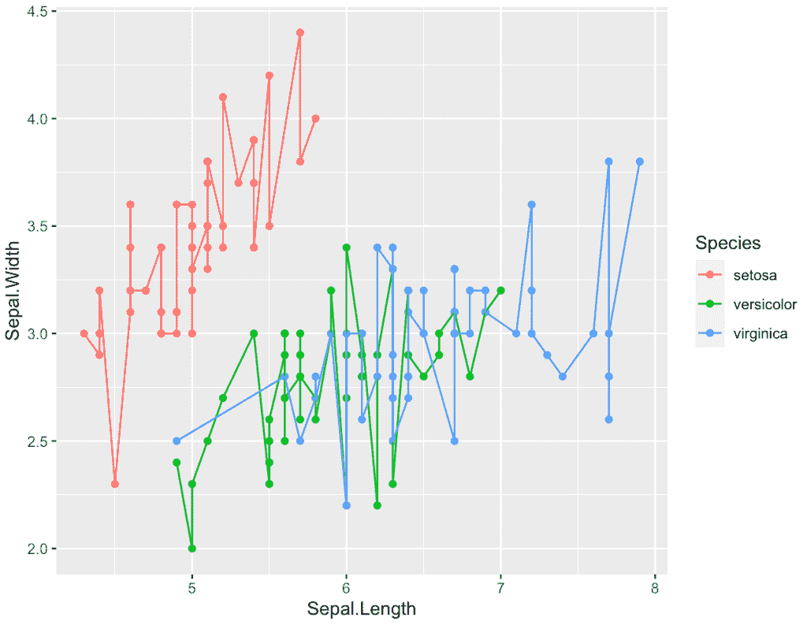
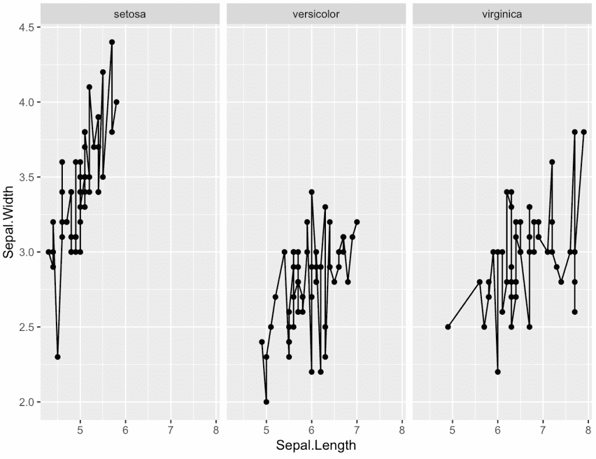
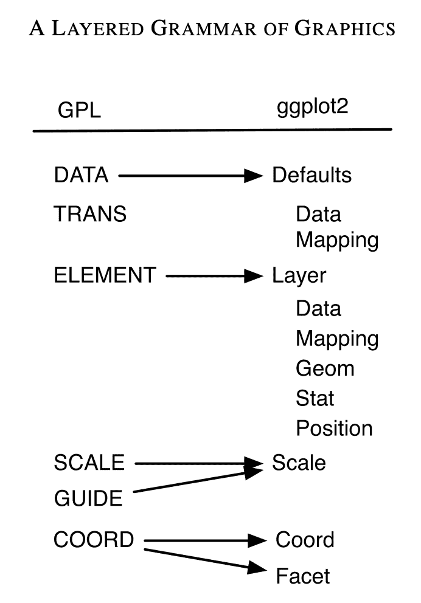

# 为什么 ggplot2 对数据可视化这么好？

> 原文：<https://towardsdatascience.com/why-is-ggplot2-so-good-for-data-visualization-b38705f43f85>

## 探索 ggplot2 中的图形语法


巴德·赫利松在 [Unsplash](https://unsplash.com/s/photos/future?utm_source=unsplash&utm_medium=referral&utm_content=creditCopyText) 上的照片

**ggplot2** 是在 r 中使用的一个众所周知的数据可视化包。由于 ggplot2 从一开始就开发得很好，工程师可以花更多的时间专注于理解带有图形的数据，并添加额外的功能来丰富 ggplot2。Python 端有很多选项可供选择，例如 Matplotlib、Seaborn、Plotly、Altair，还有很多其他的包。但是没有一个包像 ggplot2 一样在 R 中占主导地位，并且是数据可视化的首选。

**为什么 ggplot2 对数据可视化这么好？**答案是 **ggplot2** 在创建基于 [**图形语法的数据可视化方面是声明性的和高效的。**](https://www.amazon.com/Grammar-Graphics-Statistics-Computing/dp/0387245448/) 分层的语法使得开发的图表有结构性和丰富性。生成 ggplot2 感觉就像玩乐高积木。核心概念和语法对新用户来说很优雅，社区支持高级用例。ggplot2 中各种漂亮的主题和调色板使可视化看起来专业，并吸引最终用户。

# 30 秒内的 ggplot2 示例

大多数数据可视化工具从选择一个可消费格式的数据集开始。ggplot2 在这里也不例外。r 有一个内置的[虹膜数据集](https://www.rdocumentation.org/packages/datasets/versions/3.6.2/topics/iris)，可以很容易地用作数据框。

```
data(“iris”)
summary(iris)
head(iris)# Sepal.Length Sepal.Width Petal.Length Petal.Width Species
# 1 5.1 3.5 1.4 0.2 setosa
# 2 4.9 3.0 1.4 0.2 setosa
# 3 4.7 3.2 1.3 0.2 setosa
# 4 4.6 3.1 1.5 0.2 setosa
```

一旦装载了虹膜数据帧。我们可以初始化一个`ggplot`对象，用来声明共享的数据输入，建立美观(映射)。由于用户可以用不同的图层来表示同一幅图上的相同数据，这就节省了复制输入和美观的时间。

```
ggplot(data=iris, mapping=aes(x=Sepal.Length, y=Sepal.Width, color=Species)) + 
  geom_point() + 
  geom_line()
```



作者图片

在上面的例子中，我们用萼片的长度作为 x 轴，萼片的宽度作为 y 轴来定义美学。此外，还提供了颜色参数来用相同的颜色标记相同的物种。注意，我们不必引用美学。这是由于`aes()`是一个[报价功能](https://www.rdocumentation.org/packages/rlang/versions/0.2.2/topics/quotation)。这意味着它的输入 x、y 和颜色在这里被提到在虹膜数据的上下文中被评估。

使用`geom_`功能创建层。根据 [ggplot 参考，](https://ggplot2.tidyverse.org/reference/)有超过 50 种不同类型的`geom_`功能。使用`geom_point`和`geom_line`时无需指定输入数据和美学，因为它们已经在`ggplot`对象中定义。您也可以用不同的数据框和外观覆盖已经定义的`ggplot`。

ggplot2 采用类似管道的语法使用 **"+"** 来连接层，这一点超级简洁，类似于 R 中的**">% "**或者 bash 脚本中的 **"|"** 。它使你的代码非常容易跟踪和调试。

如果你想有 3 个不同的图显示物种而不是颜色，只需将物种从颜色移动到面。

🎉tada，非常简单！

```
ggplot(data=iris, mapping=aes(x=Sepal.Length, y=Sepal.Width)) +
  geom_point() +
  geom_line() + 
  facet_wrap(~Species)
```



作者图片

# ggplot2 是初学者友好的

当初学者选择数据可视化库时，一个关键的事情是它需要简单，并且反馈循环短，这意味着用户可以快速看到他们创建的图。通过上面的几行代码，我们可以生成一个好看的图形。ggplot2 利用了图形的语法，这使得开发一个情节就像构建乐高积木一样。使用 ggplot2 用图层构建图形的整个过程很容易理解，对初学者来说非常友好


照片由[哈维·卡夫雷拉](https://unsplash.com/@xavi_cabrera?utm_source=unsplash&utm_medium=referral&utm_content=creditCopyText)在 [Unsplash](https://unsplash.com/s/photos/lego?utm_source=unsplash&utm_medium=referral&utm_content=creditCopyText) 拍摄

对于初学者选择`qplot` (R 内置)还是`ggplot2`也有一些讨论。有几个原因让我更喜欢`ggplot2`:

*   **ggplot2 比 qplot** 应用更广泛。如果在 StackOverflow 上搜索 ggplot2 vs.qplot，结果是**96k vs . 3k**(2021 年 12 月)。这意味着作为一个初学者，你在 ggplot2 上找到答案的机会比 qplot 高。或者如果你最后问了一个问题，它能被回答的几率更高。
*   **ggplot2 看起来更好，主题丰富。它鼓励我去探索更多的选择，让我的情节看起来更好。ggplot2 附带了大量的主题和许多第三方添加的主题。你可以参考 [ggtheme](https://yutannihilation.github.io/allYourFigureAreBelongToUs/ggthemes/) 来看看众多的选项来很好地增强你的剧情。引人注目的图形可以从心理上说服初学者，学习 ggplot2 是值得的。**

# 图形的语法:ggplot2 背后的大思想

**图形需要一个作为层的结构来描述它是如何构造的**。就像画画一样，我们从一个简单的草图开始，为一个初步的绘画准备草图，引入画面的阴影，最后有细化。各种步骤(层)最终有一个最终的情节定义图形的语法。

[Hadley Wickham](https://en.wikipedia.org/wiki/Hadley_Wickham)(《ggplot2》的作者)在他的论文《图形的分层语法》中解释说，ggplot 2 是用图形的语法思维开发的他重新映射了图形的初始语法的核心思想，如下图所示。



图片来自 [Hadley Wickham](https://en.wikipedia.org/wiki/Hadley_Wickham) 论文《图形的分层语法》

分层语法定义了以下组件:

*   **形成美学的默认数据集和映射集**:我们用**数据**和 **aes 在 ggplot 函数调用中定义的数据集和映射集。**如果图层不使用其他数据集，我们可以假设使用相同的数据框和美学。
*   **图层**:图层可以分为四个部分:数据和美学映射、统计变换、几何对象和位置调整。图层定义了最终图形的构建模块。根据您在图上显示数据的方式，几何对象只能显示特定的美感。
*   **Scale** :处理数据到美学属性的映射。
*   **坐标系**:将物体的位置映射到绘图平面上
*   **Facet** :使用特定维度上的子图显示数据。

有了 ggplot2 中的分层语法，在创建情节时就可以很容易地采用这种结构。对于开发人员来说，由于该层可以轻松地独立运行，因此调试起来也不费力。通过使用管道(ggolot2 中的“+”)添加带有隔离层逻辑的附加层，在现有的 ggplot2 图表上进行扩展也变得非常简单。

# 超越 R

“图形语法”的概念因数据可视化而闻名。相比其他数据可视化工具，很多人真的很喜欢 R 中的 ggplot2。比如这个 [Reddit 线程](https://www.reddit.com/r/datascience/comments/mjkv5y/plotting_in_rs_ggplot2_vs_pythons_matplotlib_is/)提到 ggplot2 的体验比 Matplotlib 好很多。

一个叫做 [plotnine](https://plotnine.readthedocs.io/en/stable/) 的 Python 包是为采用 Python 中图形语法的概念而设计的。在 Python 环境中，用户可以编写类似 ggplot2 的代码，与其他 Python 代码混合使用。plotnine 目前在 Github 上获得 2.9k+颗星；你可以看到这个概念在其他语言中是多么有价值。**当不同的语言开始从一个人那里借用库，这就证明了它有多好。**

在 ggplot2 中创建地块是结构化和有组织的。它以`ggplot`为切入点开始。然后在`geom_`上展开以添加层。此外，各种规模和主题也将适用。更复杂的情节遵循这种模式，给用户一致的体验。另一方面，在 Matplotlib 这样的框架中，代码可以与其他 Python 代码分散在一起。代码的顺序不太重要，但是很难阅读；Matplotlib 比 ggplot2 写更多的代码也很麻烦。

# 最后的想法

我以前只用 Python 处理数据。然而，当涉及到数据可视化时，人们使用的库非常多，并且越来越难以整合。当我碰巧学习 ggplot2 和图形的语法时，我开始学习 R 并使用 R 进行数据分析。对于数据分析任务，使用 Python 还是 R 仍然是一个争论，但在使用 ggplot2 多年后，这是我执行任何数据可视化任务的首选工具。我强烈推荐如果你对 ggplot2 不熟悉，即使不写一行 R 代码，也要虚心一试。很快你就会发现为什么 ggplot2 对你的推荐这么好。

如果你想了解更多关于 R 和 ggplot2 的知识，我也强烈推荐 Hadley Wickham 的《数据科学的书 [*R:导入、整理、转换、可视化和建模数据*](https://www.amazon.com/R-Data-Science-Hadley-Wickham/dp/1491910399/ref=as_li_ss_tl?ie=UTF8&qid=1469550189&sr=8-1&keywords=R+for+data+science&linkCode=sl1&tag=devtools-20&linkId=6fe0069f9605cf847ed96c191f4e84dd) 。

希望这个故事对你有帮助。本文是我的工程&数据科学系列的**部分，目前包括以下内容:**


[赵承志](https://chengzhizhao.medium.com/?source=post_page-----b38705f43f85--------------------------------)

## 数据工程和数据科学故事

[View list](https://chengzhizhao.medium.com/list/data-engineering-data-science-stories-ddab37f718e7?source=post_page-----b38705f43f85--------------------------------)47 stories

你也可以 [**订阅我的新文章**](https://chengzhizhao.medium.com/subscribe) 或者成为 [**推荐媒介会员**](https://chengzhizhao.medium.com/membership) 也可以在媒介上获得所有的故事。

如果有问题/评论，**请不要犹豫，写下这个故事的评论**或通过 [Linkedin](https://www.linkedin.com/in/chengzhizhao/) 或 [Twitter](https://twitter.com/ChengzhiZhao) 直接**联系我。**