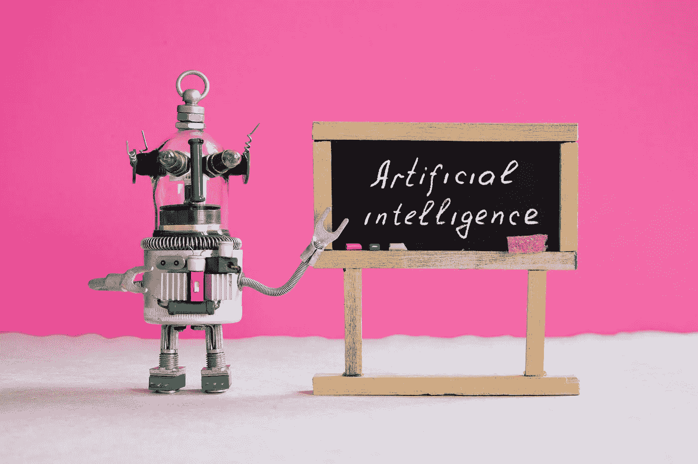
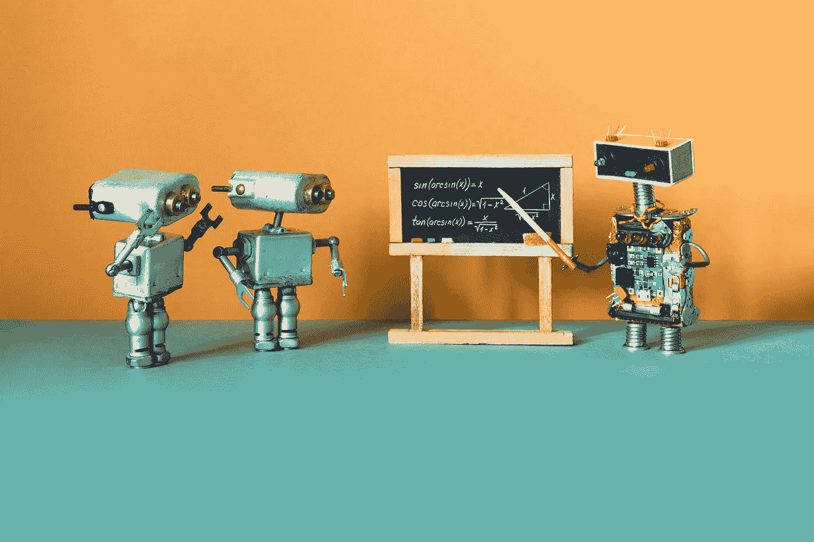
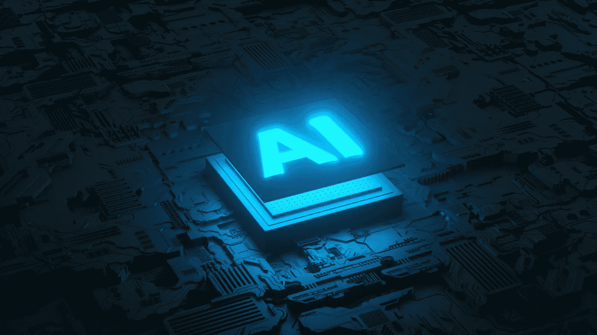

# 为什么企业采用一个框架来解决人工智能相关的问题至关重要？

> 原文：<https://towardsdatascience.com/why-is-it-crucial-for-businesses-to-adopt-a-framework-to-address-ai-related-concerns-90bc058b5e64>

## 负责任的人工智能框架就足够了吗，或者我们需要通过政策来规范这个行业吗？

信用:[大三](https://elements.envato.com/user/Besjunior)上[毒害元素](https://elements.envato.com/artificial-intelligence-and-machine-learning-conce-GCRWTZA)

考虑你的周围环境:几乎可以保证某种形式的人工智能已经存在。你可能已经和 AI 有了日常的互动，却没有意识到。人工智能目前处于高度发达的状态，以我们无法想象的方式彻底改变了我们的生活和商业实践。

随着全球人工智能市场预计到 2028 年将达到 6483 亿美元，可以肯定地说，人工智能正在迅速扰乱我们的生活。人工智能的扩展也表明，这项技术正在获得广泛接受，几乎每个行业都在采用它。

对一些人来说，人工智能的适应与生产率密切相关，并能激发兴奋感。然而，许多人把这个缩写与恐惧联系在一起。人工智能通常被定义为能够执行人脑可以执行(甚至更好)的任务的任何机器，其他几个越来越令人担忧的问题正在出现。AI 的主流实现试图解决各种合法的问题，包括劳动力的替代、安全问题和缺乏隐私。

虽然不可避免的是，所有组织最终都会增加对人工智能的使用，但组织领导人需要注意他们的方法，以确保合规。为了设计和开发人工智能，以公平地影响客户和社会的方式授权业务和工作场所，需要一个负责任的人工智能框架。

## **什么是 AI？**

在了解什么是负责任的 AI 之前，我们先快速回顾一下“人工智能”。AI 是一个广义的术语，指任何模仿人类行为的计算机软件，包括学习、批判性思维和规划。

但是人工智能是一个广泛的主题；一个学期不可能涵盖全部课程。机器学习——人工智能的一个子集——是目前业务流程中最普遍的实现类型。机器学习是自主处理大量数据的能力。这种类型的人工智能由无限学习轨迹上的算法组成。

信用:[Besjunior](https://elements.envato.com/user/Besjunior)on[enva to Elements](https://elements.envato.com/artificial-intelligence-machine-learning-and-robot-FEMF3CJ)

今天，机器学习是最流行的人工智能应用之一。从制造业到零售业，从银行业到面包店，企业正在扩大机器学习的优势范围。根据德勤在 2020 年进行的一项调查，67%的企业目前正在利用机器学习，97%的企业计划在未来几年这样做。

你可能也与机器学习互动过:键盘上的预测文本、网飞推荐、亚马逊购物建议以及你订阅的社交媒体帖子的排列都是机器学习的例子。

在业务方面，机器学习可以快速分析数据，识别模式和异常。以这种方式，如果生产输出中存在差异，算法可以通知负责维护系统的授权机构。

## **责任人艾案**

机器学习的能力是无限的。如果人类每天的生产力不超过五个小时，机器学习可以在二十四个小时内达到并保持同样的生产力水平。与我们见过的其他技术相比，人工智能有能力自动决定向谁推荐什么，甚至根据数据对客户进行优先排序。

凭借这一水平的能力，人工智能可以用固定成本的软件迅速取代依赖于人的可变成本。

作为首席执行官，我们有义务将损失降至最低，并以股东的最大利益行事。但这种结构是否暗示我们会用 AI 驱动的算法取代人类？

随着人工智能对我们生活的影响不断增长，企业领导人有更大的责任来管理人工智能可能产生的潜在道德和技术影响。这最终会导致潜在的问题，因此企业必须概述一个直截了当的人工智能战略。这就是有责任的人工智能发挥作用的地方。

R 负责任的人工智能是一个强调需要设计、开发和部署具有道德、有效和值得信赖的标准和协议的认知方法的过程。负责任的人工智能必须整合到人工智能开发和部署过程的每个方面，这必须包含每一个步骤。

随着人工智能对企业和社会产生巨大影响，现在首席执行官们有责任确保人工智能在各自的组织内得到负责任和合乎道德的实施。数百篇关于人工智能偏见、侵犯隐私、数据泄露和歧视的新闻文章在互联网上流传，在人工智能的部署方面，商业领袖陷入了困境。

负责任的人工智能由三个主要支柱支持:

**问责**

*   这是向与系统互动的合作伙伴和其他利益相关者解释和证明决策和行动的需要。人工智能中的问责制只有在结论可以由决策算法推导和解释时才能实现。

**责任**

*   这是指人的角色和人工智能系统的能力，以回答一个人的决定，并确定错误或不合理的结果。随着责任链的增长，需要将人工智能系统的决策与系统决策中数据的公平使用和利益相关者的行动联系起来。

**透明度**

*   这指的是描述、检查和再现机制的要求，通过这些机制，AI 系统做出决策，并学习适应它们的环境和管理所使用的数据。当前的人工智能算法通常被称为黑盒——需要有方法来检查这些算法和随后的结果。

信用:[MegiasD](https://elements.envato.com/user/MegiasD)on[enva to Elements](https://elements.envato.com/circuit-board-and-ai-micro-processor-artificial-in-BN6GQ49)

为了确保公平收集和管理用于训练算法和指导决策的数据，还需要透明的数据治理。这样做是为了减少偏见，确保隐私和安全。

## 责任 AI 的优势？

由于人工智能对人们的生活有着精确的影响，实施的伦理方面应该是最优先考虑的。

以下是负责任的人工智能带来的五个关键优势(基于埃森哲人工智能的研究)。

**最小化无意偏差**

*   当你在你的人工智能中建立责任时，你确保你的算法和支持它们的数据是无偏见的，并代表整个观众，而不是挑出一个。

**确保 AI 透明**

*   建立信任的支柱之一是让人工智能实践变得清晰。可解释 AI 的存在将帮助员工和客户更好地理解和感知系统。

**为员工提供新的机会**

*   让你的组织中的个人能够提出他们对人工智能系统的关注，这些系统最终将在不阻碍创新的情况下改善发展。

**保护隐私，确保数据安全**

*   在数据安全和隐私受到优先考虑的时候，负责任的人工智能实践将确保敏感数据不会被不道德地使用

**为客户和市场带来更多好处**

*   通过创建道德的人工智能实践，您可以降低风险因素，并建立有利于与业务互动的每个利益相关者的系统。

## **负责任的人工智能不是打勾！**

信用: [kenishirotie](https://elements.envato.com/user/kenishirotie) 对[Envato elements](https://elements.envato.com/checklist-box-with-red-marker-pen-MGYEW8R)

负责任的人工智能不仅仅是通过打勾来遵守规则。此外，这不是一个单一用户的旅程，而是一个需要所有利益相关者参与的旅程。

研究人员和开发人员必须接受教育，了解他们在创建具有直接社会影响的人工智能系统时的责任。监管者必须理解如何管理责任。一个很好的例子是，当自动驾驶汽车意外撞上行人时，确定谁是错的。

是硬件的制造商(传感器和摄像头制造商)吗？
软件程序员？还是给汽车开绿灯的监管者？

所有这些问题以及更多的问题必须告知社会为负责任地使用人工智能系统而制定的法规，这些法规都需要参与。

公司现在被期望自我监管他们的人工智能，这需要开发和实施他们自己的指导方针和负责任的人工智能实践。

谷歌、IBM 和微软等公司都有文档化的过程指南。然而，这方面的主要问题是，负责任的人工智能原则可能不一致；一个组织应用的东西对另一个组织来说可能完全不同。较小的企业甚至缺乏制定自己政策的手段。

为负责任的人工智能引入一个通用的指导方针是一个变通方法。目前，欧盟委员会关于可靠人工智能伦理指南的出版物可以作为一个合适的起点。正如指南中所概述的，人工智能应用程序必须满足七个基本要求才能可信。

然而，这些规则只存在于欧洲。尽管谷歌、脸书和微软等科技巨头正在推动额外的监管，但这方面的进展甚微。时间会证明一切。

***样本责任 AI 框架调查***

[*谷歌*](https://ai.google/responsibilities/responsible-ai-practices/) *|* [*微软*](https://www.microsoft.com/en-us/ai/responsible-ai?activetab=pivot1:primaryr6)*|*[*IBM*](https://www.ibm.com/artificial-intelligence/ethics)*|*[*欧盟委员会*](https://digital-strategy.ec.europa.eu/en/library/ethics-guidelines-trustworthy-ai)

负责任的人工智能不仅对企业至关重要，对国家和全球社会也是如此。埃隆讨论了人工智能及其监管框架——以下是引文。

> “我通常不支持监管和监督……我认为人们通常应该尽量减少这些事情……但这是一个对公众构成严重威胁的案例。”——埃隆·马斯克

## 责任人工智能课程

有许多关于人工智能的在线课程，但关于其负责任的应用的课程较少，包括应用人工智能中的伦理和偏见等主题。

我强烈推荐苏格兰爱丁堡大学通过 edX 举办的短期课程**“数据伦理、人工智能和负责任的创新”**。这个中级课程主要面向在相关领域工作的专业人员。

[短期在线课程(ed.ac.uk)](https://www.onlinecourses.ed.ac.uk/all-courses/data-ethics-ai-and-responsible-innovation-mooc0030-5-ex)

## 资源

如果你有兴趣了解更多关于公司和组织在人工智能的道德和责任方面所做的事情，我为你收集了一些资源。

[负责任地使用技术:IBM 案例研究|世界经济论坛(weforum.org)](https://www.weforum.org/whitepapers/responsible-use-of-technology-the-ibm-case-study)

[人工智能高级专家组|塑造欧洲数字未来(europa.eu)](https://digital-strategy.ec.europa.eu/en/policies/expert-group-ai)

[技术伦理实验室|圣母大学(nd.edu)](https://techethicslab.nd.edu/)

[CODAIT —开源(ibm.com)](https://www.ibm.com/opensource/centers/codait/)

[呼叫|罗马呼叫](https://www.romecall.org/the-call/)

[人工智能伦理| IBM](https://www.ibm.com/artificial-intelligence/ethics)