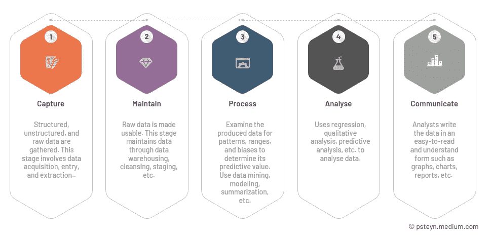

# 为什么统计在数据科学、机器学习和分析中很重要

> 原文：<https://towardsdatascience.com/why-is-statistics-important-in-data-science-machine-learning-and-analytics-92b4a410f686>

## 理解作为一名数据科学家拥有强大的统计学背景的好处

Joshua Hoehne 在 [Unsplash](https://unsplash.com?utm_source=medium&utm_medium=referral) 上拍摄的照片

S 统计学，就其最广泛的意义而言，指的是基于数据进行评估、解释、展示和决策的工具和方法的集合。有些人认为统计学是对技术数据的数学分析。

> “从大数据中实现价值的一个重大制约因素将是人才短缺，特别是在统计和机器学习方面具有深厚专业知识的人，以及知道如何利用大数据的洞察力来运营公司的经理和分析师。”——麦肯锡

在本文中，我将尝试解释为什么我认为对数据科学和机器学习爱好者来说，拥有对统计学的更深入理解是至关重要的。深入研究统计数据是一种数学分析形式，采用多种定量模型来产生实验数据或实证研究。收集、分析、解释和展示数据都是应用数学的要素。统计学的数学基础是线性代数、微积分和概率论。

我在完成 python 数据科学资格认证时学习了一部分统计学，但后来才意识到统计学 101 是不够的。因此，我认为任何称职的数据科学家都应该对统计学有更深的理解，并精通“R”或 Python。

## 数据科学到底是什么？

数据科学是一个研究领域，它利用尖端工具和技术来揭示隐藏的模式和趋势，从而产生有价值的见解，可用于做出更明智的业务决策。它还包括预测分析，其中数据科学家采用各种机器学习或统计算法。

## **数据科学生命周期**

要理解统计在数据科学中扮演的角色，您必须首先对数据科学的生命周期有一个透彻的理解。关于生命周期有几种观点，但是我使用一种简化的观点。它包括下面列出的五个阶段。

## 其他生命周期

下面列出的生命周期是特定于数据科学的更现代的方法。

*   缩写 OSEMN 代表获取、清理、探索、建模和解释，它代表一个五阶段生命周期。
*   微软 TDSP:团队数据科学过程结合了许多当代敏捷实践。它由五个阶段组成:业务理解、数据获取和理解、建模、部署和客户接受。

## 统计学对数据科学家的重要性

我们可以利用统计分析技术来量化我们所拥有的，因此我们可以使用一些度量标准来描述它，而不是筛选大量的数据。

数据科学中的高级机器学习算法利用统计学来识别数据模式并将其转换为可用的证据。数据科学家使用统计学来收集、评估、分析数据并从中得出结论，以及为相关变量实现定量数学模型。数据科学既需要技术技能，如 R 和 Python 编程，也需要“软技能”，如沟通和关注细节。

下面列出了一些数据科学家必须掌握的最重要的技能，以提高他们的统计能力。

## 统计数字

数据科学家应该努力学习统计学，因为统计学将数据与组织在所有学科中面临的问题相关联，例如如何增加收入、限制支出、创造效率以及最大化通信等。

## 数据操作

利用 Excel、R、SAS、Stata、Power Query M、Apache Spark 等系统，数据科学家可以对大型数据集进行清理和组织。

## 批判性思维

数据科学家使用线性回归识别和建模因变量和自变量之间的关系。数据科学家选择在实施过程中考虑了潜在假设的程序。如果假设被违反或选择错误，结果将是不正确的。

## 组织

数据科学家不断被来自各种来源和项目机会的数据淹没。统计功能方面的专业知识使数据科学家能够在预算和时间限制内有效工作。日常流程也有助于数据安全保护。

## 解决问题

除了纯计算和基本数据分析，数据科学家还使用应用统计学将抽象发现与现实世界的问题联系起来。此外，数据科学家利用预测分析来规划未来行动。所有这些都需要仔细考虑，以及理性和创新的解决问题的策略。

由 [charlesdeluvio](https://unsplash.com/es/@charlesdeluvio?utm_source=medium&utm_medium=referral) 在 [Unsplash](https://unsplash.com?utm_source=medium&utm_medium=referral) 拍摄的照片

# 几个重要的使用案例:

数据科学中的统计学，从根本上说，是寻找各种非结构化数据之间的结构和关系。结构化数据有助于揭示您收集的数据背后不同的有价值的见解。

**逻辑回归**，最广泛使用的分类方法之一，有助于根据可观察到的模式预测定性反应。该方法使用当前未知变量的关系和图上其他变量的值来预测该变量的值。

数据分析和机器学习建立在对逻辑回归、**、交叉验证**和其他帮助机器预测你下一步行动的技术的理解之上。其中一个例子就是当你在 YouTube 上听歌的时候。您会看到您喜欢的歌曲的建议，即使您以前从未听过这些歌曲。推荐歌曲背后的原因是统计数据。

**集群**是另一个很好的例子。例如，在医疗紧急情况下，了解受影响人群的百分比可以帮助您设计解决方案。在数据科学中，将你的买家分成不同的年龄组被称为聚类。它可以帮助你制作广告，了解更多关于你的目标受众的信息。

# 统计学在 ML/AI 中的重要性:

数据分析师必须了解并建立数据的全面图景，然后才能大规模收集数据以进行进一步分析，如双变量、单变量、多变量和主成分分析。

许多**机器学习性能测量**，比如精度、准确度、召回率、均方根误差、f 分数等等，都是基于统计的。

数据探索是数据分析过程中的第一步也是最重要的一步。数据分析师使用数据可视化和统计方法来描述数据集特征，如大小、数量和准确性，以更好地了解数据的性质。

数据可视化和探索促进了从数据中发现新的和意想不到的见解。有了这些信息，统计数据有助于验证我们已经知道的东西被揭穿，从而激发人工智能不同分支的发现。

照片由[卢克·切瑟](https://unsplash.com/@lukechesser?utm_source=medium&utm_medium=referral)在 [Unsplash](https://unsplash.com?utm_source=medium&utm_medium=referral) 上拍摄

# 数据可视化和分析:

统计使用像**饼图**和**条形图**这样的工具以结构化的格式描绘数据。通过收集个别的、不相关的信息，你无法得出准确而精确的结论。

饼图、直方图和条形图等可视化工具在使数据在广泛的数据研究中更具交互性和可理解性方面大有作为。它们为理解复杂数据提供了一种引人入胜且易于理解的方法。

数据分析是分析数据集以根据可用信息做出决策的过程，这越来越多地借助专业软件和系统来完成。它识别潜在的模型和模式，作为数据可视化的输入源，并通过预测需求来帮助公司改进。

我们可以通过使用集中趋势的**度量来分析数据。描述数据集中心点或典型值的汇总统计数据称为集中趋势的度量。这些度量通常被称为分布的中心位置，表示分布中大多数值的位置。它可以被认为是倾向于围绕一个中心值聚集的数据。**均值、中位数**和**众数**是统计学中最流行的三种集中趋势度量。这些计算中的每一个都使用不同的方法来确定中心点的位置。**

这些统计工具有助于模式的早期检测，并使最没有经验的用户也能理解它们。因此，得出结论和制定行动计划变得不那么复杂。

# 关键要点:

统计在现实生活和职业生活中都是必不可少的。它帮助你分析给你的数据，并据此做出决定。

*   阅读饼状图、条形图等的能力。统计知识有助于你理解数据，并最终提高你展示数据的技巧，让你和其他人都能得出结论。
*   它使你能够很容易地看到任何数据的趋势；它使您能够有效地分析数据；它能让你得出更好更准确的结论。
*   在 ML 统计知识的基础上，你可以完全理解你的模型的有效性。如果没有它，你根本无法理解 R 或任何其他性能指标。

然而，你并不需要去学院或大学学习统计学课程。你可以在网上轻松完成。作为一名高管，我对统计的观点和使用案例有很大不同，所以我选择了其他一些课程。

以下是一些优秀的在线统计课程的链接，这些课程将帮助您快速发展扎实的基础技能。

1.  [R | data camp 的统计基础](https://www.datacamp.com/tracks/learn-statistics-with-r)
2.  [统计学基础| edX](https://www.edx.org/course/fundamentals-of-statistics)
3.  [统计学习| edX](https://www.edx.org/course/statistical-learning)
4.  [统计和 R | edX](https://www.edx.org/course/statistics-and-r)
5.  [统计学入门| Coursera](https://www.coursera.org/learn/stanford-statistics)
6.  [用 R | Coursera 进行数据分析](https://www.coursera.org/specializations/statistics)

这是一个非常高层次的观点，解释了为什么我认为所有的数据科学家都应该更多地研究统计学。请在下面的评论中告诉我你的想法。