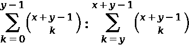
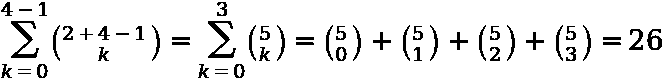
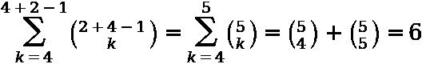
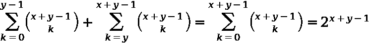
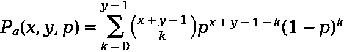
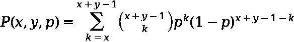
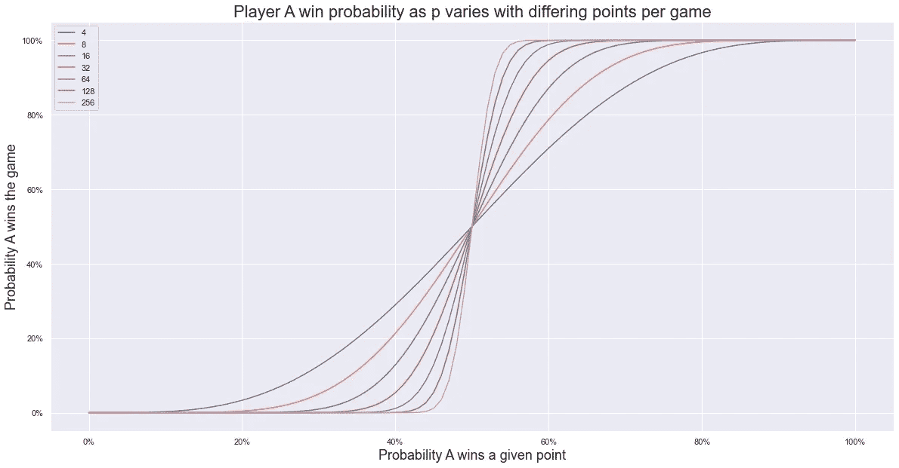

# 为什么网球是这样计分的？

> 原文：<https://towardsdatascience.com/why-is-tennis-scored-the-way-it-is-scored-4c82d4bc2262>

约翰·福南德在 [Unsplash](https://unsplash.com/s/photos/tennis?utm_source=unsplash&utm_medium=referral&utm_content=creditCopyText) 上拍摄的照片

# 为什么网球是这样计分的？

## 将“分数问题”应用于网球

对于一项被认为是典型的英国运动，温布尔登几乎傲慢地被称为“锦标赛”，我很惊讶地知道它可能起源于中世纪 12 世纪的法国(尽管英国人对从其他文化中窃取东西并不陌生)。“爱情”、“15 岁”、“30 岁”以及随后“40 岁”的离奇跳跃的起源似乎有点神秘，但总的来说，起源大致可以追溯到[这篇伟大的文章](https://time.com/5040182/tennis-scoring-system-history/)中凝结下来的大量信息。

*有趣的是(我似乎找不到太多相关信息),一场网球比赛(不是比赛)本质上是一场争夺 4 分的比赛——如果我们现在忘记“平手”的话。不管我们怎么称呼分数，这就是一场比赛的本质:第一到第四。这就带来了一个问题——如果网球是一场其他分数的比赛，它会是什么样子？比如 6？还是 8？或者只有一场比赛跑到 100 分呢？*

事实证明，选择 4 个点效果非常好，为了证明这一点，我们可以回到老的[“点的问题”](https://en.wikipedia.org/wiki/Problem_of_points)。

## 积分的问题是什么？

一个经典的概率问题，可以说导致了“期望值”的概念，点的问题(从此处弹出)涉及以下问题:

*"假设两名玩家* `*a*` *和* `*b*` *进行了一场* `*n*` *点数的比赛，如果玩家* `*a*` *有* `*x*` *点数，玩家* `*b*` *有* `*y*` *点数，我们现在被迫停止游戏，我们应该如何在两名玩家之间分配奖金？"*

举一个简单的例子来说明，如果我们有两个玩家，他们在任何给定的点数上获胜的可能性相等，并且他们目前的点数也相同，那么我们应该对半分彩池，即每个人都有 50%的获胜机会。当我们开始考虑:

*   赢得给定点数的概率不等，例如玩家`a`有 70%的胜算，而玩家`b`只有 30%的胜算
*   当前点数不相等，例如玩家`a`当前比玩家`b`多 10 点

这是帕斯卡和费马首先讨论的问题。

## 解决方案在于每个玩家还需要多少分

关键不是每个玩家目前有多少积分，`x`和`y`，而是每个玩家需要多少积分才能赢得游戏，即`(n-x)`和`(n-y)`。如果我们拿两场比赛来看，比分是:

*   8–4，第一至 10
*   18-14 岁，第一至 20 岁

显然，第一个玩家和第二个玩家赢的机会是一样的。

## 以相等的机会赢得一个给定的点来解决

如果我们改为将每个玩家需要的剩余点数标注为`x`和`y`(而不是赢得的点数)，那么我们可以得到以下结论:如果我们玩`x + y - 1`多点，那么肯定有一个玩家赢了。例如，如果`a`需要`x=2`并且`b`需要`y=4`，那么在`5`点之后:

*   至少赢了 2 局，游戏就结束了
*   至少赢了 4 局，游戏就结束了

事实上，对于一个概率相等的结果，我们可以将`a:b`的概率表示为:

作者图片

换句话说，我们可以将上述表述如下:如果我们玩`x+y-1`点，即一个玩家*必须*赢的足够多的点，每一方总结玩家`a`(左)或玩家`b`(右)获胜的所有可能组合。我们举一个具体的例子来论证。让我们来看看:

*   玩家`a`需要 2 分才能获胜
*   `y=4`:玩家`b`需要 4 分才能获胜

看左边，我们有:

作者图片

换句话说，我们计算玩家`b`没有赢得足够分数的所有时间，即他们需要 4 分才能赢，所以我们计算他们赢少于 4 分的所有时间，根据定义，这些时间玩家`a`必须赢。同样，看右边，我们得到:

作者图片

这一次我们正在计算玩家`b` *赢得足够分数获胜的次数。为了将这些计数转换成概率，我们需要除以出现的总次数，也就是左右两边的总和。幸运的是，我们可以利用帕斯卡的恒等式，该恒等式陈述(在这种情况下):*

作者图片

其中:

*   第一个等式来自合并求和
*   第二个等式来自二项式系数公式的[和——这里通过归纳](https://en.wikipedia.org/wiki/Binomial_coefficient#Sums_of_the_binomial_coefficients)[很好地证明了这一点](https://math.stackexchange.com/questions/734900/proof-by-induction-sum-of-binomial-coefficients-sum-k-0n-n-k-2n)

回到上面的数字例子，我们得到了 26/(2⁵和 6/(2⁵).的概率

## 当我们有*不相等的*概率时呢？

以前我们认为`a`和`b`在任何给定的点上获胜的概率是相等的——这就像一个“未加权”的例子，意思是转换成我们只需除以组合总数的概率——没有对每个组合发生的概率进行加权，因为权重都是相等的。

现在我们有了一个“加权”案例。这就像抛硬币两次，`a`双头赢，`b`双尾赢。如果我们使用一个有 90%机会正面朝上的装满硬币，显然`a`获胜的概率比`b`获胜的概率高得多，尽管事实上仍然只有一种结果导致胜利(双正面或双反面仍然只能在两次投掷中出现一次)。*概率*发生变化，但结果*计数*保持不变。

为了进行修正，我们从二项式系数转移到[二项式定理](https://en.wikipedia.org/wiki/Binomial_theorem)得到:

作者图片

其中`p`是`a`赢得任何给定点数的概率(相应地`1-p`是玩家`b`获胜的概率)，因此`P_a`是`a`总体获胜的概率。换句话说，我们在这里做的是抓住玩家`b`赢得点数不足的每一个机会(因此玩家`a`赢了),并且:

*   计算可能发生的情况，例如，如果我们打 5 分，有 5 种情况`b`只能赢 1 分(他们只赢第一分，他们只赢第二分，等等)
*   用它发生的概率来衡量

然后最后将所有这些加在一起，得到`b`赢得不足点数的总概率——或者换句话说，`a`赢了。鉴于我们只是在看玩家`a`，我们也可以把它改写为:

作者图片

这可能是一种更直观的写法，因为它将`a`获胜的概率表示为`a`赢得足够分数时的(概率加权)机会的总和。

## 这和网球有什么关系？

如上所述，每一场网球比赛(再次忽略平手)本质上都是一场争夺 4 分的比赛。使用上述框架并进行以下对比:

*   `x`:在`a`发球的情况下`a`赢得比赛所需的点数
*   `y`:在`b`返回的情况下`b`赢得游戏所需的点数
*   `p`:`a`发球得分的概率

然后，我们可以模拟一场网球比赛，用`x`和`y`玩一玩，看看如果我们不选择一场到 4 的比赛，而是选择一场到其他东西的比赛，会发生什么。

## 给定一个概率，`p`，`a`赢一局的概率是多少？

现在，让我们用一点 python 来展示当我们改变赢得游戏所需的点数时，赢得无二游戏的概率如何变化。

作者图片

那么以上说明了什么呢？以蓝线为例，这显示了对于“一对四”网球比赛(最接近标准)，当我们改变`a`赢得给定分数的概率(x 轴)时，`a`赢得整场比赛的概率(y 轴)是如何变化的。我们可以看到，增加您赢得任何给定点数的概率的效果是，在该范围的中间，您赢得游戏的机会增加了 1 比 1 以上——只需看看以下事实:

*   50%的几率赢得任何一点都有 50%的几率赢得游戏
*   赢得任何一点的几率为 60%,则赢得游戏的几率大于 60%(当蓝线穿过 60%的 x 轴时，几率接近 70%)

我们还可以看到，每场比赛的分数越多，赢得整场比赛的机会对赢得任何单个分数的机会就越敏感——随着我们向游戏中添加越来越多的分数，50%左右的线变得越来越陡峭。事实上，随着我们添加越来越多的“试玩”(点数)，我们正在减少每场游戏的随机性，从而增加“更好的玩家”(即`p` > 0.5)获胜的机会。这类似于[大数定律](https://en.wikipedia.org/wiki/Law_of_large_numbers)指出当我们增加试验时，样本均值将接近总体均值。相反，在这里，随着我们增加尝试，更好的玩家赢得游戏的概率接近 1，这里我们可以将 1 视为指标函数的输出，其中:

*   1 表示`a`是更好的玩家
*   0 表示`b`是更好的玩家

## 有什么意义？

关键是，如果决定一场网球比赛应该是第一场到第八场的比赛，或者更多，那么我们将会有一场更无聊的运动。每场网球比赛都有一个发球者和回球者，所以根据定义，发球者有优势。职业男子网球的这种优势在`p=65%`左右。如果我们有更长的游戏，那么我们会:

*   更少的断点
*   结果网球比赛就没那么有趣了

事实上，我们可以用上面所做的来说明这一点。有了`p=65%`和一场‘一对四’的网球比赛，我们被打破的概率是 20%。如果我们将比赛长度增加到 8 分，我们最终的概率会下降到 11.4%，几乎是中断次数的一半。令人兴奋的不仅仅是网球评分系统被离散化的事实，**它被离散化成一个合适的增量大小，这给了游戏足够的随机性，以防止稍微好一点的玩家每次都赢**。如果你是那个更好的玩家，你会觉得不公平，但如果你是其他人，你会觉得更刺激一点。